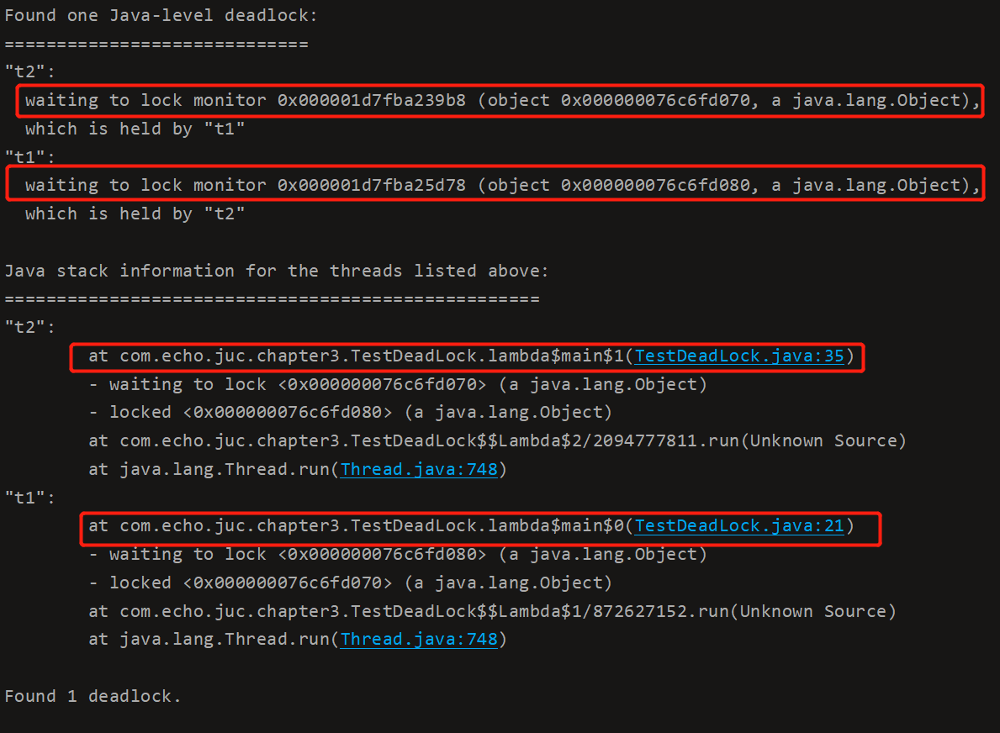

并发编程

### 1.进程与线程

#### 1.1 进程与线程

**进程**

- 程序由指令和数据组成，但这些指令要运行，数据要读写，就必须将指令加载至 CPU，数据加载至内存。在指令运行过程中还需要用到磁盘、网络等设备。进程就是用来加载指令、管理内存、管理 IO 的。

- 当一个程序被运行，从磁盘加载这个程序的代码至内存，这时就开启了一个进程。
- 进程就可以视为程序的一个实例。大部分程序可以同时运行多个实例进程（例如记事本、画图、浏览器 等），也有的程序只能启动一个实例进程（例如网易云音乐、360 安全卫士等）

**线程**

- 一个进程之内可以分为一到多个线程。
- 一个线程就是一个指令流，将指令流中的一条条指令以一定的顺序交给 CPU 执行 。
- Java 中，线程作为小调度单位，进程作为资源分配的最小单位。 在 windows 中进程是不活动的，只是作为线程的容器

**两者对比**

- 进程基本上相互独立的，而线程存在于进程内，是进程的一个子集 进程拥有共享的资源，如内存空间等，供其内部的线程共享
  - 进程间通信较为复杂 同一台计算机的进程通信称为 IPC（Inter-process communication）
  - 不同计算机之间的进程通信，需要通过网络，并遵守共同的协议，例如 HTTP
- 线程通信相对简单，因为它们共享进程内的内存，一个例子是多个线程可以访问同一个共享变量 线程更轻量，线程上下文切换成本一般上要比进程上下文切换低

#### 1.2 并行与并发

**并发**

单核 cpu 下，线程实际还是串行执行的。操作系统中有一个组件叫做任务调度器，将 cpu 的时间片（windows下时间片最小约为 15 毫秒）分给不同的程序使用，只是由于 cpu 在线程间（时间片很短）的切换非常快，人类感觉是同时运行的 。总结为一句话就是： 微观串行，宏观并行 ，


一般会**将这种线程轮流使用 CPU 的做法称为并发， concurrent**


**并行**

多核 cpu下，每个核（core） 都可以调度运行线程，这时候线程可以是并行的。


引用 Rob Pike 的一段描述：

- 并发（concurrent）是同一时间应对（dealing with）多件事情的能力
- 并行（parallel）是同一时间动手做（doing）多件事情的能力

例子

- 家庭主妇做饭、打扫卫生、给孩子喂奶，她一个人轮流交替做这多件事，这时就是并发
- 家庭主妇雇了个保姆，她们一起这些事，这时既有并发，也有并行（这时会产生竞争，例如锅只有一口，一个人用锅时，另一个人就得等待）

- 雇了3个保姆，一个专做饭、一个专打扫卫生、一个专喂奶，互不干扰，这时是并行

#### 1.3 应用

**1.3.1 代码实例**

**同步调用**

```java
@Slf4j(topic = "c.Sync")
public class Sync {
    public static void main(String[] args) throws InterruptedException {
        log.debug("start sleep");
        TimeUnit.MILLISECONDS.sleep(2000);
        log.debug("end sleep");
        log.debug("do other thing");
    }
}
```


**异步调用**

```java
@Slf4j(topic = "c.Async")
public class Async {
    public static void main(String[] args){
        new Thread(() -> {
            log.debug("start sleep");
            try {
                TimeUnit.MILLISECONDS.sleep(2000);
            } catch (InterruptedException e) {
                e.printStackTrace();
            }
            log.debug("end sleep");
        }).start();
        log.debug("do other thing");
    }
}
```


可以发现。执行睡眠操作时的线程名称已经改变了，而且操作的顺序已经发生了改变。

**1.3.2** **应用之异步调用（案例**1)

以调用方角度来讲，如果

- 需要等待结果返回，才能继续运行就是同步
- 不需要等待结果返回，就能继续运行就是异步

**1)** **设计**

多线程可以让方法执行变为异步的（即不要巴巴干等着）比如说读取磁盘文件时，假设读取操作花费了 5 秒钟，如果没有线程调度机制，这 5 秒 cpu 什么都做不了，其它代码都得暂停...

**2)** **结论**

- 比如在项目中，视频文件需要转换格式等操作比较费时，这时开一个新线程处理视频转换，避免阻塞主线程
- tomcat 的异步 servlet 也是类似的目的，让用户线程处理耗时较长的操作，避免阻塞 tomcat 的工作线程
- ui 程序中，开线程进行其他操作，避免阻塞 ui 线程

**1.3.3 应用之提高效率（案例1）**

*计算 1 花费 10 ms*

*计算 2 花费 11 ms*

*计算 3 花费 9 ms*

*汇总需要 1 ms*

- 如果是串行执行，那么总共花费的时间是 10 + 11 + 9 + 1 = 31ms
- 但如果是四核 cpu，各个核心分别使用线程 1 执行计算 1，线程 2 执行计算 2，线程 3 执行计算 3，那么 3 线程是并行的，花费时间只取决于最长的那个线程运行的时间，即 11ms 最后加上汇总时间只会花费 12ms

**注意：需要在多核 cpu 才能提高效率，单核仍然时是轮流执行**

### 2. Java线程

#### 2.1 创建和运行线程

**方法一，直接使用Thread**

```java
// 创建线程对象
Thread t = new Thread() {
 public void run() {
 // 要执行的任务
 }
};
// 启动线程
t.start();
```

例如

```java
@Slf4j(topic = "c.CreateThread1")
public class CreateThread1 {
    public static void main(String[] args) {
        //1.创建线程
        Thread t = new Thread(){
            @Override
            public void run() {
                log.debug("Running");
            }
        };
        //2.指定名称并启动线程
        t.setName("log thread");
        t.start();
        //3.主线程中的打印
        log.debug("Main Running");
    }
}
```


**方法二，使用Runnable配合Thread**

把【线程】和【任务】（要执行的代码）分开

- Thread 代表线程
- Runnable 可运行的任务（线程要执行的代码）

```java
Runnable runnable = new Runnable() {
 public void run(){
 // 要执行的任务
 }
};
// 创建线程对象
Thread t = new Thread( runnable );
// 启动线程
t.start();
```

结果

```bash
11:17:21 【runnable】 c.CreateThread2 - Running
```

Java 8 以后可以使用 lambda 精简代码

```java
Runnable runnable = ()->{
    log.debug("Running");
};
Thread thread = new Thread(runnable,"lambda");
thread.start();
```

```java
Thread thread = new Thread(()->{
            log.debug("Running");
        },"lambda");
thread.start();
```

**小结**

- 方法1 是把线程和任务合并在了一起，方法2 是把线程和任务分开了
- 用 Runnable 更容易与线程池等高级 API 配合
- 用 Runnable 让任务类脱离了 Thread 继承体系，更灵活

**方法三，FutureTask 配合Thread**

FutureTask 能够接收 Callable 类型的参数，用来处理有返回结果的情况

Callable中的run方法可以返回值，而且能抛出异常，但是Runable中的run方法则不行

```java
@Slf4j(topic = "c.CreateThread3")
public class CreateThread3 {
    public static void main(String[] args) {
        Callable<Integer> callable = new Callable<Integer>() {
            @Override
            public Integer call() throws Exception {
                log.debug("Running");
                Thread.sleep(2000);
                return 10;
            }
        };
        FutureTask<Integer> task = new FutureTask<>(callable);
        Thread thread = new Thread(task,"callable task");
        thread.start();
        try {
            //在主线程中调用FutureTask的get方法，主线程会阻塞 等待线程的执行后返回的结果
            Integer callableReturn = task.get();
            log.debug("{}",callableReturn);
        } catch (InterruptedException | ExecutionException e) {
            e.printStackTrace();
        }
    }
}
```

```bash
11:33:45 【callable task】 c.CreateThread3 - Running
11:33:47 【main】 c.CreateThread3 - 10
```

#### 2.2 观察多个线程同时运行

```java
@Slf4j(topic = "c.ObserveMultiThread")
public class ObserveMultiThread {
    public static void main(String[] args) {
        new Thread(() -> {
            while (true){
                log.debug("Running t1");
            }
        },"t1").start();

        new Thread(() -> {
            while (true){
                log.debug("Running t2");
            }
        },"t2").start();
    }
}
```

```bash
11:37:10 【t2】 c.ObserveMultiThread - Running t2
11:37:10 【t2】 c.ObserveMultiThread - Running t2
11:37:10 【t1】 c.ObserveMultiThread - Running t1
11:37:10 【t1】 c.ObserveMultiThread - Running t1
11:37:10 【t1】 c.ObserveMultiThread - Running t1
```

至于线程的底层是多个核并行处理这两个线程，还是一个核并发处理这两个线程，是由底层的任务调度器处理的，我们控制不了。

#### **2.3 查看进程的方法**

**windows**

- 任务管理器可以查看进程和线程数，也可以用来杀死进程
- tasklist 查看进程
- taskkill 杀死进程

**linux**

- ps -fe 查看所有进程
- ps -fT -p <PID> 查看某个进程（PID）的所有线程
- kill 杀死进程
- top 按大写 H 切换是否显示线程
- top -H -p <PID> 
- 查看某个进程（PID）的所有线程

**Java**

- jps 命令查看所有 Java 进程
- jstack <PID> 查看某个 Java 进程（PID）的所有线程状态
- jconsole 来查看某个 Java 进程中线程的运行情况（图形界面）

#### 2.4 线程运行原理

Java Virtual Machine Stacks （Java 虚拟机栈）

我们都知道 JVM 中由堆、栈、方法区所组成，其中栈内存是给谁用的呢？其实就是线程，每个线程启动后，虚拟

机就会为其分配一块栈内存。

- 每个栈由多个栈帧（Frame）组成，对应着每次方法调用时所占用的内存
- **每个线程只能有一个活动栈帧**，对应着当前正在执行的那个方法

**一个线程的栈帧测试**

```java
public class FrameTest {
    public static void main(String[] args) {
        method1(10);	//断点打在这里
    }
    private static void method1(int x){
        int y = x + 1;
        Object m = method2();
        System.out.println(m);
    }

    private static Object method2(){
        return new Object();
    }
}

```


其余方法调用同理。


**两个线程的栈帧测试**

```java
public class FrameTest2 {
    public static void main(String[] args) {
        Thread thread = new Thread(){
            @Override
            public void run() {
                method1(20);	//断点一
            }
        };
        thread.start();

        method1(10);		//断点二
    }
    private static void method1(int x){
        int y = x + 1;
        Object m = method2();
        System.out.println(m);
    }

    private static Object method2(){
        return new Object();
    }
}

```

在打断点时，要调整断点的模式为Thread，右击断点设置即可。


开始调试


经过执行之后，可以看到每个线程都有自己专有的方法栈和栈帧


#### 2.5 线程上下文切换

因为以下一些原因导致 cpu 不再执行当前的线程，转而执行另一个线程的代码

- 线程的 cpu 时间片用完
- 垃圾回收
- 有更高优先级的线程需要运行
- 线程自己调用了 sleep、yield、wait、join、park、synchronized、lock 等方法

当 Context Switch 发生时，需要由操作系统保存当前线程的状态，并恢复另一个线程的状态，Java 中对应的概念

就是程序计数器（Program Counter Register），它的作用是记住下一条 jvm 指令的执行地址，是线程私有的

- 状态包括程序计数器、虚拟机栈中每个栈帧的信息，如局部变量、操作数栈、返回地址等
- Context Switch 频繁发生会影响性能

#### **2.6 常见方法**


**注意，调用Thread.currentThread().isInterrupted()的效果和 当前线程对象.isInterrupted()是一样的，并不是调用的那个静态方法。**

**所以，无论是Thread.currentThread().interrupt()还是 当前线程对象.interrupt()都是将当前线程的打断标记置为true.**

​			**Thread.currentThread().isInterrupted()和 当前线程对象.isInterrupted() 都是返回当前线程的打断标记**


#### **2.7 start和run**

直接调用run方法

```java
@Slf4j(topic = "c.StartAndRun")
public class StartAndRun {
    public static void main(String[] args) {
        Thread t1 = new Thread("t1"){
            @Override
            public void run() {
                log.debug("t1 Running");
            }
        };
        t1.run();
    }
}
```

```bash
16:23:22 【main】 c.StartAndRun - t1 Running
16:23:22 【main】 c.StartAndRun - do other things
```

可以看到，直接调用run方法还是在主线程中调用的run方法，并没有达到异步的效果。所以线程的启动需要使用start方法；

```java
@Slf4j(topic = "c.StartAndRun")
public class StartAndRun {
    public static void main(String[] args) {
        Thread t1 = new Thread("t1"){
            @Override
            public void run() {
                log.debug("t1 Running");
            }
        };
        t1.start();
        log.debug("do other things");
    }
}
```

```bash
16:24:33 【t1】 c.StartAndRun - t1 Running
16:24:33 【main】 c.StartAndRun - do other things
```

start方法只能调用一次。调用多次会出现异常。

#### **2.8 sleep和yield**

**sleep**

- 调用 sleep 会让当前线程从 *Running* 进入 *Timed Waiting* 状态（阻塞）

  ```java
  @Slf4j(topic = "c.SleepAndYield")
  public class SleepAndYield {
      public static void main(String[] args) {
          Thread t1 = new Thread("t1"){
              @Override
              public void run() {
                  try {
                      Thread.sleep(2000);
                  } catch (InterruptedException e) {
                      e.printStackTrace();
                  }
              }
          };
  
          t1.start();
          log.debug("t1 state {}",t1.getState());
          try{
              Thread.sleep(500);
          }
          catch (Exception e){
              e.printStackTrace();
          }
          log.debug("t1 state {}",t1.getState());
      }
  }
  ```

  ```bash
  16:31:13 【main】 c.SleepAndYield - t1 state RUNNABLE
  16:31:13 【main】 c.SleepAndYield - t1 state TIMED_WAITING
  ```

- 其它线程可以使用 interrupt 方法打断正在睡眠的线程，这时 sleep 方法会抛出 InterruptedException

  ```java
  @Slf4j(topic = "c.SleepInterrupted")
  public class SleepInterrupted {
      public static void main(String[] args) throws InterruptedException {
          Thread t1 = new Thread("t1") {
              @Override
              public void run() {
                  log.debug("enter sleep....");
                  try {
                      Thread.sleep(2000);
                  } catch (InterruptedException e) {
                      log.debug("wake up ...");
                      e.printStackTrace();
                  }
              }
          };
          t1.start();
  
          //主线程睡一秒
          Thread.sleep(1000);
          //唤醒t1
          log.debug("interrupt ...");
          t1.interrupt();
      }
  }
  ```

  ```bash
  16:35:53 【t1】 c.SleepInterrupted - enter sleep....
  16:35:54 【main】 c.SleepInterrupted - interrupt ...
  16:35:54 【t1】 c.SleepInterrupted - wake up ...
  java.lang.InterruptedException: sleep interrupted
  	at java.lang.Thread.sleep(Native Method)
  	at com.echo.juc.chapter2.SleepInterrupted$1.run(SleepInterrupted.java:13)
  ```

- 睡眠结束后的线程未必会立刻得到执行

- 建议用 TimeUnit 的 sleep 代替 Thread 的 sleep 来获得更好的可读性

  ```java
  public class TimeUnitTest {
      public static void main(String[] args) throws InterruptedException {
          TimeUnit.MILLISECONDS.sleep(1); //睡眠一毫秒
          TimeUnit.SECONDS.sleep(1);  //睡眠一秒
          TimeUnit.HOURS.sleep(1);    //睡眠一小时
      }
  }
  ```

**yield**

- 调用 yield 会让当前线程从 *Running* 进入 *Runnable* 就绪状态，然后调度执行其它线程
- 具体的实现依赖于操作系统的任务调度器


yield是让线程变为就绪状态(可运行状态Runnable)，该线程是仍有机会获得CPU所给的时间片的。但是sleep则是让线程进入了阻塞状态，只有当线程醒过来了，才有机会获得CPU的时间片。

**线程优先级**

- 线程优先级会提示（hint）调度器优先调度该线程，但它仅仅是一个提示，调度器可以忽略它。
- 如果 cpu 比较忙，那么优先级高的线程会获得更多的时间片，但 cpu 闲时，优先级几乎没作用

```java
@Slf4j(topic = "c.PriorityTest")
public class PriorityTest {
    public static void main(String[] args) {
        Runnable task1 = ()->{
            int count = 0;
            for (;;){
                count ++;
                log.debug("t1 count {}",count);
            }
        };
        Runnable task2 = ()->{
            int count = 0;
            for (;;){
                count ++;
                log.debug("t2 count {}",count);
            }
        };

        Thread t1 = new Thread(task1,"t1");
        Thread t2 = new Thread(task2,"t2");
        t1.start();
        t2.start();
    }
}
```

不设置任何优先级时，对于count 的计数如下

```bash
16:49:30 【t1】 c.PriorityTest - t1 count 443762
16:49:30 【t1】 c.PriorityTest - t1 count 443763
16:49:30 【t2】 c.PriorityTest - t2 count 443404
16:49:30 【t2】 c.PriorityTest - t2 count 443405
```

可以发现，两个线程的count值差距并不大。

**使用yield**

```java
@Slf4j(topic = "c.PriorityTest")
public class PriorityTest {
    public static void main(String[] args) {
        Runnable task1 = ()->{
            int count = 0;
            for (;;){
                count ++;
                log.debug("t1 count {}",count);
            }
        };
        Runnable task2 = ()->{
            int count = 0;
            for (;;){
                Thread.yield(); //将cpu使用权优先让给其他线程
                count ++;
                log.debug("t2 count {}",count);
            }
        };

        Thread t1 = new Thread(task1,"t1");
        Thread t2 = new Thread(task2,"t2");
        t1.start();
        t2.start();
    }
}
```

```bash
16:52:45 【t1】 c.PriorityTest - t1 count 213925
16:52:45 【t1】 c.PriorityTest - t1 count 213926
16:52:45 【t1】 c.PriorityTest - t1 count 213927
16:52:45 【t2】 c.PriorityTest - t2 count 53435
16:52:45 【t2】 c.PriorityTest - t2 count 53436
16:52:45 【t2】 c.PriorityTest - t2 count 53437
```

可以发现，明显线程一的计数要大于线程二。因为线程二对于CPU的时间片是能让则让。

**设置优先级**

```java
@Slf4j(topic = "c.PriorityTest")
public class PriorityTest {
    public static void main(String[] args) {
        Runnable task1 = ()->{
            int count = 0;
            for (;;){
                count ++;
                log.debug("t1 count {}",count);
            }
        };
        Runnable task2 = ()->{
            int count = 0;
            for (;;){
                count ++;
                log.debug("t2 count {}",count);
            }
        };

        Thread t1 = new Thread(task1,"t1");
        Thread t2 = new Thread(task2,"t2");
        t1.setPriority(Thread.MAX_PRIORITY);
        t2.setPriority(Thread.MIN_PRIORITY);
        t1.start();
        t2.start();
    }
}
```

```bash
16:54:43 【t2】 c.PriorityTest - t2 count 135060
16:54:43 【t2】 c.PriorityTest - t2 count 135061
16:54:43 【t2】 c.PriorityTest - t2 count 135062
16:54:43 【t1】 c.PriorityTest - t1 count 222830
16:54:43 【t1】 c.PriorityTest - t1 count 222831
16:54:43 【t1】 c.PriorityTest - t1 count 222832
16:54:43 【t1】 c.PriorityTest - t1 count 222833
16:54:43 【t1】 c.PriorityTest - t1 count 222834
16:54:43 【t2】 c.PriorityTest - t2 count 135063
16:54:43 【t2】 c.PriorityTest - t2 count 135064
```

给线程一设置了最高优先级，给线程二设置了最低优先级，从结果可以看出。线程一的计数要比线程二大很多。

#### 2.9 案例：防止CPU占用100%

在一些开发的服务器，或者GUI程序时，可能需要程序一直执行，从而编写while(true)的代码。在没有利用cpu来计算时，为了防止所编写的while (true)空转浪费cpu，可以使用yield或者sleep来让出cpu的使用权给其他程序。(极为有效！)

```java
while (true){
    try {
        Thread.sleep(50);
        //dosomething
    }
    catch (InterruptedException e){
        e.printStackTrace();
    }
}
```

- 可以用 wait 或 条件变量达到类似的效果
- 不同的是，后两种都需要加锁，并且需要相应的唤醒操作，一般适用于要进行同步的场景
- sleep 适用于无需锁同步的场景

#### 2.10 join方法

考虑下面的代码打印什么？

```java
@Slf4j(topic = "c.JoinDemo")
public class JoinDemo {
    static int r = 0;
    public static void test(){
        log.debug("start");
        Thread t1 = new Thread(() -> {
            log.debug("start");
            try {
                Thread.sleep(1000);
            } catch (InterruptedException e) {
                e.printStackTrace();
            }
            log.debug("end");
            r = 10;
        });
        t1.start();
        log.debug("result:{}",r);
        log.debug("end");
    }

    public static void main(String[] args) {
        test();
    }
}
```

```bash
18:09:18 【main】 c.JoinDemo - start
18:09:18 【Thread-0】 c.JoinDemo - start
18:09:18 【main】 c.JoinDemo - result:0
18:09:18 【main】 c.JoinDemo - end
18:09:19 【Thread-0】 c.JoinDemo - end
```

出现这种情况的原因是：开启的线程要睡一秒才会修改r的值，但是在开启的线程睡的时候，主线程已经执行完了

分析

- 因为主线程和线程 t1 是并行执行的，t1 线程需要 1 秒之后才能算出 r=10
- 而主线程一开始就要打印 r 的结果，所以只能打印出 r=0

解决方法

- 用 sleep 行不行？为什么？
  有时候线程执行的方法是不确定的，主线程并不知道要休眠多久。
- 用 join，加在 t1.start() 之后即可

```java
@Slf4j(topic = "c.JoinDemo")
public class JoinDemo {
    static int r = 0;
    public static void test() throws InterruptedException {
        log.debug("start");
        Thread t1 = new Thread(() -> {
            log.debug("start");
            try {
                Thread.sleep(1000);
            } catch (InterruptedException e) {
                e.printStackTrace();
            }
            log.debug("end");
            r = 10;
        });
        t1.start();
        t1.join();  //主线程等待t1线程的结束
        log.debug("result:{}",r);
        log.debug("end");
    }

    public static void main(String[] args) throws InterruptedException {
        test();
    }
}
```

```bash
18:23:25 【main】 c.JoinDemo - start
18:23:26 【Thread-0】 c.JoinDemo - start
18:23:27 【Thread-0】 c.JoinDemo - end
18:23:27 【main】 c.JoinDemo - result:10
18:23:27 【main】 c.JoinDemo - end
```

#### 2.11 案例：同步

以调用方角度来讲，如果

- 需要等待结果返回，才能继续运行就是同步
- 不需要等待结果返回，就能继续运行就是异步


考虑下面的代码

```java
@Slf4j(topic = "c.MultiJoinDemo")
public class MultiJoinDemo {
    static int r1 = 0;
    static int r2 = 0;

    private static void test2() throws InterruptedException{
        Thread t1 = new Thread(){
            @SneakyThrows
            @Override
            public void run() {
                TimeUnit.SECONDS.sleep(1);
                r1 = 10;
            }
        };
        Thread t2 = new Thread(){
            @SneakyThrows
            @Override
            public void run() {
                TimeUnit.SECONDS.sleep(2);
                r2 = 20;
            }
        };
        long start = System.currentTimeMillis();
        t1.start();
        t2.start();
        t1.join();
        t2.join();
        long end = System.currentTimeMillis();
        log.debug("r1 : {} , r2 : {} , cost : {}",r1,r2,end - start);
    }

    public static void main(String[] args) throws InterruptedException {
        test2();
    }
}
```

```bash
18:35:19 【main】 c.MultiJoinDemo - join begin
18:35:20 【main】 c.MultiJoinDemo - t1 join end
18:35:21 【main】 c.MultiJoinDemo - t2 join end
18:35:21 【main】 c.MultiJoinDemo - r1 : 10 , r2 : 20 , cost : 2003
```


**如果颠倒两个join的位置呢？**

```java
@Slf4j(topic = "c.MultiJoinDemo")
public class MultiJoinDemo {
    static int r1 = 0;
    static int r2 = 0;

    private static void test2() throws InterruptedException{
        Thread t1 = new Thread(){
            @SneakyThrows
            @Override
            public void run() {
                TimeUnit.SECONDS.sleep(1);
                r1 = 10;
            }
        };
        Thread t2 = new Thread(){
            @SneakyThrows
            @Override
            public void run() {
                TimeUnit.SECONDS.sleep(2);
                r2 = 20;
            }
        };
        long start = System.currentTimeMillis();
        t1.start();
        t2.start();
        log.debug("join begin");
        t2.join();
        log.debug("t2 join end");
        t1.join();
        log.debug("t1 join end");
        long end = System.currentTimeMillis();
        log.debug("r1 : {} , r2 : {} , cost : {}",r1,r2,end - start);
    }

    public static void main(String[] args) throws InterruptedException {
        test2();
    }
}
```

```bash
18:38:19 【main】 c.MultiJoinDemo - join begin
18:38:21 【main】 c.MultiJoinDemo - t2 join end
18:38:21 【main】 c.MultiJoinDemo - t1 join end
18:38:21 【main】 c.MultiJoinDemo - r1 : 10 , r2 : 20 , cost : 2006
```

仍然是2秒，因为在t2.join()，即等待t2执行的时候，t1也正在执行。所以在调用完t1.join()之后，会立刻完成。


**限时join**

```java
@Slf4j(topic = "c.TimeLimitJoinDemo")
public class TimeLimitJoinDemo {
    static int r1 = 0;
    public static void main(String[] args) throws InterruptedException {
        test1();
    }
    private static void test1() throws InterruptedException{
        Thread t1 = new Thread(){
            @SneakyThrows
            @Override
            public void run() {
                TimeUnit.SECONDS.sleep(2);
                r1 = 10;
            }
        };
        long start = System.currentTimeMillis();
        t1.start();
        log.debug("join begin");
        t1.join(1500);  //等待t1 1.5s
        long end = System.currentTimeMillis();
        log.debug("r1 : {}, cost :{}",r1,end - start);
    }
}
```

```bash
18:45:38 【main】 c.TimeLimitJoinDemo - join begin
18:45:40 【main】 c.TimeLimitJoinDemo - r1 : 0, cost :1508
```

因为还差0.5秒，t1才能将r1修改为10，这里只等了1.5秒。但是如果join等待的时间比线程运行时间还要长，那么等待的时间就是线程运行的时间，并不会按照指定的值去等待。

#### 2.12 interrupt方法

**打断sleep,wait,join的线程**

这几个方法都会让线程进入**阻塞**状态，**打断阻塞的线程会让线程抛出异常。**

打断 sleep 的线程, 会清空打断状态，以 sleep 为例

```java
@Slf4j(topic = "c.InterruptDemo")
public class InterruptDemo {
    public static void main(String[] args) throws InterruptedException {
        Thread t1 = new Thread("t1") {
            @Override
            public void run() {
                log.debug("sleep...");
                try {
                    Thread.sleep(5000);
                } catch (InterruptedException e) {
                    e.printStackTrace();
                }
            }
        };
        t1.start();
        log.debug("interrupt");
        //等t1睡着
        TimeUnit.SECONDS.sleep(1);
        //打断
        t1.interrupt();
        
        log.debug("interrupt flg {}",t1.isInterrupted());
    }
}

```

```bash
18:57:31 【t1】 c.InterruptDemo - sleep...
18:57:31 【main】 c.InterruptDemo - interrupt
java.lang.InterruptedException: sleep interrupted
	at java.lang.Thread.sleep(Native Method)
	at com.echo.juc.chapter2.InterruptDemo$1.run(InterruptDemo.java:15)
18:57:32 【main】 c.InterruptDemo - interrupt flg false
```

sleep,wait,join在打断之后，会将打断标记清空，所以打印的是false（我在ubuntu中得到的flg是true?）,所指的清空打断标记，就是指将线程的打断标记重置为false

**打断正常运行的线程**

打断正常运行的线程, 不会清空打断状态

```java
@Slf4j(topic = "c.InterruptDemo2")
public class InterruptDemo2 {
    public static void main(String[] args) throws InterruptedException{
        Thread t1 = new Thread("t1") {
            @Override
            public void run() {
                while (true) {
                    //在主线程调用t1.interrupted()方法之后，会将打断标记置为真，
                    //在该线程中，判断打断标记是否为真，如果为真，则自己将自己打断
                    boolean interrupted = Thread.currentThread().isInterrupted();
                    if (interrupted){
                        log.debug("被打断了，退出循环");
                        break;
                    }
                }
            }
        };
        t1.start();
        TimeUnit.SECONDS.sleep(1);
        log.debug("interrupt");
        //正常运行的线程，在调用interrupt()方法之后，并不会停止运行。而是将打断标记置为true
        //真正是否要停止运行，是通过判断打断标记，如果为真，就停止运行
        t1.interrupt();
    }
}
```

#### 2.13 两阶段终止模式

在一个线程T1中，如何”优雅“的终止T2？这里的【优雅】是指给T2一个料理后事的机会

**错误思路**

1.使用线程对象的stop()方法停止线程

- stop方法会真正杀死线程，如果这时候线程锁住了共享资源，那么当它被杀死之后就再也没有机会释放锁，其他线程将永远无法获取锁

2.使用System.exit(int)方法停止线程

- 目的是仅停止一个线程，但是这种做法会让整个程序都停止

**流程**

一个后台监控线程，每隔两秒监控一次后台的情况，然后睡眠。

在每次while循环的开始，先检查有没有被打断，如果被打断了，那么处理后事，结束线程。如果没有被打断睡两秒，然后执行监控。

但是，如果是正常执行监控时，被打断，则打断标记会置为true，但是如果是在睡眠状态下被打断，那么打断标记并不会被置为true,所以就需要设置打断标记为true，然后同样的就会出现结束线程，处理后事的正常情况。


```java
@Slf4j(topic = "c.TwoParseTermination")
public class TwoParseTerminationDemo {
    public static void main(String[] args) throws InterruptedException {
        TwoParseTermination t = new TwoParseTermination();
        t.start();
        //主线程优雅的去停止该线程.
        TimeUnit.SECONDS.sleep(3);
        t.stop();
    }
}

@Slf4j(topic = "c.TwoParseTermination")
class TwoParseTermination{
    private Thread monitor;

    //启动监控线程
    public void start(){
        monitor = new Thread(){
            @Override
            public void run() {
                while (true){
                    boolean interrupted = Thread.currentThread().isInterrupted();
                    //被打断
                    if (interrupted){
                        log.debug("料理后事");
                        break;
                    }
                    //没被打断,睡眠一秒
                    try {
                        Thread.sleep(1000);
                        log.debug("执行监控记录");
                    } catch (InterruptedException e) {
                        e.printStackTrace();
                        //当睡眠时被打断。手动置打断标记为真
                        //因为睡眠时并不会将打断标记置为true,因此需要手动设置打断标记为true
                        //在这里可以设置成功是因为这里并没有sleep，而是正常的异常捕捉代码块
                        Thread.currentThread().interrupt();
                    }

                }
            }
        };
        monitor.start();
    }

    //停止监控线程
    public void stop(){
        monitor.interrupt();
    }
}
```

```bash
20:29:55 【Thread-0】 c.TwoParseTermination - 执行监控记录
20:29:56 【Thread-0】 c.TwoParseTermination - 执行监控记录
java.lang.InterruptedException: sleep interrupted
	at java.lang.Thread.sleep(Native Method)
	at com.echo.juc.chapter2.TwoParseTermination$1.run(TwoParseTerminationDemo.java:37)
20:29:57 【Thread-0】 c.TwoParseTermination - 料理后事
```

**打断park线程**

```java
@Slf4j(topic = "c.LockParkDemo")
public class LockParkDemo {
    public static void main(String[] args) throws InterruptedException {
        test1();
    }
    private static void test1() throws InterruptedException{
        Thread t1 = new Thread("t1"){
            @Override
            public void run() {
                log.debug("park....");
                //锁住该线程，锁住之后，下面的代码不会执行
                LockSupport.park();
                log.debug("unpark...");
                log.debug("interrupt flg {}",Thread.currentThread().isInterrupted());
                //再锁一次,但是打断标记仍为真，所以不会锁住,只能在上面重置打断标记
                LockSupport.park();
                log.debug("unpark");
            }
        };
        t1.start();
        //主线程睡一秒
        TimeUnit.SECONDS.sleep(1);
        //打断,打断之后，打断标记为真
        t1.interrupt();
    }
}
```

```bash
21:38:18 【t1】 c.LockParkDemo - park....
21:38:19 【t1】 c.LockParkDemo - unpark...
21:38:19 【t1】 c.LockParkDemo - interrupt flg true
21:38:19 【t1】 c.LockParkDemo - unpark
```

#### **2.14 不推荐的方法**

还有一些不推荐使用的方法，这些方法已过时，容易破坏同步代码块，造成线程死锁


**stop()方法要使用两阶段种植模式来终止**

#### **2.15 主线程与守护线程**

默认情况下，**Java 进程**需要等待所有线程都运行结束，才会结束。有一种特殊的线程叫做守护线程，只要其它非守护线程运行结束了，即使守护线程的代码没有执行完，也会强制结束。

```java
@Slf4j(topic = "c.DaemonDemo")
public class DaemonDemo {
    public static void main(String[] args) throws InterruptedException {
        Thread t1 = new Thread("t1"){
            @Override
            public void run() {
                while (true){
                    if(Thread.currentThread().isInterrupted()){
                        break;
                    }
                }
                log.debug("t1 end");
            }
        };
        //启动前设置为守护线程
        t1.setDaemon(true);
        t1.start();
        TimeUnit.SECONDS.sleep(1);
        log.debug("main end");
    }
}
```

```bash
21:46:10 【main】 c.DaemonDemo - main end
```

主线程已经结束了，虽然守护线程中是死循环，但仍然会被结束

**注意：**

- 垃圾回收器线程就是一种守护线程
- Tomcat 中的 Acceptor 和 Poller 线程都是守护线程，所以 Tomcat 接收到 shutdown 命令后，不会等待它们处理完当前请求

#### **2.16 线程的五种状态**

五种状态的划分主要是从操作系统的层面进行划分的


1. 初始状态，仅仅是在语言层面上创建了线程对象，即`Thead thread = new Thead();`，还未与操作系统线程关联
2. 可运行状态，也称就绪状态，指该线程已经被创建，与操作系统相关联，等待cpu给它分配时间片就可运行
3. 运行状态，指线程获取了CPU时间片，正在运行
   1. 当CPU时间片用完，线程会转换至【可运行状态】，等待 CPU再次分配时间片，会导致我们前面讲到的上下文切换
4. 阻塞状态
   1. 如果调用了阻塞API，如BIO读写文件，那么线程实际上不会用到CPU，不会分配CPU时间片，会导致上下文切换，进入【阻塞状态】
   2. 等待BIO操作完毕，会由操作系统唤醒阻塞的线程，转换至【可运行状态】
   3. 与【可运行状态】的区别是，只要操作系统一直不唤醒线程，调度器就一直不会考虑调度它们，CPU就一直不会分配时间片
5. 终止状态，表示线程已经执行完毕，生命周期已经结束，不会再转换为其它状态

#### 2.17 线程的六种状态

这是从 Java API 层面来描述的，我们主要研究的就是这种。状态转换详情图：[地址](https://www.jianshu.com/p/ec94ed32895f) 根据 Thread.State 枚举，分为六种状态 Test12.java


1. NEW 跟五种状态里的初始状态是一个意思
2. RUNNABLE 是当调用了 `start()` 方法之后的状态，注意，Java API 层面的 `RUNNABLE` 状态涵盖了操作系统层面的【可运行状态（就绪状态）】、【运行状态】和【阻塞状态（操作系统级别的阻塞状态，如文件阻塞读写）】（由于 BIO 导致的线程阻塞，在 Java 里无法区分，仍然认为是可运行）
3. `BLOCKED` ， `WAITING` ， `TIMED_WAITING` 都是 Java API 层面对【阻塞状态】的细分，后面会在状态转换一节 详述

**演示**

```java
@Slf4j(topic = "c.SixState")
public class SixState {
    public static void main(String[] args) {
        //t1新建出来还没有start
        Thread t1 = new Thread("t1"){
            @Override
            public void run() {
                log.debug("t1 running...");
            }
        };

        //t2一直执行
        Thread t2 = new Thread("t2"){
            @Override
            public void run() {
                while (true){

                }
            }
        };
        t2.start();

        //t3正常执行并结束
        Thread t3 = new Thread("t3"){
            @Override
            public void run() {
                log.debug("t3 running...");
            }
        };
        t3.start();
        
        //t4对SixState.class加锁（可以拿到），然后执行休眠
        Thread t4 = new Thread("t4"){
            @Override
            public void run() {
                synchronized (SixState.class){
                    try {
                        TimeUnit.SECONDS.sleep(5000);
                    } catch (InterruptedException e) {
                        e.printStackTrace();
                    }
                }
            }
        };
        t4.start();
        
        //t5 等待t2执行完毕，因为t2是死循环，所以一直不会执行完毕
        Thread t5 = new Thread("t5"){
            @Override
            public void run() {
                try{
                    t2.join();
                }
                catch (InterruptedException e){
                    e.printStackTrace();
                }
            }
        };
        t5.start();

        //t6等待拿到SixState.class的锁，但是由于t4没有休眠完成，所以不会得到锁
        Thread t6 = new Thread("t6"){
            @Override
            public void run() {
                //这里t6是拿不到锁的，所以会一直等待锁
                synchronized (SixState.class){
                    //blocked
                    try {
                        TimeUnit.SECONDS.sleep(5000);
                    } catch (InterruptedException e) {
                        e.printStackTrace();
                    }
                }
            }
        };
        t6.start();

        log.debug("t1 state {}", t1.getState());
        log.debug("t2 state {}", t2.getState());
        log.debug("t3 state {}", t3.getState());
        log.debug("t4 state {}", t4.getState());
        log.debug("t5 state {}", t5.getState());
        log.debug("t6 state {}", t6.getState());
    }
}

```

```bash
16:33:26 【t3】 c.SixState - t3 running...
16:33:26 【main】 c.SixState - t1 state NEW
16:33:26 【main】 c.SixState - t2 state RUNNABLE
16:33:26 【main】 c.SixState - t3 state TERMINATED
16:33:26 【main】 c.SixState - t4 state TIMED_WAITING
16:33:26 【main】 c.SixState - t5 state WAITING
16:33:26 【main】 c.SixState - t6 state BLOCKED
```

#### 2.18 案例：统筹规划

t1执行洗水壶和做开水的动作，其中洗水壶1分钟，做开水15分钟。

t2执行洗茶杯，洗茶壶,拿茶叶的动作，其中洗茶杯1分钟，洗茶壶2分钟，拿茶叶1分钟。然后等待t1执行完成后，t2执行泡茶动作

```java
@Slf4j(topic = "c.MakeTea")
public class MakeTea {
    public static void main(String[] args) {
        //t1.洗水壶，烧开水
        Thread t1 = new Thread("t1"){
            @Override
            public void run() {
                log.debug("洗水壶 1分钟");
                try {
                    TimeUnit.SECONDS.sleep(1);
                } catch (InterruptedException e) {
                    e.printStackTrace();
                }
                log.debug("做开水 15分钟");
                try {
                    TimeUnit.SECONDS.sleep(15);
                } catch (InterruptedException e) {
                    e.printStackTrace();
                }
            }
        };
        //t2.洗茶杯，洗茶壶，拿茶叶
        Thread t2 = new Thread("t2"){
            @Override
            public void run() {
                log.debug("洗茶杯 1分钟");
                try {
                    TimeUnit.SECONDS.sleep(1);
                } catch (InterruptedException e) {
                    e.printStackTrace();
                }
                log.debug("洗茶壶 2分钟");
                try {
                    TimeUnit.SECONDS.sleep(2);
                } catch (InterruptedException e) {
                    e.printStackTrace();
                }
                log.debug("拿茶叶 1分钟");
                try {
                    TimeUnit.SECONDS.sleep(1);
                } catch (InterruptedException e) {
                    e.printStackTrace();
                }
                //t2等待t1执行完成后，泡茶
                try {
                    t1.join();
                } catch (InterruptedException e) {
                    e.printStackTrace();
                }
                log.debug("泡茶");
            }
        };

        t1.start();
        t2.start();
    }
}

```

后续有更好的解法

#### 2.19 小结

1）线程的创建
2）线程重要的 API，如 start、run、sleep、yield、join、interrupt 等
3）线程的状态
4）原理方面，线程的运行流程，栈、栈帧、上下文切换、程序计数器等知识。
5）Thread 两种创建线程的源码
6）使用 interrupt 来编写两阶段终止

### 3.共享模型之管程（悲观锁）

#### 3.1 小故事 

#### 3.2 线程出现问题的原因

线程出现问题的根本原因是因为线程上下文切换，导致线程里的指令没有执行完就切换执行其它线程了

```java
@Slf4j(topic = "c.CurrentError")
public class CurrentError {
    static int count = 0;

    public static void main(String[] args) throws InterruptedException {
        Thread t1 = new Thread(()->{
            for (int i = 0; i < 5000; i++) {
                count ++;
            }
        },"t1");
        Thread t2 = new Thread(() -> {
            for (int i = 0; i < 5000; i++) {
                count--;
            }
        }, "t2");
        t1.start();
        t2.start();
        t1.join();
        t2.join();
        log.debug("count :{}",count);
    }
}
```


```bash
17:18:24 【main】 c.CurrentError - count :-755
```

java中对于静态变量执行的自增或者自减都不是原子操作，从字节码部分可以看

```bash
count++; // 操作字节码如下：

getstatic i // 获取静态变量i的值
iconst_1 // 准备常量1
iadd // 自增
putstatic i // 将修改后的值存入静态变量i

count--; // 操作字节码如下：

getstatic i // 获取静态变量i的值
iconst_1 // 准备常量1
isub // 自减
putstatic i // 将修改后的值存入静态变量i
```

Java 的内存模型如下，完成静态变量的自增，自减需要在主存和工作内存中进行数据交换：


如果代码是正常按顺序运行的，那么count的值不会计算错


出现负数的情况：


出现正数的情况：


#### 3.3 临界区 Critical Section

- 一个程序运行多线程本身是没有问题的

- 问题出现在多个线程共享资源的时候
  - 多个线程同时对共享资源进行读操作本身也没有问题
  - 多个线程对共享资源进行读写操作时，发生指令交错，就会出现问题

临界区的概念：一段代码内如果存在对共享资源的多线程读写操作，那么称这段代码为临界区

```java
static int counter = 0;
static void increment(){
    //临界区
    counter ++;
}
static void decrement(){
    //临界区
    counter --;
}
```

#### 3.4 竞态条件

多个线程在临界区执行，那么由于代码指令的执行不确定而导致的结果问题，称为竞态条件

#### 3.5 synchronized解决竞态条件

为了避免临界区中的竞态条件发生，有多种手段可以达到该目的

- 阻塞式解决方案：synchronized ，Lock
- 非阻塞式解决方案：原子变量

现在讨论使用synchronized来进行解决，即俗称的对象锁，它采用互斥的方式让同一时刻至多只有一个线程持有对象锁，其他线程如果想获取这个锁就会阻塞住，这样就能保证拥有锁的线程可以安全的执行临界区内的代码，不用担心线程上下文切换

*注意 虽然 java 中互斥和同步都可以采用 synchronized 关键字来完成，但它们还是有区别的： 互斥是保证临界区的竞态条件发生，同一时刻只能有一个线程执行临界区的代码 同步是由于线程执行的先后，顺序不同但是需要一个线程等待其它线程运行到某个点。*

**语法**

```java
synchronized(对象){	//线程一获得锁，那么线程二的状态是block，注意是block，因为sychronized是互斥的。
    临界区
}
```


```java
@Slf4j(topic = "c.SychronizedResolve")
public class SychronizedResolve {
    static int count = 0;
    static Object lock = new Object();

    public static void main(String[] args) throws InterruptedException {
        Thread t1 = new Thread(()->{
            for (int i = 0; i < 5000; i++) {
                synchronized (lock){   //拿到锁对象，锁住代码
                    count ++;
                }
            }
        },"t1");
        Thread t2 = new Thread(() -> {
            for (int i = 0; i < 5000; i++) {
                synchronized (lock){
                    count--;
                }
            }
        }, "t2");
        t1.start();
        t2.start();
        t1.join();
        t2.join();
        log.debug("count :{}",count);
    }
}
```

#### 3.6 synchronized理解

可以做这样的类比:

- synchronized(对象)中的对象，可以想象为一个房间，有唯一入口（门），房间只能一次进入一人进行计算，线程t1,t2可以想象成两个人
- 当线程t1执行到synchronized(room)时，就好比t1进入了这个房间，并锁住了门，拿走了钥匙，在门内执行了count++代码。
- 这时如果t2也运行到了synchronized(room)时，它发现门被锁住了，只能在门外等候，发生了上下文切换，阻塞住了。
- 这时，即使t1的cpu时间片不幸用完，被踢出了门外（**不要错误的理解为锁住了对象就能一直执行下去**），这时门还是锁住的,t1仍拿着钥匙，t2线程还在阻塞状态进不去，因为t2没有钥匙，只有下次轮到t1自己再次获得时间片时才能开门进入。
- 当t1执行完synchronized{}块内的代码，这时候才会从room房间里出来，并解开门上的锁，唤醒t2线程，把钥匙给它，t2这时才可以进入room房间，锁住门，拿上钥匙，执行代码。

如图


synchronized 实际是用**对象锁**保证了**临界区内代码的原子性**，临界区内的代码对外是不可分割的，不会被线程切

换所打断。

**思考**

- 如果把 synchronized(obj) 放在 for 循环的外面，如何理解？-- 原子性

  ```java
  Thread t1 = new Thread(()->{
              synchronized (lock){ //拿到锁对象，锁住代码
                  for (int i = 0; i < 5000; i++) {
                      count ++;
                  }
              }
   },"t1");
  ```

  这样会将整个for循环都锁住，等到整个for循环执行完成后才释放锁。

- 如果 t1 synchronized(obj1) 而 t2 synchronized(obj2) 会怎样运作？-- 锁对象

  ```java
  Thread t1 = new Thread(()->{
      for (int i = 0; i < 5000; i++) {
          synchronized (lock1){   //拿到锁对象，锁住代码
              count ++;
          }
      }
  },"t1");
  Thread t2 = new Thread(() -> {
      for (int i = 0; i < 5000; i++) {
          synchronized (lock2){
              count--;
          }
      }
  }, "t2");
  ```

  这样锁的是两个不同的对象，第一个会给第一个加锁，第二个会给第二个加锁，不能实现互斥

- 如果 t1 synchronized(obj) 而 t2 没有加会怎么样？如何理解？-- 锁对象

  ```java
  Thread t1 = new Thread(()->{
      for (int i = 0; i < 5000; i++) {
          synchronized (lock){   //拿到锁对象，锁住代码
              count ++;
          }
      }
  },"t1");
  Thread t2 = new Thread(() -> {
      for (int i = 0; i < 5000; i++) {
          count--;
      }
  }, "t2");
  ```

  看上面的时序图，虽然t1进行了加锁，但是当时间片分配到t2时，t2并不需要获取锁，也就不会阻塞，从而导致t2在获取到时间片时可以随意操作count的值

**面向对象的改进**

```java
/**
 * 以面向对象的方式改进
 */
@Slf4j(topic = "c.SychronizedResolveOOP")
public class SychronizedResolveOOP {

//    static Object lock = new Object();

    public static void main(String[] args) throws InterruptedException {
        Room room = new Room();
        Thread t1 = new Thread(()->{
            for (int i = 0; i < 5000; i++) {
                room.increment();
            }
        },"t1");
        Thread t2 = new Thread(() -> {
            for (int i = 0; i < 5000; i++) {
                room.decrement();
            }
        }, "t2");
        t1.start();
        t2.start();
        t1.join();
        t2.join();
        log.debug("count :{}",room.getCount());
    }
}
class Room{
    private int count = 0;
    public void increment(){
        //用当前对象自己作为锁对象，保护原子操作
        synchronized (this){
            this.count ++;
        }
    }
    public void decrement(){
        synchronized (this){
            this.count -- ;
        }
    }
    public int getCount(){
        //为了保证获取时得到的是一个完整的结果，
        //而不是指令执行一半之后的结果，也需要加锁
        synchronized (this){
            return this.count;
        }
    }
}
```


```bash
22:03:29 【main】 c.SychronizedResolveOOP - count :0
```

#### 3.7 方法上的synchronized

```java
//非static方法
class Test{
    public synchronized void test() {

    }
}
//等价于
class Test{
    public void test() {
        synchronized(this) {

        }
    }
}
```


```java
//static方法
class Test{
    public synchronized static void test() {
        
    }
}
//等价于
class Test{
    public static void test() {
        synchronized(Test.class) {

        }
    }
}
```

**synchronized只能锁对象**

**不加synchronized**的方法是无法保证方法中的代码的原子性的


**“线程八锁”**

其实就是考察 synchronized 锁住的是哪个对象

情况一

```java
@Slf4j(topic = "c.Number")
class Number{
    public synchronized void a(){
        log.debug("1");
    }
    public synchronized void b(){
        log.debug("2");
    }
}


@Slf4j(topic = "c.ThreadEightLockOne")
public class ThreadEightLockOne {
    public static void main(String[] args) {
        Number number = new Number();
        new Thread(() -> { number.a(); }).start();
        new Thread(() -> { number.b(); }).start();
    }
}
```


```bash
22:15:01 【Thread-0】 c.Number - 1
22:15:01 【Thread-1】 c.Number - 2
```

结果也有可能是先2后1

两个线程锁的都是同一个对象，都是number对象，因为synchronized加在成员方法上相当于锁的是this.


情况二

```java
@Slf4j(topic = "c.Number")
class Number2{
    public synchronized void a() throws InterruptedException {
        TimeUnit.SECONDS.sleep(1);
        log.debug("1");
    }
    public synchronized void b(){
        log.debug("2");
    }
}


@Slf4j(topic = "c.ThreadEightLockTwo")
public class ThreadEightLockTwo {
    public static void main(String[] args) {
        Number2 number = new Number2();
        new Thread(() -> {
            try {
                number.a();
            } catch (InterruptedException e) {
                e.printStackTrace();
            }
        }).start();
        new Thread(() -> { number.b(); }).start();
    }
}
```


```bash
22:57:47 【Thread-0】 c.Number - 1
22:57:47 【Thread-1】 c.Number - 2
```

会出现两种结果，1秒后，打印1 2，或者先打印2 ，1秒后打印1


情况三

```java
@Slf4j(topic = "c.Number3")
class Number3{
    public synchronized void a() throws InterruptedException {
        TimeUnit.SECONDS.sleep(1);
        log.debug("a");
    }

    public synchronized void b(){
        log.debug("b");
    }

    public void c(){
        log.debug("c");
    }
}

public class ThreadEightLockThree {
    public static void main(String[] args) {
        Number3 number = new Number3();
        new Thread(() -> {
            try {
                number.a();
            } catch (InterruptedException e) {
                e.printStackTrace();
            }
        }).start();
        new Thread(() -> { number.b(); }).start();
        new Thread(() -> { number.c(); }).start();
    }
}
```


```bash
21:06:23 【Thread-2】 c.Number3 - c
21:06:24 【Thread-0】 c.Number3 - a
21:06:24 【Thread-1】 c.Number3 - b
```

可能的情况，c 肯定会打印，然后第一个线程获得锁，等待一秒打印a,然后打印b

或者就是b先获得锁，先打印c 打印b然后一秒后打印a

因为执行c方法并不需要锁，所以线程启动后可以直接执行c方法，没有互斥的方法。


情况四

```java
@Slf4j(topic = "c.Number4")
class Number4{
    public synchronized void a() throws InterruptedException {
        TimeUnit.SECONDS.sleep(1);
        log.debug("1");
    }
    public synchronized void b(){
        log.debug("2");
    }
}
@Slf4j(topic = "c.ThreadEightLockFour")
public class ThreadEightLockFour {
    public static void main(String[] args) {
        Number4 n1 = new Number4();
        Number4 n2 = new Number4();

        new Thread(()->{
            try {
                n1.a();
            } catch (InterruptedException e) {
                e.printStackTrace();
            }
        }).start();
        new Thread(()->{
            n2.b();
        }).start();

    }
}
```


```bash
21:14:22 【Thread-1】 c.Number4 - 2
21:14:23 【Thread-0】 c.Number4 - 1
```

肯定是这种执行结果，因为两个线程锁的对象不一样，互不干扰，然后2先打印，1在1秒后打印


情况五

```java
@Slf4j(topic = "c.Number5")
class Number5{
    public static synchronized void a() throws InterruptedException {
        TimeUnit.SECONDS.sleep(1);
        log.debug("1");
    }
    public synchronized void b(){
        log.debug("2");
    }
}
@Slf4j(topic = "c.ThreadEightLockFive")
public class ThreadEightLockFive {
    public static void main(String[] args) {
        Number5 number5 = new Number5();
        new Thread(()->{
            try {
                number5.a();
            } catch (InterruptedException e) {
                e.printStackTrace();
            }
        }).start();
        new Thread(()->{
            number5.b();
        }).start();
    }
}
```


```bash
21:29:23 【Thread-1】 c.Number5 - 2
21:29:24 【Thread-0】 c.Number5 - 1
```

同理，b方法锁的是this对象，a方法锁的是Number5.class对象。两者不是同一个锁，所以不会相互干扰。


情况六

```java
@Slf4j(topic = "c.Number5")
class Number6{
    public static synchronized void a() throws InterruptedException {
        TimeUnit.SECONDS.sleep(1);
        log.debug("1");
    }
    public static synchronized void b()  {
        log.debug("2");
    }
}

@Slf4j(topic = "c.ThreadEightLockFive")
public class ThreadEightLockSix {
    public static void main(String[] args) {
        Number5 number5 = new Number5();
        new Thread(()->{
            try {
                number5.a();
            } catch (InterruptedException e) {
                e.printStackTrace();
            }
        }).start();
        new Thread(()->{
            number5.b();
        }).start();
    }
}
```


```bash
21:32:24 【Thread-1】 c.Number5 - 2
21:32:25 【Thread-0】 c.Number5 - 1
```

方法a和b都是锁的Number.class对象。所以，两个线程互斥，会出现先2,一秒之后1。也会出现一秒之后1，马上2


情况七

```java
@Slf4j(topic = "c.Number7")
class Number7{
    public static synchronized void a() throws InterruptedException {
        TimeUnit.SECONDS.sleep(1);
        log.debug("1");
    }
    public synchronized void b()  {
        log.debug("2");
    }
}

@Slf4j(topic = "c.ThreadEightLockSeven")
public class ThreadEightLockSeven {
    public static void main(String[] args) {
        Number7 number5 = new Number7();
        new Thread(()->{
            try {
                number5.a();
            } catch (InterruptedException e) {
                e.printStackTrace();
            }
        }).start();
        new Thread(()->{
            number5.b();
        }).start();
    }
}
```


```bash
21:35:55 【Thread-1】 c.Number7 - 2
21:35:56 【Thread-0】 c.Number7 - 1
```

方法a锁Number7.class对象，方法b锁this对象。所以这两个线程同样互不干扰，先打印2，睡1秒后打印1.


情况八

```java
@Slf4j(topic = "c.Number8")
class Number8{
    public static synchronized void a() throws InterruptedException {
        TimeUnit.SECONDS.sleep(1);
        log.debug("1");
    }
    public static synchronized void b()  {
        log.debug("2");
    }
}

@Slf4j(topic = "c.ThreadEightLockEight")
public class ThreadEightLockEight {
    public static void main(String[] args) {
        Number8 num1 = new Number8();
        Number8 num2 = new Number8();
        new Thread(()->{
            try {
                num1.a();
            } catch (InterruptedException e) {
                e.printStackTrace();
            }
        }).start();
        new Thread(()->{
            num2.b();
        }).start();
    }
}
```


```bash
21:40:01 【Thread-0】 c.Number8 - 1
21:40:01 【Thread-1】 c.Number8 - 2
```

方法a和方法b锁的都是Number8.class对象。所以二者会竞争锁，会出现睡一秒然后打印1，2以及，先打印2，睡1秒打印1的情况。

#### 3.8 变量的线程安全分析

**成员变量和静态变量是否线程安全**

- 如果它们没有共享，则线程安全

- 如果它们被共享了，根据它们的状态是否能够改变，又分两种情况

  ​	如果只有读操作，则线程安全

  ​	如果有读写操作，则这段代码是临界区，需要考虑线程安全

  

**局部变量是否线程安全**

- 局部变量是线程安全的

- 但局部变量引用的对象则未必(例如引用的堆种的对象)

  - 如果该对象没有逃离方法的作用访问，它是线程安全的
  - 如果该对象逃离方法的作用范围，需要考虑线程安全，（return语句返回的对象引用）

  

**局部变量线程安全分析**

```java
public static void test1() {
    int i = 10;
    i++;
}
```

每个线程调用 test1() 方法时,局部变量 i会在每个线程的栈帧内存中被创建多份，因此不存在共享。每个线程的栈帧中都会创建一个i,可以看其反编译后的代码。

```bash
public static void test1();
    descriptor: ()V
    flags: ACC_PUBLIC, ACC_STATIC
    Code:
    stack=1, locals=1, args_size=0
    0: bipush 10
    2: istore_0
    3: iinc 0, 1
    6: return
    LineNumberTable:
    line 10: 0
    line 11: 3
    line 12: 6
    LocalVariableTable:
    Start Length Slot Name Signature
    3     4      0    i    I
```

如图


**局部变量的引用不一定是线程安全的**，如下例子

```java
@Slf4j(topic = "c.LocalVariableReferenceUnsafe")
public class LocalVariableReferenceUnsafe {
    static final int THREAD_NUMBER = 2;
    static final int LOOP_NUMBER = 200;

    public static void main(String[] args) {
        ThreadUnsafe th = new ThreadUnsafe();
        for (int i = 0;i < THREAD_NUMBER;i ++){
            new Thread(() -> {
                th.method1(LOOP_NUMBER);
            },"Thread" + i).start();
        }
    }
}
class ThreadUnsafe{
    ArrayList<String> arrayList = new ArrayList<>();
    public void method1(int loop){
        for (int i = 0;i < loop;i ++){
            method2();
            method3();
        }
    }

    public void method2(){
        arrayList.add("1");
    }

    public void method3(){
        arrayList.remove(0);
    }
}
```

运行

其中一种情况是，如果线程2 还未 add，线程1 remove 就会报错：

```bash
Exception in thread "Thread1" java.lang.IndexOutOfBoundsException: Index: 0, Size: 0
	at java.util.ArrayList.rangeCheck(ArrayList.java:659)
	at java.util.ArrayList.remove(ArrayList.java:498)
	at com.echo.juc.chapter3.ThreadUnsafe.method3(LocalVariableReferenceUnsafe.java:35)
	at com.echo.juc.chapter3.ThreadUnsafe.method1(LocalVariableReferenceUnsafe.java:26)
	at com.echo.juc.chapter3.LocalVariableReferenceUnsafe.lambda$main$0(LocalVariableReferenceUnsafe.java:16)
	at java.lang.Thread.run(Thread.java:748)
```

根本原因就是方法中的引用，引用了局部变量。

分析：

- 无论哪个线程中的 method2 引用的都是同一个对象中的 list 成员变量
- method3 与 method2 分析相同


**将 list 修改为局部变量**

```java
public class LocalVariableReferenceSafe {
    static final int THREAD_NUM = 2;
    static final int LOOP = 200;
    public static void main(String[] args) {
        ThreadSafe threadSafe = new ThreadSafe();
        for (int i = 0;i < THREAD_NUM;i ++){
            new Thread(() -> {
                threadSafe.method1(LOOP);
            },"Thread" + (i + 1)).start();
        }
    }
}
class ThreadSafe{
    public void method1(int loop){
        ArrayList<String> list = new ArrayList<>();
        for (int i = 0;i < loop;i ++){
            method2(list);
            method3(list);
        }
    }

    public void method2(ArrayList<String> list){
        list.add("1");
    }

    public void method3(ArrayList<String> list){
        list.remove(0);
    }
}
```

分析

- list 是局部变量，每个线程调用时会创建其不同实例，没有共享
- 而 method2 的参数是从 method1 中传递过来的，与 method1 中引用同一个对象
- method3 的参数分析与 method2 相同


**将局部变量的引用暴露到外部**

方法访问修饰符带来的思考，如果把 method2 和 method3 的方法修改为 public 会不会代理线程安全问题？

- 情况1：有其它线程调用 method2 和 method3
  这种情况下不会出现线程安全问题，因为即使调用了method2和method3，传入的引用也不会是method1中对list的引用。

- 情况2：在 情况1 的基础上，为 ThreadSafe 类添加子类，子类覆盖 method2 或 method3 方法，即

  ```java
  class ThreadSafe2{
      public void method1(int loop){
          ArrayList<String> list = new ArrayList<>();
          for (int i = 0;i < loop;i ++){
              method2(list);
              method3(list);
          }
      }
  
      public void method2(ArrayList<String> list){
          list.add("1");
      }
  
      public void method3(ArrayList<String> list){
          list.remove(0);
      }
  }
  class ThreadSafe2Sub extends ThreadSafe2{
      @Override
      public void method3(ArrayList<String> list) {
          new Thread(() -> {
              list.remove(0);
          }).start();
      }
  }
  public class ExtendsUnsafe {
      public static void main(String[] args) {
          ThreadSafe2Sub t = new ThreadSafe2Sub();
          t.method1(200);
      }
  }
  
  ```

  ```bash
  Exception in thread "Thread-199" java.lang.IndexOutOfBoundsException: Index: 0, Size: 0
  	at java.util.ArrayList.rangeCheck(ArrayList.java:659)
  	at java.util.ArrayList.remove(ArrayList.java:498)
  	at com.echo.juc.chapter3.ThreadSafe2Sub.lambda$method3$0(ExtendsUnsafe.java:26)
  	at java.lang.Thread.run(Thread.java:748)
  ```

  这是因为，子类调用method1(),子类并没有重写父类的method1，所以子类实际上是调用的父类的method1，而method1中调用了method3，这个method3是子类重写过的，在重写的method3中又重新开了一个线程去访问传入的list，出现了线程不安全的问题。

  从这个例子可以看出 private 或 final 提供【安全】的意义所在，请体会开闭原则中的【闭】

**常见线程安全类**

- String
- Integer（所有包装类）
- StringBuffer
- Random
- Vector
- Hashtable
- java.util.concurrent 包下的类

这里说它们是线程安全的是指，多个线程调用它们同一个实例的某个方法时，是线程安全的。也可以理解为

```java
Hashtable table = new Hashtable();
new Thread(()->{
    table.put("key","value1");
}).start();
new Thread(()->{
    table.put("key","value2");
}).start();
```

- 它们的每个方法是原子的，因为每个方法上都添加了sychronized

- 但注意它们多个方法的组合不是原子的

  ```java
  Hashtable table = new Hashtable();
  // 线程1，线程2
  if(table.get("key") == null) {
      table.put("key", value);
  }
  ```

  get和put组合，就会受到线程上下文切换的影响。

  

**不可变类线程安全性**

String、Integer 等都是不可变类，因为其内部的状态不可以改变，因此它们的方法都是线程安全的。

但String 有 replace，substring 等方法【可以】改变值啊，那么这些方法又是如何保证线程安全的呢？

以subString()为例分析源码

```java
public String substring(int beginIndex) {
    if (beginIndex < 0) {
        throw new StringIndexOutOfBoundsException(beginIndex);
    }
    int subLen = value.length - beginIndex;
    if (subLen < 0) {
        throw new StringIndexOutOfBoundsException(subLen);
    }
    return (beginIndex == 0) ? this : new String(value, beginIndex, subLen);
}
```

可以看到在分割字符串之后，返回了一个新的字符串

```java
public String(char value[], int offset, int count) {
    if (offset < 0) {
        throw new StringIndexOutOfBoundsException(offset);
    }
    if (count <= 0) {
        if (count < 0) {
            throw new StringIndexOutOfBoundsException(count);
        }
        if (offset <= value.length) {
            this.value = "".value;
            return;
        }
    }
    // Note: offset or count might be near -1>>>1.
    if (offset > value.length - count) {
        throw new StringIndexOutOfBoundsException(offset + count);
    }
    this.value = Arrays.copyOfRange(value, offset, offset+count);
}
```

在构造方法中是对所传入的字符数组进行了复制。所以substring的实质是新创建了一个字符串，而并非改变了原有的字符串。

**实例分析**

1.

```java
public class MyServlet extends HttpServlet {	//tomcat中的线程共享servlet实例，servlet只有一份
    // 是否安全？ 否
    Map<String,Object> map = new HashMap<>();
    // 是否安全？ 是，字符串是不可变类，字符串对象本身就是不可变的
    String S1 = "...";
    // 是否安全？ 是
    final String S2 = "...";
    // 是否安全？否
    Date D1 = new Date();
    // 是否安全？ 否，加了final只是说明，D2这个引用指向Date()不可变。并不是说对象Date()本身不可变
    final Date D2 = new Date();
    public void doGet(HttpServletRequest request, HttpServletResponse response) {
    
    }
}
```

2.

```java
public class MyServlet extends HttpServlet {
    // 是否安全？并不安全，因为sevelet只有一份，userService是Servlet的成员变量
    private UserService userService = new UserServiceImpl();
    public void doGet(HttpServletRequest request, HttpServletResponse response) {
        userService.update(...);
    }
}
public class UserServiceImpl implements UserService {
    // 记录调用次数
    private int count = 0;
    public void update() {
// ...
        count++;
    }
}
```

3.

```java
@Aspect
@Component
public class MyAspect {
    // 是否安全？Spring中的对象默认都是单例的，所以对象中的实例变量也是呗线程共享的，不安全
    private long start = 0L;
    @Before("execution(* *(..))")
    public void before() {
        start = System.nanoTime();
    }
    @After("execution(* *(..))")
    public void after() {
        long end = System.nanoTime();
        System.out.println("cost time:" + (end-start));
    }
}
```


4.

```java
public class MyServlet extends HttpServlet {
    // 是否安全？是的，因为userService中的成员变量是私有的，其他线程也无法访问，而且成员变量dao是无状态的
    private UserService userService = new UserServiceImpl();
    public void doGet(HttpServletRequest request, HttpServletResponse response) {
        userService.update(...);
    }
}
public class UserServiceImpl implements UserService {
    // 是否安全？是，因为userDao中没有可以更改的属性，即没有成员变量，处于无状态的情况。因此是线程安全的
    private UserDao userDao = new UserDaoImpl();
    public void update() {
        userDao.update();
    }
}
public class UserDaoImpl implements UserDao {
    public void update() {
        String sql = "update user set password = ? where username = ?";
// 是否安全？没有任何成员变量，是线程安全的
        try (Connection conn = DriverManager.getConnection("","","")){
// ...
        } catch (Exception e) {
// ...
        }
    }
}
```


5.

```java
public class MyServlet extends HttpServlet {
    // 是否安全
    private UserService userService = new UserServiceImpl();
    public void doGet(HttpServletRequest request, HttpServletResponse response) {
        userService.update(...);
    }
}
public class UserServiceImpl implements UserService {
    // 是否安全
    private UserDao userDao = new UserDaoImpl();
    public void update() {
        userDao.update();
    }
}

public class UserDaoImpl implements UserDao {
    // 是否安全,不安全，因为这个conn是成员变量，是共享的
    private Connection conn = null;
    public void update() throws SQLException {
        String sql = "update user set password = ? where username = ?";
        conn = DriverManager.getConnection("","","");
// ...
        conn.close();
    }
}
```


6.

```java
public class MyServlet extends HttpServlet {
    // 是否安全
    private UserService userService = new UserServiceImpl();
    public void doGet(HttpServletRequest request, HttpServletResponse response) {
        userService.update(...);
    }
}
public class UserServiceImpl implements UserService {
    public void update() {
        UserDao userDao = new UserDaoImpl();
        userDao.update();
    }
}
public class UserDaoImpl implements UserDao {
// 是否安全,安全，虽然这个conn是dao的成员变量。但是dao在service中成了局部变量。任何线程调用service的update方法都会新建一个dao对象，而不是共享一个dao对象，同样的新建一个dao对象，就会新建一个conn
    private Connection conn = null;
    public void update() throws SQLException {
        String sql = "update user set password = ? where username = ?";
        conn = DriverManager.getConnection("","","");
// ...
        conn.close();
    }
}
```


7.

```java
public abstract class Test {
    public void bar() {
// 是否安全，不安全，因为会将SimpleDateFormat对象的引用泄露给子类。子类中的foo方法的行为是不知道的
        SimpleDateFormat sdf = new SimpleDateFormat("yyyy-MM-dd HH:mm:ss");
        foo(sdf);
    }

    public abstract foo(SimpleDateFormat sdf);

    public static void main(String[] args) {
        new Test().bar();
    }
}
```

其中 foo 的行为是不确定的，可能导致不安全的发生，被称之为**外星方法**

```java
public void foo(SimpleDateFormat sdf) {
    String dateStr = "1999-10-11 00:00:00";
    for (int i = 0; i < 20; i++) {
        new Thread(() -> {
            try {
                sdf.parse(dateStr);
            } catch (ParseException e) {
                e.printStackTrace();
            }
        }).start();
    }
}
```

请比较 JDK 中 String 类的实现,String类是final的，因为如果String类不设计成final 的，就可以使用子类覆盖String中的某些方法，导致线程不安全等危险现象的发生。

#### 3.9 习题

1.

```java
@Slf4j(topic = "c.ExerciseSell")
public class ExerciseSell {
    public static void main(String[] args) {
        TicketWindow ticketWindow = new TicketWindow(2000);
        log.debug("最初总票数:{}",ticketWindow.getCount());
        List<Thread> list = new ArrayList<>();
        // 用来存储买出去多少张票
        List<Integer> sellCount = new Vector<>();
        for (int i = 0; i < 2000; i++) {
            Thread t = new Thread(() -> {
        // 分析这里的竞态条件
                int count = ticketWindow.sell(randomAmount());
                sellCount.add(count);
            });
            list.add(t);
            t.start();
        }
        list.forEach((t) -> {
            try {
                t.join();
            } catch (InterruptedException e) {
                e.printStackTrace();
            }
        });
        // 买出去的票求和
        log.debug("selled count:{}", sellCount.stream().mapToInt(c -> c).sum());
        // 剩余票数
        log.debug("remainder count:{}", ticketWindow.getCount());
    }

    // Random 为线程安全
    static Random random = new Random();

    // 随机 1~5
    public static int randomAmount() {
        return random.nextInt(5) + 1;
    }
}

class TicketWindow {
    private int count;

    public TicketWindow(int count) {
        this.count = count;
    }

    public int getCount() {
        return count;
    }

    public int sell(int amount) {
        if (this.count >= amount) {
            this.count -= amount;
            return amount;
        } else {
            return 0;
        }
    }
}
```

```bash
11:30:59 【main】 c.ExerciseSell - 最初总票数:2000
11:30:59 【main】 c.ExerciseSell - 一共卖出的票数:2002
11:30:59 【main】 c.ExerciseSell - 剩余的票数:0
```

出现了线程安全问题

#### 3.10 转账问题

```java
@Slf4j(topic = "c.ExerciseTransfer")
public class ExerciseTransfer {
    //random为线程安全
    static Random random = new Random();
    public static int randomAccount(){
        return random.nextInt(100) + 1;
    }

    public static void main(String[] args) throws InterruptedException {
        Account a = new Account(1000);
        Account b = new Account(1000);

        Thread t1 = new Thread(() -> {
            for (int i = 0; i < 1000; i++) {
                a.transfer(b,randomAccount());
            }
        },"t1");

        Thread t2 = new Thread(() -> {
            for (int i = 0; i < 1000; i++) {
                b.transfer(a,randomAccount());
            }
        },"t2");
        t1.start();
        t2.start();
        t1.join();
        t2.join();

        log.debug("total: {}",(a.getMoney() + b.getMoney()));
    }

}

class Account{
    private int money;

    public Account(int money){
        this.money = money;
    }

    public int getMoney() {
        return money;
    }

    public void setMoney(int money) {
        this.money = money;
    }

    //转账
    public void transfer(Account another,int amount){
        if (this.money >= amount){
            this.setMoney(this.money - amount);
            another.setMoney(another.getMoney() + amount);
        }
    }
}
```

```bash
21:51:39 【main】 c.ExerciseTransfer - total: 13223
```

这里的共享变量其实有两个，一个是A账户的余额，一个是B账户的余额，所以，加锁时，单纯的去锁this，就是去锁一个共享变量是不行的。如果同时要给两个账户加锁，也是不行的，因为可能会发生死锁的问题。

解决方法

```java
//转账
public void transfer(Account another,int amount){
    synchronized (Account.class){
        if (this.money >= amount){
            this.setMoney(this.money - amount);
            another.setMoney(another.getMoney() + amount);
        }
    }
}
```

这两个account共享的有这个Account.class对象。所以对它进行加锁，就可以解决该问题。

其实，并不一定非要是Account.class对象，只要能保证这个锁对象是唯一且二者都能访问到的，都可以！例如：

```java
	private static final Object lock = new Object();
    //转账
    public void transfer(Account another,int amount){
        synchronized (lock){
//        synchronized (Account.class){
            if (this.money >= amount){
                this.setMoney(this.money - amount);
                another.setMoney(another.getMoney() + amount);
            }
        }
    }
```

#### 3.11 Monitor概念

**Java对象头**

以 32 位虚拟机为例

**普通对象**


**Klass word是指向其类对象的指针**

**数组对象**


其中Mark Word结构为


这个表代表了：Mark Word这32位，在不同的状态（Normal,Biased,Ligheweight Locked,Heavyweight Locked,Mark for GC)下的不同表示。

biased_lock指偏向锁，biased_lock后面两位代表加锁状态。

**64 位虚拟机 Mark Word**


一个对象的结构如下


**Monitor(锁)**

Monitor被翻译为**监视器**或者说**管程**

每个java对象都可以关联一个Monitor，如果使用`synchronized`给对象上锁（重量级），该对象头的Mark Word中就被设置为指向Monitor对象的指针，过程如下


Monitor结构如下：


- 刚开始时Monitor中的Owner为null
- 当Thread-2 执行synchronized(obj){}代码时就会将Monitor的所有者Owner 设置为 Thread-2，上锁成功，Monitor中同一时刻只能有一个Owner
- 当Thread-2 占据锁时，如果线程Thread-3，Thread-4也来执行synchronized(obj){}代码，就会进入EntryList中变成BLOCKED状态
- Thread-2 执行完同步代码块的内容，然后唤醒 EntryList 中等待的线程来竞争锁，竞争时是非公平的
- 图中 WaitSet 中的 Thread-0，Thread-1 是之前获得过锁，但条件不满足进入 WAITING 状态的线程，后面讲wait-notify 时会分析

*注意：synchronized 必须是进入同一个对象的 monitor 才有上述的效果不加 synchronized 的对象不会关联监视器，不遵从以上规则*

#### 3.12 synchronized原理

```java
public class SychronizedPrinciple {
    static final Object lock = new Object();
    static int counter = 0;

    public static void main(String[] args) {
        synchronized (lock){
            counter ++;
        }
    }
}
```

反编译后的字节码

```bash
Classfile /G:/JavaConcurrentProgramming/target/classes/com/echo/juc/chapter3/SychronizedPrinciple.class
  Last modified 2021-8-15; size 719 bytes
  MD5 checksum cfa233596c243a52c16fc76800f5ccdc
  Compiled from "SychronizedPrinciple.java"
public class com.echo.juc.chapter3.SychronizedPrinciple
  minor version: 0
  major version: 52
  flags: ACC_PUBLIC, ACC_SUPER
Constant pool:
   #1 = Methodref          #4.#28         // java/lang/Object."<init>":()V
   #2 = Fieldref           #5.#29         // com/echo/juc/chapter3/SychronizedPrinciple.lock:Ljava/lang/Object;
   #3 = Fieldref           #5.#30         // com/echo/juc/chapter3/SychronizedPrinciple.counter:I
   #4 = Class              #31            // java/lang/Object
   #5 = Class              #32            // com/echo/juc/chapter3/SychronizedPrinciple
   #6 = Utf8               lock
   #7 = Utf8               Ljava/lang/Object;
   #8 = Utf8               counter
   #9 = Utf8               I
  #10 = Utf8               <init>
  #11 = Utf8               ()V
  #12 = Utf8               Code
  #13 = Utf8               LineNumberTable
  #14 = Utf8               LocalVariableTable
  #15 = Utf8               this
  #16 = Utf8               Lcom/echo/juc/chapter3/SychronizedPrinciple;
  #17 = Utf8               main
  #18 = Utf8               ([Ljava/lang/String;)V
  #19 = Utf8               args
  #20 = Utf8               [Ljava/lang/String;
  #21 = Utf8               StackMapTable
  #22 = Class              #20            // "[Ljava/lang/String;"
  #23 = Class              #31            // java/lang/Object
  #24 = Class              #33            // java/lang/Throwable
  #25 = Utf8               <clinit>
  #26 = Utf8               SourceFile
  #27 = Utf8               SychronizedPrinciple.java
  #28 = NameAndType        #10:#11        // "<init>":()V
  #29 = NameAndType        #6:#7          // lock:Ljava/lang/Object;
  #30 = NameAndType        #8:#9          // counter:I
  #31 = Utf8               java/lang/Object
  #32 = Utf8               com/echo/juc/chapter3/SychronizedPrinciple
  #33 = Utf8               java/lang/Throwable
{
  static final java.lang.Object lock;
    descriptor: Ljava/lang/Object;
    flags: ACC_STATIC, ACC_FINAL

  static int counter;
    descriptor: I
    flags: ACC_STATIC

  public com.echo.juc.chapter3.SychronizedPrinciple();
    descriptor: ()V
    flags: ACC_PUBLIC
    Code:
      stack=1, locals=1, args_size=1
         0: aload_0
         1: invokespecial #1                  // Method java/lang/Object."<init>":()V
         4: return
      LineNumberTable:
        line 3: 0
      LocalVariableTable:
        Start  Length  Slot  Name   Signature
            0       5     0  this   Lcom/echo/juc/chapter3/SychronizedPrinciple;

  public static void main(java.lang.String[]);
    descriptor: ([Ljava/lang/String;)V
    flags: ACC_PUBLIC, ACC_STATIC
    Code:
      stack=2, locals=3, args_size=1
         0: getstatic     #2                  // Field lock:Ljava/lang/Object; <-lock引用(sychronzied开始) 拿到lock引用
         3: dup								//复制一份
         4: astore_1						//存到slot 1中，后续用来解锁
         5: monitorenter					//开始加锁，将lock对象的markword置为monitor指针
         6: getstatic     #3                  // Field counter:I 拿到i引用
         9: iconst_1						//准备常数 i
        10: iadd							//i++
        11: putstatic     #3                  // Field counter:I 写回到i
        14: aload_1							//执行完成将slot 1中的锁引用取出
        15: monitorexit						//将lock对象Markword重置，唤醒EntryList
        16: goto          24
        19: astore_2						// e -> slot 2将异常对象的引用存储到slot 2
        20: aload_1							// 加载 lock引用
        21: monitorexit						// 将lock对象Markword重置，唤醒EntryList
        22: aload_2							// 将slot 2中的异常对象引用取出来
        23: athrow							// 将异常抛出
        24: return
      Exception table:		//异常监测表，检测的范围有6-16行的字节码和19-22行的字节码，
         from    to  target type
             6    16    19   any	//如果6-16行的字节码（其实就是同步代码块中的内容）出现异常，跳到第19行处理
            19    22    19   any	//如果19-22行的字节码出现异常，跳到第19行处理
      LineNumberTable:
        line 8: 0
        line 9: 6
        line 10: 14
        line 11: 24
      LocalVariableTable:
        Start  Length  Slot  Name   Signature
            0      25     0  args   [Ljava/lang/String;
      StackMapTable: number_of_entries = 2
        frame_type = 255 /* full_frame */
          offset_delta = 19
          locals = [ class "[Ljava/lang/String;", class java/lang/Object ]
          stack = [ class java/lang/Throwable ]
        frame_type = 250 /* chop */
          offset_delta = 4

  static {};
    descriptor: ()V
    flags: ACC_STATIC
    Code:
      stack=2, locals=0, args_size=0
         0: new           #4                  // class java/lang/Object
         3: dup
         4: invokespecial #1                  // Method java/lang/Object."<init>":()V
         7: putstatic     #2                  // Field lock:Ljava/lang/Object;
        10: iconst_0
        11: putstatic     #3                  // Field counter:I
        14: return
      LineNumberTable:
        line 4: 0
        line 5: 10
}
SourceFile: "SychronizedPrinciple.java"
```

#### 3.13 synchronized优化原理-小故事

故事角色

- 老王 - JVM
- 小南 - 线程
- 小女 - 线程
- 房间 - 对象
- 房间门上 - 防盗锁 - Monitor
- 房间门上 - 小南书包 - 轻量级锁
- 房间门上 - 刻上小南大名 - 偏向锁
- 批量重刻名 - 一个类的偏向锁撤销到达 20 阈值
- 不能刻名字 - 批量撤销该类对象的偏向锁，设置该类不可偏向

小南要使用房间保证计算不被其它人干扰（原子性），最初，他用的是防盗锁，当上下文切换时，锁住门。这样，即使他离开了，别人也进不了门，他的工作就是安全的。

但是，很多情况下没人跟他来竞争房间的使用权。小女是要用房间，但使用的时间上是错开的，小南白天用，小女晚上用。每次上锁太麻烦了，有没有更简单的办法呢？

小南和小女商量了一下，约定不锁门了，而是谁用房间，谁把自己的书包挂在门口，但他们的书包样式都一样，因此每次进门前得翻翻书包，看课本是谁的，如果是自己的，那么就可以进门，这样省的上锁解锁了。万一书包不是自己的，那么就在门外等，并通知对方下次用锁门的方式。

后来，小女回老家了，很长一段时间都不会用这个房间。小南每次还是挂书包，翻书包，虽然比锁门省事了，但仍然觉得麻烦。

于是，小南干脆在门上刻上了自己的名字：【小南专属房间，其它人勿用】，下次来用房间时，只要名字还在，那么说明没人打扰，还是可以安全地使用房间。如果这期间有其它人要用这个房间，那么由使用者将小南刻的名字擦掉，升级为挂书包的方式。

同学们都放假回老家了，小南就膨胀了，在 20 个房间刻上了自己的名字，想进哪个进哪个。后来他自己放假回老家了，这时小女回来了（她也要用这些房间），结果就是得一个个地擦掉小南刻的名字，升级为挂书包的方式。老王（这里是JVM)觉得这成本有点高，提出了一种批量重刻名的方法，他让小女不用挂书包了，可以直接在门上刻上自己的名字

后来，刻名的现象越来越频繁，老王受不了了：算了，这些房间都不能刻名了，只能挂书包

从JDK6开始，对monitor加锁的方式进行了优化。

#### 3.14 synchronized优化原理-进阶

**轻量级锁**

轻量级锁的使用场景是：如果一个对象虽然有多个线程要对它进行加锁，但是加锁的时间是错开的（也就是没有人可以竞争的），那么可以使用轻量级锁来进行优化，如果有竞争，轻量级锁会变成重量级锁。

轻量级锁对使用者是透明的，即语法仍然是`synchronized`，

假设有两个方法同步块，利用同一个对象加锁。

```java
static final Object obj = new Object();
public static void method1() {
     synchronized( obj ) {
         // 同步块 A
         method2();
     }
}
public static void method2() {
     synchronized( obj ) {
         // 同步块 B
     }
}
```

1. 每次执行到synchronized代码块时，线程都会在栈帧中创建锁记录（Lock Record）对象，每个线程都会包括一个锁记录的结构，锁记录内部可以储存加锁对象的Mark Word和加锁对象的引用reference
   


2. 让锁记录中的Object reference指向对象，并且尝试用cas(compare and sweep)替换Object对象的Mark Word ，将Mark Word 的值存入锁记录中，*说白了就是将   lock record 地址 00  和 hashcode age bias 01进行交换*。未加锁的状态码为01，轻量级锁的状态码为00


3.如果cas替换成功，那么对象的对象头储存了锁记录的地址和状态00，表示由该线程给对象加锁，如下所示

表示Thread-0给Object加上了轻量级锁


4. 如果cas失败，有两种情况

- 如果是其它线程已经持有了该Object的轻量级锁，那么表示有竞争，将进入锁膨胀阶段，直白一些就是这个Object已经被Thread-0加上轻量级锁了，那么再有线程过来的时候，就会有竞争，进入锁膨胀
- 如果是自己的线程已经执行了synchronized进行加锁，那么那么再添加一条 Lock Record 作为重入的计数，直白一些：就是线程Thread-0自己又对该Object进行了加锁，那么就再添加一条Lock Record表示重入了，添加时同样会执行cas交换的过程，但是执行的时候发现已经进行过了cas交换，所以本次的cas交换就会失败，Thread-0中有几条lock record，就表明Thread-0对object加了几次锁。


5.当线程退出synchronized代码块的时候，**如果获取的是取值为 null 的锁记录（Lock Record) **，表示有重入，这时重置锁记录，表示重入计数减一


6.当线程退出synchronized代码块的时候，如果获取的锁记录取值不为 null，那么使用cas将Mark Word的值恢复给对象

- 成功，则解锁成功

- 失败，则说明轻量级锁进行了锁膨胀或已经升级为重量级锁，进入重量级锁解锁流程

**锁膨胀**

如果在尝试加轻量级锁的过程中，cas操作无法成功，这是有一种情况就是其它线程已经为这个对象加上了轻量级锁，这时就要进行锁膨胀，将轻量级锁变成重量级锁。

1.当 Thread-1 进行轻量级加锁时，Thread-0 已经对该对象加了轻量级锁，发生过cas交换


2.这时 Thread-1 加轻量级锁失败，进入锁膨胀流程

- 即为对象申请Monitor锁，让Object指向重量级锁地址，然后自己进入Monitor 的EntryList 变成BLOCKED状态


- 当Thread-0 退出synchronized同步块时，使用cas将Mark Word的值恢复给对象头，失败（因为已经升级为重量级锁），那么会进入重量级锁的解锁过程，即按照Monitor的地址找到Monitor对象，将Owner设置为null，唤醒EntryList 中的Thread-1线程

**自旋优化**

重量级锁竞争的时候，还可以使用自旋来进行优化，如果当前线程自旋成功（即在自旋的时候持锁的线程释放了锁），那么当前线程就可以不用进行上下文切换就获得了锁，不必进入阻塞状态。自旋其实就是执行循环，尝试获得锁。

- 自旋重试成功的情况，对于多核CPU，自旋性能更好。


- 自旋重试失败的情况，自旋了一定次数还是没有等到持锁的线程释放锁


自旋会占用 CPU 时间，单核 CPU 自旋就是浪费，多核 CPU 自旋才能发挥优势。在 Java 6 之后自旋锁是自适应的，比如对象刚刚的一次自旋操作成功过，那么认为这次自旋成功的可能性会高，就多自旋几次；反之，就少自旋甚至不自旋，总之，比较智能。Java 7 之后不能控制是否开启自旋功能

自旋：
重量级锁的情况下。会尝试获得锁几次，怎么获得呢？ 


查看锁对象的对象头，找到其Monitor。
然后查找该Monitor的owner，看看是否为空？不为空，不立即进入阻塞队列，
而是循环几次检查owner的操作，如果在这几次循环过程中发现了owner为null，即获得了锁
那么不会进入阻塞状态，避免了上下文切换，直接进入就绪态，等待CPU调度运行。

在这几次自旋（循环检查)之后仍然获得不了锁，才进入阻塞状态。


**偏向锁**

如果同一个线程对同一个锁对象进行重入锁时，也需要执行CAS操作，会很耗时。

那么java6开始引入了偏向锁，只有第一次使用CAS时将线程ID设置到对象的Mark Word头，**之后这个入锁线程再进行重入锁时，发现线程ID是自己的，那么就不用再进行CAS了。以后只要不发生竞争，这个对象就归该线程所有。**

例如：

```java
static final Object obj = new Object();
public static void m1(){
    synchronized(obj){
        //同步块 A
        m2();
    }
}
public static void m2(){
    synchronized(obj){
        //同步块B
        m3();
    }
}
public static void m3(){
    synchronized(obj){
        //同步块C
    }
}
```


**偏向状态**

回忆一下对象头格式


一个对象的创建过程

- 如果开启了偏向锁（默认是开启的），那么对象刚创建之后，Mark Word 最后三位的值101，并且这是它的Thread，epoch，age都是0，在加锁的时候进行设置这些的值

- 偏向锁默认是延迟的，不会在程序启动的时候立刻生效，如果想避免延迟，可以添加虚拟机参数来禁用延迟：-`XX:BiasedLockingStartupDelay=0`来禁用延迟
  测试前需要加入一个工具包

  ```xml
  <dependency>
      <groupId>org.openjdk.jol</groupId>
      <artifactId>jol-core</artifactId>
      <version>0.10</version>
  </dependency>
  ```

  ```java
  @Slf4j(topic = "c.BiasedTest")
  public class BiasedTest {
      public static void main(String[] args) throws InterruptedException {
          Dog dog = new Dog();
          String s = ClassLayout.parseInstance(dog).toPrintable();
          log.debug(s);
          Thread.sleep(4000);
          Dog newDog = new Dog();
          String s2 = ClassLayout.parseInstance(newDog).toPrintable();
          log.debug(s2);
      }
  }
  class Dog{
  
  }
  ```

  

- 注意：处于偏向锁的对象解锁后，线程 id 仍存储于对象头中

  ```java
  @Slf4j(topic = "c.BiasedTest")
  public class BiasedTest {
      public static void main(String[] args) throws InterruptedException {
          Dog dog = new Dog();
          String s = ClassLayout.parseInstance(dog).toPrintable();
          log.debug(s);
          Thread.sleep(4000);
          Dog newDog = new Dog();
          //加锁后打印
          synchronized (newDog){
              String s2 = ClassLayout.parseInstance(newDog).toPrintable();
              log.debug(s2);
          }
          //解锁后打印
          String s2 = ClassLayout.parseInstance(newDog).toPrintable();
          log.debug(s2);
      }
  }
  class Dog{
  
  }
  ```

  

  可以看到，加锁中以及加锁后，对象头的信息没有发生变化，是因为使用了偏向锁，在加锁之后，就将线程的信息进行了保存。

禁用偏向锁

在上述代码运行时添加VM参数: -XX:-UseBiasedLocking 禁用偏向锁。+ 是使用   -是禁用


禁用偏向锁之后，使用的就是轻量级锁


**调用hashcode()方法会禁用偏向锁**

```java
@Slf4j(topic = "c.BiasedTest")
public class BiasedTest {
    public static void main(String[] args) throws InterruptedException {
        Dog dog = new Dog();
        log.debug("延迟前");
        String s = ClassLayout.parseInstance(dog).toPrintable();
        log.debug(s);
        Thread.sleep(4000);
        Dog newDog = new Dog();
        //hashcode() 方法会禁用偏向锁。
        newDog.hashCode();
        //加锁前打印
        log.info("加锁前");
        String s1 = ClassLayout.parseInstance(newDog).toPrintable();
        log.debug(s1);
        //加锁后打印
        synchronized (newDog){
            log.debug("加锁中");
            String s2 = ClassLayout.parseInstance(newDog).toPrintable();
            log.debug(s2);
        }
        //解锁后打印
        log.debug("枷锁后");
        String s2 = ClassLayout.parseInstance(newDog).toPrintable();
        log.debug(s2);
    }
}
class Dog{

}
```


神奇的现象发生了，并没有使用-XX:-UseBiasedLocking参数，也出现了偏向锁被禁用的情况。

原因如下：


当调用hashcode()方法之后，对象为了存储其hashcode的值，对象头的markword就变回了普通的状态，因此，也就没有办法去存储thread,epoch等值，它也就自然而然的禁用了偏向锁，使用了Normal状态。

#####  撤销偏向锁-其它线程使用对象

当有其他线程使用偏向锁对象时，会将偏向锁升级为轻量级锁（前提是，两个线程对锁对象的竞争是分时的，即错开的，就是在线程一释放锁对象之后，线程二去请求锁对象的情况）

```java
@Slf4j(topic = "c.BiasedTest2")
public class BiasedTest2 {
    public static void main(String[] args) {
        Dog lock = new Dog();
        //间隔使用锁对象时，导致偏向锁转换为轻量级锁
        new Thread(() ->{
            log.info("加锁前");
            String s1 = ClassLayout.parseInstance(lock).toPrintable();
            log.debug(s1);
            synchronized (lock){
                log.info("加锁中");
                String s2 = ClassLayout.parseInstance(lock).toPrintable();
                log.debug(s2);
            }
            log.info("加锁后");
            String s3 = ClassLayout.parseInstance(lock).toPrintable();
            log.debug(s3);

            //为了保证两个线程先后执行，采取notify的操作
            synchronized (BiasedTest2.class){
                BiasedTest2.class.notify();
            }

        },"t1").start();

        new Thread(() ->{
            //为了保证两个线程先后执行，采取wait的操作
            synchronized (BiasedTest2.class){
                try {
                    BiasedTest2.class.wait();
                }
                catch (Exception e){
                    e.printStackTrace();
                }
            }
            log.info("加锁前");
            String s1 = ClassLayout.parseInstance(lock).toPrintable();
            log.debug(s1);
            synchronized (lock){
                log.info("加锁中");
                String s2 = ClassLayout.parseInstance(lock).toPrintable();
                log.debug(s2);
            }
            log.info("加锁后");
            String s3 = ClassLayout.parseInstance(lock).toPrintable();
            log.debug(s3);
        },"t2").start();

    }
}
```

我的代码没有跑出实验的效果。安装他的结果解析一下


##### 撤销 - 调用 wait/notify

会使对象的锁变成重量级锁，因为wait/notify方法之后重量级锁才支持

##### 批量重偏向

如果对象被多个线程访问，但是没有竞争，这时候偏向了线程一的对象又有机会重新偏向线程二，即可以不用升级为轻量级锁，可这和我们之前做的实验矛盾了呀，其实要实现重新偏向是要有条件的：就是超过20对象对同一个线程如线程一撤销偏向时，那么第20个及以后的对象才可以将撤销对线程一的偏向这个动作变为将第20个及以后的对象偏向线程二

```java
@Slf4j(topic = "c.BiasedTest3")
public class BiasedTest3 {

    public static void main(String[] args) {
        Vector<Dog> list = new Vector<>();

        Thread t1 = new Thread(() -> {
            for (int i = 0; i < 30; i++) {
                Dog d = new Dog();
                list.add(d);
                synchronized (d){
                    //这里30个dog对象都偏向了t1
                    log.debug(ClassLayout.parseInstance(d).toPrintable());
                }
            }
            synchronized (list){
                list.notify();
            }
        },"t1");
        t1.start();
        //t1执行完后，开始执行t2,t2将列表中偏向t1的30个对象都拿出来，执行一次加锁
        //在循环刚开始，会将偏向t1的偏向锁撤销，使用轻量级锁。
        //但是随着循环的次数增加，jvm会认为这样有问题，默认阈值是20，如果执行了20次之后，
        //还是t2来撤销t1的偏向锁进行加锁，那么jvm会直接将后续t2对偏向t1的对象的加锁设置为偏向锁
        //直接偏向给t2
        Thread t2 = new Thread(() -> {
            synchronized (list){
                try {
                    list.wait();
                }
                catch (Exception e){
                    e.printStackTrace();
                }
            }
            for (int i = 0; i < 30; i++) {
                Dog d = list.get(i);
                log.debug(ClassLayout.parseInstance(d).toPrintable());
                synchronized (d){
                    log.debug(ClassLayout.parseInstance(d).toPrintable());
                }
                log.debug(ClassLayout.parseInstance(d).toPrintable());
            }
        },"t2");
        t2.start();
    }
}
```

##### 批量撤销

撤销阈值超过40次之后，jvm会觉得自己确实偏向错了，根本就不该偏向，于是改锁的整个类的所有锁对象（上例中是Dog），都会变为不可偏向，新建的对象也是不可偏向的。

##### 锁消除

```java
public class MyBenchMark {
    static int x = 0;
    public void a() throws Exception{
        x ++;
    }
    public void b() throws Exception{
        Object o = new Object();
        synchronized (o){
            x ++;
        }
    }
}
```

加锁对于性能影响多大？

由工具检测后的a,b方法的运行时间


可以看到并没有很大差距，这是由于JIT即时编译器，对代码进行了优化，优化就优化在了上述

Object o = new Object();上。

JIT发现，这个o对象，根本不可能被共享，因此加锁会被取消，直接去掉。

如果去掉锁消除优化之后，进行测试


可以发现，加锁的性能消耗多么恐怖

#### 3.15 小故事-为什么要用wait

- 小南抢到了房间（获取了CPU），但是，由于条件不满足,小南不能继续使用CPU进行计算
- 但小南如果一直占用着锁,其它人就得一直阻塞,效率太低


- 于是老王单开了一间休息室(调用 wait 方法),让小南到休息室(WaitSet)等着去了,但这时锁释放开,
  其它人可以由老王随机安排进屋

- 直到小M将烟送来,大叫一声 [ 你的烟到了 ] (调用 notify 方法)，小南重新获得了可以计算的条件(那根烟)

  

- 小南于是可以离开休息室,重新进入竞争锁的队列，注意，这里是进入竞争队列


#### 3.16 wait/notify原理


- 在Monitor中，当Owner线程发现自己的运行条件不满足时，调用wait方法，即可进入WAITING状态
- WAITING状态和BLOCKED状态一样，都是处于阻塞状态，不占用CPU的时间片
- WAITING状态和BLOCKED状态的唤醒条件是不一样的，BLOCKED线程会在Owner线程释放锁时唤醒，然后进入竞争CPU时间片的状态，而WAITING状态的线程是Owner的线程调用notify或者notifyAll时唤醒，但唤醒之后也并不是立刻获得锁对象，仍需**进入EntryList竞争**（即Owner释放锁之后同EntryList中的线程共同竞争）。

#### 3.17 wait/notify API

- obj.wait()让进入obj对象的Monitor的线程,即成为obj对象Monitor的owner线程到wait set等待
- obj.notify()，在obj对象Monitor的waitset的等待线程中，挑一个唤醒。
- obj.notifyAll()，唤醒obj对象的Monitor的wait set中的所有线程。
- **被nofify()或notifyAll()唤醒的线程，在执行obj.notify()或obj.notifyAll()的线程释放obj之后，重新获取obj，然后从调用obj.wait()的代码处继续向下执行**

这几个方法都是线程之间进行协作的手段，都属于Object对象的方法，必须获得此锁的对象，才能调用这几个方法。

```java
@Slf4j(topic = "c.WaitNotifyDemo")
public class WaitNotifyDemo {
    static final Object lock = new Object();
    public static void main(String[] args) {
        //必须先获得了锁，线程才有资格进入Monitor的wait set中
        synchronized (lock){
            try {
                lock.wait();
            } catch (InterruptedException e) {
                e.printStackTrace();
            }
        }
    }
}
```

执行结果：主线程阻塞

```java
@Slf4j(topic = "c.WaitNotifyDemo2")
public class WaitNotifyDemo2 {
    final static Object lock = new Object();

    public static void main(String[] args) throws InterruptedException {
        new Thread(() -> {
            synchronized (lock){
                log.debug("执行....");
                try {
                    //调用这个方法，该线程t1就会跑到,lock的Monitor的waitset中
                    lock.wait();
                }
                catch (Exception e){
                    e.printStackTrace();
                }
                log.debug("其他代码。。。");
            }
        },"t1").start();


        new Thread(() -> {
            synchronized (lock){
                log.debug("执行....");
                try {
                    //调用这个方法，该线程t2就会跑到lock的Monitor的waitset中
                    lock.wait();
                }
                catch (InterruptedException e){
                    e.printStackTrace();
                }
                log.debug("其他代码....");
            }
        },"t2").start();
        
        //主线程两秒后执行
        TimeUnit.SECONDS.sleep(2);
        log.debug("唤醒lock上其他线程");
        synchronized (lock){//必须获得锁，才能唤醒该锁的monitor的wait set的其他线程
            lock.notify();//挑一个唤醒
            //lock.notifyAll(); //唤醒所有的
        }
    }
}
```

notify结果

```bash
11:27:38 【t1】 c.WaitNotifyDemo2 - 执行....
11:27:38 【t2】 c.WaitNotifyDemo2 - 执行....
11:27:40 【main】 c.WaitNotifyDemo2 - 唤醒lock上其他线程
11:27:40 【t1】 c.WaitNotifyDemo2 - 其他代码。。。
```

notifyAll结果

```bash
11:28:13 【t1】 c.WaitNotifyDemo2 - 执行....
11:28:13 【t2】 c.WaitNotifyDemo2 - 执行....
11:28:15 【main】 c.WaitNotifyDemo2 - 唤醒lock上其他线程
11:28:15 【t1】 c.WaitNotifyDemo2 - 其他代码。。。
11:28:15 【t2】 c.WaitNotifyDemo2 - 其他代码....
```

带一个参数的wait（毫秒）

```java
new Thread(() -> {
    synchronized (lock){
        log.debug("执行....");
        try {
            //调用这个方法，该线程t2就会跑到lock的Monitor的waitset中
            lock.wait(1000);//只会等一秒钟，在一秒钟之后自动唤醒
        }
        catch (InterruptedException e){
            e.printStackTrace();
        }
        log.debug("其他代码....");
    }
},"t2").start();
```

带两个参数的wait(毫秒，纳秒)

其实并没有精确到纳秒。只要这个纳秒大于0，那毫秒就会加1

#### 3.18 正确使用wait和notify

**sleep(long timeout)和wait(long timeout)的区别**

- sleep是Thread的静态方法，wait是Object的方法
- sleep不需要强制和synchronized配合使用，但是wait需要和synchronized配合使用
- sleep在睡眠的同时，不会释放对象锁，wait在等待的时候会释放对象锁

**共同点**

- 使用方法之后，线程的状态都是timeed-waiting

```java
@Slf4j(topic = "c.WaitAndSleep")
public class WaitAndSleep {
    //定义为final，防止引用的修改
    static final Object lock = new Object();

    public static void main(String[] args) throws InterruptedException {
        new Thread(() -> {
            synchronized (lock){
                try{
                    //睡眠的这两秒，其他线程是不能获得锁的
                    Thread.sleep(2000);
                }
                catch (InterruptedException e){
                    e.printStackTrace();
                }
            }
        },"t1").start();
        TimeUnit.SECONDS.sleep(1);
        synchronized (lock){
            log.debug("获得锁");
        }
    }
}
```

```bash
15:31:10 【main】 c.WaitAndSleep - 获得锁
```

```java
@Slf4j(topic = "c.WaitAndSleep")
public class WaitAndSleep {
    //定义为final，防止引用的修改
    static final Object lock = new Object();

    public static void main(String[] args) throws InterruptedException {
        new Thread(() -> {
            synchronized (lock){
                try{
                    //睡眠的这两秒，其他线程是不能获得锁的
                    //Thread.sleep(2000);
                    //调用lock.wait会让当前拿到锁的线程去monitor的waitset中阻塞timeout的时间
                    //同时释放锁，让其他线程可以拿到
                    lock.wait(2000);
                }
                catch (InterruptedException e){
                    e.printStackTrace();
                }
            }
        },"t1").start();
        TimeUnit.SECONDS.sleep(1);
        synchronized (lock){
            log.debug("获得锁");
        }
    }
}
```

```bash
15:33:54 【main】 c.WaitAndSleep - 获得锁
```

#### 3.19 小案例

```java
@Slf4j(topic = "c.TestCorrectPosture1")
public class TestCorrectPosture1 {
    static final Object room = new Object();
    static boolean hacCigarette = false;    //有烟吗？
    static boolean hasTakeout = false;

    public static void main(String[] args) throws InterruptedException {
        new Thread(() -> {
            synchronized (room){
                log.debug("有烟没?[{}]",hacCigarette);
                if (!hacCigarette){
                    log.debug("没烟，先歇会");
                    try {
                        TimeUnit.SECONDS.sleep(2);
                    } catch (InterruptedException e) {
                        e.printStackTrace();
                    }
                }
                log.debug("有烟没?[{}]",hacCigarette);
                if (hacCigarette){
                    log.debug("可以开始干活了");
                }
                else {
                    log.debug("还是么有，老子不干了");
                }
            }
        },"小南").start();

        //其余五个人等着拿到房间干活
        for (int i = 0; i < 5; i++) {
            new Thread(() -> {
                synchronized (room){
                    log.debug("可以开始干活了");
                }
            },"其他人").start();
        }
        //主线程一秒之后派个送烟的过去
        TimeUnit.SECONDS.sleep(1);
        //送烟的
        new Thread(() -> {
            hacCigarette = true;
            log.debug("烟送到了");
        },"送烟的").start();
    }
}
```

```bash
15:57:14 【小南】 c.TestCorrectPosture1 - 有烟没?[false]
15:57:14 【小南】 c.TestCorrectPosture1 - 没烟，先歇会
15:57:15 【送烟的】 c.TestCorrectPosture1 - 烟送到了
15:57:16 【小南】 c.TestCorrectPosture1 - 有烟没?[true]
15:57:16 【小南】 c.TestCorrectPosture1 - 可以开始干活了
15:57:16 【其他人】 c.TestCorrectPosture1 - 可以开始干活了
15:57:16 【其他人】 c.TestCorrectPosture1 - 可以开始干活了
15:57:16 【其他人】 c.TestCorrectPosture1 - 可以开始干活了
15:57:16 【其他人】 c.TestCorrectPosture1 - 可以开始干活了
15:57:16 【其他人】 c.TestCorrectPosture1 - 可以开始干活了
```

- 其它干活的线程,都要一直阻塞,效率太低
- 小南线程必须睡足 2s 后才能醒来,就算烟提前送到,也无法立刻醒来
- 加了 synchronized (room) 后,就好比小南在里面反锁了门睡觉,烟根本没法送进门,main 没加
- synchronized 就好像 main 线程是翻窗户进来的
- 解决方法,使用 wait - notify 机制

**解决办法1**


```java
@Slf4j(topic = "c.TestCorrectPosture2")
public class TestCorrectPosture2 {
    static final Object room = new Object();
    static boolean hacCigarette = false;    //有烟吗？
    static boolean hasTakeout = false;

    public static void main(String[] args) throws InterruptedException {
        new Thread(() -> {
            synchronized (room){
                log.debug("有烟没?[{}]",hacCigarette);
                if (!hacCigarette){
                    log.debug("没烟，先歇会");
                    //使用wait改造
                    try {
                        //没有拿到烟，小南线程进入等待队列，释放room锁
                        room.wait();
                    }
                    catch (InterruptedException e){
                        e.printStackTrace();
                    }
                }
                //被叫醒之后执行下面的代码
                log.debug("有烟没?[{}]",hacCigarette);
                if (hacCigarette){
                    log.debug("可以开始干活了");
                }
                else {
                    log.debug("还是么有，老子不干了");
                }
            }
        },"小南").start();

        //其余五个人等着拿到房间干活
        for (int i = 0; i < 5; i++) {
            new Thread(() -> {
                synchronized (room){
                    log.debug("可以开始干活了");
                }
            },"其他人").start();
        }
        //主线程一秒之后派个送烟的过去
        TimeUnit.SECONDS.sleep(1);
        //送烟的
        new Thread(() -> {
            synchronized (room){
                hacCigarette = true;
                log.debug("烟送到了");
                //叫醒wait-set中的线程，即小南
                room.notify();
            }

        },"送烟的").start();
    }
}

```

```bash
16:23:15 【小南】 c.TestCorrectPosture2 - 有烟没?[false]
16:23:15 【小南】 c.TestCorrectPosture2 - 没烟，先歇会
16:23:15 【其他人】 c.TestCorrectPosture2 - 可以开始干活了
16:23:15 【其他人】 c.TestCorrectPosture2 - 可以开始干活了
16:23:15 【其他人】 c.TestCorrectPosture2 - 可以开始干活了
16:23:15 【其他人】 c.TestCorrectPosture2 - 可以开始干活了
16:23:15 【其他人】 c.TestCorrectPosture2 - 可以开始干活了
16:23:16 【送烟的】 c.TestCorrectPosture2 - 烟送到了
16:23:16 【小南】 c.TestCorrectPosture2 - 有烟没?[true]
16:23:16 【小南】 c.TestCorrectPosture2 - 可以开始干活了
```

- 解决了其它干活的线程阻塞的问题
- 但如果有其它线程也在等待条件呢?比如两个线程，小南和小女，送烟的只想送给小南，小女则需要拿外卖

**错误唤醒**

```java
@Slf4j(topic = "c.TestCorrectPosture3")
public class TestCorrectPosture3 {
    static final Object room = new Object();
    static boolean hacCigarette = false;    //有烟吗？
    static boolean hasTakeout = false;      //有外卖吗？

    public static void main(String[] args) throws InterruptedException {
        new Thread(() -> {
            synchronized (room){
                log.debug("有烟没?[{}]",hacCigarette);
                if (!hacCigarette){
                    log.debug("没烟，先歇会");
                    //使用wait改造
                    try {
                        //没有拿到烟，小南线程进入等待队列，释放room锁
                        room.wait();
                    }
                    catch (InterruptedException e){
                        e.printStackTrace();
                    }
                }
                //被叫醒之后执行下面的代码
                log.debug("有烟没?[{}]",hacCigarette);
                if (hacCigarette){
                    log.debug("可以开始干活了");
                }
                else {
                    log.debug("还是么有，老子不干了");
                }
            }
        },"小南").start();

        new Thread(() -> {
            synchronized (room){
                log.debug("有外卖吗?[{}]",hasTakeout);
                if (!hasTakeout){
                    log.debug("没外卖，先歇会");
                    //使用wait改造
                    try {
                        //没有拿到外卖，小女线程进入等待队列，释放room锁
                        room.wait();
                    }
                    catch (InterruptedException e){
                        e.printStackTrace();
                    }
                }
                //被叫醒之后执行下面的代码
                log.debug("有外卖没?[{}]",hasTakeout);
                if (hasTakeout){
                    log.debug("可以开始干活了");
                }
                else {
                    log.debug("还是么有，老子不干了");
                }
            }
        },"小女").start();

        //主线程一秒之后派个外卖的过去
        TimeUnit.SECONDS.sleep(1);
        //送外卖
        new Thread(() -> {
            synchronized (room){
                hasTakeout = true;
                log.debug("外卖送到了");
                //叫醒wait-set中的线程
                room.notify();
            }
        },"送外卖的").start();
    }
}

```

```bash
16:30:42 【小南】 c.TestCorrectPosture3 - 有烟没?[false]
16:30:42 【小南】 c.TestCorrectPosture3 - 没烟，先歇会
16:30:42 【小女】 c.TestCorrectPosture3 - 有外卖吗?[false]
16:30:42 【小女】 c.TestCorrectPosture3 - 没外卖，先歇会
16:30:43 【送外卖的】 c.TestCorrectPosture3 - 外卖送到了
16:30:43 【小南】 c.TestCorrectPosture3 - 有烟没?[false]
16:30:43 【小南】 c.TestCorrectPosture3 - 还是么有，老子不干了
```

本来是送到外卖了，但是叫醒了小南，错误的唤醒了线程

解决办法：使用notifyAll()

```java
@Slf4j(topic = "c.TestCorrectPosture3")
public class TestCorrectPosture3 {
    static final Object room = new Object();
    static boolean hacCigarette = false;    //有烟吗？
    static boolean hasTakeout = false;      //有外卖吗？

    public static void main(String[] args) throws InterruptedException {
        new Thread(() -> {
            synchronized (room){
                log.debug("有烟没?[{}]",hacCigarette);
                if (!hacCigarette){
                    log.debug("没烟，先歇会");
                    //使用wait改造
                    try {
                        //没有拿到烟，小南线程进入等待队列，释放room锁
                        room.wait();
                    }
                    catch (InterruptedException e){
                        e.printStackTrace();
                    }
                }
                //被叫醒之后执行下面的代码
                log.debug("有烟没?[{}]",hacCigarette);
                if (hacCigarette){
                    log.debug("可以开始干活了");
                }
                else {
                    log.debug("还是么有，老子不干了");
                }
            }
        },"小南").start();

        new Thread(() -> {
            synchronized (room){
                log.debug("有外卖吗?[{}]",hasTakeout);
                if (!hasTakeout){
                    log.debug("没外卖，先歇会");
                    //使用wait改造
                    try {
                        //没有拿到外卖，小女线程进入等待队列，释放room锁
                        room.wait();
                    }
                    catch (InterruptedException e){
                        e.printStackTrace();
                    }
                }
                //被叫醒之后执行下面的代码
                log.debug("有外卖没?[{}]",hasTakeout);
                if (hasTakeout){
                    log.debug("可以开始干活了");
                }
                else {
                    log.debug("还是么有，老子不干了");
                }
            }
        },"小女").start();

        //主线程一秒之后派个外卖的过去
        TimeUnit.SECONDS.sleep(1);
        //送外卖
        new Thread(() -> {
            synchronized (room){
                hasTakeout = true;
                log.debug("外卖送到了");
                //叫醒wait-set中的线程
//                room.notify();
                room.notifyAll();
            }

        },"送外卖的").start();
    }
}
```

```bash
16:33:01 【小南】 c.TestCorrectPosture3 - 有烟没?[false]
16:33:01 【小南】 c.TestCorrectPosture3 - 没烟，先歇会
16:33:01 【小女】 c.TestCorrectPosture3 - 有外卖吗?[false]
16:33:01 【小女】 c.TestCorrectPosture3 - 没外卖，先歇会
16:33:02 【送外卖的】 c.TestCorrectPosture3 - 外卖送到了
16:33:02 【小女】 c.TestCorrectPosture3 - 有外卖没?[true]
16:33:02 【小女】 c.TestCorrectPosture3 - 可以开始干活了
16:33:02 【小南】 c.TestCorrectPosture3 - 有烟没?[false]
16:33:02 【小南】 c.TestCorrectPosture3 - 还是么有，老子不干了
```

虽然可以解决问题，但是小南没有等到烟，还是被唤醒了。

**彻底解决：while循环改造**

```java
@Slf4j(topic = "c.TestCorrectPosture4")
public class TestCorrectPosture4 {
    static final Object room = new Object();
    static boolean hacCigarette = false;    //有烟吗？
    static boolean hasTakeout = false;      //有外卖吗？

    public static void main(String[] args) throws InterruptedException {
        new Thread(() -> {
            synchronized (room){
                log.debug("有烟没?[{}]",hacCigarette);
                //使用while循环进行改造
                while (!hacCigarette){
                    log.debug("没烟，先歇会");
                    //使用wait改造
                    try {
                        //没有拿到烟，小南线程进入等待队列，释放room锁
                        room.wait();
                    }
                    catch (InterruptedException e){
                        e.printStackTrace();
                    }
                }
                //被叫醒之后执行下面的代码
                log.debug("有烟没?[{}]",hacCigarette);
                if (hacCigarette){
                    log.debug("可以开始干活了");
                }
                else {
                    log.debug("还是么有，老子不干了");
                }
            }
        },"小南").start();

        new Thread(() -> {
            synchronized (room){
                log.debug("有外卖吗?[{}]",hasTakeout);
                if (!hasTakeout){
                    log.debug("没外卖，先歇会");
                    //使用wait改造
                    try {
                        //没有拿到外卖，小女线程进入等待队列，释放room锁
                        room.wait();
                    }
                    catch (InterruptedException e){
                        e.printStackTrace();
                    }
                }
                //被叫醒之后执行下面的代码
                log.debug("有外卖没?[{}]",hasTakeout);
                if (hasTakeout){
                    log.debug("可以开始干活了");
                }
                else {
                    log.debug("还是么有，老子不干了");
                }
            }
        },"小女").start();

        //主线程一秒之后派个外卖的过去
        TimeUnit.SECONDS.sleep(1);
        //送外卖
        new Thread(() -> {
            synchronized (room){
                hasTakeout = true;
                log.debug("外卖送到了");
                //叫醒wait-set中的线程
                room.notifyAll();
            }

        },"送外卖的").start();
    }
}
```

```bash
16:54:24 【小南】 c.TestCorrectPosture4 - 有烟没?[false]
16:54:24 【小南】 c.TestCorrectPosture4 - 没烟，先歇会
16:54:24 【小女】 c.TestCorrectPosture4 - 有外卖吗?[false]
16:54:24 【小女】 c.TestCorrectPosture4 - 没外卖，先歇会
16:54:25 【送外卖的】 c.TestCorrectPosture4 - 外卖送到了
16:54:25 【小女】 c.TestCorrectPosture4 - 有外卖没?[true]
16:54:25 【小女】 c.TestCorrectPosture4 - 可以开始干活了
16:54:25 【小南】 c.TestCorrectPosture4 - 没烟，先歇会
```

将小南的if判断改为了while判断。这样，当送外卖的唤醒了所有的线程之后，所有线程都从wait-set中醒来，然后竞争room，竞争到之后，从room.wait()的代码处开始执行。假如这时小女竞争到了room，从她的room.wait()处向下执行，判断条件，发现外卖送到了，结束，释放锁。释放了之后，小南从room.wait()的处向下执行，因为是while循环，这时又回到了while循环的开始处，执行判断，发现还是没有烟，然后继续调用room.wait()，进入等待队列等待被叫醒了。

一个模式

```java
synchronized(lock){
    while(条件不成立){
        lock.wait();
    }
    //干活
}

//另一个线程
synchronized(lock){
    lock.notifyAll();
}
```

#### 3.20 同步模式之保护性暂停

- 即 Guarded Suspension,用在一个线程等待另一个线程的执行结果

要点

- 有一个结果需要从一个线程传递到另一个线程,让他们关联同一个 GuardedObject
- 如果有结果不断从一个线程到另一个线程那么可以使用消息队列(见生产者/消费者)
- JDK 中,join 的实现、Future 的实现,采用的就是此模式
- 因为要等待另一方的结果,因此归类到同步模式


代码：

```java
@Slf4j(topic = "c.GuardedSuspension")
public class GuardedSuspension {
    //线程一等待线程二的下载结果
    public static void main(String[] args) {
        GuardObject guardObject = new GuardObject();
        new Thread(() -> {
            //等待结果
            log.debug("等待结果");
            String result = (String) guardObject.get();
            log.debug("获取到了下载结果:{}",result);
        },"线程一").start();

        new Thread(() -> {
            log.debug("执行下载");
            try {
                //等待两秒
                TimeUnit.SECONDS.sleep(2);
                //构造下载结果
                String downLoad = "事情为什么总是向着不好的地方发展。";
                //将下载结果传递
                guardObject.complete(downLoad);
            } catch (InterruptedException e) {
                e.printStackTrace();
            }
        },"线程二").start();
    }

}

/**
 * 桥梁，用来线程间消息的传递
 */
class GuardObject{
    private Object response;    //结果

    //获取结果
    public Object get(){
        synchronized (this){
            while (response == null){   //还没有结果
                try {
                    this.wait();
                } catch (InterruptedException e) {
                    e.printStackTrace();
                }
            }
            return response;
        }
    }

    //产生结果，给response赋值
    public void complete(Object response){
        synchronized (this){
            //给结果成员变量赋值
            this.response = response;
            //通知结果产生了
            this.notifyAll();
        }
    }
}
```

**添加超时增强：**

```java
import java.util.concurrent.TimeUnit;
@Slf4j(topic = "c.GuardedSuspension2")
public class GuardedSuspension2 {


    public static void main(String[] args) {
        GuardObject2 guardObject = new GuardObject2();
        new Thread(() -> {
            //等待结果
            log.debug("等待结果");
            String result = (String) guardObject.get(3000);
            log.debug("获取到了下载结果:{}",result);
        },"线程一").start();

        new Thread(() -> {
            log.debug("执行下载");
            try {
                //等待两秒
                TimeUnit.SECONDS.sleep(2);
                //构造下载结果
                String downLoad = "事情为什么总是向着不好的地方发展。";
                //将下载结果传递
                guardObject.complete(downLoad);
            } catch (InterruptedException e) {
                e.printStackTrace();
            }
        },"线程二").start();
    }
}
/**
 * 桥梁，用来线程间消息的传递
 * 超时增强
 */
class GuardObject2{
    private Object response;    //结果

    //获取结果
    //timeout:超时时间
    public Object get(long timeout){
        synchronized (this){
            //记录一个开始时间 15:00:00
            long begin = System.currentTimeMillis();
            //记录一个经历的时间
            long passedTime = 0;
            while (response == null){   //还没有结果
                if (passedTime >= timeout){
                    //经历的时间，超过了所传过来的最大超时时间，就退出循环
                    break;
                }
                try {
                    //this.wait(timeout); // 万一出现虚假唤醒，被一个notifyAll唤醒了15：00：01，那么
                                        //就会继续向下执行，求得passedTime肯定会小于timeout,然后
                                        //从while循环重新开始执行，response肯定为null，且passedTime也
                                        //小于timeout,那么wait的时候，又会重新wait一个完整的timeout，但
                                        //事实上，已经过了一秒了，所以要修改
                    this.wait(timeout - passedTime);    //这样，就算被虚假唤醒了，下次等待的时间也正常了
                } catch (InterruptedException e) {
                    e.printStackTrace();
                }
                //求得经历的时间
                passedTime = System.currentTimeMillis() - begin;    //15:00:02
            }
            return response;
        }
    }

    //产生结果，给response赋值
    public void complete(Object response){
        synchronized (this){
            //给结果成员变量赋值
            this.response = response;
            //通知结果产生了
            this.notifyAll();
        }
    }
}
```

```bash
# 超时
10:30:05 【线程二】 c.GuardedSuspension2 - 执行下载
10:30:05 【线程一】 c.GuardedSuspension2 - 等待结果
10:30:06 【线程一】 c.GuardedSuspension2 - 获取到了下载结果:null
```

```bash
# 正常
10:30:41 【线程一】 c.GuardedSuspension2 - 等待结果
10:30:41 【线程二】 c.GuardedSuspension2 - 执行下载
10:30:43 【线程一】 c.GuardedSuspension2 - 获取到了下载结果:事情为什么总是向着不好的地方发展。
```

#### 3.21 join原理

join的原理其实就和上述保护性暂停模式类似，只不过保护性暂停等待的是另一个线程的执行结果，而join等待的是另一个线程的结束。

```java
public final synchronized void join(long millis)
    throws InterruptedException {
        long base = System.currentTimeMillis();
        long now = 0;

        if (millis < 0) {
            throw new IllegalArgumentException("timeout value is negative");
        }

        if (millis == 0) {
            while (isAlive()) {
                wait(0);
            }
        } else {
            while (isAlive()) {
                long delay = millis - now;
                if (delay <= 0) {
                    break;
                }
                wait(delay);
                now = System.currentTimeMillis() - base;
            }
        }
    }
```

#### 3.22 多任务版 GuardedObject

图中 Futures 就好比居民楼一层的信箱(每个信箱有房间编号),左侧的 t0,t2,t4 就好比等待邮件的居民,右
侧的 t1,t3,t5 就好比邮递员。

如果需要在多个类之间使用 GuardedObject 对象,作为参数传递不是很方便,因此设计一个用来解耦的中间类，
这样不仅能够解耦【结果等待者】和【结果生产者】,还能够同时支持多个任务的管理。


很多RPC框架也是使用此模式。

```java
public class GuardedSuspension3 {
    public static void main(String[] args) throws InterruptedException {
        for (int i = 0; i < 3; i++) {
            new People().start();   //等待收信
        }
        //等待一秒
        TimeUnit.SECONDS.sleep(1);
        //获得信件编号
        for (Integer id: MailBoxes.getIds()){
            new Postman(id,"内容:" + id).start();
        }
    }
}

/**
 * 居民类，消费Mailboxes中的信件
 */
@Slf4j(topic = "c.People")
class People extends Thread{
    @Override
    public void run() {
        //收信
        GuardedObjectV3 guardObject = MailBoxes.createGuardObject();
        log.debug("开始收信 id:{}",guardObject.getId());
        Object mail = guardObject.get(5000);
        log.debug("收到信 id:{},内容:{}",guardObject.getId(),mail);
    }
}

/**
 * 邮递员类，向mailboxes中添加信件
 */
@Slf4j(topic = "c.Postman")
class Postman extends Thread{
    private int mailId; //信箱的ID
    private String mail; //信件内容

    public Postman(int id,String mail){
        this.mailId = id;
        this.mail = mail;
    }


    @Override
    public void run() {
        GuardedObjectV3 guardedObject = MailBoxes.getGuardedObject(mailId);
        log.debug("开始送信:{},内容:{}",mailId,mail);
        guardedObject.complete(mail);
    }
}


/**
 * 存储多个GuardedObject
 */
class MailBoxes{
    //保证线程安全,使用hashtable
    private static Map<Integer,GuardedObjectV3> boxes = new Hashtable<>();
    private static int id = 1;

    private static synchronized int generateId(){
        //产生唯一的ID
        return id ++;
    }

    /**
     * 因为 Hashtable是线程安全的，所以下面两个方法是不需要加synchronized关键字的
     */
    //产生GuardedObject
    public static GuardedObjectV3 createGuardObject(){
        GuardedObjectV3 v3 = new GuardedObjectV3(generateId());
        boxes.put(v3.getId(), v3);
        return v3;
    }

    public static GuardedObjectV3 getGuardedObject(int id){
        return boxes.remove(id);
    }

    public static Set<Integer> getIds(){
        return boxes.keySet();
    }
}

class GuardedObjectV3{
    //添加id，标识唯一
    private int id;

    public GuardedObjectV3(int id){
        this.id = id;
    }

    public int getId() {
        return id;
    }

    private Object response;

    public Object get(long timeout){
        synchronized (this){
            //开始时间
            long begin = System.currentTimeMillis();
            //经历的时间
            long passedTime = 0;
            while (response == null){
                //这一轮循环应该等待的时间
                long waitTime = timeout - passedTime;
                //经历的时间超过了最大等待时间，退出循环
                if (waitTime < 0){
                    break;
                }
                try{
                    this.wait(waitTime);
                }
                catch (InterruptedException e){
                    e.printStackTrace();
                }
                passedTime = System.currentTimeMillis() - begin;
            }
            return response;
        }
    }

    public void complete(Object o){
        synchronized (this){
            this.response = o;
            this.notifyAll();
        }
    }
}
```

#### 3.23 异步生产者/消费者模式

##### 定义

- 与前面的保护性暂停中的GuardObject不同，不需要产生结果和消费结果的线程一一对应
- 消费队列可以用来平衡生产和消费的线程资源
- 生产者只负责产生结果数据，不关心数据如何处理，而消费者专心处理结果数据
- 消息队列是有容量限制的，满时不会再加入数据，空时不会再消耗数据
- JDK中各种阻塞队列，采用的就是这种模式


##### **代码**

```java
@Slf4j(topic = "c.ProducerAndConsumer")
public class ProducerAndConsumer {
    public static void main(String[] args) {
        MessageQueue messageQueue = new MessageQueue(2);
        for (int i = 0; i < 3; i++) {
            int id = i;
            new Thread(() -> {
                messageQueue.put(new Message(id,"值" + id));
            },"生产者" + i).start();
        }
        new Thread(() -> {
            while (true){
                try {
                    TimeUnit.SECONDS.sleep(1);
                    Message take = messageQueue.take();
                    System.out.println(take);
                } catch (InterruptedException e) {
                    e.printStackTrace();
                }
            }
        },"消费者").start();
    }
}

/**
 * 消息队列类，该消息队列是Java线程之间通信的
 * 而不是进程之间通信的
 */
@Slf4j(topic = "c.MessageQueue")
class MessageQueue{
    //消息队列集合
    private LinkedList<Message> list = new LinkedList<>();
    //消息队列容量
    private int capcity;

    public MessageQueue(int capcity){
        this.capcity = capcity;
    }

    //获取消息
    public Message take(){
        //检查队列是否为空
        synchronized (list){
            while (list.isEmpty()){
                try {
                    log.debug("队列为空，消费者线程等待");
                    list.wait();
                }
                catch (InterruptedException e){
                    e.printStackTrace();
                }
            }
            //从队列头部获取消息返回
            Message message = list.removeFirst();
            log.debug("已消费消息:{}",message);
            //通知添加消息的进程已经添加了
            list.notifyAll();
            //消息返回
            return message;
        }

    }

    //存入消息
    public void put(Message message){
        synchronized (list){
            while (list.size() == capcity){
                try {
                    log.debug("队列已满，生产者线程阻塞");
                    list.wait();
                }
                catch (InterruptedException e){
                    e.printStackTrace();
                }
            }
            //将消息加入队列尾部
            log.debug("已生产消息:{}",message);
            list.add(message);
            //唤醒等待消息的线程
            list.notifyAll();
        }
    }
}

final class Message{
    private int id;
    private Object value;

    public Message(int id,Object value){
        this.id = id;
        this.value = value;
    }

    public int getId() {
        return id;
    }

    public Object getValue() {
        return value;
    }

    @Override
    public String toString() {
        return "Message{" +
                "id=" + id +
                ", value=" + value +
                '}';
    }
}
```

```bash
15:20:50 【生产者0】 c.MessageQueue - 已生产消息:Message{id=0, value=值0}
15:20:50 【生产者1】 c.MessageQueue - 已生产消息:Message{id=1, value=值1}
15:20:50 【生产者2】 c.MessageQueue - 队列已满，生产者线程阻塞
15:20:51 【消费者】 c.MessageQueue - 已消费消息:Message{id=0, value=值0}
Message{id=0, value=值0}
15:20:51 【生产者2】 c.MessageQueue - 已生产消息:Message{id=2, value=值2}
15:20:52 【消费者】 c.MessageQueue - 已消费消息:Message{id=1, value=值1}
Message{id=1, value=值1}
15:20:53 【消费者】 c.MessageQueue - 已消费消息:Message{id=2, value=值2}
Message{id=2, value=值2}
15:20:54 【消费者】 c.MessageQueue - 队列为空，消费者线程等待
```

#### 3.24 Park和Unpark

**基本使用**

```java
// 暂停当前线程
LockSupport.park();
// 恢复某个线程的运行
LockSupport.unpark(暂停线程对象)
```

先 park 再 unpark,线程park之后，其状态为WAIT状态。

```java
@Slf4j(topic = "c.TestParkAndUnpark")
public class TestParkAndUnpark {
    public static void main(String[] args) throws InterruptedException {
        Thread t1 = new Thread(() -> {
            try {
                log.debug("start...");
                TimeUnit.SECONDS.sleep(1);
                log.debug("park...");
                LockSupport.park();
                log.debug("resume...");
            } catch (InterruptedException e) {
                e.printStackTrace();
            }
        }, "t1");
        t1.start();

        TimeUnit.SECONDS.sleep(5);

        log.debug("unpark...");
        LockSupport.unpark(t1);
    }
}
```

```bash
15:30:27 【t1】 c.TestParkAndUnpark - start...
15:30:28 【t1】 c.TestParkAndUnpark - park...
15:30:32 【main】 c.TestParkAndUnpark - unpark...
15:30:32 【t1】 c.TestParkAndUnpark - resume...
```

**问题**

t1线程4秒之后才会执行park,然而主线程在2秒之后就执行了unpark

```java
@Slf4j(topic = "c.TestParkAndUnpark")
public class TestParkAndUnpark {
    public static void main(String[] args) throws InterruptedException {
        Thread t1 = new Thread(() -> {
            try {
                log.debug("start...");
                //t1线程4秒之后才会执行park
                TimeUnit.SECONDS.sleep(4);
                log.debug("park...");
                LockSupport.park();
                log.debug("resume...");
            } catch (InterruptedException e) {
                e.printStackTrace();
            }
        }, "t1");
        t1.start();
        //然而主线程在2秒之后就执行了unpark
        TimeUnit.SECONDS.sleep(2);
        log.debug("unpark...");
        LockSupport.unpark(t1);
    }
}
```

```bash
15:33:49 【t1】 c.TestParkAndUnpark - start...		//t1开始执行
15:33:51 【main】 c.TestParkAndUnpark - unpark...		//2秒之后，主线程执行了unpark
15:33:53 【t1】 c.TestParkAndUnpark - park...			//4秒之后，t1线程才执行了park
15:33:53 【t1】 c.TestParkAndUnpark - resume...		//这时，直接就执行了park后面的内容，park失效
```

**特点**

与 Object 的 wait & notify 相比

- wait,notify 和 notifyAll 必须配合 Object Monitor 一起使用,而 park,unpark 不必
- park & unpark 是以线程为单位来【阻塞】和【唤醒】线程,而 notify 只能随机唤醒一个等待线程,notifyAll
  是唤醒所有等待线程,就不那么【精确】
- park & unpark 可以先 unpark,而 wait & notify 不能先 notify

#### 3.25 park和unpark的原理

每个线程都有一个自己的Parker对象，由三部分组成_ counter,_ cond和_ mutex组成，该Parker底层是由C实现的。

打个比喻：

- 线程就像一个旅人，Parker就像他随身携带的背包，条件变量就好比背包中的帐篷。_ counter就好比背包中的备用干粮（0为耗尽，1为充足）
- 调用park就是看需不需要停下来歇息
  - 如果备用干粮耗尽，那么钻进帐篷休息
  - 如果备用干粮充足，那么不需要停留，继续前进
- 调用unpark，就好比令干粮充足
  - 如果这时线程还在帐篷，就唤醒让他继续前进
  - 如果这时线程还在运行，那么下次他调用park时，


1.当前线程调用Unsafe.park()方法

2.检查_ counter，本情况为0，这时获得_ mutex互斥锁

3.线程进入_ cond条件变量阻塞

4.设置_ counter=0


先调用过了park，然后调用unpark

1.调用Unsafe.unpark(Thread-0)方法，设置_ counter=1

2.唤醒_ cond条件变量中的Thread-0

3.Thread-0恢复运行

4.设置_ counter为0


然后调用unpark，然后调用park

1.调用Unsafe.unpark(Thread-0)方法，设置_ counter为1

2.当前线程调用Unsafe.park()方法

3.检查_ counter，本情况为1，这时线程无需阻塞，直接继续运行

4.设置_ counter为0

#### 3.26 重新理解线程状态转换


单向箭头，表示只能从箭头出发的方向转换为箭头指向的方向。双向箭头则表示二者可以相互转换。

假设有线程 Thread t

**情况 1 NEW --> RUNNABLE**

- 当调用 t.start() 方法时,由 NEW --> RUNNABLE


**情况 2 RUNNABLE <--> WAITING**
t 线程用 synchronized(obj) 获取了对象锁后


- 调用 obj.wait() 方法时,t 线程从 RUNNABLE --> WAITING

- 调用 obj.notify() , obj.notifyAll() , t.interrupt() 时

  - 竞争锁成功,t 线程从 WAITING --> RUNNABLE (t线程从wait-set 进入entry-list，然后entry-list中的所有线程同时竞争锁，t线程竞争成功)
- 竞争锁失败,t 线程从 WAITING --> BLOCKED (t线程从wait-set 进入entry-list，然后entry-list中的所有线程同时竞争锁，t线程竞争失败，仍在entry-list中)

```java
@Slf4j(topic = "c.TestWaitNotify")
public class TestWaitNotify {
    static final Object lock = new Object();

    public static void main(String[] args) throws InterruptedException {
        new Thread(() -> {
            synchronized (lock){
                log.debug("执行...");
                try {
                    lock.wait();    //线程t1在lock的monitor的wait-set上等下去
                }
                catch (InterruptedException e){
                    e.printStackTrace();
                }
                log.debug("其他代码...");   //断点
            }
        },"t1").start();

        new Thread(() -> {
            synchronized (lock){
                log.debug("执行...");
                try {
                    lock.wait();    //线程t2在lock的monitor的wait-set上等下去
                }
                catch (InterruptedException e){
                    e.printStackTrace();
                }
                log.debug("其他代码...");   //断点
            }
        },"t2").start();

        //主线程两秒后运行
        TimeUnit.SECONDS.sleep(2);
        log.debug("唤醒lock上的其他线程");
        synchronized (lock){
            lock.notifyAll();   //断点
        }
    }
}
```


**情况 3 RUNNABLE <--> WAITING**

- 当前线程调用 t.join() 方法时,当前线程从 RUNNABLE --> WAITING
  - 注意是当前线程在t 线程对象的监视器上等待,例如，在主线程中创建了一个线程t,在主线程中调用t.join()会让主线程从RUNNABLE 转换为WAITING

- t 线程运行结束,或调用了**当前线程**的 interrupt() 时,当前线程从 WAITING --> RUNNABLE

**情况 4 RUNNABLE <--> WAITING**

- **当前线程**调用 LockSupport.park() 方法会让**当前线程**从 RUNNABLE --> WAITING

- 调用 LockSupport.unpark(目标线程) 或调用了线程的 interrupt() ,会让目标线程从 WAITING -->
  RUNNABLE

**情况 5 RUNNABLE <--> TIMED_WAITING**

t 线程用 synchronized(obj) 获取了对象锁后

- 调用 obj.wait(long n) 方法时,t 线程从 RUNNABLE --> TIMED_WAITING

- t 线程等待时间超过了 n 毫秒,或调用 obj.notify() , obj.notifyAll() , t.interrupt() 时
  - 竞争锁成功,t 线程从 TIMED_WAITING --> RUNNABLE
  - 竞争锁失败,t 线程从 TIMED_WAITING --> BLOCKED

**情况 6 RUNNABLE <--> TIMED_WAITING**

- **当前线程**调用 t.join(long n) 方法时,**当前线程**从 RUNNABLE --> TIMED_WAITING
  - 注意是当前线程在t 线程对象的监视器上等待,,例如，在主线程中创建了一个线程t,在主线程中调用t.join(long n)会让主线程从RUNNABLE 转换为TIMED_WAITING

- 当前线程等待时间超过了 n 毫秒,或t 线程运行结束,或调用了当前线程的 interrupt() 时,当前线程从
  TIMED_WAITING --> RUNNABLE

**情况 7 RUNNABLE <--> TIMED_WAITING**

- 当前线程调用 Thread.sleep(long n) ,**当前线程**从 RUNNABLE --> TIMED_WAITING
- 当前线程等待时间超过了 n 毫秒,当前线程从 TIMED_WAITING --> RUNNABLE

**情况 8 RUNNABLE <--> TIMED_WAITING**

- 当前线程调用 LockSupport.parkNanos(long nanos) 或 LockSupport.parkUntil(long millis) 时,当前线
  程从 RUNNABLE --> TIMED_WAITING
- 调用 LockSupport.unpark(目标线程) 或调用了线程 的 interrupt() ,或是等待超时,会让目标线程从
  TIMED_WAITING--> RUNNABLE

**情况 9 RUNNABLE <--> BLOCKED**

- t 线程用 synchronized(obj) 获取了对象锁时如果竞争失败,从 RUNNABLE --> BLOCKED
- 持 obj 锁线程的同步代码块执行完毕,会唤醒该对象上所有 BLOCKED 的线程重新竞争,如果其中 t 线程竞争
  成功,从 BLOCKED --> RUNNABLE ,其它失败的线程仍然 BLOCKED

**情况 10 RUNNABLE <--> TERMINATED**

- 当前线程所有代码运行完毕,进入 TERMINATED

#### 3.27 多把锁

**多把不相干的锁**

一间大屋子有两个功能:睡觉、学习,互不相干。
现在小南要学习,小女要睡觉,但如果只用一间屋子(一个对象锁)的话,那么并发度很低
解决方法是准备多个房间(多个对象锁)
例如

**并发度低**

```java
@Slf4j(topic = "c.TestMutilLock")
public class TestMutilLock {
    public static void main(String[] args) {
        BigRoom bigRoom = new BigRoom();
        new Thread(() -> {
            try {
                bigRoom.sleep();
            } catch (InterruptedException e) {
                e.printStackTrace();
            }
        },"小南").start();

        new Thread(() -> {
            try {
                bigRoom.study();
            } catch (InterruptedException e) {
                e.printStackTrace();
            }
        },"小女").start();
    }
}

@Slf4j(topic = "c.BigRoom")
class BigRoom{
    public void sleep() throws InterruptedException {
        synchronized (this){
            log.debug("睡觉2小时");
            TimeUnit.SECONDS.sleep(2);
        }
    }

    public void study() throws InterruptedException{
        synchronized (this){
            log.debug("学习1小时");
            TimeUnit.SECONDS.sleep(1);
        }
    }
}
```

```bash
15:26:55 【小南】 c.BigRoom - 睡觉2小时
15:26:57 【小女】 c.BigRoom - 学习1小时
```

**解决方法**

将锁的粒度细化

```java
@Slf4j(topic = "c.BigRoom")
class BigRoom{
    //使用多把锁，解耦不同的功能
    private final Object studyRoom = new Object();
    private final Object sleepRoom = new Object();

    public void sleep() throws InterruptedException {
        synchronized (sleepRoom){
            log.debug("睡觉2小时");
            TimeUnit.SECONDS.sleep(2);
        }
    }

    public void study() throws InterruptedException{
        synchronized (studyRoom){
            log.debug("学习1小时");
            TimeUnit.SECONDS.sleep(1);
        }
    }
}
```

```bash
15:45:47 【小女】 c.BigRoom - 学习1小时
15:45:47 【小南】 c.BigRoom - 睡觉2小时
```

将锁的粒度细分

- 好处,是可以增强并发度
- 坏处,如果一个线程需要同时获得多把锁,就容易发生死锁

#### 3.28 活跃性

##### **死锁**

有这样的情况：一个线程需要同时获取多把锁，这时就容易发生死锁

t1 线程 获得 A对象 锁，接下来想获取 B对象 的锁 

t2 线程 获得 B对象 锁，接下来想获取 A对象 的锁 

例：

```java
@Slf4j(topic = "c.TestDeadLock")
public class TestDeadLock {
    public static void main(String[] args) {
        Object lock1 = new Object();
        Object lock2 = new Object();
        Thread t1 = new Thread(()->{
            synchronized (lock1){
                log.debug("获取了lock1的锁");
                try {
                    TimeUnit.SECONDS.sleep(1);
                } catch (InterruptedException e) {
                    e.printStackTrace();
                }
                synchronized (lock2){
                    log.debug("获取了lock2的锁");
                    log.debug("开始操作");
                }
            }
        },"t1");
        Thread t2 = new Thread(()->{
            synchronized (lock2){
                log.debug("获取了lock2的锁");
                try {
                    TimeUnit.SECONDS.sleep(1);
                } catch (InterruptedException e) {
                    e.printStackTrace();
                }
                synchronized (lock1){
                    log.debug("获取了lock1的锁");
                    log.debug("开始操作");
                }
            }
        },"t2");

        t1.start();
        t2.start();
    }
}
```

```bash
22:49:31 【t2】 c.TestDeadLock - 获取了lock2的锁
22:49:31 【t1】 c.TestDeadLock - 获取了lock1的锁

```

##### 定位死锁

检测死锁可以使用 jconsole工具，或者使用 jps 定位进程 id，再用 jstack 定位死锁




```bash
G:\JavaConcurrentProgramming>jstack 2212
2021-09-08 22:55:23
Full thread dump Java HotSpot(TM) 64-Bit Server VM (25.271-b09 mixed mode):

"DestroyJavaVM" #14 prio=5 os_prio=0 tid=0x000001d7e0e2e800 nid=0x14fc waiting on condition [0x0000000000000000]
   java.lang.Thread.State: RUNNABLE

"t2" #13 prio=5 os_prio=0 tid=0x000001d7fdf45000 nid=0x2bfc waiting for monitor entry [0x0000003e9f3ff000]
   java.lang.Thread.State: BLOCKED (on object monitor)
        at com.echo.juc.chapter3.TestDeadLock.lambda$main$1(TestDeadLock.java:35)
        - waiting to lock <0x000000076c6fd070> (a java.lang.Object)
        - locked <0x000000076c6fd080> (a java.lang.Object)
        at com.echo.juc.chapter3.TestDeadLock$$Lambda$2/2094777811.run(Unknown Source)
        at java.lang.Thread.run(Thread.java:748)

"t1" #12 prio=5 os_prio=0 tid=0x000001d7fdf44000 nid=0x3d5c waiting for monitor entry [0x0000003e9f2ff000]
   java.lang.Thread.State: BLOCKED (on object monitor)
        at com.echo.juc.chapter3.TestDeadLock.lambda$main$0(TestDeadLock.java:21)
        - waiting to lock <0x000000076c6fd080> (a java.lang.Object)
        - locked <0x000000076c6fd070> (a java.lang.Object)
        at com.echo.juc.chapter3.TestDeadLock$$Lambda$1/872627152.run(Unknown Source)
        at java.lang.Thread.run(Thread.java:748)

"Service Thread" #11 daemon prio=9 os_prio=0 tid=0x000001d7fd936800 nid=0x3db4 runnable [0x0000000000000000]
   java.lang.Thread.State: RUNNABLE

"C1 CompilerThread3" #10 daemon prio=9 os_prio=2 tid=0x000001d7fd885800 nid=0x3dfc waiting on condition [0x0000000000000000]
   java.lang.Thread.State: RUNNABLE

"C2 CompilerThread2" #9 daemon prio=9 os_prio=2 tid=0x000001d7fd87c800 nid=0x3e04 waiting on condition [0x0000000000000000]
   java.lang.Thread.State: RUNNABLE

"C2 CompilerThread1" #8 daemon prio=9 os_prio=2 tid=0x000001d7fd877000 nid=0x3de0 waiting on condition [0x0000000000000000]
   java.lang.Thread.State: RUNNABLE

"C2 CompilerThread0" #7 daemon prio=9 os_prio=2 tid=0x000001d7fd873000 nid=0x35c0 waiting on condition [0x0000000000000000]
   java.lang.Thread.State: RUNNABLE

"Monitor Ctrl-Break" #6 daemon prio=5 os_prio=0 tid=0x000001d7fd86f800 nid=0x3bb4 runnable [0x0000003e9ebfe000]
   java.lang.Thread.State: RUNNABLE
        at java.net.SocketInputStream.socketRead0(Native Method)
        at java.net.SocketInputStream.socketRead(SocketInputStream.java:116)
        at java.net.SocketInputStream.read(SocketInputStream.java:171)
        at java.net.SocketInputStream.read(SocketInputStream.java:141)
        at sun.nio.cs.StreamDecoder.readBytes(StreamDecoder.java:284)
        at sun.nio.cs.StreamDecoder.implRead(StreamDecoder.java:326)
        at sun.nio.cs.StreamDecoder.read(StreamDecoder.java:178)
        - locked <0x000000076bb8f6c0> (a java.io.InputStreamReader)
        at java.io.InputStreamReader.read(InputStreamReader.java:184)
        at java.io.BufferedReader.fill(BufferedReader.java:161)
        at java.io.BufferedReader.readLine(BufferedReader.java:324)
        - locked <0x000000076bb8f6c0> (a java.io.InputStreamReader)
        at java.io.BufferedReader.readLine(BufferedReader.java:389)
        at com.intellij.rt.execution.application.AppMainV2$1.run(AppMainV2.java:48)

"Attach Listener" #5 daemon prio=5 os_prio=2 tid=0x000001d7fbaab000 nid=0x22d8 waiting on condition [0x0000000000000000]
   java.lang.Thread.State: RUNNABLE

"Signal Dispatcher" #4 daemon prio=9 os_prio=2 tid=0x000001d7fba57000 nid=0x3ef8 runnable [0x0000000000000000]
   java.lang.Thread.State: RUNNABLE

"Finalizer" #3 daemon prio=8 os_prio=1 tid=0x000001d7fba26800 nid=0x3848 in Object.wait() [0x0000003e9e8fe000]
   java.lang.Thread.State: WAITING (on object monitor)
        at java.lang.Object.wait(Native Method)
        - waiting on <0x000000076ba08ee0> (a java.lang.ref.ReferenceQueue$Lock)
        at java.lang.ref.ReferenceQueue.remove(ReferenceQueue.java:144)
        - locked <0x000000076ba08ee0> (a java.lang.ref.ReferenceQueue$Lock)
        at java.lang.ref.ReferenceQueue.remove(ReferenceQueue.java:165)
        at java.lang.ref.Finalizer$FinalizerThread.run(Finalizer.java:216)

"Reference Handler" #2 daemon prio=10 os_prio=2 tid=0x000001d7fba17800 nid=0x38a4 in Object.wait() [0x0000003e9e7ff000]
   java.lang.Thread.State: WAITING (on object monitor)
        at java.lang.Object.wait(Native Method)
        - waiting on <0x000000076ba06c00> (a java.lang.ref.Reference$Lock)
        at java.lang.Object.wait(Object.java:502)
        at java.lang.ref.Reference.tryHandlePending(Reference.java:191)
        - locked <0x000000076ba06c00> (a java.lang.ref.Reference$Lock)
        at java.lang.ref.Reference$ReferenceHandler.run(Reference.java:153)

"VM Thread" os_prio=2 tid=0x000001d7fb9f0000 nid=0x3dd0 runnable

"GC task thread#0 (ParallelGC)" os_prio=0 tid=0x000001d7e0e48800 nid=0x2144 runnable

"GC task thread#1 (ParallelGC)" os_prio=0 tid=0x000001d7e0e49800 nid=0x35bc runnable

"GC task thread#2 (ParallelGC)" os_prio=0 tid=0x000001d7e0e4b000 nid=0x9f8 runnable

"GC task thread#3 (ParallelGC)" os_prio=0 tid=0x000001d7e0e4c000 nid=0xa3c runnable

"GC task thread#4 (ParallelGC)" os_prio=0 tid=0x000001d7e0e4e800 nid=0x35a4 runnable

"GC task thread#5 (ParallelGC)" os_prio=0 tid=0x000001d7e0e4f000 nid=0x3d04 runnable

"GC task thread#6 (ParallelGC)" os_prio=0 tid=0x000001d7e0e52000 nid=0x3d20 runnable

"GC task thread#7 (ParallelGC)" os_prio=0 tid=0x000001d7e0e53000 nid=0x2634 runnable

"VM Periodic Task Thread" os_prio=2 tid=0x000001d7fd966800 nid=0x3f08 waiting on condition

JNI global references: 316


Found one Java-level deadlock:
=============================
"t2":
  waiting to lock monitor 0x000001d7fba239b8 (object 0x000000076c6fd070, a java.lang.Object),
  which is held by "t1"
"t1":
  waiting to lock monitor 0x000001d7fba25d78 (object 0x000000076c6fd080, a java.lang.Object),
  which is held by "t2"

Java stack information for the threads listed above:
===================================================
"t2":
        at com.echo.juc.chapter3.TestDeadLock.lambda$main$1(TestDeadLock.java:35)
        - waiting to lock <0x000000076c6fd070> (a java.lang.Object)
        - locked <0x000000076c6fd080> (a java.lang.Object)
        at com.echo.juc.chapter3.TestDeadLock$$Lambda$2/2094777811.run(Unknown Source)
        at java.lang.Thread.run(Thread.java:748)
"t1":
        at com.echo.juc.chapter3.TestDeadLock.lambda$main$0(TestDeadLock.java:21)
        - waiting to lock <0x000000076c6fd080> (a java.lang.Object)
        - locked <0x000000076c6fd070> (a java.lang.Object)
        at com.echo.juc.chapter3.TestDeadLock$$Lambda$1/872627152.run(Unknown Source)
        at java.lang.Thread.run(Thread.java:748)

Found 1 deadlock.
```

##### 哲学家进餐问题


有五位哲学家，围坐在圆桌旁。

- 他们只做两件事，思考和吃饭，思考一会吃口饭，吃完饭后接着思考。
- 吃饭时要用两根筷子吃，桌上共有 5 根筷子，每位哲学家左右手边各有一根筷子。
- 如果筷子被身边的人拿着，自己就得等待

```java
/**
 * 哲学家就餐问题
 */
public class PhilosopherMeal {
    public static void main(String[] args) {
        Chopstick c1 = new Chopstick("1");
        Chopstick c2 = new Chopstick("2");
        Chopstick c3 = new Chopstick("3");
        Chopstick c4 = new Chopstick("4");
        Chopstick c5 = new Chopstick("5");
        new Philosopher("苏格拉底", c1, c2).start();
        new Philosopher("柏拉图", c2, c3).start();
        new Philosopher("亚里士多德", c3, c4).start();
        new Philosopher("赫拉克利特", c4, c5).start();
        new Philosopher("阿基米德", c5, c1).start();
    }
}

@Slf4j(topic = "c.Chopstick")
class Chopstick{
    String name;

    public Chopstick(String name){
        this.name = name;
    }

    @Override
    public String toString() {
        return "筷子{" +
                "name='" + name + '\'' +
                '}';
    }
}

@Slf4j(topic = "c.Philosopher")
class Philosopher extends Thread{
    Chopstick left;
    Chopstick right;

    public Philosopher(String name,Chopstick left,Chopstick right){
        super(name);
        this.left = left;
        this.right = right;
    }

    public void eat() throws InterruptedException {
        log.debug(getName() + "eating...");
        TimeUnit.SECONDS.sleep(1);
    }

    @SneakyThrows   //将当前方法抛出的异常，包装成RuntimeException，骗过编译器，使得调用点可以不用显示处理异常信息。
    @Override
    public void run() {
        while (true){
            synchronized (left){
                log.debug(getName() + "拿到了左边的筷子");
                synchronized (right){
                    log.debug(getName() + "拿到了右边的筷子");
                    eat();
                }
            }
        }
    }
}
```

```bash
23:10:12 【苏格拉底】 c.Philosopher - 苏格拉底拿到了左边的筷子
23:10:12 【赫拉克利特】 c.Philosopher - 赫拉克利特拿到了左边的筷子
23:10:12 【柏拉图】 c.Philosopher - 柏拉图拿到了左边的筷子
23:10:12 【亚里士多德】 c.Philosopher - 亚里士多德拿到了左边的筷子
23:10:12 【阿基米德】 c.Philosopher - 阿基米德拿到了左边的筷子
```

执行结果表示，他们都只拿到了左边的筷子。

使用JPS和Jstack查看


这种线程没有按预期结束，执行不下去的情况，归类为【活跃性】问题，除了死锁以外，还有活锁和饥饿者两种情况

##### 活锁

活锁出现在两个线程互相改变对方的结束条件,最后谁也无法结束,例如

```java
@Slf4j(topic = "c.TestLiveLock")
public class TestLiveLock {
    static volatile int count = 10;

    public static void main(String[] args) {
        new Thread(() ->{
            while (count > 0){
                //将count减到0结束
                try {
                    Thread.sleep(200);
                } catch (InterruptedException e) {
                    e.printStackTrace();
                }
                count --;
                log.debug("count:{}",count);
            }
        },"t1").start();

        new Thread(()->{
            while (count < 20){
                //将count加到20结束
                try {
                    Thread.sleep(200);
                } catch (InterruptedException e) {
                    e.printStackTrace();
                }
                count ++;
                log.debug("count:{}",count);
            }
        },"t2").start();
    }
}
```

```bash
17:27:20 【t2】 c.TestLiveLock - count:11
17:27:20 【t1】 c.TestLiveLock - count:10
17:27:20 【t2】 c.TestLiveLock - count:11
17:27:20 【t1】 c.TestLiveLock - count:10
17:27:20 【t1】 c.TestLiveLock - count:10
17:27:20 【t2】 c.TestLiveLock - count:11
17:27:20 【t1】 c.TestLiveLock - count:9
17:27:20 【t2】 c.TestLiveLock - count:10
```

开发中遇到活锁，可以采用增加一些某线程的睡眠时间来解决该问题。

##### 线程饥饿问题

很多教程中把饥饿定义为,一个线程由于优先级太低,始终得不到 CPU 调度执行,也不能够结束,饥饿的情况不
易演示,讲读写锁时会涉及饥饿问题

下面我讲一下我遇到的一个线程饥饿的例子,先来看看使用顺序加锁的方式解决之前的死锁问题


顺序加锁的解决方案：两个线程都按照先获得锁A，再获得锁B的顺序去加锁。


但是可能会出现线程饥饿现象，导致某些线程拿不到锁，一直无法执行。

#### 3.29 ReentrantLock

相对于 synchronized 它具备如下特点

- 可中断

- 可以设置超时时间

- 可以设置为公平锁，先到先得

- 支持多个条件变量，可以设置多个可以等待的entrylist

与 synchronized 一样，都支持可重入，**synchronized获取锁，如果获取不到就会一直阻塞等待**

基本语法

```java
// 获取锁
reentrantLock.lock();
try {
 // 临界区
} finally {
 // 释放锁
 reentrantLock.unlock();
}
```

##### 可重入

可重入是指同一个线程如果首次获得了这把锁，那么因为它是这把锁的拥有者，因此有权利再次获取这把锁

如果是不可重入锁，那么第二次获得锁时，自己也会被锁挡住

```java
@Slf4j(topic = "c.ReentryLockDemo1")
public class ReentryLockDemo1 {
    static ReentrantLock lock = new ReentrantLock();

    public static void main(String[] args) {
        method1();
    }

    public static void method1(){
        lock.lock();    //这相当于synchronized的开始部分
        try {
            log.debug("execute method1");
            method2();
        }
        finally {
            lock.unlock();//这相当于synchronized的结束部分
        }
    }
    public static void method2(){
        lock.lock();    //对同一个锁对象lock 进行加锁
        try {
            log.debug("execute method2");
            method3();
        }
        finally {
            lock.unlock();
        }
    }

    public static void method3(){
        lock.lock();
        try {
            log.debug("execute method3");
        }
        finally {
            lock.unlock();
        }
    }
}
```

```bash
16:03:31 【main】 c.ReentryLockDemo1 - execute method1
16:03:31 【main】 c.ReentryLockDemo1 - execute method2
16:03:31 【main】 c.ReentryLockDemo1 - execute method3
```

##### 可打断

正常情况下

```java
/**
 * ReentrantLock的可打断特性
 */
@Slf4j(topic = "c.ReentryLockDemo2")
public class ReentryLockDemo2 {
    private static ReentrantLock lock = new ReentrantLock();
    public static void main(String[] args) throws InterruptedException {
        Thread t1 = new Thread(() -> {
            log.debug("尝试获得锁");
            lock.lock();
            try {
                log.debug("获取到锁");
            } finally {
                lock.unlock();
            }
        }, "t1");

        lock.lock();    //主线程先获得锁。这样t1就获得不了锁
        t1.start();

        //睡一秒
        TimeUnit.SECONDS.sleep(1);
        log.debug("打断t1");
        t1.interrupt();
    }
}
```

使用lock.lock();方法是无法被打断的

```bash
16:16:15 【t1】 c.ReentryLockDemo2 - 尝试获得锁
16:16:16 【main】 c.ReentryLockDemo2 - 打断t1
```

主线程获得了锁，且没有释放，这样t1会无限等待下去。

用可打断的方式加锁，可以使用 t1.interrupt();来终止t1的无限等待状态

```java
@Slf4j(topic = "c.ReentryLockDemo2")
public class ReentryLockDemo2 {
    private static ReentrantLock lock = new ReentrantLock();
    public static void main(String[] args) throws InterruptedException {
        Thread t1 = new Thread(() -> {
            try {
                //如果没有竞争，那么该方法和.lock()方法一样，获取lock对象的锁
                //如果有竞争，可以进入阻塞队列，但是在阻塞队列中时，其他线程可以使用interrupt方法将其等待状态打断
                log.debug("尝试获得锁");
                lock.lockInterruptibly();
            } catch (InterruptedException e) {
                log.debug("被打断了，没有获得锁，直接返回");
                e.printStackTrace();
                return;
            }
            try {
                log.debug("获取到锁");
            } finally {
                lock.unlock();
            }
        }, "t1");

        lock.lock();    //主线程先获得锁。这样t1就获得不了锁
        t1.start();

        //睡一秒
        TimeUnit.SECONDS.sleep(1);
        log.debug("打断t1");
        t1.interrupt();
    }
}
```

```bash
16:20:00 【t1】 c.ReentryLockDemo2 - 尝试获得锁
16:20:01 【main】 c.ReentryLockDemo2 - 打断t1
16:20:01 【t1】 c.ReentryLockDemo2 - 被打断了，没有获得锁，直接返回
java.lang.InterruptedException
	at java.util.concurrent.locks.AbstractQueuedSynchronizer.doAcquireInterruptibly(AbstractQueuedSynchronizer.java:898)
	at java.util.concurrent.locks.AbstractQueuedSynchronizer.acquireInterruptibly(AbstractQueuedSynchronizer.java:1222)
	at java.util.concurrent.locks.ReentrantLock.lockInterruptibly(ReentrantLock.java:335)
	at com.echo.juc.chapter3.ReentryLockDemo2.lambda$main$0(ReentryLockDemo2.java:20)
	at java.lang.Thread.run(Thread.java:748)
```

##### 锁超时

立刻失败，线程在等待锁且获取不到，一定时间后，主动放弃锁。可以避免线程使用synchronized无限制等待下去。

正常获取锁

```java
/**
 * ReentrantLock的锁超时特性
 */
@Slf4j(topic = "c.ReentryLockDemo3")
public class ReentryLockDemo3 {
    private static ReentrantLock lock = new ReentrantLock();

    public static void main(String[] args) {
        Thread t1 = new Thread(() -> {
            log.debug("尝试获得锁");
            boolean success = lock.tryLock();//获取成功 返回 true,获取失败 返回 false
            if (!success) {
                log.debug("获取不到锁");
                return;
            }
            try {
                log.debug("获得了锁");
            } finally {
                lock.unlock();
            }
        }, "t1");
        t1.start();
    }
}
```

```bash
16:26:39 【t1】 c.ReentryLockDemo3 - 尝试获得锁
16:26:39 【t1】 c.ReentryLockDemo3 - 获得了锁
```

主线程竞争

```java
/**
 * ReentrantLock的锁超时特性
 */
@Slf4j(topic = "c.ReentryLockDemo3")
public class ReentryLockDemo3 {
    private static ReentrantLock lock = new ReentrantLock();

    public static void main(String[] args) {
        Thread t1 = new Thread(() -> {
            log.debug("尝试获得锁");
            boolean success = lock.tryLock();//获取成功 返回 true,获取失败 返回 false
            if (!success) {
                log.debug("获取不到锁");
                return;
            }
            try {
                log.debug("获得了锁");
            } finally {
                lock.unlock();
            }
        }, "t1");

        log.debug("主线程获得了锁");
        lock.lock();

        t1.start();
    }
}
```

```bash
16:27:25 【main】 c.ReentryLockDemo3 - 主线程获得了锁
16:27:25 【t1】 c.ReentryLockDemo3 - 尝试获得锁
16:27:25 【t1】 c.ReentryLockDemo3 - 获取不到锁
```

带超时参数的

```java
try {
    success = lock.tryLock(3, TimeUnit.SECONDS);//等待3秒
} catch (InterruptedException e) {
    e.printStackTrace();
}
```

```bash
16:29:00 【main】 c.ReentryLockDemo3 - 主线程获得了锁
16:29:00 【t1】 c.ReentryLockDemo3 - 尝试获得锁
16:29:03 【t1】 c.ReentryLockDemo3 - 获取不到锁
```

##### 解决哲学家用餐问题

筷子类继承ReentrantLock，使其可以使用tryLock()方法

```java
/**
 * 继承了ReentrantLock之后的筷子
  */
@Slf4j(topic = "c.Chopstick")
class Chopstick extends ReentrantLock {
    String name;

    public Chopstick(String name){
        this.name = name;
    }

    @Override
    public String toString() {
        return "筷子{" +
                "name='" + name + '\'' +
                '}';
    }
}
```

重新编写哲学家类，在run方法对筷子进行加锁时，使用tryLock()方法获取锁，获取不到的话就放弃，不抢占资源

```java
@Slf4j(topic = "c.Philosopher")
class Philosopher extends Thread{
    Chopstick left;
    Chopstick right;

    public Philosopher(String name,Chopstick left,Chopstick right){
        super(name);
        this.left = left;
        this.right = right;
    }

    public void eat() throws InterruptedException {
        log.debug(getName() + "eating...");
        TimeUnit.SECONDS.sleep(1);
    }

    @SneakyThrows   //将当前方法抛出的异常，包装成RuntimeException，骗过编译器，使得调用点可以不用显示处理异常信息。
    @Override
    public void run() {
        //使用synchronized 以及传统筷子导致死锁
//        while (true){
//            synchronized (left){
//                log.debug(getName() + "拿到了左边的筷子");
//                synchronized (right){
//                    log.debug(getName() + "拿到了右边的筷子");
//                    eat();
//                }
//            }
//        }
        //使用继承了ReentrantLock之后的筷子
        while (true){
            //尝试获取左手筷子
            if (left.tryLock()){
                //获取到锁之后，要加try-finally块。来释放锁
                try {
                    //尝试获取右手筷子
                    if (right.tryLock()){
                        //如果右手的筷子也获取到了，那么就吃饭
                        try {
                            eat();
                        }
                        finally {
                            right.unlock();     //释放右手的筷子
                        }
                    }
                }
                finally {
                    left.unlock();//释放左手的筷子
                }
            }
        }
    }
}
```

```bash
16:40:07 【苏格拉底】 c.Philosopher - 苏格拉底eating...
16:40:07 【亚里士多德】 c.Philosopher - 亚里士多德eating...
16:40:08 【赫拉克利特】 c.Philosopher - 赫拉克利特eating...
16:40:08 【苏格拉底】 c.Philosopher - 苏格拉底eating...
16:40:09 【苏格拉底】 c.Philosopher - 苏格拉底eating...
16:40:09 【亚里士多德】 c.Philosopher - 亚里士多德eating...
16:40:10 【阿基米德】 c.Philosopher - 阿基米德eating...
16:40:10 【柏拉图】 c.Philosopher - 柏拉图eating...
16:40:11 【柏拉图】 c.Philosopher - 柏拉图eating...
16:40:11 【赫拉克利特】 c.Philosopher - 赫拉克利特eating...
16:40:12 【柏拉图】 c.Philosopher - 柏拉图eating...
16:40:12 【赫拉克利特】 c.Philosopher - 赫拉克利特eating...
16:40:13 【赫拉克利特】 c.Philosopher - 赫拉克利特eating...
16:40:13 【柏拉图】 c.Philosopher - 柏拉图eating...
16:40:14 【柏拉图】 c.Philosopher - 柏拉图eating...
16:40:14 【赫拉克利特】 c.Philosopher - 赫拉克利特eating...
16:40:15 【柏拉图】 c.Philosopher - 柏拉图eating...
16:40:15 【赫拉克利特】 c.Philosopher - 赫拉克利特eating...
```

##### 公平锁

ReentrantLock 默认是不公平的，在创建ReentrantLock对象时，构造参数改为false就可以使用公平锁

```java
ReentrantLock lock = new ReentrantLock(false);
```

在使用synchronized对 锁对象 加锁之后，当释放锁对象时，会让entryList中的所有线程重新竞争，可能会导致某个线程一直无法获取锁对象的情况，然后导致线程饥饿现象。使用公平锁，可以让所有的线程按照先来先得的方式获取锁对象，解决线程饥饿问题。

但是：**公平锁一般没有必要，会降低并发度，后面分析原理时会讲解，使用tryLock()方法就可以解决很多线程饥饿问题**


##### 条件变量

synchronized 中也有条件变量，就是我们讲原理时那个 waitSet 休息室，当条件不满足时进入 waitSet 等待

ReentrantLock 的条件变量比 synchronized 强大之处在于，它是支持多个条件变量的，这就好比

- synchronized 是那些不满足条件的线程都在一间休息室等消息
- 而 ReentrantLock 支持多间休息室，有专门等烟的休息室、专门等早餐的休息室、唤醒时也是按休息室来唤醒

```java
public class ReentryLockDemo4 {
    static ReentrantLock lock = new ReentrantLock();

    public static void main(String[] args) throws InterruptedException {
        //创建一个新的条件变量,（一个新的休息室）
        Condition condition1 = lock.newCondition();
        //再创建一个新的条件变量，(另一个休息室)
        Condition condition2 = lock.newCondition();
        //当前线程进入休息室等待
        condition1.await();

        //唤醒休息室1中的某个线程，类似notify()
        condition1.signal();
        //唤醒休息室1中的所有线程,类似notifyAll()
        condition1.signalAll();
    }
}
```

使用要点：

- await 前需要获得锁
- await 执行后，会释放锁，进入 conditionObject 等待
- await 的线程被唤醒（或打断、或超时）取重新竞争 lock 锁
- 竞争 lock 锁成功后，从 await 后继续执行

例子：
吸烟者和吃外卖的人

```java
@Slf4j(topic = "c.ReentryLockDemo5")
public class ReentryLockDemo5 {
    static final Object room = new Object();
    static boolean hacCigarette = false;    //有烟吗？
    static boolean hasTakeout = false;      //有外卖吗？

    static ReentrantLock mainRoom = new ReentrantLock();//主房间
    static Condition cigaretteRoom = mainRoom.newCondition();   //主房间划出一个抽烟的房间
    static Condition takeOutRoom = mainRoom.newCondition();     //主房间划出一个吃外卖的房间

    public static void main(String[] args) throws InterruptedException {
        new Thread(() -> {
            mainRoom.lock();
            try {
                log.debug("有烟没?[{}]",hacCigarette);
                //使用while循环进行改造
                while (!hacCigarette){
                    log.debug("没烟，先歇会");
                    try {
                        cigaretteRoom.await();
                    }
                    catch (InterruptedException e){
                        e.printStackTrace();
                    }
                }
                //被叫醒之后执行下面的代码
                log.debug("有烟没?[{}]",hacCigarette);
                if (hacCigarette){
                    log.debug("可以开始干活了");
                }
                else {
                    log.debug("还是么有，老子不干了");
                }
            }
            finally {
                mainRoom.unlock();
            }
        },"小南").start();

        new Thread(() -> {
            mainRoom.lock();
            try {
                log.debug("有外卖吗?[{}]",hasTakeout);
                if (!hasTakeout){
                    log.debug("没外卖，先歇会");
                    try {
                        takeOutRoom.await();
                    }
                    catch (InterruptedException e){
                        e.printStackTrace();
                    }
                }
                //被叫醒之后执行下面的代码
                log.debug("有外卖没?[{}]",hasTakeout);
                if (hasTakeout){
                    log.debug("可以开始干活了");
                }
                else {
                    log.debug("还是么有，老子不干了");
                }
            }
            finally {
                mainRoom.unlock();
            }
        },"小女").start();

        //主线程一秒之后派个外卖的过去
        TimeUnit.SECONDS.sleep(1);
        //送外卖
        new Thread(() -> {
            mainRoom.lock();
            try {
                hasTakeout = true;
                log.debug("外卖送到了");
                //叫醒外卖房间的线程
                takeOutRoom.signalAll();
            }
            finally {
                mainRoom.unlock();
            }
        },"送外卖的").start();

        TimeUnit.SECONDS.sleep(1);
        //送烟
        new Thread(() -> {
            mainRoom.lock();
            try {
                hacCigarette = true;
                log.debug("烟送到了");
                //叫醒外卖房间的线程
                cigaretteRoom.signalAll();
            }
            finally {
                mainRoom.unlock();
            }
        },"送烟的").start();
    }
}

```

```bash
17:18:35 【小南】 c.ReentryLockDemo5 - 有烟没?[false]
17:18:35 【小南】 c.ReentryLockDemo5 - 没烟，先歇会
17:18:35 【小女】 c.ReentryLockDemo5 - 有外卖吗?[false]
17:18:35 【小女】 c.ReentryLockDemo5 - 没外卖，先歇会
17:18:36 【送外卖的】 c.ReentryLockDemo5 - 外卖送到了
17:18:36 【小女】 c.ReentryLockDemo5 - 有外卖没?[true]
17:18:36 【小女】 c.ReentryLockDemo5 - 可以开始干活了
17:18:37 【送烟的】 c.ReentryLockDemo5 - 烟送到了
17:18:37 【小南】 c.ReentryLockDemo5 - 有烟没?[true]
17:18:37 【小南】 c.ReentryLockDemo5 - 可以开始干活了
```

#### 3.30 同步模式之顺序控制

##### 固定运行顺序

**wait notify版**

```java
/**
 * 控制程序执行顺序，一定是先打印2后打印1
 */
@Slf4j(topic = "c.SequenceControl")
public class SequenceControl {
    static final Object lock = new Object();
    //表示t2是否执行过
    static boolean t2run = false;
    public static void main(String[] args) {
        Thread t1 = new Thread(() -> {
            synchronized (lock){
                while (!t2run){
                    try {
                        lock.wait();
                    } catch (InterruptedException e) {
                        e.printStackTrace();
                    }
                }
                log.debug("1");
            }
        }, "t1");

        Thread t2 = new Thread(() -> {
            synchronized (lock){
                log.debug("2");
                t2run = true;
                lock.notifyAll();
            }
        }, "t2");

        t1.start();
        t2.start();
    }
}
```

**Reentrylock**

```java
/**
 * ReentryLock版，顺序控制
 */
@Slf4j(topic = "c.SequenceControl2")
public class SequenceControl2 {
    static ReentrantLock lock = new ReentrantLock();
    static Condition condition = lock.newCondition();
    static boolean t2Run = false;

    public static void main(String[] args) {
        Thread t1 = new Thread(() ->{
            lock.lock();
            try{
                while (!t2Run){
                    //这是object的方法，ReentrantLock要实现wait/notify的效果，必须借助于Condition
                    //lock.wait();
                    condition.await();
                }
                log.debug("1");
            } catch (InterruptedException e) {
                e.printStackTrace();
            } finally {
                lock.unlock();
            }
        },"t1");

        Thread t2 = new Thread(() -> {
            lock.lock();
            try {
                log.debug("2");
                t2Run = true;
                //这是object的方法，ReentrantLock要实现wait/notify的效果，必须借助于Condition
                //lock.notifyAll();
                condition.signalAll();
            }
            finally {
                lock.unlock();
            }
        },"t2");

        t1.start();
        t2.start();
    }
}
```

可以看到，实现上很麻烦：

- 首先，需要保证先 wait 再 notify，否则 wait 线程永远得不到唤醒。因此使用了『运行标记』来判断该不该wait

- 第二，如果有些干扰线程错误地 notify 了 wait 线程，条件不满足时还要重新等待，使用了 while 循环来解决此问题

- 最后，唤醒对象上的 wait 线程需要使用 notifyAll，因为『同步对象』上的等待线程可能不止一个可以使用 LockSupport 类的 park 和 unpark 来简化上面的题目：

```java
/**
 * park&unpark版，顺序控制
 */
@Slf4j(topic = "c.SequenceControl3")
public class SequenceControl3 {
    public static void main(String[] args) {
        Thread t1 = new Thread(() -> {
            LockSupport.park();
            log.debug("1");
        },"t1");

        Thread t2 = new Thread(() -> {
            log.debug("2");
            LockSupport.unpark(t1);
        },"t2");
        t1.start();
        t2.start();
    }
}
```

```bash
11:23:26 【t2】 c.SequenceControl3 - 2
11:23:26 【t1】 c.SequenceControl3 - 1
```

park 和 unpark 方法比较灵活，他俩谁先调用，谁后调用无所谓。并且是以线程为单位进行『暂停』和『恢复』，不需要『同步对象』和『运行标记』

##### 交替输出

线程 1 输出 a 3次，线程 2 输出 b 3 次，线程 3 输出 c 3次。现在要求输出 abcabcabcabcabc 怎么实现。

**wait/notify**

```java
/**
 * 交替输出a,b,c
 * 输出内容     等待标记        下个标记
 *  a               1           2
 *  b               2           3
 *  c               3           1
 */
@Slf4j(topic = "c.AlternateOutput1")
public class AlternateOutput1 {
    private int flg;    //等待标记
    private int loopNum;    //循环次数

    public AlternateOutput1(int flg, int loopNum) {
        this.flg = flg;
        this.loopNum = loopNum;
    }

    /**
     * 打印
     * @param str 打印内容
     * @param waitFlg   等待标记
     * @param nextFlg   下个标记
     */
    public void printCharacter(String str,int waitFlg,int nextFlg){	//建议断点打在这里调试一下，可能理解的更好
        for (int i = 0; i < loopNum; i++) {
            synchronized (this){
                while (flg != waitFlg){
                    try {
                        this.wait();
                    } catch (InterruptedException e) {
                        e.printStackTrace();
                    }
                }
                log.debug(str);
                //叫醒下个线程
                flg = nextFlg;
                this.notifyAll();
            }
        }
    }

    public static void main(String[] args) {
        AlternateOutput1 alternateOutput1 = new AlternateOutput1(1, 3);
        new Thread(() -> {
            alternateOutput1.printCharacter("A",1,2);
        },"t1").start();

        new Thread(() -> {
            alternateOutput1.printCharacter("B",2,3);
        },"t2").start();

        new Thread(() -> {
            alternateOutput1.printCharacter("C",3,1);
        },"t3").start();
    }
}
```

该程序最好打断点，调试一下，才能理解的更好

**ReentryLock**

```java
/**
 *  * 交替输出a,b,c
 *  * 输出内容     等待标记        下个标记
 *  *  a               1           2
 *  *  b               2           3
 *  *  c               3           1
 *      ReentryLock版
 */
@Slf4j(topic = "c.AlternateOutput2")
public class AlternateOutput2 {
    public static void main(String[] args) throws InterruptedException {
        AwaitSignal lock = new AwaitSignal(3);
        Condition conditionA = lock.newCondition();
        Condition conditionB = lock.newCondition();
        Condition conditionC = lock.newCondition();

        Thread t1 = new Thread(() -> {
            lock.printCharacter("A",conditionA,conditionB);
        }, "t1");

        Thread t2 = new Thread(() -> {
            lock.printCharacter("B",conditionB,conditionC);
        }, "t2");

        Thread t3 = new Thread(() -> {
            lock.printCharacter("C",conditionC,conditionA);
        }, "t3");
        t1.start();
        t2.start();
        t3.start();
        //主线程发起开始的命令，因为这三个都进入休息室了
        TimeUnit.SECONDS.sleep(1);
        lock.lock();
        try{
            log.debug("开始。。。");
            //叫醒A
            conditionA.signal();
        }
        finally {
            lock.unlock();
        }
    }
}
@Slf4j(topic = "c.AwaitSignal")
class AwaitSignal extends ReentrantLock{
    private int loopNum;

    public AwaitSignal(int loopNum) {
        this.loopNum = loopNum;
    }

    public void printCharacter(String str,Condition current,Condition next){
        for (int i = 0; i < loopNum; i++) {
            this.lock();
            try {
                current.await();
                log.debug(str);
                next.signal();
            } catch (InterruptedException e) {
                e.printStackTrace();
            } finally {
                this.unlock();
            }
        }
    }
}
```

```bash
15:39:42 【t1】 c.AwaitSignal - A
15:39:42 【t2】 c.AwaitSignal - B
15:39:42 【t3】 c.AwaitSignal - C
15:39:42 【t1】 c.AwaitSignal - A
15:39:42 【t2】 c.AwaitSignal - B
15:39:42 【t3】 c.AwaitSignal - C
15:39:42 【t1】 c.AwaitSignal - A
15:39:42 【t2】 c.AwaitSignal - B
15:39:42 【t3】 c.AwaitSignal - C
```

问题：被signal()方法唤醒之后，从哪里开始执行呢？

调试：

三个线程执行到await()之后，都进入了WAITING状态


主线程执行，唤醒打印A的线程t1


注意，这里虽然唤醒了t1,但是t1仍处于WAITING状态，是因为主线程还没有释放锁

继续执行，主线程释放锁


**这里主线程释放了锁之后，t1线程才继续执行，而且是在await()方法之后，继续执行。**

**park/unpark**

```java
public class AlternateOutput3 {
    static Thread t1;
    static Thread t2;
    static Thread t3;
    public static void main(String[] args) {
        ParkUnpark p = new ParkUnpark(3);
        t1 = new Thread(() -> {
            p.printCharacter("A",t2);
        },"t1");
        t2 = new Thread(() ->{
            p.printCharacter("B",t3);
        },"t2");
        t3 = new Thread(() ->{
            p.printCharacter("C",t1);
        },"t3");

        t1.start();
        t2.start();
        t3.start();

        LockSupport.unpark(t1);
    }
}

@Slf4j(topic = "c.ParkUnpark")
class ParkUnpark{
    private int loopNum;

    public ParkUnpark(int loopNum) {
        this.loopNum = loopNum;
    }

    /**
     * 打印字符
     * @param str 要打印的内容
     * @param next 下一个要唤醒的线程
     */
    public void printCharacter(String str,Thread next){
        for (int i = 0; i < loopNum; i++) {
            LockSupport.park();
            log.debug(str);
            LockSupport.unpark(next);
        }
    }
}
```

```bash
16:15:28 【t1】 c.ParkUnpark - A
16:15:28 【t2】 c.ParkUnpark - B
16:15:28 【t3】 c.ParkUnpark - C
16:15:28 【t1】 c.ParkUnpark - A
16:15:28 【t2】 c.ParkUnpark - B
16:15:28 【t3】 c.ParkUnpark - C
16:15:28 【t1】 c.ParkUnpark - A
16:15:28 【t2】 c.ParkUnpark - B
16:15:28 【t3】 c.ParkUnpark - C
```

#### 3.31 小结

本章我们需要重点掌握的是

- 分析多线程访问共享资源时，哪些代码片段属于临界区
- 使用 synchronized 互斥解决临界区的线程安全问题
  - 掌握 synchronized 锁对象语法
  - 掌握 synchronzied 加载成员方法和静态方法语法
  - 掌握 wait/notify 同步方法

- 使用 lock 互斥解决临界区的线程安全问题
  - 掌握 lock 的使用细节：可打断、锁超时、公平锁、条件变量

- 学会分析变量的线程安全性、掌握常见线程安全类的使用
- 了解线程活跃性问题：死锁、活锁、饥饿

**应用方面**

- 互斥：使用 synchronized 或 Lock 达到共享资源互斥效果
- 同步：使用 wait/notify 或 Lock 的条件变量来达到线程间通信效果

**原理方面**

- monitor、synchronized 、wait/notify 原理
- synchronized 进阶原理
- park & unpark 原理

**模式方面**

- 同步模式之保护性暂停
- 异步模式之生产者消费者
- 同步模式之顺序控制

### 4.共享模型之内存

#### 4.1 本章内容

上一章讲解的 Monitor 主要关注的是访问共享变量时，保证临界区代码的原子性

这一章我们进一步深入学习共享变量在多线程间的【可见性】问题与多条指令执行时的【有序性】问题

#### 4.2 Java内存模型

JMM 即 Java Memory Model，它定义了主存（所有线程共享的数据，如：静态成员变量和成员变量）、工作内存（线程自己私有的数据，如：局部变量）抽象概念，底层对应着 CPU 寄存器、缓存、硬件内存、

CPU 指令优化等。

JMM 体现在以下几个方面

- 原子性 - 保证指令不会受到线程上下文切换的影响
- 可见性 - 保证指令不会受 cpu 缓存的影响
- 有序性 - 保证指令不会受 cpu 指令并行优化的影响

#### 4.3 可见性问题

**退不出的循环**

先来看一个现象，main 线程对 run 变量的修改对于 t 线程不可见，导致了 t 线程无法停止：

```java
@Slf4j(topic = "c.VisibilityIssues1")
public class VisibilityIssues1 {
    static boolean run = true;
    public static void main(String[] args) throws InterruptedException {
        Thread t = new Thread(()->{
            while(run){
                // ....
                //log.debug("run"); 加上这句就可以停下来，就挺奇怪的
                //System.out.println("1");,加上任何打印语句都可以停下来。。。。
                int i = 0;
            }
        });
        t.start();
        TimeUnit.SECONDS.sleep(1);
        run = false; // 线程t不会如预想的停下来
    }
}
```

为什么呢？分析一下：

1. 初始状态， t 线程刚开始从主内存读取了 run 的值到工作内存。
   
2.  因为 t 线程要频繁从主内存中读取 run 的值，JIT 编译器会将 run 的值缓存至自己工作内存中的高速缓存中，减少对主存中 run 的访问，提高效率（*所以，刚才出现的那个使用打印语句，会导致线程退出的情况并非Demo有问题，可能是JIT编译器在编译含有打印的代码后，取消了对于高速缓存的使用*）
   
3.  1 秒之后，main 线程修改了 run 的值，并同步至主存，而 t 是从自己工作内存中的高速缓存中读取这个变量的值，结果永远是旧值
   

#### 4.4 可见性问题的解决

volatile（易变关键字）

它可以用来修饰成员变量和静态成员变量，他可以避免线程从自己的工作缓存中查找变量的值，必须到主存中获取它的值，线程操作 volatile 变量都是直接操作主存

```java
@Slf4j(topic = "c.VisibilityIssues1")
public class VisibilityIssues1 {
    //volatile 本意为 易变的意思，加了这个关键字的变量，就不能从缓存中获取了，必须从主内存中读取
    volatile static boolean run = true;
    public static void main(String[] args) throws InterruptedException {
        Thread t = new Thread(()->{
            while(run){
                int i = 0;
            }
        });
        t.start();
        TimeUnit.SECONDS.sleep(1);
        run = false; // 线程t会停下
    }
}
```

同样也可以使用synchronized关键字来解决变量可见性的问题

```java
public class VisibilityIssues2 {
    static boolean run = true;
    final static Object lock = new Object();
    public static void main(String[] args) throws InterruptedException {
        Thread t = new Thread(()->{
            while(run){
                synchronized (lock){
                    if (!run){
                        break;
                    }
                    int i = 0;
                }
            }
        });
        t.start();
        TimeUnit.SECONDS.sleep(1);
        synchronized (lock){
            run = false;
        }
    }
}
```

但是synchronized过于重量级

#### 4.5 可见性VS原子性

前面例子体现的实际就是可见性，它保证的是在多个线程之间，**一个线程对 volatile 变量的修改对另一个线程可见， 不能保证原子性**，仅用在一个写线程，多个读线程的情况： 上例从字节码理解是这样的

```bash
getstatic run // 线程 t 获取 run true 
getstatic run // 线程 t 获取 run true 
getstatic run // 线程 t 获取 run true 
getstatic run // 线程 t 获取 run true 
putstatic run // 线程 main 修改 run 为 false， 仅此一次
getstatic run // 线程 t 获取 run false
```

比较一下之前我们将线程安全时举的例子：两个线程一个 i++ 一个 i-- ，只能保证看到最新值，不能解决指令交错

```bash
// 假设i的初始值为0 
getstatic i // 线程2-获取静态变量i的值 线程内i=0 
getstatic i // 线程1-获取静态变量i的值 线程内i=0 
iconst_1 // 线程1-准备常量1 
iadd // 线程1-自增 线程内i=1 
putstatic i // 线程1-将修改后的值存入静态变量i 静态变量i=1 
iconst_1 // 线程2-准备常量1 
isub // 线程2-自减 线程内i=-1 
putstatic i // 线程2-将修改后的值存入静态变量i 静态变量i=-1
```

volatile 只能解决可见性，不能解决原子性。


**注意** 

synchronized 语句块既可以保证代码块的原子性，也同时保证代码块内变量的可见性。但缺点是

synchronized 是属于重量级操作，性能相对更低

如果在前面示例的死循环中加入 System.out.println() 会发现即使不加 volatile 修饰符，线程 t 也能正确看到

对 run 变量的修改了，想一想为什么？

通过查看System.out.println()源码，

```java
    public void println(String x) {
        synchronized (this) {
            print(x);
            newLine();
        }
    }
```

可以发现这个方法，使用了synchronized

#### 4.6 两阶段终止模式--volatile关键字版

使用volatile关键字，修改成员变量可见性，以成员变量作为线程停止的标志

```java
@Slf4j(topic = "c.TwoParseTerminationDemo")
public class TwoParseTerminationDemo {
    public static void main(String[] args) throws InterruptedException {
        TwoParseTermination t = new TwoParseTermination();
        t.start();
        //主线程优雅的去停止该线程.
        TimeUnit.SECONDS.sleep(3);
        t.stop();
    }
}

@Slf4j(topic = "c.TwoParseTermination")
class TwoParseTermination{
    private Thread monitor;

    private volatile boolean stop = false;

    public void start(){
        monitor = new Thread(() -> {
            while (true){
                Thread current = Thread.currentThread();
                if (stop){
                    log.debug("料理后事");
                    break;
                }
                try {
                    TimeUnit.SECONDS.sleep(1);
                }
                catch (Exception e){
                    current.interrupt();
                    e.printStackTrace();
                }
                log.debug("执行监控程序");
            }
        },"monitor");
        monitor.start();
    }

    //停止监控线程,其他线程调用该方法，所以要保证这个stop变量的可见性
    //即其他线程调用该方法，修改stop的值之后，当前线程能够感知到
    public void stop(){
        stop = true;
        //防止调用该方法时，线程在休眠
        monitor.interrupt();
    }
}
```

```bash
22:32:19 【monitor】 c.TwoParseTermination - 执行监控
22:32:19 【monitor】 c.TwoParseTermination - 执行监控程序
22:32:21 【monitor】 c.TwoParseTermination - 执行监控
22:32:21 【monitor】 c.TwoParseTermination - 执行监控程序
java.lang.InterruptedException: sleep interrupted
	at java.lang.Thread.sleep(Native Method)
	at java.lang.Thread.sleep(Thread.java:340)
	at java.util.concurrent.TimeUnit.sleep(TimeUnit.java:386)
	at com.echo.juc.chapter4.model.TwoParseTermination.lambda$start$0(TwoParseTerminationDemo.java:33)
	at java.lang.Thread.run(Thread.java:748)
22:32:21 【monitor】 c.TwoParseTermination - 执行监控程序
22:32:21 【monitor】 c.TwoParseTermination - 料理后事
```

#### 4.7 设计模式-犹豫模式

上述两阶段终止模式，每次调用start方法都会新创建一个线程

```java
/**
 * 犹豫模式:犹豫就体现在，如果已经有一个线程调用过start了，那么另一个线程就没必要调用了
 * 即：做某件事情之前，犹豫一下判断其他人是不是已经做过了
 */
@Slf4j(topic = "c.HesitationMode")
public class HesitationMode1 {
    public static void main(String[] args) {
        TwoParseTermination t = new TwoParseTermination();
        t.start();
        t.start();
    }
}

@Slf4j(topic = "c.TwoParse")
class TwoParse {
    //监控线程
    private Thread monitor;
    //停止标记
    private volatile boolean stop = false;
    //线程是否执行过start
    private boolean starting = false;

    //启动监控线程
    public void start() {
        synchronized (this) {
            if (starting) {
                return;
            }
            starting = true;
        }
        monitor = new Thread(() -> {
            while (true){
                Thread current = Thread.currentThread();
                if (stop){
                    log.debug("料理后事");
                    break;
                }
                try {
                    TimeUnit.SECONDS.sleep(1);
                }
                catch (Exception e){
                    current.interrupt();
                    e.printStackTrace();
                }
                log.debug("执行监控程序");
            }
        },"monitor");
        monitor.start();
    }


    public void stop() {
        stop = true;
        monitor.interrupt();
    }
}
```

我的犹豫模式有问题。

#### 4.8 设计模式-犹豫模式-应用

经常用来实现线程安全的单例

#### 4.9 指令有序性

JVM 会在不影响正确性的前提下，可以调整语句的执行顺序，思考下面一段代码

```java
static int i;
static int j;
// 在某个线程内执行如下赋值操作
i = ...; 
j = ...;
```

可以看到，至于是先执行 i 还是 先执行 j ，对最终的结果不会产生影响。所以，上面代码真正执行时，既可以是

```java
i = ...; 
j = ...;
```

也可以是

```java
j = ...;
i = ...;
```

这种特性称之为『指令重排』，多线程下『指令重排』会影响正确性。为什么要有重排指令这项优化呢？从 CPU

执行指令的原理来理解一下吧

#### 4.10 指令重排序的原理

##### 时钟周期

主频的概念大家接触的比较多，而 CPU 的 Clock Cycle Time（时钟周期时间），等于主频的倒数，意思是 CPU 能够识别的最小时间单位，比如说 4G 主频的 CPU 的 Clock Cycle Time 就是 0.25 ns，作为对比，我们墙上挂钟的Cycle Time 是 1s。

例如，运行一条加法指令一般需要一个时钟周期时间

##### 指令平均时钟周期数 CPI

有的指令需要更多的时钟周期时间，所以引出了 CPI （Cycles Per Instruction）指令平均时钟周期数

##### IPC

IPC（Instruction Per Clock Cycle） 即 CPI 的倒数，表示每个时钟周期能够运行的指令数

##### CPU执行时间

程序的 CPU 执行时间，即我们前面提到的 user + system 时间，可以用下面的公式来表示

```bash
程序 CPU 执行时间 = 指令数 * CPI * Clock Cycle Time
```

##### 鱼罐头的故事

加工一条鱼需要 50 分钟，只能一条鱼、一条鱼顺序加工


可以将每个鱼罐头的加工流程细分为 5 个步骤：

- 去鳞清洗 10分钟

- 蒸煮沥水 10分钟

- 加注汤料 10分钟

- 杀菌出锅 10分钟

- 真空封罐 10分钟


即使只有一个工人，最理想的情况是：他能够在 10 分钟内同时做好这 5 件事，因为对第一条鱼的真空装罐，不会

影响对第二条鱼的杀菌出锅...

##### 指令重排序优化

事实上，现代处理器会设计为一个时钟周期完成一条执行时间最长的 CPU 指令。为什么这么做呢？可以想到指令还可以再划分成一个个更小的阶段，例如，每条指令都可以分为： 取指令 - 指令译码 - 执行指令 - 内存访问 - 数据写回 这 5 个阶段


在不改变程序结果的前提下，这些指令的各个阶段可以通过**重排序**和**组合**来实现**指令级并行**，这一技术在 80's 中叶到 90's 中叶占据了计算架构的重要地位。

指令重排的前提是，重排指令不能影响结果，例如

```java
// 可以重排的例子
int a = 10; // 指令1
int b = 20; // 指令2
System.out.println( a + b );
// 不能重排的例子
int a = 10; // 指令1
int b = a - 5; // 指令2
```

##### 支持流水线的处理器

现代 CPU 支持**多级指令流水线**，例如支持同时执行取指令 - 指令译码 - 执行指令 - 内存访问 - 数据写回 的处理器，就可以称之为**五级指令流水线**。这时 CPU 可以在一个时钟周期内，同时运行五条指令的不同阶段（相当于一条执行时间最长的复杂指令），IPC = 1，本质上，流水线技术并不能缩短单条指令的执行时间，但它变相地提了指令地吞吐率。


#####  SuperScalar处理器

大多数处理器包含多个执行单元，并不是所有计算功能都集中在一起，可以再细分为整数运算单元、浮点数运算单元等，这样可以把多条指令也可以做到并行获取、译码等，CPU 可以在一个时钟周期内，执行多于一条指令，IPC>1


##### cpu缓存结构


查看 cpu 缓存

```bash
⚡ root@yihang01 ~ lscpu
Architecture: x86_64
CPU op-mode(s): 32-bit, 64-bit
Byte Order: Little Endian
CPU(s): 1
On-line CPU(s) list: 0
Thread(s) per core: 1
Core(s) per socket: 1
Socket(s): 1
NUMA node(s): 1
Vendor ID: GenuineIntel
CPU family: 6
Model: 142
Model name: Intel(R) Core(TM) i7-8565U CPU @ 1.80GHz
Stepping: 11
CPU MHz: 1992.002
BogoMIPS: 3984.00
Hypervisor vendor: VMware
Virtualization type: full
L1d cache: 32K
L1i cache: 32K
L2 cache: 256K
L3 cache: 8192K
NUMA node0 CPU(s): 0
```

速度比较


cpu 拿到的内存地址格式是这样的

```bash
[高位组标记][低位索引][偏移量]
```


##### CPU 缓存读

读取数据流程如下

- 根据低位，计算在缓存中的索引

- 判断是否有效
  - 0 去内存读取新数据更新缓存行
  - 1 再对比高位组标记是否一致
    - 一致，根据偏移量返回缓存数据
    - 不一致，去内存读取新数据更新缓存行

##### **CPU** **缓存一致性**

MESI 协议

1. E、S、M 状态的缓存行都可以满足 CPU 的读请求

2. E 状态的缓存行，有写请求，会将状态改为 M，这时并不触发向主存的写

3. E 状态的缓存行，必须监听该缓存行的读操作，如果有，要变为 S 状态


4. M 状态的缓存行，必须监听该缓存行的读操作，如果有，先将其它缓存（S 状态）中该缓存行变成 I 状态（即

6的流程），写入主存，自己变为 S 状态

5. S 状态的缓存行，有写请求，走 4. 的流程

6. S 状态的缓存行，必须监听该缓存行的失效操作，如果有，自己变为 I 状态

7. I 状态的缓存行，有读请求，必须从主存读取


##### 内存屏障

- 可见性
  - 写屏障（sfence）保证在该屏障之前的，对共享变量的改动，都同步到主存当中
  - 而读屏障（lfence）保证在该屏障之后，对共享变量的读取，加载的是主存中最新数据

- 有序性
  - 写屏障会确保指令重排序时，不会将写屏障之前的代码排在写屏障之后
  - 读屏障会确保指令重排序时，不会将读屏障之后的代码排在读屏障之前


#### 4.11 诡异的问题

CPU级别会对指令进行重排序的优化，同理Java级别也存在着这样的问题。

单线程情况下，指令重排序不会有影响，但是多线程情况下，指令重排序就会影响线程执行结果，

下面看一个例子

```java
boolean ready = false;
// 线程1 执行此方法
public void actor1(I_Result r) {
 if(ready) {
 r.r1 = num + num;
 } else {
 r.r1 = 1;
 }
}
// 线程2 执行此方法
public void actor2(I_Result r) { 
 num = 2;
 ready = true; 
}
```

I_Result 是一个对象，有一个属性 r1 用来保存结果，问，可能的结果有几种？

有同学这么分析

情况1：线程1 先执行，这时 ready = false，所以进入 else 分支结果为 1

情况2：线程2 先执行 num = 2，但没来得及执行 ready = true，线程1 执行，还是进入 else 分支，结果为1

情况3：线程2 执行到 ready = true，线程1 执行，这回进入 if 分支，结果为 4（因为 num 已经执行过了）

但我告诉你，结果还有可能是 0 😁😁😁，信不信吧！

这种情况下是：线程2 执行 ready = true，切换到线程1，进入 if 分支，相加为 0，再切回线程2 执行 num = 2

```java
public void actor2(I_Result r) { 
    //重排序优化
    ready = true;
 	num = 2;
}
```

这种现象叫做指令重排，是 JIT 编译器在运行时的一些优化，这个现象需要通过大量测试才能复现

**解决办法**

加上volatile关键字，

```java
boolean volatile ready = false;
```

#### 4.12 volatile原理

volatile 的底层实现原理是内存屏障，Memory Barrier（Memory Fence） 

- 在 volatile 变量的写指令后面会加入写屏障

- 在volatile 变量的读指令前面前会加入读屏障

##### 如何保证可见性

写屏障（sfence）保证在该屏障之前的，对共享变量(注意，这里是共享变量，并非只是加了volatile关键字的变量，而是所有线程可能共享的变量）的改动，都同步到主存当中。

```java
public void actor2(I_Result r) {
 num = 2;
 ready = true; // ready 是 volatile 赋值带写屏障
 // 写屏障  (在 volatile 变量的写指令后面会加入写屏障)
}
```

而读屏障（lfence）保证在该屏障之后，对共享变量的读取，加载的是主存中最新数据

```java
public void actor1(I_Result r) {
 // 读屏障 (在volatile 变量的读指令前面前会加入读屏障)
 // ready 是 volatile 读取值带读屏障
  if(ready) {
     r.r1 = num + num;
  } else {
     r.r1 = 1;
  }
}
```


##### 如何保证有序性

写屏障会确保指令重排序时，不会将写屏障之前的代码排在写屏障之后

```java
public void actor2(I_Result r) {
 num = 2;
 ready = true; // ready 是 volatile 赋值带写屏障
 // 写屏障
}
```

读屏障会确保指令重排序时，不会将读屏障之后的代码排在读屏障之前

```java
public void actor1(I_Result r) {
 // 读屏障
 // ready 是 volatile 读取值带读屏障
 if(ready) {
 r.r1 = num + num;
 } else {
 r.r1 = 1;
 }
}
```


还是那句话，不能解决指令交错：

- 写屏障仅仅是保证之后的读能够读到最新的结果，但不能保证读跑到它前面去

- 而有序性的保证也只是保证了本线程内相关代码不被重排序


##### double-checked locking问题

以**单例模式**为例

```java
public final class Singleton {
    private Singleton() { }
    private static Singleton INSTANCE = null;
    public static Singleton getInstance() {
        synchronized(Singleton.class) {
            if (INSTANCE == null) { // t1
                INSTANCE = new Singleton();
            }
        }
        return INSTANCE;
    }
}
```

以上的实现特点是：懒惰实例化，但是是有问题的。因为每次调用getInstance()，无论对象是否实例化出来，都会进入同步代码块，性能会很差。

**double-checked locking 单例模式**

为解决上述性能问题，设计了double-checked locking 单例模式

```java
public final class Singleton {
    private Singleton() { }
    private static Singleton INSTANCE = null;
    public static Singleton getInstance() {
        if(INSTANCE == null){
            //如果INSTANCE未初始化，才进入同步代码块，进行初始化。
            synchronized(Singleton.class) {
                if (INSTANCE == null) { // t1
                    INSTANCE = new Singleton();
                }
            }
        }
        return INSTANCE;
    }
}
```

以上的实现特点是：

- 懒惰实例化

- 首次使用 getInstance() 才使用 synchronized 加锁，后续使用时无需加锁

- 有隐含的，但很关键的一点：第一个 if 使用了 INSTANCE 变量，是在同步块之外

但在多线程环境下，上面的代码是有问题的，getInstance 方法对应的字节码为：

```bash
0: getstatic #2 // Field INSTANCE:Lcn/itcast/n5/Singleton; 获取INSTANCE
3: ifnonnull 37		#如果INSTANCE不为NULL跳转至37行，否则继续
6: ldc #3 // class cn/itcast/n5/Singleton  获取类对象Singleton.class
8: dup		//类对象的引用地址，赋值一份，存储
9: astore_0	//存储
10: monitorenter	#进入同步代码块	
11: getstatic #2 // Field INSTANCE:Lcn/itcast/n5/Singleton;
14: ifnonnull 27
17: new #3 // class cn/itcast/n5/Singleton	 创建对象
20: dup		#复制对象引用地址
21: invokespecial #4 // Method "<init>":()V 根据引用地址，调用构造方法
24: putstatic #2 // Field INSTANCE:Lcn/itcast/n5/Singleton; 将复制的引用地址，赋值给静态变量
27: aload_0
28: monitorexit
29: goto 37
32: astore_1
33: aload_0
34: monitorexit
35: aload_1
36: athrow
37: getstatic #2 // Field INSTANCE:Lcn/itcast/n5/Singleton;
40: areturn
```

其中

- 17 表示创建对象，将对象引用入栈 // new Singleton

- 20 表示复制一份对象引用 // 引用地址

- 21 表示利用一个对象引用，调用构造方法

- 24 表示利用一个对象引用，赋值给 static INSTANCE

也许 jvm 会优化为：先执行 24，再执行 21。也就是先将引用地址赋值给静态变量，然后再调用对象的构造方法

如果两个线程 t1，t2 按如下时间序列执行


1. t1判断静态变量INSTANCE引用了一个null，进入了if块，这时并没有其他线程进行竞争，它成功获得了Singleton.class的锁。开始执行Singleton()对象的创建，以及将Singleton()对象给INSTANCE引用赋值的工作。
2. 这时发生了指令重排序，也就是17~24行字节码指令的重排序，正常的顺序是先调用Singleton()的构造方法，然后将INSTANCE的引用指向该对象。但是，指令重排序导致，先将INSTANCE的引用指向了Singleton()对象，后执行对象的构造方法。
3. 然后与此同时，来了一个线程t2，它执行到了第一个if块进行判断。结果发现INSTANCE的指向并不为空，直接将该引用返回了，然而返回的这个对象，是一个未执行构造方法的空对象。。。出现了错误。

关键在于 0: getstatic 这行代码在 monitor 控制之外，它就像之前举例中不守规则的人，可以越过 monitor 读取INSTANCE 变量的值，这时 t1 还未完全将构造方法执行完毕，如果在构造方法中要执行很多初始化操作，那么 t2 拿到的是将是一个未初始化完毕的单例对 INSTANCE 使用 volatile 修饰即可，可以禁用指令重排，但要注意在 JDK 5 以上的版本的 volatile 才会真正有效。

**说明：**不是说synchronized管理的代码块不会发生指令重排吗？

要纠正一下，是由synchronized所完全托管的变量、引用等，是不会发生指令重排的。在本例中，INSTANCE变量并非完全由synchronized代码块管理的。因为该变量在第一个if块中使用了，第一个if块并没有被synchronized托管。

##### double-checked locking问题解决

```java
public final class Singleton {
    private Singleton() { }
    private static volatile Singleton INSTANCE = null;
    public static Singleton getInstance() {
        // 实例没创建，才会进入内部的 synchronized代码块
        if (INSTANCE == null) {
            synchronized (Singleton.class) { // t2
                // 也许有其它线程已经创建实例，所以再判断一次
                if (INSTANCE == null) { // t1
                    INSTANCE = new Singleton();
                }
            }
        }
        return INSTANCE;
    }
}
```

字节码上看不出来 volatile 指令的效果

```bash
// -------------------------------------> 加入对 INSTANCE 变量的读屏障
0: getstatic #2 // Field INSTANCE:Lcn/itcast/n5/Singleton;
3: ifnonnull 37
6: ldc #3 // class cn/itcast/n5/Singleton
8: dup
9: astore_0
10: monitorenter -----------------------> 保证原子性、可见性
11: getstatic #2 // Field INSTANCE:Lcn/itcast/n5/Singleton;
14: ifnonnull 27
17: new #3 // class cn/itcast/n5/Singleton
20: dup
21: invokespecial #4 // Method "<init>":()V
24: putstatic #2 // Field INSTANCE:Lcn/itcast/n5/Singleton;
// -------------------------------------> 加入对 INSTANCE 变量的写屏障，加入了写屏障之后，任何对INSTANCE的指令，在putstatic执行完之前，都不能被重排序到putstatic之后
27: aload_0
28: monitorexit ------------------------> 保证原子性、可见性
29: goto 37
32: astore_1
33: aload_0
34: monitorexit
35: aload_1
36: athrow
37: getstatic #2 // Field INSTANCE:Lcn/itcast/n5/Singleton;
40: areturn
```

如上面的注释内容所示，读写 volatile 变量时会加入内存屏障（Memory Barrier（Memory Fence）），保证下面两点：

- 可见性
  - 写屏障（sfence）保证在该屏障之前的 t1 对共享变量的改动，都同步到主存当中
  - 而读屏障（lfence）保证在该屏障之后 t2 对共享变量的读取，加载的是主存中最新数据

- 有序性
  - 写屏障会确保指令重排序时，不会将写屏障之前的代码排在写屏障之后
  - 读屏障会确保指令重排序时，不会将读屏障之后的代码排在读屏障之前

更底层是读写变量时使用 lock 指令来多核 CPU 之间的可见性与有序性。


#### 4.13 heppens-before

happens-before 规定了对共享变量的写操作对其它线程的读操作可见，它是可见性与有序性的一套规则总结，抛开以下 happens-before 规则，JMM 并不能保证一个线程对共享变量的写，对于其它线程对该共享变量的读可见


- 线程解锁 m 之前对变量的写，对于接下来对 m 加锁的其它线程对该变量的读可见

```java
static int x;
static Object m = new Object();

new Thread(()->{
    synchronized(m) {
        x = 10;
    }
},"t1").start();

new Thread(()->{
    synchronized(m) {
        System.out.println(x);
    }
},"t2").start();
```

- 线程对 volatile 变量的写，对接下来其它线程对该变量的读可见

```java
volatile static int x;

new Thread(()->{
    x = 10;
},"t1").start();

new Thread(()->{
    System.out.println(x);
},"t2").start();
```

- 线程 start 前对变量的写，对该线程开始后对该变量的读可见

```java
static int x; 
x = 10;

new Thread(()->{
 System.out.println(x);
},"t2").start();
```

- 线程结束前对变量的写，对其它线程得知它结束后的读可见（比如其它线程调用 t1.isAlive() 或 t1.join()等待它结束）

```java
static int x;

Thread t1 = new Thread(()->{
 x = 10;
},"t1");

t1.start();
t1.join();
System.out.println(x);
```

- 线程 t1 打断 t2（interrupt）前对变量的写，对于其他线程得知 t2 被打断后对变量的读可见（通过t2.interrupted 或 t2.isInterrupted）

```java
static int x;
public static void main(String[] args) {
    Thread t2 = new Thread(()->{
        while(true) {
            if(Thread.currentThread().isInterrupted()) {
                System.out.println(x);//t2被打断之后，也可以获取到x的值
                break;
            }
        }
    },"t2");
    t2.start();
    
    new Thread(()->{
        sleep(1);
        x = 10;//写了一个x的值
        t2.interrupt();	//打断t2
    },"t1").start();
    
    while(!t2.isInterrupted()) {
        Thread.yield();
    }
    System.out.println(x);
}
```

- 对变量默认值（0，false，null）的写，对其它线程对该变量的读可见

- 具有传递性，如果 x hb-> y 并且 y hb-> z 那么有 x hb-> z ，配合 volatile 的防指令重排，有下面的例子

```java
volatile static int x;
static int y;
new Thread(()->{
    y = 10;
    x = 20;
},"t1").start();
new Thread(()->{
    // x=20 对 t2 可见, 同时 y=10 也对 t2 可见
    System.out.println(x);
},"t2").start();
```

#### 4.14 **balking** **模式习题**

希望 doInit() 方法仅被调用一次，下面的实现是否有问题，为什么？

```java
public class TestVolatile {
    volatile boolean initialized = false;
    void init() {
        if (initialized) {
            return;
        }
        doInit();
        initialized = true;
    }
    private void doInit() {
    }
}
```

必然有问题，volatile只保证了被修饰者的可见性，并不保证原子性。

如果线程t1执行到了doInit(),还没有来得及执行对initialized的赋值操作。那么线程t2执行该方法时，又会执行一次doInit()方法。

#### 4.15 **线程安全单例习题**

单例模式有很多实现方法，饿汉、懒汉、静态内部类、枚举类，试分析每种实现下获取单例对象（即调用

getInstance）时的线程安全，并思考注释中的问题

- 饿汉式：类加载就会导致该单实例对象被创建
- 懒汉式：类加载不会导致该单实例对象被创建，而是首次使用该对象时才会创建

实例1：

```java
// 问题1：为什么加 final
// 答：防止子类方法覆盖，破坏单例
// 问题2：如果实现了序列化接口, 还要做什么来防止反序列化破坏单例
// 答：实现readResolve()方法，防止反序列化创建的对象影响单例
public final class Singleton implements Serializable {
    // 问题3：为什么设置为私有? 是否能防止反射创建新的实例?
    // 答：防止调用构造器创建对象，不能防止反射创建
    private Singleton() {}
    // 问题4：这样初始化是否能保证单例对象创建时的线程安全?
    // 答：没有，因为在类加载阶段，JVM就已经将Singleton()对象创建好了
    private static final Singleton INSTANCE = new Singleton();
    // 问题5：为什么提供静态方法而不是直接将 INSTANCE 设置为 public, 说出你知道的理由
    // 答：提供一些创建时的扩展性和控制，并且使用方法可以支持泛型
    public static Singleton getInstance() {
        return INSTANCE;
    }
    public Object readResolve() {
        return INSTANCE;
    }
}
```

实例2：

```java
// 问题1：枚举单例是如何限制实例个数的
// 答：枚举类中，定义的对象，枚举时有几个，就有几个对象，因为枚举类中的变量就是枚举类的静态成员变量，是单实例的
// 问题2：枚举单例在创建时是否有并发问题
// 答：不会，因为枚举变量是静态成员变量，是类加载时就创建好的。
// 问题3：枚举单例能否被反射破坏单例
// 答：不会
// 问题4：枚举单例能否被反序列化破坏单例
// 答：枚举类都是默认实现序列化接口的，枚举可以被序列化和反序列化，但是枚举类已经考虑到了单例情况，所以不用我们操心
// 问题5：枚举单例属于懒汉式还是饿汉式
// 答：因为是类加载时进行初始化，所以是饿汉式
// 问题6：枚举单例如果希望加入一些单例创建时的初始化逻辑该如何做
// 答：可以通过构造方法来实现，枚举类中也可以添加构造方法
enum Singleton { 
 INSTANCE; 
}
```

实例3：

```java
public final class Singleton {
    private Singleton() { }
    private static Singleton INSTANCE = null;
    // 分析这里的线程安全, 并说明有什么缺点
   	// 虽然线程安全，但是，锁的范围太大了，每次调用方法都要加锁
    public static synchronized Singleton getInstance() {
        if( INSTANCE != null ){
            return INSTANCE;
        }
        INSTANCE = new Singleton();
        return INSTANCE;
    }
}
```

实例4：DLK

```java
public final class Singleton {
    private Singleton() { }
    // 问题1：解释为什么要加 volatile ?
    private static volatile Singleton INSTANCE = null;

    // 问题2：对比实现3, 说出这样做的意义 
    public static Singleton getInstance() {
        if (INSTANCE != null) {
            return INSTANCE;
        }
        synchronized (Singleton.class) {
            // 问题3：为什么还要在这里加为空判断, 之前不是判断过了吗
            // 防止第一次并发访问时，INSTANCE被重复创建的问题
            if (INSTANCE != null) { // t2 
                return INSTANCE;
            }
            INSTANCE = new Singleton();
            return INSTANCE;
        }
    }
}
```

问题3详细解释：

假如存在两个线程t1和t2。

1. t1.经过第一个if判断，发现INSTANCE为null，然后同时还没有人竞争锁，它进入了sychronized块。
2. t1判断INSTANCE为null。然后准备执行 INSTANCE = new Singleton();
3. 在t1没有执行 INSTANCE = new Singleton();时，有线程t2，经过第一个if，判断了INSTANCE为null，然后执行到了sychronized块处，开始阻塞。
4. 这时，t1执行完了INSTANCE= new Singleton()；并将INSTANCE返回。t2进入了同步代码块。
5. 如果不加第二个if判断，那么t2也会执行INSTANCE = new Singleton(); 又创建了一个新实例，进行了返回，
6. 但是加上第二个if判断之后，t2检测INSTANCE不为null 就直接返回了INSTANCE

实例5：

```java
public final class Singleton {
    private Singleton() { }
    // 问题1：属于懒汉式还是饿汉式
    // 答：懒汉式，只有在用到静态内部类中的类变量时，才会加载
    private static class LazyHolder {
        static final Singleton INSTANCE = new Singleton();
    }
    // 问题2：在创建时是否有并发问题
    // 答：不会，因为静态内部类是由JVM处理的
    public static Singleton getInstance() {
        return LazyHolder.INSTANCE;
    }
}
```

### 5.共享模型之无锁（乐观锁）

#### 5.1 一个不安全的账户实例

```java
import lombok.extern.slf4j.Slf4j;

import java.util.ArrayList;
import java.util.List;

@Slf4j(topic = "c.TestAccount")
public class TestAccount {
    public static void main(String[] args) {
        AccountUnsafe account = new AccountUnsafe(10000);
        Account.demo(account);
    }
}
class AccountUnsafe implements Account{
    private Integer balance;

    public AccountUnsafe(Integer balance){
        this.balance = balance;
    }


    @Override
    public Integer getBalance() {
        return this.balance;
    }

    @Override
    public void withDraw(Integer amount) {
        this.balance -= amount;
    }
}
interface Account{
    //获取余额
    Integer getBalance();

    //取款
    void withDraw(Integer amount);

    /**
     * 方法内会启动 1000 个线程，每个线程做 -10 元 的操作
     * 如果初始余额为 10000 那么正确的结果应当是 0
     */
    static void demo(Account account){
        List<Thread> ts = new ArrayList<>();
        long start = System.nanoTime();
        for (int i = 0; i < 1000; i++) {
            ts.add(new Thread(() -> {
                account.withDraw(10);
            }));
        }
        ts.forEach(Thread::start);
        ts.forEach(t -> {
            try {
                t.join();
            } catch (InterruptedException e) {
                e.printStackTrace();
            }
        });
        long end = System.nanoTime();
        System.out.println(account.getBalance() + " cost : " + (end-start)/1000_000 + "ms");
    }
}
```

```bash
410 cost : 170ms
```

可以看到，结果根本不正确。 

使用sychronized进行改进

```java
class AccountUnsafe implements Account{
    private Integer balance;

    public AccountUnsafe(Integer balance){
        this.balance = balance;
    }


    @Override
    public Integer getBalance() {
        synchronized (this){
            return this.balance;
        }
    }

    @Override
    public void withDraw(Integer amount) {
        synchronized (this){
            this.balance -= amount;
        }

    }
}
```

```bash
0 cost : 173ms
```

#### 5.2 使用无锁实现，保护账户安全

改进

```java
@Slf4j(topic = "c.TestAccount")
public class TestAccount {
    public static void main(String[] args) {
//        AccountUnsafe account = new AccountUnsafe(10000);
//        Account.demo(account);

        AccountCas accountCas = new AccountCas(10000);
        Account.demo(accountCas);
    }
}
class AccountCas implements Account{
    private AtomicInteger balance;

    public AccountCas(int balance) {
        this.balance = new AtomicInteger(balance);
    }


    @Override
    public Integer getBalance() {
        return balance.get();
    }

    @Override
    public void withDraw(Integer amount) {
        while (true){
            //获取最新的余额值
            int prev = balance.get();
            //要修改的值
            int next = prev - amount;
            //设置新值
            if (balance.compareAndSet(prev,next)){
                //如果修改成功，跳出循环
                break;
            }
        }
    }
}
```

```bash
0 cost : 143ms
```

#### 5.3 CAS与volatile

前面看到的 AtomicInteger 的解决方法，内部并没有用锁来保护共享变量的线程安全。那么它是如何实现的呢？

```java
public void withdraw(Integer amount) {
    while (true) {
            // 比如拿到了旧值 1000
            int prev = balance.get();
            // 在这个基础上 1000-10 = 990
            int next = prev - amount;
            /*
                 compareAndSet 正是做这个检查，在 set 前，先比较 prev 与当前值
                 - 不一致了，next 作废，返回 false 表示失败
                 比如，别的线程已经做了减法，当前值已经被减成了 990
                 那么本线程的这次 990 就作废了，进入 while 下次循环重试
                 - 一致，以 next 设置为新值，返回 true 表示成功
                 */ 
            if (balance.compareAndSet(prev, next)) {
                break;
            }
        }
}
```

其中的关键是 compareAndSet，它的简称就是 CAS （也有 Compare And Swap 的说法），它必须是原子操作。


图中线程2的已经修改为90了的意思是，在线程1要修改为90时，线程2已经修改为90了，那么线程1在线程2修改为90的基础上再进行修改，就是需要再次进行读取操作，然后修改值。

**注意**

其实 CAS 的底层是 lock cmpxchg 指令（X86 架构），在单核 CPU 和多核 CPU 下都能够保证【比较-交换】的原子性。

在多核状态下，某个核执行到带 lock 的指令时，CPU 会让总线锁住，当这个核把此指令执行完毕，再开启总线。这个过程中不会被线程的调度机制所打断，保证了多个线程对内存操作的准确性，是原子的。

#### 5.4 CAS和volatile的关系

获取共享变量时，为了保证该变量的可见性，需要使用 volatile 修饰。

它可以用来修饰成员变量和静态成员变量，他可以避免线程从自己的工作缓存中查找变量的值，必须到主存中获取它的值，线程操作 volatile 变量都是直接操作主存。即一个线程对 volatile 变量的修改，对另一个线程可见。

**注意**

volatile 仅仅保证了共享变量的可见性，让其它线程能够看到最新值，但不能解决指令交错问题（不能保证原子性）

CAS 必须借助 volatile 才能读取到共享变量的最新值来实现【比较并交换】的效果

#### 5.5 为什么无锁的效率高

- 无锁情况下，即使重试失败，线程始终在高速运行，没有停歇，而 synchronized 会让线程在没有获得锁的时候，发生上下文切换，进入阻塞。打个比喻
- 线程就好像高速跑道上的赛车，高速运行时，速度超快，一旦发生上下文切换，就好比赛车要减速、熄火，等被唤醒又得重新打火、启动、加速... 恢复到高速运行，代价比较大
- 但无锁情况下，因为线程要保持运行，需要额外 CPU 的支持，CPU 在这里就好比高速跑道，没有额外的跑道，线程想高速运行也无从谈起，虽然不会进入阻塞，但由于没有分到时间片，仍然会进入可运行状态，还是会导致上下文切换。
- 线程数少于CPU核心数的时候，CAS效率很高，但是线程数大于CPU的核心数时，由于没有多余的核心，CAS效率也不会高


#### 5.6 CAS的特点

结合 CAS 和 volatile 可以实现无锁并发，适用于线程数少、多核 CPU 的场景下。

- CAS 是基于乐观锁的思想：最乐观的估计，不怕别的线程来修改共享变量，就算改了也没关系，我吃亏点再重试呗。
- synchronized 是基于悲观锁的思想：最悲观的估计，得防着其它线程来修改共享变量，我上了锁你们都别想改，我改完了解开锁，你们才有机会。

- CAS 体现的是无锁并发、无阻塞并发，请仔细体会这两句话的意思
  - 因为没有使用 synchronized，所以线程不会陷入阻塞，这是效率提升的因素之一
  - 但如果竞争激烈，可以想到重试必然频繁发生，反而效率会受影响

#### 5.7 原子整数

J.U.C 并发包提供了：

AtomicBoolean

AtomicInteger

AtomicLong

以 AtomicInteger 为例

基础API

```java
public class AtomicIntType {
    public static void main(String[] args) {
        AtomicInteger atomicInteger = new AtomicInteger(0);
        atomicInteger.incrementAndGet();    //自增1 ++i 先自增再获取
        System.out.println(atomicInteger);
        System.out.println(atomicInteger.getAndIncrement());    //先获取在自增
        System.out.println(atomicInteger.get());

        System.out.println(atomicInteger.getAndAdd(5)); //先获取再增加5
        System.out.println(atomicInteger.addAndGet(5)); //先增加5再获取
    }
}

```

高级API

```java
public static void main(String[] args) {
    //        AtomicInteger atomicInteger = new AtomicInteger(0);
    //        atomicInteger.incrementAndGet();    //自增1 ++i 先自增再获取
    //        System.out.println(atomicInteger);
    //        System.out.println(atomicInteger.getAndIncrement());    //先获取在自增
    //        System.out.println(atomicInteger.get());
    //
    //        System.out.println(atomicInteger.getAndAdd(5)); //先获取再增加5
    //        System.out.println(atomicInteger.addAndGet(5)); //先增加5再获取

    AtomicInteger integer = new AtomicInteger(5);
    System.out.println(integer.updateAndGet(x -> x * 5));//先对值进行操作，然后再获取
    System.out.println(integer.getAndUpdate(x -> x * 2));
    System.out.println(integer.get());

    updateAndGetDemo(integer,p -> p / 2);
    System.out.println(integer.get());
}

 //updateAndGet原理
public static void updateAndGetDemo(AtomicInteger integer, IntUnaryOperator operator)	{
    while (true){
        int pre = integer.get();
        int next = operator.applyAsInt(pre);
        if (integer.compareAndSet(pre,next)){
            break;
        }
    }
}
```

#### 5.8 原子引用

为什么需要原子引用类型？

AtomicReference

AtomicMarkableReference

AtomicStampedReference

有如下方法

```java
public class AtomicReferenceType {
    public static void main(String[] args) {
        DecimalAccount.demo(new DecimalAccountCas(new BigDecimal("10000")));
    }
}
class DecimalAccountCas implements DecimalAccount{
    private AtomicReference<BigDecimal> balance;

    public DecimalAccountCas(BigDecimal balance) {
        this.balance = new AtomicReference<>(balance);
    }

    @Override
    public BigDecimal getBalance() {
        return balance.get();
    }

    @Override
    public void withDraw(BigDecimal amount) {
        while (true){
            BigDecimal pre = balance.get();
            BigDecimal next = pre.subtract(amount);
            if(balance.compareAndSet(pre,next)){
                break;
            }
        }
    }
}
/**
 * 余额类型都为小数
 */
interface DecimalAccount{
    //获取余额
    BigDecimal getBalance();

    //取款
    void withDraw(BigDecimal amount);

    /**
     * 方法内会启动 1000 个线程，每个线程做 -10 元 的操作
     * 如果初始余额为 10000 那么正确的结果应当是 0
     */
    static void demo(DecimalAccount account){
        List<Thread> ts = new ArrayList<>();
        long start = System.nanoTime();
        for (int i = 0; i < 1000; i++) {
            ts.add(new Thread(() -> {
                account.withDraw(BigDecimal.TEN);
            }));
        }
        ts.forEach(Thread::start);
        ts.forEach(t -> {
            try {
                t.join();
            } catch (InterruptedException e) {
                e.printStackTrace();
            }
        });
        long end = System.nanoTime();
        System.out.println(account.getBalance() + " cost : " + (end-start)/1000_000 + "ms");
    }
}
```

#### 5.9 原子引用ABA问题

compareAndSet()能感知到其他线程对值的修改吗？

```java
@Slf4j(topic = "c.ABAProblem")
public class ABAProblem {
    static AtomicReference<String> ref = new AtomicReference<>("A");

    public static void main(String[] args) throws InterruptedException {
        log.debug("Main start....");
        //获取值A
        //这个共享变量是否被其他线程修改过呢？
        String pre = ref.get();
        doOtherThing();
        TimeUnit.SECONDS.sleep(1);
        log.debug("change A->C : {}",ref.compareAndSet(pre,"C"));
    }

    public static void doOtherThing(){
        new Thread(() -> {
            log.debug("change A->B : {}",ref.compareAndSet(ref.get(), "B"));
        },"t1").start();

        new Thread(() -> {
            log.debug("change B->A : {}",ref.compareAndSet(ref.get(), "A"));
        },"t2").start();
    }
}

```

```bash
11:25:42 【main】 c.ABAProblem - Main start....
11:25:42 【t2】 c.ABAProblem - change B->A : true
11:25:42 【t1】 c.ABAProblem - change A->B : true
11:25:43 【main】 c.ABAProblem - change A->C : true
```

使用AtomicReference，调用compareAndSet()是无感知的，意思就是，其他线程对值的修改，当前线程并不知道。

就如上例结果，t1将A变为了B，t2又将B变为了A，但是主线程在compareAndSet()时，并没有感觉到这次修改，只是发现得到的值还是A，好像没有变过。其实这对实际业务造成不了多少影响。可以使用其他的类型，来使改变可感知。

主线程仅能判断出共享变量的值与最初值 A 是否相同，不能感知到这种从 A 改为 B 又 改回 A 的情况，如果主线程希望：只要有其它线程【动过了】共享变量，那么自己的 cas 就算失败，这时，仅比较值是不够的，需要再加一个版本号

##### AtomicStampedReference解决

使用AtomicStampedReference类，该类添加了一个标记，能够记录线程对共享变量的改动，从而使其变成有感知的。

```java
@Slf4j(topic = "c.ABAProblemSolve1")
public class ABAProblemSolve1 {
    //给一个初始的值以及一个初始的版本号
    static AtomicStampedReference<String> ref = new AtomicStampedReference<>("A",0);

    public static void main(String[] args) throws InterruptedException {
        log.debug("Main start....");
        //获取值A
        String pre = ref.getReference();
        //获取版本号
        int stamp = ref.getStamp();
        //打印
        log.debug("value:{},stamp:{}",pre,stamp);


        doOtherThing();
        TimeUnit.SECONDS.sleep(1);
        //更新值的时候，不仅要更新值，也要更新版本号。
        log.debug("value:{},stamp:{}",ref.getReference(),ref.getStamp());
        log.debug("change A->C : {}",ref.compareAndSet(pre,"C",stamp,stamp + 1));
    }

    public static void doOtherThing(){
        new Thread(() -> {
            int stamp = ref.getStamp();
            String pre = ref.getReference();
            log.debug("value:{},stamp:{}",pre,stamp);
            log.debug("change A->B : {}",ref.compareAndSet(pre, "B",stamp,stamp + 1));
        },"t1").start();

        new Thread(() -> {
            int stamp = ref.getStamp();
            String pre = ref.getReference();
            log.debug("value:{},stamp:{}",pre,stamp);
            log.debug("change B->A : {}",ref.compareAndSet(pre, "A",stamp,stamp + 1));
        },"t2").start();
    }
}
```

```bash
15:22:58 【main】 c.ABAProblemSolve1 - Main start....
15:22:58 【main】 c.ABAProblemSolve1 - value:A,stamp:0
15:22:58 【t1】 c.ABAProblemSolve1 - value:A,stamp:0
15:22:58 【t1】 c.ABAProblemSolve1 - change A->B : true
15:22:58 【t2】 c.ABAProblemSolve1 - value:B,stamp:1
15:22:58 【t2】 c.ABAProblemSolve1 - change B->A : true
15:22:59 【main】 c.ABAProblemSolve1 - value:A,stamp:2
15:22:59 【main】 c.ABAProblemSolve1 - change A->C : false
```

主线程发现，虽然值没有变还是A，但是自己的版本号stamp和当前的版本号stamp差距为2，所以放弃修改

##### AtomicMarkableReference解决

AtomicStampedReference 可以给原子引用加上版本号，追踪原子引用整个的变化过程，如： A -> B -> A -> C ，通过AtomicStampedReference，我们可以知道，引用变量中途被更改了几次。

但是有时候，并不关心引用变量更改了几次，只是单纯的关心**是否更改过**，所以就有AtomicMarkableReference


```java
@Slf4j(topic = "c.ABAProblemSolve2")
public class ABAProblemSolve2 {
    public static void main(String[] args) throws InterruptedException {
        GarbageBag bag = new GarbageBag("装满了垃圾");
        //参数2 mark 表示垃圾袋装满了
        AtomicMarkableReference<GarbageBag> ref = new AtomicMarkableReference<>(bag,true);
        log.debug("start...");
        GarbageBag pre = ref.getReference();
        log.debug(pre.toString());

        //保洁阿姨替换
        new Thread(()->{
            log.debug("保洁阿姨start...");
            bag.setDesc("空垃圾袋");
            ref.compareAndSet(bag,bag,true,false);
            log.debug(bag.toString());
        },"保洁阿姨").start();

        TimeUnit.SECONDS.sleep(1);
        log.debug("想换一只新的垃圾袋？");
        //期望的标记exceptMark为true,如果原来的exceptedMark是true，才把newMark变为false
        boolean success = ref.compareAndSet(pre, new GarbageBag("空垃圾袋"), true, false);
        log.debug("换了吗 : {}",success);
        log.debug(ref.getReference().toString());
    }
}
class GarbageBag {
    String desc;

    public GarbageBag(String desc) {
        this.desc = desc;
    }

    public String getDesc() {
        return desc;
    }

    public void setDesc(String desc) {
        this.desc = desc;
    }

    @Override
    public String toString() {
        return "GarbageNag{" +
                "desc='" + desc + '\'' +
                '}';
    }
}
```

```bash
15:50:51 【main】 c.ABAProblemSolve2 - start...
15:50:51 【main】 c.ABAProblemSolve2 - GarbageNag{desc='装满了垃圾'}
15:50:51 【保洁阿姨】 c.ABAProblemSolve2 - 保洁阿姨start...
15:50:51 【保洁阿姨】 c.ABAProblemSolve2 - GarbageNag{desc='空垃圾袋'}
15:50:52 【main】 c.ABAProblemSolve2 - 想换一只新的垃圾袋？
15:50:52 【main】 c.ABAProblemSolve2 - 换了吗 : false
15:50:52 【main】 c.ABAProblemSolve2 - GarbageNag{desc='空垃圾袋'}
```

####  5.10 原子数组

有时候需要保护的是数组中的元素，而不是对数组的引用。所以出现了原子数组。

- AtomicIntegerArray
- AtomicLongArray
- AtomicReferenceArray

有如下方法

对普通数组

```java
@Slf4j(topic = "c.AtomicArrayType")
public class AtomicArrayType {

    public static void main(String[] args) {
        demo(
                () -> new int[10],
                (array) -> array.length,
                (array,index) -> array[index] ++,   //对每个数组元素自增
                (array) -> System.out.println(Arrays.toString(array))
        );
    }
    /**
     * 参数1，提供数组、可以是线程不安全数组或线程安全数组
     * 参数2，获取数组长度的方法
     * 参数3，自增方法，回传 array, index
     * 参数4，打印数组的方法
     */
    // supplier 提供者 无中生有 ()->结果
    // function 函数 一个参数一个结果 (参数)->结果 , BiFunction (参数1,参数2)->结果
    // consumer 消费者 一个参数没结果 (参数)->void, BiConsumer (参数1,参数2)->void
    private static <T> void demo(
            Supplier<T> arraySupplier, Function<T, Integer> lengthFun,
            BiConsumer<T, Integer> putConsumer, Consumer<T> printConsumer) {

        List<Thread> ts = new ArrayList<>();

        T array = arraySupplier.get();
        int length = lengthFun.apply(array);

        //如果length = 10，10个线程，每个线程对数组操作10000次，本例中的操作是自增1
        //所以正常情况下，数组中的每个元素应该为10000
        for (int i = 0; i < length; i++) {
            // 每个线程对数组作 10000 次操作
            ts.add(new Thread(() -> {
                for (int j = 0; j < 10000; j++) {
                    //均摊，并不是让一个线程单独操作数组中的一个元素
                    putConsumer.accept(array, j % length);
                }
            }));
        }
        
        
        
        ts.forEach(t -> t.start()); // 启动所有线程
        ts.forEach(t -> {
            try {
                t.join();
            } catch (InterruptedException e) {
                e.printStackTrace();
            }
        }); // 等所有线程结束
        printConsumer.accept(array);
    }
}

```

```bash
[8303, 8287, 8296, 8313, 8323, 8308, 8294, 8298, 8306, 8303]
```

使用原子数组

```java
    public static void main(String[] args) {
//        demo(
//                () -> new int[10],
//                (array) -> array.length,
//                (array,index) -> array[index] ++,   //对每个数组元素自增
//                (array) -> System.out.println(Arrays.toString(array))
//        );
        //原子数组
        demo(
                () -> new AtomicIntegerArray(10),
                (array) -> array.length(),
                (array,index) -> array.getAndIncrement(index),
                array -> System.out.println(array)
        );
    }
```

```bash
[10000, 10000, 10000, 10000, 10000, 10000, 10000, 10000, 10000, 10000]
```


#### 5.11  字段更新器

保证对象中的字段操作是原子性的，保护对象中的字段。

```java
public class AtomicFieldType {
    public static void main(String[] args) {
        Student s = new Student();
        //为Student对象中的name字段创建一个属性更新器。其中name字段是String类型的
        AtomicReferenceFieldUpdater<Student, String> updater =
                AtomicReferenceFieldUpdater.newUpdater(Student.class,String.class,"name");
        //如果期望的是null，就是假如原来的是null,就更新为Echo
        updater.compareAndSet(s,null,"Echo");

        System.out.println(s);

    }
}
class Student{
    volatile String name;    //不能用private，因为字段更新器要访问该字段,必须要用volatile修饰

    @Override
    public String toString() {
        return "Student{" +
                "name='" + name + '\'' +
                '}';
    }
}

```

```bash
Student{name='Echo'}
```

#### 5.12 原子累加器

##### 累加器性能测试

```java
@Slf4j(topic = "c.AtomicIncrement")
public class AtomicIncrement {


    public static void main(String[] args) {
        //比较 AtomicLong 与 LongAdder
        demo(
                () -> new AtomicLong(0),
                (adder) -> adder.getAndIncrement()
                );
        demo(
                () -> new LongAdder(),
                (adder) -> adder.increment()
        );
    }
    /**
     * 性能测试的方法
     * @param adderSupplier 被测试的累加器
     * @param action 累加器的行为
     * @param <T> 累加器泛型
     */
    private static <T> void demo(Supplier<T> adderSupplier, Consumer<T> action) {
        T adder = adderSupplier.get();
        long start = System.nanoTime();
        List<Thread> ts = new ArrayList<>();
        // 4 个线程，每人累加 50 万,共累加到200w
        for (int i = 0; i < 40; i++) {
            ts.add(new Thread(() -> {
                for (int j = 0; j < 500000; j++) {
                    action.accept(adder);
                }
            }));
        }
        ts.forEach(Thread::start);
        ts.forEach(t -> {
            try {
                t.join();
            } catch (InterruptedException e) {
                e.printStackTrace();
            }
        });
        long end = System.nanoTime();
        System.out.println(adder + " cost:" + (end - start)/1000_000);
    }
}

```

```bash
20000000 cost:471
20000000 cost:51
```

LongAdder性能提升的原因很简单，就是在有竞争时，设置多个累加单元，Therad-0 累加 Cell[0]，而 Thread-1 累加Cell[1]... 最后将结果汇总。这样它们在累加时操作的不同的 Cell 变量，因此减少了 CAS 重试失败，从而提高性能。

#### 5.13 源码之LongAdder

LongAdder是并发大师@author Doug Lea(大哥李)的作品，设计的非常精巧

LongAdder类有几个关键域

```java
//累加单元数组，懒惰初始化
transient volatile Cell[] cells;
//基础值,如果没有竞争，则用cas累加这个域
transient volatile long base;
//在cells创建或扩容时，置为1，表示加锁
transient volatile int cellsBusy;
```

##### cas锁

```java
/**
 * CAS锁
 */
@Slf4j(topic = "c.LockCas")
public class LockCas {
    //0，没加锁
    //1，加锁
    private AtomicInteger state = new AtomicInteger(0);

    public void lock(){
        while (true){
            if (state.compareAndSet(0,1)){
                break;
            }
        }
    }

    public void unlock(){
        log.debug("unlock...");
        state.set(0);
    }

    public static void main(String[] args) {
        LockCas lockCas = new LockCas();
        new Thread(() -> {
            log.debug("begin....");
            lockCas.lock();
            try {
                log.debug("lock...");
                try {
                    TimeUnit.SECONDS.sleep(1);
                } catch (InterruptedException e) {
                    e.printStackTrace();
                }
            }
            finally {
                lockCas.unlock();
            }
        }).start();

        new Thread(() -> {
            log.debug("begin....");
            lockCas.lock();
            try {
                log.debug("lock...");
            }
            finally {
                lockCas.unlock();
            }
        }).start();
    }
}

```

上述cellsBusy就是使用类似于上述CAS锁来实现的。


##### 原理之伪共享

其中Cell即为累加单元

```java
@sun.misc.Contended //注解防止缓存行 伪共享
static final class Cell {
    volatile long value;
    Cell(long x) { value = x; }
    //最重要的方法，用cas方式来进行累加，cmp表示旧值，val表示新值
    final boolean cas(long cmp, long val) {
        return UNSAFE.compareAndSwapLong(this, valueOffset, cmp, val);
    }

    // Unsafe mechanics
    private static final sun.misc.Unsafe UNSAFE;
    private static final long valueOffset;
    static {
        try {
            UNSAFE = sun.misc.Unsafe.getUnsafe();
            Class<?> ak = Cell.class;
            valueOffset = UNSAFE.objectFieldOffset
                (ak.getDeclaredField("value"));
        } catch (Exception e) {
            throw new Error(e);
        }
    }
}
```

得从缓存说起，下面是缓存与内存速度的比较


因为CPU与内存的速度差异很大，需要靠预读取数据至缓存来提升效率。

而缓存以缓存行为单位，每个缓存行对应着一块内存，一般是64byte(8个long)

缓存的加入会造成数据副本的产生，即同一份数据会缓存在不同核心的缓存行中

cpu要保证数据一致性，如果某个CPU核心更改了数据，其他CPU核心对应的整个缓存行必须失效。


因为Cell是数组形式，在内存中是连续存储的，一个Cell为24字节（16字节的对象头和8字节的value)，因此缓存行可以存下2个的Cell对象（一个缓存行64字节）。这样问题来了：

- Core-0要修改Cell[0]
- Core-1要修改Cell[1]

无论谁修改成功，都会导致对方Core的缓存行失效，比如Core-0中的Cell[0]=6000,Cell[1]=8000要累加到Cell[0]=6001,Cell[1]=8000,这会让Core-1的缓存行失效

@sun.misc.Contended注解用来解决这个问题，它的原理是在使用此注解的对象或字段的前后各增加128字节大小的padding，从而让CPU将对象预读取至缓存时占用不同的缓存行，这样不会导致对方缓存行的失效


#### 5.14 LongAdder源码阅读

累加主要调用下面的方法

```java
public void add(long x) {
    // as 为累加单元数组
    // b 为基础值
    // x 为累加值
    Cell[] as; long b, v; int m; Cell a;
    // 进入 if 的两个条件
    // 1. as 有值, 表示已经发生过竞争, 进入 if
    // 2. cas 给 base 累加时失败了, 表示 base 发生了竞争, 进入 if
    if ((as = cells) != null || !casBase(b = base, b + x)) {
        // uncontended 表示 cell 没有竞争
        boolean uncontended = true;
        if (
            // as 还没有创建
            as == null || (m = as.length - 1) < 0 ||
            // 当前线程对应的 cell 还没有
            (a = as[getProbe() & m]) == null ||
            // cas 给当前线程的 cell 累加失败 uncontended=false ( a 为当前线程的 cell )
            !(uncontended = a.cas(v = a.value, v + x))
        ) {
            // 进入 cell 数组创建、cell 创建的流程
            longAccumulate(x, null, uncontended);
        }
    }
}
```

add 流程图


```java
final void longAccumulate(long x, LongBinaryOperator fn,
                              boolean wasUncontended) {
    int h;
    // 当前线程还没有对应的 cell, 需要随机生成一个 h 值用来将当前线程绑定到 cell
    if ((h = getProbe()) == 0) {
        // 初始化 probe
        ThreadLocalRandom.current();
        // h 对应新的 probe 值, 用来对应 cell
        h = getProbe();
        wasUncontended = true;
    }
    // collide 为 true 表示需要扩容
    boolean collide = false;
    for (;;) {
        Cell[] as; Cell a; int n; long v;
        // 已经有了 cells
        if ((as = cells) != null && (n = as.length) > 0) {
            if ((a = as[(n - 1) & h]) == null) {
                // 为 cellsBusy 加锁, 创建 cell, cell 的初始累加值为 x
                // 成功则 break, 否则继续 continue 循环
            }
            // 有竞争, 改变线程对应的 cell 来重试 cas
            else if (!wasUncontended)
                wasUncontended = true;
            // cas 尝试累加, fn 配合 LongAccumulator 不为 null, 配合 LongAdder 为 null
            else if (a.cas(v = a.value, ((fn == null) ? v + x : fn.applyAsLong(v, x))))
                break;
            // 如果 cells 长度已经超过了最大长度, 或者已经扩容, 改变线程对应的 cell 来重试 cas
            else if (n >= NCPU || cells != as)
                collide = false;
            // 确保 collide 为 false 进入此分支, 就不会进入下面的 else if 进行扩容了
            else if (!collide)
                collide = true;
            // 加锁
            else if (cellsBusy == 0 && casCellsBusy()) {
                // 加锁成功, 扩容
                continue;
            }
            // 改变线程对应的 cell
            h = advanceProbe(h);
        }
        // 还没有 cells, 尝试给 cellsBusy 加锁
        else if (cellsBusy == 0 && cells == as && casCellsBusy()) {
            // 加锁成功, 初始化 cells, 最开始长度为 2, 并填充一个 cell
            // 成功则 break;
        }
        // 上两种情况失败, 尝试给 base 累加
        else if (casBase(v = base, ((fn == null) ? v + x : fn.applyAsLong(v, x))))
            break;
    }
}
```

longAccumulate 流程图


每个线程刚进入 longAccumulate 时，会尝试对应一个 cell 对象（找到一个坑位）


获取最终结果通过 sum 方法

```java
public long sum() {
    Cell[] as = cells; Cell a;
    long sum = base;
    if (as != null) {
        for (int i = 0; i < as.length; ++i) {
            if ((a = as[i]) != null)
                sum += a.value;
        }
    }
    return sum; 
}
```

#### 5.15 Unsafe

Unsafe 对象提供了非常底层的，操作内存、线程的方法，Unsafe 对象不能直接调用，只能通过反射获得

##### 5.15.1 Unsafe的CAS基本操作

```java
public class TestUnsafe {
    public static void main(String[] args) throws Exception {
        //获取unsafe对象
        Field theUnsafe = Unsafe.class.getDeclaredField("theUnsafe");
        theUnsafe.setAccessible(true);
        //1. 如果字段不是静态字段的话,要传入反射类的对象.如果传null是会报java.lang.NullPointerException
        //
        //2. 如果字段是静态字段的话,传入任何对象都是可以的,包括null,这里我们获取的这个字段是静态字段
        Unsafe unsafe = (Unsafe) theUnsafe.get(null);
        System.out.println(unsafe);

        //1.获取属性的偏移地址(这里获取Teacher类中的id和name属性的偏移地址)
        long idOffset = unsafe.objectFieldOffset(Teacher.class.getDeclaredField("id"));
        long nameOffset = unsafe.objectFieldOffset(Teacher.class.getDeclaredField("name"));

        Teacher t = new Teacher();
        System.out.println("CAS前：" + t);
        //2.执行cas操作
        /**
         * 参数1：要执行cas的对象
         * 参数2：要执行cas对象的域偏移量
         * 参数3：执行cas操作前，该id域的值
         * 参数4：执行cas操作后，要将该id修改的值
         */
        unsafe.compareAndSwapInt(t,idOffset,0,1);

        unsafe.compareAndSwapObject(t,nameOffset,null,"张三");

        System.out.println("CAS后：" + t);
    }
}
class Teacher{
    volatile int id;
    volatile String name;

    public Teacher(int id, String name) {
        this.id = id;
        this.name = name;
    }

    public Teacher() {
    }

    public int getId() {
        return id;
    }

    public void setId(int id) {
        this.id = id;
    }

    public String getName() {
        return name;
    }

    public void setName(String name) {
        this.name = name;
    }

    @Override
    public String toString() {
        return "Teacher{" +
                "id=" + id +
                ", name='" + name + '\'' +
                '}';
    }
}
```

##### 5.15.2 自定义原子整数类

```java
@Slf4j(topic = "c.TestUnsafeAtomicInteger")
public class TestUnsafeAtomicInteger {
    public static void main(String[] args) {
        Account.demo(new MyAtomicInteger(10000));
    }
}
class MyAtomicInteger implements Account{
    //被保护的整型变量
    private volatile int value;
    //被保护的变量的偏移量
    private static final long valueOffset;
    //UNSAFE对象
    static final Unsafe UNSAFE;
    static {
        //初始化UNSAFE对象
        UNSAFE = UnsafeAccessor.getUnsafe();
        try {
            //使用UNSAFE对象获取到MyAtomicInteger中value域的偏移值
            valueOffset = UNSAFE.objectFieldOffset(MyAtomicInteger.class.getDeclaredField("value"));
        } catch (NoSuchFieldException e) {
            e.printStackTrace();
            throw new RuntimeException(e);
        }
    }

    public MyAtomicInteger(int value) {
        this.value = value;
    }

    public int getValue(){
        return value;
    }

    public void decrement(int amount){
        while (true){
            int prev = this.value;
            int next = this.value - amount;
            //使用UNSAFE的cas方法进行cas操作
            if (UNSAFE.compareAndSwapInt(this,valueOffset,prev,next)) {
                break;
            }
        }
    }

    @Override
    public Integer getBalance() {
        return this.getValue();
    }

    @Override
    public void withDraw(Integer amount) {
        this.decrement(amount);
    }
}
```

```java
public class UnsafeAccessor {
    private static final Unsafe unsafe;

    static {
        try {
            Field theUnsafe = Unsafe.class.getDeclaredField("theUnsafe");
            theUnsafe.setAccessible(true);
            unsafe = (Unsafe) theUnsafe.get(null);
        }
        catch (Exception e){
            e.printStackTrace();
            throw new Error(e);
        }
    }
    public static Unsafe getUnsafe(){
        return unsafe;
    }
}
```

```bas
0 cost : 154ms
```


前面提到的原子整数、原子引用、原子数组、字段更新器、原子累加器等底层用到的都是Unsafe


### 6.共享模型之不可变

- 不可变类的使用
- 不可变类的设计
- 无状态类的设计

#### 6.1 日期转换的问题

问题提出：

下面的代码在运行时，由于 SimpleDateFormat 不是线程安全的

```java
@Slf4j(topic = "c.UnsafeSimpleDateFormat")
public class UnsafeSimpleDateFormat {
    public static void main(String[] args) {
        SimpleDateFormat sdf = new SimpleDateFormat("yyyy-MM-dd");
        for (int i = 0; i < 10; i++) {
            new Thread(()->{
                try {
                    log.debug("{}",sdf.parse("1951-1-04"));
                }
                catch (Exception e){
                    log.error("{}",e);
                }
            }).start();
        }
    }
}
```

有很大几率出现 java.lang.NumberFormatException 或者出现不正确的日期解析结果，例如：

```bas
java.lang.NumberFormatException: For input string: ""
	at java.lang.NumberFormatException.forInputString(NumberFormatException.java:65)
	at java.lang.Long.parseLong(Long.java:601)
	at java.lang.Long.parseLong(Long.java:631)
	at java.text.DigitList.getLong(DigitList.java:195)
	at java.text.DecimalFormat.parse(DecimalFormat.java:2084)
	at java.text.SimpleDateFormat.subParse(SimpleDateFormat.java:1869)
	at java.text.SimpleDateFormat.parse(SimpleDateFormat.java:1514)
	at java.text.DateFormat.parse(DateFormat.java:364)
	at com.echo.juc.chapter6.UnsafeSimpleDateFormat.lambda$main$0(UnsafeSimpleDateFormat.java:13)
	at java.lang.Thread.run(Thread.java:748)
15:23:05 【Thread-3】 c.UnsafeSimpleDateFormat - {}
java.lang.NumberFormatException: For input string: ""
	at java.lang.NumberFormatException.forInputString(NumberFormatException.java:65)
	at java.lang.Long.parseLong(Long.java:601)
	at java.lang.Long.parseLong(Long.java:631)
	at java.text.DigitList.getLong(DigitList.java:195)
	at java.text.DecimalFormat.parse(DecimalFormat.java:2084)
	at java.text.SimpleDateFormat.subParse(SimpleDateFormat.java:1869)
	at java.text.SimpleDateFormat.parse(SimpleDateFormat.java:1514)
	at java.text.DateFormat.parse(DateFormat.java:364)
	at com.echo.juc.chapter6.UnsafeSimpleDateFormat.lambda$main$0(UnsafeSimpleDateFormat.java:13)
	at java.lang.Thread.run(Thread.java:748)
```

原因就是SimpleDateFormat是一个可变类，内部包含很多不安全的共享引用，就会出现问题

##### 解决方案1 - 加锁

```java
SimpleDateFormat sdf = new SimpleDateFormat("yyyy-MM-dd");
for (int i = 0; i < 10; i++) {
    new Thread(()->{
        synchronized (sdf){
            try {
                log.debug("{}",sdf.parse("1951-1-04"));
            }
            catch (Exception e){
                log.error("{}",e);
            }
        }
    }).start();
}
```

这样虽能解决问题，但带来的是性能上的损失，并不算很好：

##### 解决方案2 - 不可变

如果一个对象在不能够修改其内部状态（属性），那么它就是线程安全的，因为不存在并发修改啊！这样的对象在Java 中有很多，例如在 Java 8 后，提供了一个新的日期格式化类：

```java
//JDK8新引入的线程安全的日期格式化对象
DateTimeFormatter stf = DateTimeFormatter.ofPattern("yyyy-MM-dd");
for (int i = 0; i < 10; i++) {
    new Thread(() -> {
        TemporalAccessor parse = stf.parse("2008-08-09");
        log.debug("{}", parse);
    }).start();
}
```

```bash
15:30:46 【Thread-2】 c.UnsafeSimpleDateFormat - {},ISO resolved to 2008-08-09
15:30:46 【Thread-8】 c.UnsafeSimpleDateFormat - {},ISO resolved to 2008-08-09
15:30:46 【Thread-3】 c.UnsafeSimpleDateFormat - {},ISO resolved to 2008-08-09
15:30:46 【Thread-1】 c.UnsafeSimpleDateFormat - {},ISO resolved to 2008-08-09
15:30:46 【Thread-7】 c.UnsafeSimpleDateFormat - {},ISO resolved to 2008-08-09
15:30:46 【Thread-9】 c.UnsafeSimpleDateFormat - {},ISO resolved to 2008-08-09
```

可以看 DateTimeFormatter 的文档

```java
@implSpec
This class is immutable and thread-safe.
```

不可变对象，实际是另一种避免竞争的方式。

#### 6.2 不可变设计

另一个大家更为熟悉的 String 类也是不可变的，以它为例，说明一下不可变设计的要素

```java
public final class String
 implements java.io.Serializable, Comparable<String>, CharSequence {
 /** The value is used for character storage. */
 private final char value[];
 /** Cache the hash code for the string */
 private int hash; // Default to 0
 
 // ...
 
}
```

##### final 的使用

发现该类、类中所有属性都是 fifinal 的

- 属性用 fifinal 修饰保证了该属性是只读的，不能修改

- 类用 final 修饰保证了该类中的方法不能被覆盖，防止子类无意间破坏不可变性

##### 保护性拷贝

但有同学会说，使用字符串时，也有一些跟修改相关的方法啊，比如 substring 等，那么下面就看一看这些方法是如何实现的，就以 substring 为例：

```java
public String substring(int beginIndex) {
 if (beginIndex < 0) {
 throw new StringIndexOutOfBoundsException(beginIndex);
 }
 int subLen = value.length - beginIndex;
 if (subLen < 0) {
 throw new StringIndexOutOfBoundsException(subLen);
 }
 return (beginIndex == 0) ? this : new String(value, beginIndex, subLen);
}
```

发现其内部是调用 String 的构造方法创建了一个新字符串，再进入这个构造看看，是否对 final char[] value 做出了修改：

```java
public String(char value[], int offset, int count) {
 if (offset < 0) {
 throw new StringIndexOutOfBoundsException(offset);
 }
 if (count <= 0) {
 if (count < 0) {
 throw new StringIndexOutOfBoundsException(count);
 }
 if (offset <= value.length) {
 this.value = "".value;
 return;
 }
 }
 if (offset > value.length - count) {
 throw new StringIndexOutOfBoundsException(offset + count);
 }
 this.value = Arrays.copyOfRange(value, offset, offset+count);
}
```

结果发现也没有，构造新字符串对象时，会生成新的 char[] value，对内容进行复制 。这种通过创建副本对象来避

免共享的手段称之为【保护性拷贝（defensive copy）】,拷贝一份新的，防止外部也有对于内部this.value的引用，从而改变内部的this.value

#### 6.3 享元设计模式

##### 定义

当需要重用数量有限的同一类对象时采用的设计模式，以String举例，String中每次重新赋值或者进行某些操作，都要重新创建一个字符数组对象来保留值。这样可能会造成大量字符数组对象的创建。因此采用这个模式。

尽可能地去共享内容相同的数据，减少内存的使用

##### 体现

**包装类**

在JDK中 Boolean，Byte，Short，Integer，Long，Character 等包装类提供了 valueOf 方法，例如 Long 的valueOf 会缓存 -128~127 之间的 Long 对象，在这个范围之间会重用对象，大于这个范围，才会新建 Long 对象：

```java
public static Long valueOf(long l) {
 final int offset = 128;
 if (l >= -128 && l <= 127) { // will cache
 return LongCache.cache[(int)l + offset];
 }
 return new Long(l);
}
```

**注意：**

Byte, Short, Long 缓存的范围都是 -128~127

Character 缓存的范围是 0~127

Integer的默认范围是 -128~127

最小值不能变

但最大值可以通过调整虚拟机参数 ` 

-Djava.lang.Integer.IntegerCache.high` 来改变

Boolean 缓存了 TRUE 和 FALSE

**String串池**

**BigDecimal BigInteger**

##### 一个享元模式的例子-线程池

例如：一个线上商城应用，QPS 达到数千，如果每次都重新创建和关闭数据库连接，性能会受到极大影响。 这时预先创建好一批连接，放入连接池。一次请求到达后，从连接池获取连接，使用完毕后再还回连接池，这样既节约了连接的创建和关闭时间，也实现了连接的重用，不至于让庞大的连接数压垮数据库。

```java
@Slf4j(topic = "c.TestConnectPool")
public class TestConnectPool {
    public static void main(String[] args) {
        Pool pool = new Pool(3);
        for (int i = 0; i < 5; i++) {
            new Thread(() -> {
                Connection connection = pool.borrowConnection();
                try {
                    Thread.sleep(new Random().nextInt(1000));
                } catch (InterruptedException e) {
                    e.printStackTrace();
                }
                pool.freeConnection(connection);
            }).start();
        }
    }
}
@Slf4j(topic = "c.Pool")
class Pool{
    //1.连接池大小
    private final int poolSize;

    //2.连接对象的数组
    private Connection[] connections;

    //3.连接状态数组 0 表示空闲， 1 表示繁忙,要使用原子数组对整型数组进行保护，因为它不是线程安全的
    private AtomicIntegerArray states;

    //4.构造方法初始化
    public Pool(int poolSize){
        this.poolSize = poolSize;
        this.connections = new Connection[poolSize];
        this.states = new AtomicIntegerArray(new int[poolSize]);
        //创建连接
        for (int i = 0; i < poolSize; i++) {
            connections[i] = new MockConnection("连接" + i);
        }
    }

    //5.借连接
    public Connection borrowConnection(){
        while (true){
            //无限循环去找有没有空闲的连接
            for (int i = 0; i < this.poolSize; i++) {
                if (states.get(i) == 0){
                    //不能直接用states.set(i),因为如果同时有两个线程一起进入了这个if块之后，会有线程安全问题，所以要使用cas
                    //更改为1，设为繁忙
                    if (states.compareAndSet(i,0,1)) {
                        log.debug("borrow:{}",connections[i]);
                        //返回连接对象
                        return connections[i];
                    }
                }
            }
            //如果没有空闲连接，让当前线程进入线程池的等待队列
            //添加这端代码的原因是：CAS操作适用于短时间内的操作，如果不添加这段代码，就会导致尝试获取连接的线程空转，长时间无法获取连接
            synchronized (this){
                try {
                    log.debug("wait...");
                    this.wait();
                }
                catch (InterruptedException e){
                    e.printStackTrace();
                }
            }
        }
    }

    //6.归还连接
    public void freeConnection(Connection connection){
        //先遍历看看归还的连接是不是线程池中的连接
        for (int i = 0; i < poolSize; i++) {
            if (connections[i] == connection){
                //这里不用cas的原因是：连接的持有者能保证唯一性，这里没有竞争
                states.set(i,0);
                break;
            }
        }
        //唤醒因为没有拿到连接而阻塞的线程
        synchronized (this){
            log.debug("free :{}",connection);
            this.notifyAll();
        }
    }

}
/**
 * 模拟的连接对象
 */
class MockConnection implements Connection{
    //....
}
```

```bash
16:47:43 【Thread-0】 c.Pool - borrow:MockConnection{name='连接0'}
16:47:43 【Thread-2】 c.Pool - borrow:MockConnection{name='连接2'}
16:47:43 【Thread-3】 c.Pool - wait...
16:47:43 【Thread-1】 c.Pool - borrow:MockConnection{name='连接1'}
16:47:43 【Thread-4】 c.Pool - wait...
16:47:43 【Thread-2】 c.Pool - free :MockConnection{name='连接2'}
16:47:43 【Thread-3】 c.Pool - wait...
16:47:43 【Thread-4】 c.Pool - borrow:MockConnection{name='连接2'}
16:47:44 【Thread-1】 c.Pool - free :MockConnection{name='连接1'}
16:47:44 【Thread-3】 c.Pool - borrow:MockConnection{name='连接1'}
16:47:44 【Thread-3】 c.Pool - free :MockConnection{name='连接1'}
16:47:44 【Thread-4】 c.Pool - free :MockConnection{name='连接2'}
16:47:44 【Thread-0】 c.Pool - free :MockConnection{name='连接0'}
```

以上实现没有考虑：

- 连接的动态增长与收缩
- 连接保活（可用性检测）
- 等待超时处理
- 分布式 hash

对于关系型数据库，有比较成熟的连接池实现，例如c3p0, druid等 对于更通用的对象池，可以考虑使用apache commons pool，例如redis连接池可以参考jedis中关于连接池的实现,也可以参考tomcat的连接池实现。

#### 6.4 final原理

##### 设置final变量的原理

理解了 volatile 原理,再对比 final 的实现就比较简单了

```java
public class TestFinal {
	final int a = 20;
}
```

字节码

```bash
0: aload_0
1: invokespecial #1
4: aload_0
5: bipush 20
7: putfield
<-- 写屏障
10: return
```

发现 final 变量的赋值也会通过 putfield 指令来完成,同样在这条指令之后也会加入写屏障,保证在其它线程读到
它的值时不会出现为 0 的情况,如果不加的话，

##### 获取final变量的原理

```java
class FinalDemo{
    static final int A = 10;
    static final int B = Short.MAX_VALUE + 1;
}

public class TestFinal {
    public static void main(String[] args) {
        System.out.println(FinalDemo.A);
        System.out.println(FinalDemo.B);
    }
}
```

查看TestFinal的字节码

```bash
 // access flags 0x9
  public static main([Ljava/lang/String;)V
   L0
    LINENUMBER 10 L0
    GETSTATIC java/lang/System.out : Ljava/io/PrintStream;
    BIPUSH 10		# 直接压栈
    INVOKEVIRTUAL java/io/PrintStream.println (I)V
   L1
    LINENUMBER 11 L1
    GETSTATIC java/lang/System.out : Ljava/io/PrintStream;
    LDC 32768		# 从常量池中读取
    INVOKEVIRTUAL java/io/PrintStream.println (I)V
   L2
    LINENUMBER 12 L2
    RETURN
   L3
    LOCALVARIABLE args [Ljava/lang/String; L0 L3 0
    MAXSTACK = 2
    MAXLOCALS = 1
}
```

可以发现，经过final修饰的变量，在读取时如果小于32768，会直接复制一份，压入栈中。如果大于32768，则从常量池中读取

```java
class FinalDemo{
    static int A = 10;
    static int B = Short.MAX_VALUE + 1;
}

public class TestFinal {
    public static void main(String[] args) {
        System.out.println(FinalDemo.A);
        System.out.println(FinalDemo.B);
    }
}
```


```bash
  public static main([Ljava/lang/String;)V
   L0
    LINENUMBER 10 L0
    GETSTATIC java/lang/System.out : Ljava/io/PrintStream;
    GETSTATIC com/echo/juc/chapter6/FinalDemo.A : I	#获取类的静态字段
    INVOKEVIRTUAL java/io/PrintStream.println (I)V
   L1
    LINENUMBER 11 L1
    GETSTATIC java/lang/System.out : Ljava/io/PrintStream;
    GETSTATIC com/echo/juc/chapter6/FinalDemo.B : I
    INVOKEVIRTUAL java/io/PrintStream.println (I)V
   L2
    LINENUMBER 12 L2
    RETURN
   L3
    LOCALVARIABLE args [Ljava/lang/String; L0 L3 0
    MAXSTACK = 2
    MAXLOCALS = 1
```

不加static则是取拿相应类的静态字段，这样效率会偏低一些。

#### 6.5 无状态

在 web 阶段学习时,设计 Servlet 时为了保证其线程安全,都会有这样的建议,不要为 Servlet 设置成员变量,这
种没有任何成员变量的类是线程安全的

因为成员变量保存的数据也可以称为状态信息,因此没有成员变量就称之为【无状态】

### 7 共享模型之工具

#### 7.1 线程池

##### 自定义线程池


```java
@Slf4j(topic = "c.TestPool")
public class TestPool {
    public static void main(String[] args) {
        //两个线程的池
        ThreadPool pool = new ThreadPool(2, 1000, TimeUnit.MILLISECONDS, 10);
        for (int i = 0; i < 5; i++) {
            int j = i;
            pool.execute(() -> {
                log.debug("{}",j);
            });
        }
    }
}
@Slf4j(topic = "c.ThreadPool")
class ThreadPool{
    //任务队列
    private BlockingQueue<Runnable> taskQueue;

    //线程集合
    private HashSet<Worker> workers = new HashSet();

    //核心线程数
    private int coreSize;

    //获取任务的超时时间
    private long timeout;

    private TimeUnit timeUnit;

    public ThreadPool(int coreSize, long timeout, TimeUnit timeUnit,int queueSize) {
        this.coreSize = coreSize;
        this.timeout = timeout;
        this.timeUnit = timeUnit;
        this.taskQueue = new BlockingQueue<>(queueSize);
    }

    //执行任务
    public void execute(Runnable task){
        //保证workers的线程安全，因为workers是多个线程可能会操作的
        synchronized (workers){
            //当任务的数量没有超过coreSize时，直接交给worker对象执行
            if (workers.size() < coreSize){
                Worker worker = new Worker(task);
                log.debug("新增 worker{}执行{}",worker,task);
                //加入线程集合
                workers.add(worker);
                //执行任务
                worker.start();
            }
            else{
                //当任务数量超过coreSize时，将任务加入队列暂存
                taskQueue.put(task);
                log.debug("加入任务队列 {}",task);
            }
        }

    }

    class Worker extends Thread{
        private Runnable task;
        public Worker(Runnable task){
            this.task = task;
        }

        @Override
        public void run() {
            //执行任务
            //1.当task不为空，直接执行任务
            //2.当task执行完毕，再接着从任务队列获取任务执行。
            //while (task != null || (task = taskQueue.get()) != null){   //无超时限制，线程不会终止
            //核心就在这里，是worker去主动取任务执行
            while (task != null || (task = taskQueue.poll(timeout,timeUnit)) != null){ //有超时时间，线程会终止
                try {
                    log.debug("正在执行 {}",task);
                    task.run();
                }
                catch (Exception e){
                    e.printStackTrace();
                }
                finally {
                    //无论任务是否正常执行完毕，在结束后，将task置为null
                    task = null;
                }
            }
            //传过来的任务执行完了，线程池中也没有线程了，从线程集合中移除该线程
            synchronized (workers){
                log.debug("worker 被移除:{}",this);
                workers.remove(this);
            }
        }
    }


}

/**
 * 任务队列
 * */
@Slf4j(topic = "c.BlockingQueue")
class BlockingQueue<T>{
    //1.任务队列容器
    private Deque<T> queue = new ArrayDeque<>();

    //2.锁，用来防止线程竞争向队列中添加或取出任务
    private ReentrantLock lock = new ReentrantLock();

    //3.生产者条件变量，如果队列已满，新来的生产者进入该队列等待
    private Condition fullWaitSet = lock.newCondition();

    //4.消费者条件变量，如果队列已空，要进行消费的消费者进入该队列等待
    private Condition emptyWaitSet = lock.newCondition();

    //5.队列容量
    private int capacity;

    public BlockingQueue(int capacity) {
        this.capacity = capacity;
    }

    //获取，如果超时则放弃
    public T poll(long timeout, TimeUnit unit){
        lock.lock();
        try{
            //将timeout统一转换为纳秒
            long nanos = unit.toNanos(timeout);

            while (queue.isEmpty()){
                //队列为空，进入等待队列
                try {
                    if (nanos <= 0){
                        return null;
                    }
                    //返回的是，等完之后剩余的时间
                    nanos = emptyWaitSet.awaitNanos(nanos);
                }
                catch (InterruptedException e){
                    e.printStackTrace();
                }
            }
            T t = queue.removeFirst();
            //唤醒另一个队列中的生产者
            fullWaitSet.signal();
            return t;
        }
        finally {
            lock.unlock();
        }
    }

    //获取
    public T get(){
        lock.lock();
        try{
            while (queue.isEmpty()){
                //队列为空，进入等待队列
                try {
                    emptyWaitSet.await();
                }
                catch (InterruptedException e){
                    e.printStackTrace();
                }
            }
            T t = queue.removeFirst();
            //唤醒另一个队列中的生产者
            fullWaitSet.signal();
            return t;
        }
        finally {
            lock.unlock();
        }
    }

    //添加
    public void put(T e){
        lock.lock();
        try {
            while (queue.size() == capacity){
                //如果满了，进入等待队列
                try{
                    log.debug("等待加入任务队列{}...",e);
                    fullWaitSet.await();
                }
                catch (InterruptedException x){
                    x.printStackTrace();
                }
            }
            log.debug("加入任务队列{}",e);
            queue.addLast(e);
            //添加完新元素之后，唤醒 另一个等待队列中的消费者
            emptyWaitSet.signal();
        }
        finally {
            lock.unlock();
        }
    }

    //获取大小
    public int size(){
        lock.lock();
        try {
            return queue.size();
        }
        finally {
            lock.unlock();
        }
    }
}
```

上述自定义线程池可以正常工作，但是如果任务的数量远远大于 线程池中的线程数与任务队列的 和的大小，且线程执行时间很长，就会出现阻塞主线程的情况。

```java
for (int i = 0; i < 15; i++) {
    int j = i;
    pool.execute(() -> {
        try {
            TimeUnit.SECONDS.sleep(10);
        } catch (InterruptedException e) {
            e.printStackTrace();
        }
        log.debug("{}",j);
    });
}
```


```java
20:21:16 【main】 c.ThreadPool - 新增 workerThread[Thread-0,5,main]执行com.echo.juc.chapter7.TestPool$$Lambda$1/1207769059@7907ec20
20:21:16 【main】 c.ThreadPool - 新增 workerThread[Thread-1,5,main]执行com.echo.juc.chapter7.TestPool$$Lambda$1/1207769059@649d209a
20:21:16 【main】 c.BlockingQueue - 加入任务队列com.echo.juc.chapter7.TestPool$$Lambda$1/1207769059@357246de
20:21:16 【Thread-0】 c.ThreadPool - 正在执行 com.echo.juc.chapter7.TestPool$$Lambda$1/1207769059@7907ec20
20:21:16 【Thread-1】 c.ThreadPool - 正在执行 com.echo.juc.chapter7.TestPool$$Lambda$1/1207769059@649d209a
20:21:16 【main】 c.ThreadPool - 加入任务队列 com.echo.juc.chapter7.TestPool$$Lambda$1/1207769059@357246de
20:21:16 【main】 c.BlockingQueue - 加入任务队列com.echo.juc.chapter7.TestPool$$Lambda$1/1207769059@28f67ac7
20:21:16 【main】 c.ThreadPool - 加入任务队列 com.echo.juc.chapter7.TestPool$$Lambda$1/1207769059@28f67ac7
20:21:16 【main】 c.BlockingQueue - 加入任务队列com.echo.juc.chapter7.TestPool$$Lambda$1/1207769059@256216b3
20:21:16 【main】 c.ThreadPool - 加入任务队列 com.echo.juc.chapter7.TestPool$$Lambda$1/1207769059@256216b3
20:21:16 【main】 c.BlockingQueue - 加入任务队列com.echo.juc.chapter7.TestPool$$Lambda$1/1207769059@2a18f23c
20:21:16 【main】 c.ThreadPool - 加入任务队列 com.echo.juc.chapter7.TestPool$$Lambda$1/1207769059@2a18f23c
20:21:16 【main】 c.BlockingQueue - 加入任务队列com.echo.juc.chapter7.TestPool$$Lambda$1/1207769059@d7b1517
20:21:16 【main】 c.ThreadPool - 加入任务队列 com.echo.juc.chapter7.TestPool$$Lambda$1/1207769059@d7b1517
20:21:16 【main】 c.BlockingQueue - 加入任务队列com.echo.juc.chapter7.TestPool$$Lambda$1/1207769059@16c0663d
20:21:16 【main】 c.ThreadPool - 加入任务队列 com.echo.juc.chapter7.TestPool$$Lambda$1/1207769059@16c0663d
20:21:16 【main】 c.BlockingQueue - 加入任务队列com.echo.juc.chapter7.TestPool$$Lambda$1/1207769059@23223dd8
20:21:16 【main】 c.ThreadPool - 加入任务队列 com.echo.juc.chapter7.TestPool$$Lambda$1/1207769059@23223dd8
20:21:16 【main】 c.BlockingQueue - 加入任务队列com.echo.juc.chapter7.TestPool$$Lambda$1/1207769059@4ec6a292
20:21:16 【main】 c.ThreadPool - 加入任务队列 com.echo.juc.chapter7.TestPool$$Lambda$1/1207769059@4ec6a292
20:21:16 【main】 c.BlockingQueue - 加入任务队列com.echo.juc.chapter7.TestPool$$Lambda$1/1207769059@1b40d5f0
20:21:16 【main】 c.ThreadPool - 加入任务队列 com.echo.juc.chapter7.TestPool$$Lambda$1/1207769059@1b40d5f0
20:21:16 【main】 c.BlockingQueue - 加入任务队列com.echo.juc.chapter7.TestPool$$Lambda$1/1207769059@ea4a92b
20:21:16 【main】 c.ThreadPool - 加入任务队列 com.echo.juc.chapter7.TestPool$$Lambda$1/1207769059@ea4a92b
20:21:16 【main】 c.BlockingQueue - 等待加入任务队列com.echo.juc.chapter7.TestPool$$Lambda$1/1207769059@3c5a99da...
```

要添加拒绝策略。来防止这种情况,不让主线程死等


增加一个 添加任务的方法，该方法为带超时时间的阻塞添加

```java
//带超时时间的阻塞添加
public boolean offer(T e,long timeout,TimeUnit timeUnit){
    lock.lock();
    try{
        long nanos = timeUnit.toNanos(timeout);
        while (queue.size() == capacity){
            try {
                log.debug("等待加入任务队列{}...",e);
                if (nanos <= 0){
                    return false;
                }
                nanos = fullWaitSet.awaitNanos(timeout);
            }
            catch (InterruptedException e){
                e.printStackTrace();
            }
        }
        log.debug("加入任务队列{}",e);
        queue.add(e);
        emptyWaitSet.signal();
        return true;
    }
    finally {
        lock.unlock();
    }

}
```


通过策略设计模式，设计一个拒绝策略，在构建线程池时，将策略传递给线程池。

1.函数式接口 -- 定义策略

```java
interface RejectPolicy<T>{
    //拒绝策略
    void reject(BlockingQueue<T> queue,T task);
}
```

2.在任务队列类中添加一个方法，以传入的拒绝策略执行添加

```java
@Slf4j(topic = "c.BlockingQueue")
class BlockingQueue<T>{
	    public void tryPut(RejectPolicy<T> rejectPolicy,T task){
            lock.lock();
            try {
                if(queue.size() == capacity){
                    rejectPolicy.reject(this,task);
                }
                else {
                    log.debug("加入任务队列{}",task);
                    queue.add(task);
                    emptyWaitSet.signal();
                }
            }
            finally {
                lock.unlock();
            }
    }
}
```

3.修改线程池中的执行方法，以传入的拒绝策略来操作任务队列

```java
class ThreadPool{
	    //执行任务
    public void execute(Runnable task){
        //保证workers的线程安全，因为workers是多个线程可能会操作的
        synchronized (workers){
            //当任务的数量没有超过coreSize时，直接交给worker对象执行
            if (workers.size() < coreSize){
                Worker worker = new Worker(task);
                log.debug("新增 worker{}执行{}",worker,task);
                //加入线程集合
                workers.add(worker);
                //执行任务
                worker.start();
            }
            else{
                //当任务数量超过coreSize时，将任务加入队列暂存
//                taskQueue.put(task);
//                log.debug("加入任务队列 {}",task);
                //防止阻塞的策略
                //1)死等 2)带超时时间的等待 3)让调用者放弃任务执行 4)让调用者抛出异常 5)让调用者自己执行任务
                taskQueue.tryPut(rejectPolicy,task);
            }
        }
    }
}
```

4.主线程中构造线程池时，传入创建的策略

```java
        ThreadPool pool = new ThreadPool(2, 1000, TimeUnit.MILLISECONDS, 10,((queue, task) -> {
            queue.put(task); //死等策略
        }));
```


**完整版**

```java
package com.echo.juc.chapter7;

import lombok.extern.slf4j.Slf4j;

import java.sql.Time;
import java.util.ArrayDeque;
import java.util.Deque;
import java.util.HashSet;
import java.util.concurrent.TimeUnit;
import java.util.concurrent.locks.Condition;
import java.util.concurrent.locks.ReentrantLock;

/**
 * 自定义线程池
 */
@Slf4j(topic = "c.TestPool")
public class TestPool {
    public static void main(String[] args) {
        //两个线程的池
        ThreadPool pool = new ThreadPool(2, 1000, TimeUnit.MILLISECONDS, 2,((queue, task) -> {
            //queue.put(task); //死等策略
            //queue.offer(task,500,TimeUnit.MILLISECONDS);    //超时等待
            //log.debug("放弃{}",task);     //调用者放弃 什么操作也不做，也就是放弃了该任务,放弃所有提交的任务（提交了但是，放弃了）
            //throw new RuntimeException("任务执行失败" + task);    //抛出异常，可以让剩余的任务不执行（出异常之后，剩下的都不提交）
            task.run(); //调用者自己去执行任务。这里就是主线程将线程池无法执行的任务，执行了
        }));
        for (int i = 0; i < 15; i++) {
            int j = i;
            pool.execute(() -> {
                try {
                    TimeUnit.SECONDS.sleep(10);
                } catch (InterruptedException e) {
                    e.printStackTrace();
                }
                log.debug("{}",j);
            });
        }
    }
}
@Slf4j(topic = "c.ThreadPool")
class ThreadPool{
    //任务队列
    private BlockingQueue<Runnable> taskQueue;

    //线程集合
    private HashSet<Worker> workers = new HashSet();

    //核心线程数
    private int coreSize;

    //获取任务的超时时间
    private long timeout;

    private TimeUnit timeUnit;

    //拒绝策略的实现
    private RejectPolicy<Runnable> rejectPolicy;

    public ThreadPool(int coreSize, long timeout, TimeUnit timeUnit,int queueSize,RejectPolicy<Runnable> rejectPolicy) {
        this.coreSize = coreSize;
        this.timeout = timeout;
        this.timeUnit = timeUnit;
        this.rejectPolicy = rejectPolicy;
        this.taskQueue = new BlockingQueue<>(queueSize);
    }

    //执行任务
    public void execute(Runnable task){
        //保证workers的线程安全，因为workers是多个线程可能会操作的
        synchronized (workers){
            //当任务的数量没有超过coreSize时，直接交给worker对象执行
            if (workers.size() < coreSize){
                Worker worker = new Worker(task);
                log.debug("新增 worker{}执行{}",worker,task);
                //加入线程集合
                workers.add(worker);
                //执行任务
                worker.start();
            }
            else{
                //当任务数量超过coreSize时，将任务加入队列暂存
//                taskQueue.put(task);
//                log.debug("加入任务队列 {}",task);
                //防止阻塞的策略
                //1)死等 2)带超时时间的等待 3)让调用者放弃任务执行 4)让调用者抛出异常 5)让调用者自己执行任务
                taskQueue.tryPut(rejectPolicy,task);
            }
        }

    }

    class Worker extends Thread{
        private Runnable task;
        public Worker(Runnable task){
            this.task = task;
        }

        @Override
        public void run() {
            //执行任务
            //1.当task不为空，直接执行任务
            //2.当task执行完毕，再接着从任务队列获取任务执行。
            //while (task != null || (task = taskQueue.get()) != null){   //无超时限制，线程不会终止
            //核心就在这里，是worker去主动取任务执行
            while (task != null || (task = taskQueue.poll(timeout,timeUnit)) != null){ //有超时时间，线程会终止
                try {
                    log.debug("正在执行 {}",task);
                    task.run();
                }
                catch (Exception e){
                    e.printStackTrace();
                }
                finally {
                    //无论任务是否正常执行完毕，在结束后，将task置为null
                    task = null;
                }
            }
            //传过来的任务执行完了，线程池中也没有线程了，从线程集合中移除该线程
            synchronized (workers){
                log.debug("worker 被移除:{}",this);
                workers.remove(this);
            }
        }
    }


}

interface RejectPolicy<T>{
    //拒绝策略
    void reject(BlockingQueue<T> queue,T task);
}

/**
 * 任务队列
 * */
@Slf4j(topic = "c.BlockingQueue")
class BlockingQueue<T>{
    //1.任务队列容器
    private Deque<T> queue = new ArrayDeque<>();

    //2.锁，用来防止线程竞争向队列中添加或取出任务
    private ReentrantLock lock = new ReentrantLock();

    //3.生产者条件变量，如果队列已满，新来的生产者进入该队列等待
    private Condition fullWaitSet = lock.newCondition();

    //4.消费者条件变量，如果队列已空，要进行消费的消费者进入该队列等待
    private Condition emptyWaitSet = lock.newCondition();

    //5.队列容量
    private int capacity;

    public BlockingQueue(int capacity) {
        this.capacity = capacity;
    }

    //获取，如果超时则放弃
    public T poll(long timeout, TimeUnit unit){
        lock.lock();
        try{
            //将timeout统一转换为纳秒
            long nanos = unit.toNanos(timeout);

            while (queue.isEmpty()){
                //队列为空，进入等待队列
                try {
                    if (nanos <= 0){
                        return null;
                    }
                    //返回的是，等完之后剩余的时间
                    nanos = emptyWaitSet.awaitNanos(nanos);
                }
                catch (InterruptedException e){
                    e.printStackTrace();
                }
            }
            T t = queue.removeFirst();
            //唤醒另一个队列中的生产者
            fullWaitSet.signal();
            return t;
        }
        finally {
            lock.unlock();
        }
    }

    //获取
    public T get(){
        lock.lock();
        try{
            while (queue.isEmpty()){
                //队列为空，进入等待队列
                try {
                    emptyWaitSet.await();
                }
                catch (InterruptedException e){
                    e.printStackTrace();
                }
            }
            T t = queue.removeFirst();
            //唤醒另一个队列中的生产者
            fullWaitSet.signal();
            return t;
        }
        finally {
            lock.unlock();
        }
    }

    //添加
    public void put(T e){
        lock.lock();
        try {
            while (queue.size() == capacity){
                //如果满了，进入等待队列
                try{
                    log.debug("等待加入任务队列{}...",e);
                    fullWaitSet.await();
                }
                catch (InterruptedException x){
                    x.printStackTrace();
                }
            }
            log.debug("加入任务队列{}",e);
            queue.addLast(e);
            //添加完新元素之后，唤醒 另一个等待队列中的消费者
            emptyWaitSet.signal();
        }
        finally {
            lock.unlock();
        }
    }

    //带超时时间的阻塞添加
    public boolean offer(T e,long timeout,TimeUnit timeUnit){
        lock.lock();
        try{
            long nanos = timeUnit.toNanos(timeout);
            while (queue.size() == capacity){
                try {
                    log.debug("等待加入任务队列{}...",e);
                    if (nanos <= 0){
                        return false;
                    }
                    nanos = fullWaitSet.awaitNanos(timeout);
                }
                catch (InterruptedException x){
                    x.printStackTrace();
                }
            }
            log.debug("加入任务队列{}",e);
            queue.add(e);
            emptyWaitSet.signal();
            return true;
        }
        finally {
            lock.unlock();
        }

    }

    //获取大小
    public int size(){
        lock.lock();
        try {
            return queue.size();
        }
        finally {
            lock.unlock();
        }
    }

    public void tryPut(RejectPolicy<T> rejectPolicy,T task){
        lock.lock();
        try {
            if(queue.size() == capacity){
                rejectPolicy.reject(this,task);
            }
            else {
                log.debug("加入任务队列{}",task);
                queue.add(task);
                emptyWaitSet.signal();
            }
        }
        finally {
            lock.unlock();
        }
    }
}
```

#####  **ThreadPoolExecutor**


**线程池状态**

ThreadPoolExecutor 使用 int 的高 3 位来表示线程池状态，低 29 位表示线程数量


从数字上比较，TERMINATED > TIDYING > STOP > SHUTDOWN > RUNNING  （最高位符号位）

**为什么要用1个int的不同位存储，而不是两个int？**

这些信息存储在一个原子变量 ctl 中，目的是将线程池状态与线程个数合二为一，这样就可以用一次 cas 原子操作进行赋值，如果使用两个int值，那么就要执行两次CAS操作。

```java
// c 为旧值， ctlOf 返回结果为新值
ctl.compareAndSet(c, ctlOf(targetState, workerCountOf(c))));
// rs 为高 3 位代表线程池状态， wc 为低 29 位代表线程个数，ctl 是合并它们
private static int ctlOf(int rs, int wc) { return rs | wc; }
```

**构造方法**

```java
public ThreadPoolExecutor(int corePoolSize,
                          int maximumPoolSize,
                          long keepAliveTime,
                          TimeUnit unit,
                          BlockingQueue<Runnable> workQueue,
                          ThreadFactory threadFactory,
                          RejectedExecutionHandler handler)
```

- corePoolSize 核心线程数目 (最多保留的线程数)
- maximumPoolSize 最大线程数目
- keepAliveTime 生存时间 - 针对救急线程
- unit 时间单位 - 针对救急线程
- workQueue 阻塞队列
- threadFactory 线程工厂 - 可以为线程创建时起个好名字,将线程池中的线程和其他线程区分开
- handler 拒绝策略

工作方式：


c 核心线程数：2 。   m 最大线程数： 3。  救急线程数 = m - c

- 线程池中刚开始没有线程，当一个任务提交给线程池后，线程池会创建一个新线程来执行任务。
- 当线程数达到 corePoolSize 并没有线程空闲，这时再加入任务，新加的任务会被加入workQueue 队列排队，直到有空闲的线程。
- 如果队列**选择了有界队列**，那么任务超过了队列大小时，会创建 maximumPoolSize - corePoolSize 数目的线程来救急。 
- 如果线程到达 maximumPoolSize（救急线程也处于忙碌状态） 仍然有新任务这时会执行拒绝策略。拒绝策略 jdk 提供了 4 种实现，其它著名框架也提供了实现
  - AbortPolicy 让调用者抛出 RejectedExecutionException 异常，这是默认策略
  - CallerRunsPolicy 让调用者运行任务
  - DiscardPolicy 放弃本次任务
  - DiscardOldestPolicy 放弃队列中最早的任务，本任务取而代之
  - Dubbo 的实现，在抛出 RejectedExecutionException 异常之前会记录日志，并 dump 线程栈信息，方便定位问题
  - Netty 的实现，是创建一个新线程来执行任务
  - ActiveMQ 的实现，带超时等待（60s）尝试放入队列，类似我们之前自定义的拒绝策略
  - PinPoint 的实现，它使用了一个拒绝策略链，会逐一尝试策略链中每种拒绝策略
- 当高峰过去后，超过corePoolSize 的救急线程如果一段时间没有任务做，需要结束节省资源，这个时间由keepAliveTime 和 unit 来控制。所以救急线程和核心线程的区别主要就是救急线程有生存时间。


根据这个构造方法，JDK Executors 类中提供了众多工厂方法来创建各种用途的线程池

#####  **newFixedThreadPool**

固定大小的线程池

```java
public static ExecutorService newFixedThreadPool(int nThreads) {
     return new ThreadPoolExecutor(nThreads, nThreads,
     0L, TimeUnit.MILLISECONDS,
     new LinkedBlockingQueue<Runnable>());
}
```

特点

- 核心线程数 == 最大线程数（没有救急线程被创建），因此也无需超时时间
- 阻塞队列是无界的，可以放任意数量的任务

**评价** 适用于任务量已知，相对耗时的任务

```java
@Slf4j(topic = "c.FixedThreadPoolDemo")
public class FixedThreadPoolDemo {
    public static void main(String[] args) {
        ExecutorService pool = Executors.newFixedThreadPool(2);
        pool.execute(() -> {
            log.debug("1");
        });

        pool.execute(() -> {
            log.debug("2");
        });

        pool.execute(() -> {
            log.debug("3");
        });
    }
}
```

```bash
11:28:43 【pool-1-thread-1】 c.FixedThreadPoolDemo - 1
11:28:43 【pool-1-thread-2】 c.FixedThreadPoolDemo - 2
11:28:43 【pool-1-thread-1】 c.FixedThreadPoolDemo - 3
```

线程池中的线程都是非守护线程，不会随着主线程的结束而结束


创建时，也可以自己指定线程工厂

```java
ExecutorService customPool = Executors.newFixedThreadPool(2, new ThreadFactory() {
    private AtomicInteger integer = new AtomicInteger(1);

    @Override
    public Thread newThread(Runnable r) {
        return new Thread("mypool_t" + integer.getAndIncrement());
    }
});
```

##### **newCachedThreadPool**

```java
public static ExecutorService newCachedThreadPool() {
     return new ThreadPoolExecutor(0, Integer.MAX_VALUE,
     60L, TimeUnit.SECONDS,
     new SynchronousQueue<Runnable>());
}
```

特点

- 核心线程数是 0， 
- 最大线程数是 Integer.MAX_VALUE，救急线程的空闲生存时间是 60s，意味着全部都是救急线程（60s 后可以回收）

- 队列采用了 SynchronousQueue 实现特点是，它没有容量，没有线程来取是放不进去的（一手交钱、一手交货）,更像是两个线程之间用来交换数据的队列。由下面的结果可以观察到，在有线程要消费队列中的元素时，队列才会向里面填充元素

```java
@Slf4j(topic = "c.SynchronousQueueDemo")
public class SynchronousQueueDemo {
    public static void main(String[] args) throws InterruptedException {
        SynchronousQueue<Integer> queue = new SynchronousQueue<>();
        new Thread(() -> {
            try{
                log.debug("putting : {}",1);
                queue.put(1);
                log.debug("{} putted",1);

                log.debug("putting : {}" , 2);
                queue.put(2);
                log.debug("{} putted",2);
            }
            catch (InterruptedException e){
                e.printStackTrace();
            }
        },"t1").start();

        TimeUnit.SECONDS.sleep(1);

        new Thread(() -> {
            try {
                log.debug("taking {}",1);
                queue.take();
            }
            catch (InterruptedException e){
                e.printStackTrace();
            }
        },"t2").start();

        TimeUnit.SECONDS.sleep(1);

        new Thread(() -> {
            try {
                log.debug("taking {}",2);
                queue.take();
            }
            catch (InterruptedException e){
                e.printStackTrace();
            }
        },"t3").start();
    }
}
```

```bash
15:16:36 【t1】 c.SynchronousQueueDemo - putting : 1
15:16:37 【t2】 c.SynchronousQueueDemo - taking 1
15:16:37 【t1】 c.SynchronousQueueDemo - 1 putted
15:16:37 【t1】 c.SynchronousQueueDemo - putting : 2
15:16:38 【t3】 c.SynchronousQueueDemo - taking 2
15:16:38 【t1】 c.SynchronousQueueDemo - 2 putted
```

**评价** 整个线程池表现为线程数会根据任务量不断增长，没有上限，当任务执行完毕，空闲 1分钟后释放线

程。 适合任务数比较密集，但每个任务执行时间较短的情况

##### **newSingleThreadExecutor**

```java
public static ExecutorService newSingleThreadExecutor() {
     return new FinalizableDelegatedExecutorService
     (new ThreadPoolExecutor(1, 1,
         0L, TimeUnit.MILLISECONDS,
         new LinkedBlockingQueue<Runnable>()));
}
```

使用场景：

希望多个任务排队执行。线程数固定为 1，任务数多于 1 时，会放入无界队列排队。任务执行完毕，这唯一的线程也不会被释放。

与自己创建单线程执行任务的区别：

- 自己创建一个单线程串行执行任务，如果任务执行失败而终止那么没有任何补救措施，而线程池还会新建一个线程，保证池的正常工作

  ```java
  @Slf4j(topic = "c.SingleThreadExecutorDemo")
  public class SingleThreadExecutorDemo {
      public static void main(String[] args) {
          test();
      }
      public static void test(){
          ExecutorService pool = Executors.newSingleThreadExecutor();
          pool.execute(() -> {
              log.debug("1");
              int i = 1 / 0;  //抛出异常
          });
  
          pool.execute(() -> {
              log.debug("2");
          });
  
          pool.execute(() -> {
              log.debug("3");
          });
      }
  }
  
  ```

  ```bash
  15:26:32 【pool-1-thread-1】 c.SingleThreadExecutorDemo - 1
  15:26:32 【pool-1-thread-2】 c.SingleThreadExecutorDemo - 2
  15:26:32 【pool-1-thread-2】 c.SingleThreadExecutorDemo - 3
  Exception in thread "pool-1-thread-1" java.lang.ArithmeticException: / by zero
  	at com.echo.juc.chapter7.SingleThreadExecutorDemo.lambda$test$0(SingleThreadExecutorDemo.java:17)
  	at java.util.concurrent.ThreadPoolExecutor.runWorker(ThreadPoolExecutor.java:1149)
  	at java.util.concurrent.ThreadPoolExecutor$Worker.run(ThreadPoolExecutor.java:624)
  	at java.lang.Thread.run(Thread.java:748)
  ```

  可以看到，即时线程执行某段代码的时候发生了异常终止了，线程池还是可以创建一个新的线程来执行剩余的任务。

与设置为1的固定容量的线程池之间的区别：

- Executors.newSingleThreadExecutor() 线程个数始终为1，不能修改
  - FinalizableDelegatedExecutorService 应用的是装饰器模式，只对外暴露了 ExecutorService 接口，因此不能调用 ThreadPoolExecutor 中特有的方法

- Executors.newFixedThreadPool(1) 初始时为1，以后还可以修改
  - 对外暴露的是 ThreadPoolExecutor 对象，可以强转后调用 setCorePoolSize 等方法进行修改

##### 提交任务

```java
// 执行任务
void execute(Runnable command);

// 提交任务 task，用返回值 Future 获得任务执行结果
<T> Future<T> submit(Callable<T> task);

// 提交 tasks 中所有任务
<T> List<Future<T>> invokeAll(Collection<? extends Callable<T>> tasks) throws InterruptedException;

// 提交 tasks 中所有任务，带超时时间
<T> List<Future<T>> invokeAll(Collection<? extends Callable<T>> tasks,
 long timeout, TimeUnit unit) throws InterruptedException;

// 提交 tasks 中所有任务，哪个任务先成功执行完毕，返回此任务执行结果，其它任务取消
//提交一个包含所有任务的集合，集合中哪个任务最先执行完毕，就将执行完毕的结果返回，并停止集合中所有其他线程的执行
<T> T invokeAny(Collection<? extends Callable<T>> tasks) throws InterruptedException, ExecutionException;
```

```java
@Slf4j(topic = "c.SubmitDemo")
public class SubmitDemo {
    public static void main(String[] args) throws ExecutionException, InterruptedException {
//        testSubmit();
        testInvokeAny();
    }

    private static void testSubmit() throws InterruptedException, ExecutionException {
        ExecutorService pool = Executors.newFixedThreadPool(2);
        //提交任务并拿到future对象
        Future<String> result = pool.submit(new Callable<String>() {
            @Override
            public String call() throws Exception {
                TimeUnit.SECONDS.sleep(1);
                return "OK";
            }
        });
        //拿到线程的执行结果
        log.debug("future get {}",result.get());
    }

    private static void testInvokeAll() throws InterruptedException, ExecutionException {
        ExecutorService pool = Executors.newFixedThreadPool(2);
        List<Future<Object>> futures = pool.invokeAll(Arrays.asList(
                () -> {
                    log.debug("begin");
                    TimeUnit.SECONDS.sleep(1);
                    return "1";
                },
                () -> {
                    log.debug("begin");
                    TimeUnit.SECONDS.sleep(2);
                    return "2";
                },
                () -> {
                    log.debug("begin");
                    TimeUnit.SECONDS.sleep(3);
                    return "3";
                }));

        futures.forEach(f -> {
            try{
                log.debug("{}",f.get());
            }
            catch (InterruptedException |ExecutionException e){
                e.printStackTrace();
            }
        });

    }

    private static void testInvokeAny() throws InterruptedException, ExecutionException {
        ExecutorService pool = Executors.newFixedThreadPool(2);
        //invokeAny,提交一个包含所有任务的集合，集合中哪个任务最先执行完毕，就将执行完毕的结果返回，
        //并停止集合中所有其他线程的执行
        String result = pool.invokeAny(Arrays.asList(
                () -> {
                    log.debug("begin");
                    TimeUnit.SECONDS.sleep(1);
                    return "1";
                },
                () -> {
                    log.debug("begin");
                    TimeUnit.SECONDS.sleep(2);
                    return "2";
                },
                () -> {
                    log.debug("begin");
                    TimeUnit.SECONDS.sleep(3);
                    return "3";
                }
        ));
        log.debug("{}",result);
    }
}
```

##### 关闭线程池

**shutdown()**

```java
/*
线程池状态变为 SHUTDOWN
- 不会接收新任务
- 但已提交任务会执行完
- 此方法不会阻塞调用线程的执行
*/
void shutdown();
```

```java
public void shutdown() {
     final ReentrantLock mainLock = this.mainLock;
     mainLock.lock();
     try {
     checkShutdownAccess();
     // 修改线程池状态
     advanceRunState(SHUTDOWN);
     // 仅会打断空闲线程
     interruptIdleWorkers();
     onShutdown(); // 扩展点 ScheduledThreadPoolExecutor
     } finally {
     mainLock.unlock();
     }
     // 尝试终结(没有运行的线程可以立刻终结，如果还有运行的线程也不会等)
     tryTerminate();
}
```

**shutdownNow**

```java
/*
线程池状态变为 STOP
- 不会接收新任务
- 会将任务队列中，尚未执行的任务返回
- 并用 interrupt 的方式中断正在执行的任务
*/
List<Runnable> shutdownNow();
```

```java
public List<Runnable> shutdownNow() {
     List<Runnable> tasks;
     final ReentrantLock mainLock = this.mainLock;
     mainLock.lock();
     try {
     checkShutdownAccess();
     // 修改线程池状态
     advanceRunState(STOP);
     // 打断所有线程
     interruptWorkers();
     // 获取队列中剩余任务
     tasks = drainQueue();
     } finally {
     mainLock.unlock();
     }
     // 尝试终结
     tryTerminate();
     return tasks; 
}
```

示例

```java
@Slf4j(topic = "c.ShutDownDemo")
public class ShutDownDemo {
    public static void main(String[] args) {
        ExecutorService pool = Executors.newFixedThreadPool(2);

        Future<Integer> res1 = pool.submit(() -> {
            log.debug("task1 running ...");
            Thread.sleep(1000);
            log.debug("task1 finish ...");
            return 1;
        });

        Future<Integer> res2 = pool.submit(() -> {
            log.debug("task2 running ...");
            Thread.sleep(2000);
            log.debug("task2 finish ...");
            return 2;
        });

        Future<Integer> res3 = pool.submit(() -> {
            log.debug("task3 running ...");
            Thread.sleep(3000);
            log.debug("task3 finish ...");
            return 3;
        });


        log.debug("shut down");
        //pool.shutdown();

        List<Runnable> runnables = pool.shutdownNow();
        log.debug("others : {}",runnables);
    }
}
```

##### 任务调度线程池

在『任务调度线程池』功能加入之前,可以使用 java.util.Timer 来实现定时功能,Timer 的优点在于简单易用,但
由于所有任务都是由同一个线程来调度,因此所有任务都是串行执行的,同一时间只能有一个任务在执行,前一个
任务的延迟或异常都将会影响到之后的任务。

**Timer**

```java
@Slf4j(topic = "c.TimerDemo")
public class TimerDemo {
    public static void main(String[] args) {
        Timer timer = new Timer();
        TimerTask timerTask1 = new TimerTask() {
            @SneakyThrows
            @Override
            public void run() {
                log.debug("task 1");
                TimeUnit.SECONDS.sleep(2);
            }
        };

        TimerTask timerTask2 = new TimerTask() {
            @Override
            public void run() {
                log.debug("task 2");
            }
        };

        log.debug("start....");
        //延迟1秒后执行timerTask1
        timer.schedule(timerTask1,1000);
        //延迟1秒后执行timerTask2
        timer.schedule(timerTask2,1000);
    }
}
```

使用 timer 添加两个任务,希望它们都在 1s 后执行，但由于 timer 内只有一个线程来顺序执行队列中的任务,因此『任务1』的延时,影响了『任务2』的执行。

```bash
09:28:49 【main】 c.TimerDemo - start....
09:28:50 【Timer-0】 c.TimerDemo - task 1
09:28:52 【Timer-0】 c.TimerDemo - task 2
```

**newScheduledThreadPool**

带有定时和延时任务的线程池任务的线程池。

**执行延时任务**

```java
@Slf4j(topic = "c.ScheduledThreadPoolDemo")
public class ScheduledThreadPoolDemo {
    public static void main(String[] args) {
        //创建一个容量为2的线程池
        ScheduledExecutorService pool = Executors.newScheduledThreadPool(2);
        //延时一秒之后执行任务1，任务1需要花费2秒去执行。
        pool.schedule(() -> {
            log.debug("task1");
            try {
                TimeUnit.SECONDS.sleep(2);
            } catch (InterruptedException e) {
                e.printStackTrace();
            }
        },1, TimeUnit.SECONDS);

        //同样延时1秒之后执行任务2
        pool.schedule(() -> {
            log.debug("task2");
        },1,TimeUnit.SECONDS);
    }
}
```

```bash
10:31:01 【pool-1-thread-2】 c.ScheduledThreadPoolDemo - task2
10:31:01 【pool-1-thread-1】 c.ScheduledThreadPoolDemo - task1
```

从结果中可以看出，两个任务都是在延迟1秒后同时执行了。互不影响。

但是如果将线程池的大小改为1，那么就会出现串行执行的情况，即任务一执行完，再执行任务二,而且，即使任务一出现异常，也不会影响任务二执行

```java
ScheduledExecutorService pool = Executors.newScheduledThreadPool(1);
```

```bash
10:33:45 【pool-1-thread-1】 c.ScheduledThreadPoolDemo - task1
10:33:47 【pool-1-thread-1】 c.ScheduledThreadPoolDemo - task2
```


**执行定时任务**

1. scheduleAtFixedRate

```java
@Slf4j(topic = "c.ScheduledThreadPoolDemo")
public class ScheduledThreadPoolDemo {
    public static void main(String[] args) {
        //delayTask();
        log.debug("start....");
        ScheduledExecutorService pool = Executors.newScheduledThreadPool(2);
        pool.scheduleAtFixedRate(() -> {
            log.debug("running....");
        },1,2,TimeUnit.SECONDS);
        //创建一个定时任务，延时1秒之后开始执行，每隔2秒执行一次。

    }
}
```

```bash
10:41:08 【main】 c.ScheduledThreadPoolDemo - start....
10:41:09 【pool-1-thread-1】 c.ScheduledThreadPoolDemo - running....
10:41:11 【pool-1-thread-1】 c.ScheduledThreadPoolDemo - running....
```


如果任务执行的时间超过所定义的任务周期呢？

```java
@Slf4j(topic = "c.ScheduledThreadPoolDemo")
public class ScheduledThreadPoolDemo {
    public static void main(String[] args) {
        //delayTask();
        log.debug("start....");
        ScheduledExecutorService pool = Executors.newScheduledThreadPool(2);
        pool.scheduleAtFixedRate(() -> {
            log.debug("running....");
            
            try {
                TimeUnit.SECONDS.sleep(3);
            } catch (InterruptedException e) {
                e.printStackTrace();
            }

        },1,2,TimeUnit.SECONDS);
        //创建一个定时任务，延时1秒之后开始执行，每隔2秒执行一次。但是任务执行完成需要3秒
    }
}
```

```bash
10:44:45 【main】 c.ScheduledThreadPoolDemo - start....
10:44:46 【pool-1-thread-1】 c.ScheduledThreadPoolDemo - running....
10:44:49 【pool-1-thread-1】 c.ScheduledThreadPoolDemo - running....
10:44:52 【pool-1-thread-1】 c.ScheduledThreadPoolDemo - running....
```

会以任务的执行时长为准，不会出现任务重叠的现象。可以看到，这里的间隔变成了任务的执行时长3秒，总而言之就是要等到任务执行完成才行。

```java
@Slf4j(topic = "c.ScheduledThreadPoolDemo")
public class ScheduledThreadPoolDemo {
    public static void main(String[] args) {
        //delayTask();
        log.debug("start....");
        ScheduledExecutorService pool = Executors.newScheduledThreadPool(2);
//        pool.scheduleAtFixedRate(() -> {
//            log.debug("running....");
//
//            try {
//                TimeUnit.SECONDS.sleep(3);
//            } catch (InterruptedException e) {
//                e.printStackTrace();
//            }
//
//        },1,2,TimeUnit.SECONDS);
        //创建一个定时任务，延时1秒之后开始执行，每隔2秒执行一次。


        pool.scheduleWithFixedDelay(()->{
            log.debug("running....");

            try {
                TimeUnit.SECONDS.sleep(2);
            } catch (InterruptedException e) {
                e.printStackTrace();
            }
        },1,2,TimeUnit.SECONDS);
        //创建一个定时任务，在延迟1秒之后执行，执行任务时，在每次任务执行完毕后，延迟2秒，再执行下一次任务
    }
}
```

```bash
10:49:40 【main】 c.ScheduledThreadPoolDemo - start....
10:49:41 【pool-1-thread-1】 c.ScheduledThreadPoolDemo - running....
10:49:45 【pool-1-thread-1】 c.ScheduledThreadPoolDemo - running....
10:49:49 【pool-1-thread-1】 c.ScheduledThreadPoolDemo - running....
```

就如结果所示，在40秒主线程开始，延迟1秒，41秒后，任务开始执行。每次执行一个任务需要花费2秒，我们设定的任务完成后的延迟为2秒，所以就出现了，任务在41秒执行，执行2秒，延迟2秒，然后45秒开始下一个任务。

**任务中的异常处理**

1.自己用try-catch捕捉

```java
pool.scheduleAtFixedRate(() -> {
    log.debug("running....");
    try{
        int i = 1 / 0;  
    }
    catch (Exception e){
        e.printStackTrace();
    }

    try {
        TimeUnit.SECONDS.sleep(3);
    } catch (InterruptedException e) {
        e.printStackTrace();
    }

},1,2,TimeUnit.SECONDS);
```

2.给任务加上返回值，当做future处理，通过调用future的get方法来获取异常

```java
ExecutorService pool1 = Executors.newFixedThreadPool(1);
Future<Boolean> future = pool1.submit(() -> {
    log.debug("Hello");
    int i = 1 / 0;
    return true;
});
future.get();
```

在正常情况下future.get();会得到任务的返回值，如果发生了异常，那么future.get();则得到返回的异常信息。，

**一个例子**

如何让每周四 18:00:00 定时执行任务?

```java
@Slf4j(topic = "c.DailyDemo")
public class DailyDemo {

    //如何让每周四18：00：00定时执行任务
    public static void main(String[] args) {
        ScheduledExecutorService pool = Executors.newScheduledThreadPool(1);

        //获取当前时间
        LocalDateTime now = LocalDateTime.now();
        System.out.println(now);
        //获取周四时间(修改当前时间)
        LocalDateTime targetTime = now.withHour(18).withMinute(0).withSecond(0).withNano(0).with(DayOfWeek.THURSDAY);
        System.out.println(targetTime);
        //如果当前时间大于本周周四（例如今天周五）,必须找到下周周四
        if (now.compareTo(targetTime) > 0){
            //在本周周四基础上，加一周，变成下周周四
            targetTime = targetTime.plusWeeks(1);
        }

        long initialDelay = Duration.between(now, targetTime).toMillis();
        long period = 60 * 60 * 24 * 7;
        //initailDelay表示当前时间和周四的时间差
        //period一周的间隔时间
        pool.scheduleAtFixedRate(()->{
            log.debug("Hello world");
        },initialDelay,period, TimeUnit.SECONDS);
    }
}
```

##### Tomcat线程池

Tomcat 在哪里用到了线程池呢


- LimitLatch 用来限流,可以控制最大连接个数,类似 J.U.C 中的 Semaphore 后面再讲
- Acceptor 只负责【接收新的 socket 连接】
- Poller 只负责监听 socket channel 是否有【可读的 I/O 事件】
- 一旦可读,封装一个任务对象(socketProcessor),提交给 Executor 线程池处理
- Executor 线程池中的工作线程最终负责【处理请求】

Tomcat 线程池扩展了 ThreadPoolExecutor,行为稍有不同

- 如果总线程数达到 maximumPoolSize
  - 这时不会立刻抛 RejectedExecutionException 异常
  - 而是再次尝试将任务放入队列,如果还失败,才抛出 RejectedExecutionException 异常

源码 tomcat-7.0.42

```java
public void execute(Runnable command, long timeout, TimeUnit unit) {
    submittedCount.incrementAndGet();
    try {
        super.execute(command);
    } catch (RejectedExecutionException rx) {
        if (super.getQueue() instanceof TaskQueue) {
            final TaskQueue queue = (TaskQueue)super.getQueue();
            try {
                //尝试再次加入队列	
                if (!queue.force(command, timeout, unit)) {
                    submittedCount.decrementAndGet();
                    throw new RejectedExecutionException("Queue capacity is full.");
                }
            } catch (InterruptedException x) {
                submittedCount.decrementAndGet();
                Thread.interrupted();
                throw new RejectedExecutionException(x);
            }
        } else {
            submittedCount.decrementAndGet();
            throw rx;
        }
    }
}
```

TaskQueue.java

```java
public boolean force(Runnable o, long timeout, TimeUnit unit) throws InterruptedException {
    if ( parent.isShutdown() )
        throw new RejectedExecutionException(
        "Executor not running, can't force a command into the queue"
    );
    return super.offer(o,timeout,unit); //forces the item onto the queue, to be used if the task
    is rejected
}
```

Connector 配置


Executor配置


#### 7.2 工作线程模式（Worker Thread)

##### **定义**

让有限的工作线程（Worker Thread）来轮流异步处理无限多的任务。也可以将其归类为分工模式，它的典型实现就是线程池，也体现了经典设计模式中的享元模式。

例如，海底捞的服务员（线程），轮流处理每位客人的点餐（任务），如果为每位客人都配一名专属的服务员，那么成本就太高了（对比另一种多线程设计模式：Thread-Per-Message）。

注意，不同任务类型应该使用不同的线程池，这样能够避免饥饿，并能提升效率。

例如，如果一个餐馆的工人既要招呼客人（任务类型A），又要到后厨做菜（任务类型B）显然效率不咋地，分成服务员（线程池A）与厨师（线程池B）更为合理，当然你能想到更细致的分工。

##### 饥饿

固定大小线程池会有饥饿现象

- 两个工人是同一个线程池中的两个线程
- 他们要做的事情是：为客人点餐和到后厨做菜，这是两个阶段的工作
  - 客人点餐：必须先点完餐，等菜做好，上菜，在此期间处理点餐的工人必须等待
  - 后厨做菜：没啥说的，做就是了
- 比如工人A 处理了点餐任务，接下来它要等着 工人B 把菜做好，然后上菜，他俩也配合的蛮好
- 但现在同时来了两个客人，这个时候工人A 和工人B 都去处理点餐了，这时没人做饭了，饥饿

```java
@Slf4j(topic = "c.HungryDemo")
public class HungryDemo {
    static final List<String> MENU = Arrays.asList("地三鲜","宫保鸡丁","辣子鸡","炖大鹅");
    static Random random = new Random();
    static String cooking(){
        return MENU.get(random.nextInt(MENU.size()));
    }

    public static void main(String[] args) {
        ExecutorService pool = Executors.newFixedThreadPool(2);
        //提交一个点餐的任务
        pool.execute(() -> {
            log.debug("处理点餐");
            //在点餐的任务中再提交一个做菜的任务，并等待菜品做出
            Future<String> result = pool.submit(() -> {
                log.debug("做菜");
                return cooking();
            });
            try {
                log.debug("上菜：{}",result.get());
            }
            catch (Exception e){
                e.printStackTrace();
            }
        });
    }
}

```

```bash
16:44:41 【pool-1-thread-1】 c.HungryDemo - 处理点餐
16:44:41 【pool-1-thread-2】 c.HungryDemo - 做菜
16:44:41 【pool-1-thread-1】 c.HungryDemo - 上菜：辣子鸡
```

正常情况下，如果只有一个线程过来，可以发现能够正确处理点菜和做菜的流程。thread-1处理点餐，并让thread-2处理做菜。

如果是两个线程的话：

```java
@Slf4j(topic = "c.HungryDemo")
public class HungryDemo {
    static final List<String> MENU = Arrays.asList("地三鲜","宫保鸡丁","辣子鸡","炖大鹅");
    static Random random = new Random();
    static String cooking(){
        return MENU.get(random.nextInt(MENU.size()));
    }

    public static void main(String[] args) {
        ExecutorService pool = Executors.newFixedThreadPool(2);
        //提交一个点餐的任务
        pool.execute(() -> {
            log.debug("处理点餐");
            //在点餐的任务中再提交一个做菜的任务，并等待菜品做出
            Future<String> result = pool.submit(() -> {
                log.debug("做菜");
                return cooking();
            });
            try {
                log.debug("上菜：{}",result.get());
            }
            catch (Exception e){
                e.printStackTrace();
            }
        });

        //再提交一个点餐的任务
        pool.execute(() -> {
            log.debug("处理点餐");
            //在点餐的任务中再提交一个做菜的任务，并等待菜品做出
            Future<String> result = pool.submit(() -> {
                log.debug("做菜");
                return cooking();
            });
            try {
                log.debug("上菜：{}",result.get());
            }
            catch (Exception e){
                e.printStackTrace();
            }
        });
    }
}

```

```bash
16:47:11 【pool-1-thread-2】 c.HungryDemo - 处理点餐
16:47:11 【pool-1-thread-1】 c.HungryDemo - 处理点餐
```

可以看到，thread-1和thread-2都去处理点餐了，然后就出现了线程饥饿现象，这并不是死锁，而是由线程数不足导致的饥饿。

##### 饥饿问题的解决

解决的根本方法其实就是：不同的任务使用不同的线程池！

```java
@Slf4j(topic = "c.HungryDemo")
public class HungryDemo {
    static final List<String> MENU = Arrays.asList("地三鲜","宫保鸡丁","辣子鸡","炖大鹅");
    static Random random = new Random();
    static String cooking(){
        return MENU.get(random.nextInt(MENU.size()));
    }

    public static void main(String[] args) {
        //服务员线程池，专门处理点餐任务。
        ExecutorService waiterPool = Executors.newFixedThreadPool(2);

        //厨师线程池，专门处理做饭任务
        ExecutorService cookerPool = Executors.newFixedThreadPool(2);


        //提交一个点餐的任务
        waiterPool.execute(() -> {
            log.debug("处理点餐");
            //在点餐的任务中再提交一个做菜的任务给厨师，并等待菜品做出
            Future<String> result = cookerPool.submit(() -> {
                log.debug("做菜");
                return cooking();
            });
            try {
                log.debug("上菜：{}",result.get());
            }
            catch (Exception e){
                e.printStackTrace();
            }
        });

        //再提交一个点餐的任务
        waiterPool.execute(() -> {
            log.debug("处理点餐");
            //在点餐的任务中再提交一个做菜的任务，并等待菜品做出
            Future<String> result = cookerPool.submit(() -> {
                log.debug("做菜");
                return cooking();
            });
            try {
                log.debug("上菜：{}",result.get());
            }
            catch (Exception e){
                e.printStackTrace();
            }
        });
    }
}

```

```bash
16:59:47 【pool-1-thread-1】 c.HungryDemo - 处理点餐
16:59:47 【pool-1-thread-2】 c.HungryDemo - 处理点餐
16:59:47 【pool-2-thread-2】 c.HungryDemo - 做菜
16:59:47 【pool-2-thread-1】 c.HungryDemo - 做菜
16:59:47 【pool-1-thread-1】 c.HungryDemo - 上菜：地三鲜
16:59:47 【pool-1-thread-2】 c.HungryDemo - 上菜：炖大鹅
```

##### 创建多大的线程池合适？

- 过小会导致程序不能充分地利用系统资源、容易导致饥饿
- 过大会导致更多的线程上下文切换，占用更多内存

**CPU密集型运算**

通常采用 cpu 核数 + 1 能够实现最优的 CPU 利用率，+1 是保证当线程由于页缺失故障（操作系统）或其它原因导致暂停时，额外的这个线程就能顶上去，保证 CPU 时钟周期不被浪费

 **I/O** **密集型运算**

CPU 不总是处于繁忙状态，例如，当你执行业务计算时，这时候会使用 CPU 资源，但当你执行 I/O 操作时、远程RPC 调用时，包括进行数据库操作时，这时候 CPU 就闲下来了，你可以利用多线程提高它的利用率。

经验公式如下

线程数 = 核数 * 期望 CPU 利用率 * 总时间(CPU计算时间+等待时间) / CPU 计算时间

例如 4 核 CPU 计算时间是 50% ，其它等待时间是 50%，期望 cpu 被 100% 利用，套用公式

4 * 100% * 100% / 50% = 8

例如 4 核 CPU 计算时间是 10% ，其它等待时间是 90%，期望 cpu 被 100% 利用，套用公式

4 * 100% * 100% / 10% = 40

#### 7.3 Fork/Join线程池

##### 概念

Fork/Join 是 JDK 1.7 加入的新的线程池实现,它体现的是一种分治思想,适用于能够进行任务拆分的 cpu 密集型
运算
所谓的任务拆分,是将一个大任务拆分为算法上相同的小任务,直至不能拆分可以直接求解。跟递归相关的一些计
算,如归并排序、斐波那契数列、都可以用分治思想进行求解
Fork/Join 在分治的基础上加入了多线程,可以把每个任务的分解和合并交给不同的线程来完成,进一步提升了运
算效率
Fork/Join 默认会创建与 cpu 核心数大小相同的线程池


##### 使用

提交给 Fork/Join 线程池的任务需要继承 RecursiveTask(有返回值)或 RecursiveAction(没有返回值),例如下
面定义了一个对 1~n 之间的整数求和的任务。

```java
@Slf4j(topic = "c.ForkJoinDemo1")
public class ForkJoinDemo1 {
    public static void main(String[] args) {
        ForkJoinPool forkJoinPool = new ForkJoinPool(4);
        //求1~5累加的和
        Integer sum = forkJoinPool.invoke(new MyTask(5));
        System.out.println(sum);

        //拆分 ：
        /**
         * new MyTask(5) = 5 + new MyTask(4){4 + new MyTask(3){3 + new MyTask(2){
         *      2 + new MyTask(1){1}}}}
         */
    }
}

/**
 * 计算1~n之间整数的和
 */
@Slf4j(topic = "c.MyTask")
class MyTask extends RecursiveTask<Integer>{

    private int n;

    public MyTask(int n){
        this.n = n;
    }

    @Override
    public String toString() {
        return "MyTask{" +
                "n=" + n +
                '}';
    }

    @Override
    protected Integer compute() {
//        if (n == 1){
//            return 1;   //终止条件
//        }
//        //拆分任务
//        MyTask t1 = new MyTask(n - 1);
//        //让线程执行
//        t1.fork();
//
//
//        //获取任务结果
//        int result = n + t1.join();
//
//        //返回结果
//        return result;


        // 如果 n 已经为 1,可以求得结果了
        if (n == 1) {
            log.debug("join() {}", n);
            return n;
        }
        // 将任务进行拆分(fork)
        MyTask t1 = new MyTask(n - 1);
        t1.fork();
        log.debug("fork() {} + {}", n, t1);

        // 合并(join)结果
        int result = n + t1.join();
        log.debug("join() {} + {} = {}", n, t1, result);
        return result;
    }
}
```

```bash
18:02:48 【ForkJoinPool-1-worker-0】 c.MyTask - fork() 2 + MyTask{n=1}
18:02:48 【ForkJoinPool-1-worker-3】 c.MyTask - fork() 3 + MyTask{n=2}
18:02:48 【ForkJoinPool-1-worker-2】 c.MyTask - fork() 4 + MyTask{n=3}
18:02:48 【ForkJoinPool-1-worker-1】 c.MyTask - fork() 5 + MyTask{n=4}
18:02:48 【ForkJoinPool-1-worker-0】 c.MyTask - join() 1
18:02:48 【ForkJoinPool-1-worker-0】 c.MyTask - join() 2 + MyTask{n=1} = 3
18:02:48 【ForkJoinPool-1-worker-3】 c.MyTask - join() 3 + MyTask{n=2} = 6
18:02:48 【ForkJoinPool-1-worker-2】 c.MyTask - join() 4 + MyTask{n=3} = 10
18:02:48 【ForkJoinPool-1-worker-1】 c.MyTask - join() 5 + MyTask{n=4} = 15
15
```

用图来表示


##### 改进

二分式任务分解。

```java
public class ForkJoinDemo2 {
    public static void main(String[] args) {
        ForkJoinPool pool = new ForkJoinPool(4);
        Integer result = pool.invoke(new AddTask(1, 5));
        System.out.println(result);
    }
}

@Slf4j(topic = "c.AddTask")
class AddTask extends RecursiveTask<Integer>{
    int begin;
    int end;

    public AddTask(int begin,int end){
        this.begin = begin;
        this.end = end;
    }

    @Override
    public String toString() {
        return "AddTask{" +
                "begin=" + begin +
                ", end=" + end +
                '}';
    }


    @Override
    protected Integer compute() {
        //假如遇到5，5的情况
        if(begin == end){
            log.debug("join() {}",begin);
            return begin;
        }
        if(end - begin == 1){
            log.debug("join() {} + {} = {}",begin,end,begin + end);
            return begin + end;
        }

        //二分式任务分解
        int mid = (end + begin) / 2;

        AddTask t1 = new AddTask(begin, mid);
        t1.fork();
        AddTask t2 = new AddTask(mid + 1, end);
        t2.fork();
        log.debug("fork() {} + {} = ?",t1,t2);

        int result = t1.join() + t2.join();
        log.debug("join() {} + {} = {}",t1,t2,result);
        return result;
    }
}
```

```bash
09:52:00 【ForkJoinPool-1-worker-3】 c.AddTask - join() 4 + 5 = 9
09:52:00 【ForkJoinPool-1-worker-1】 c.AddTask - fork() AddTask{begin=1, end=3} + AddTask{begin=4, end=5} = ?
09:52:00 【ForkJoinPool-1-worker-2】 c.AddTask - fork() AddTask{begin=1, end=2} + AddTask{begin=3, end=3} = ?
09:52:00 【ForkJoinPool-1-worker-3】 c.AddTask - join() 1 + 2 = 3
09:52:00 【ForkJoinPool-1-worker-1】 c.AddTask - join() 3
09:52:00 【ForkJoinPool-1-worker-2】 c.AddTask - join() AddTask{begin=1, end=2} + AddTask{begin=3, end=3} = 6
09:52:00 【ForkJoinPool-1-worker-1】 c.AddTask - join() AddTask{begin=1, end=3} + AddTask{begin=4, end=5} = 15
15
```

Fork/Join的难点主要就是线程池

#### 7.4 J.U.C

##### AQS原理

全称是 AbstractQueuedSynchronizer,是阻塞式锁和相关的同步器工具的框架

特点:

- 用 state 属性来表示资源的状态(分独占模式和共享模式),子类需要定义如何维护这个状态,控制如何获取
  锁和释放锁
  - getState - 获取 state 状态
  - setState - 设置 state 状态
  - compareAndSetState - cas 机制设置 state 状态
  - 独占模式是只有一个线程能够访问资源,而共享模式可以允许多个线程访问资源

- 提供了基于 FIFO 的等待队列,类似于 Monitor 的 EntryList
- 条件变量来实现等待、唤醒机制,支持多个条件变量,类似于 Monitor 的 WaitSet

子类主要实现这样一些方法(默认抛出 UnsupportedOperationException)

- tryAcquire
- tryRelease
- tryAcquireShared
- tryReleaseShared
- isHeldExclusively

获取锁的姿势

```java
// 如果获取锁失败
if (!tryAcquire(arg)) {
// 入队, 可以选择阻塞当前线程
 park unpark
}
```

释放锁的姿势

```java
// 如果释放锁成功
if (tryRelease(arg)) {
// 让阻塞线程恢复运行
}
```

一个例子

```java
@Slf4j(topic = "c.TestAQS")
public class TestAQS {
    public static void main(String[] args) {
        MyLock myLock = new MyLock();
        new Thread(()->{
            myLock.lock();
            try {
                log.debug("locking...");
                TimeUnit.SECONDS.sleep(2);
            } catch (InterruptedException e) {
                e.printStackTrace();
            } finally {
                log.debug("unlocking...");
                myLock.unlock();
            }
        },"t1").start();

        new Thread(()->{
            myLock.lock();
            try {
                log.debug("locking...");
            }
            finally {
                log.debug("unlocking...");
                myLock.unlock();
            }
        },"t2").start();
    }
}

/**
 * 自定义实现不可重入锁
 */
class MyLock implements Lock{

    /**
     * 同步器类，自定义的不可重入锁的大部分功能是由同步器类实现的
     * 实现独占锁
     */
    class MySync extends AbstractQueuedSynchronizer{
        @Override
        protected boolean tryAcquire(int arg) {
            //return super.tryAcquire(arg);
            //将state从0尝试改为1
            if(compareAndSetState(0,1)){
                //如果成功了，表示加锁成功,并设置owner为当前线程
                setExclusiveOwnerThread(Thread.currentThread());
                return true;
            }
            return false;
        }

        @Override
        protected boolean tryRelease(int arg) {
            //return super.tryRelease(arg);
            setExclusiveOwnerThread(null);  //表示没有线程可以占用
            setState(0);    //解锁
            //这样放置的顺序是因为state是volatile的，开启一个写屏障，防止指令重排序
            return true;
        }

        @Override   //是否持有独占锁
        protected boolean isHeldExclusively() {
            //return super.isHeldExclusively();
            return getState() == 1; //看state是否为1
        }

        public Condition newCondition(){
            return new ConditionObject();
        }
    }
    private MySync sync = new MySync();

    @Override   //加锁，不成功会进入等待队列
    public void lock() {
        sync.acquire(1);    //内部会调用tryAcquire
    }

    @Override   //加锁，可打断式的加锁
    public void lockInterruptibly() throws InterruptedException {
        sync.acquireInterruptibly(1);
    }

    @Override   //尝试加锁，尝试加锁一次，如果不成功返回false
    public boolean tryLock() {
        return sync.tryAcquire(1);
    }

    @Override   //尝试加锁，带超时时间
    public boolean tryLock(long time, TimeUnit unit) throws InterruptedException {
        return sync.tryAcquireNanos(1,unit.toNanos(time));
    }

    @Override   //解锁
    public void unlock() {
        sync.release(0);
    }

    @Override   //创建条件变量
    public Condition newCondition() {
        return sync.newCondition();
    }
}
```

```bash
11:31:00 【t1】 c.TestAQS - locking...
11:31:02 【t1】 c.TestAQS - unlocking...
11:31:02 【t2】 c.TestAQS - locking...
11:31:02 【t2】 c.TestAQS - unlocking...
```

不可重入测试

```java
new Thread(()->{
    myLock.lock();
    log.debug("locking...");
    myLock.lock();
    log.debug("locking...");
    try {
        log.debug("locking...");
        TimeUnit.SECONDS.sleep(2);
    } catch (InterruptedException e) {
        e.printStackTrace();
    } finally {
        log.debug("unlocking...");
        myLock.unlock();
    }
},"t1").start();
```

```bash
11:32:49 【t1】 c.TestAQS - locking...
```

就会一直阻塞在这里。

**心得**

起源

早期程序员会自己通过一种同步器去实现另一种相近的同步器,例如用可重入锁去实现信号量,或反之。这显然不
够优雅,于是在 JSR166(java 规范提案)中创建了 AQS,提供了这种通用的同步器机制。

目标

AQS 要实现的功能目标

- 阻塞版本获取锁 acquire 和非阻塞的版本尝试获取锁 tryAcquire
- 获取锁超时机制
- 通过打断取消机制
- 独占机制及共享机制
- 条件不满足时的等待机制

要实现的性能目标

Instead, the primary performance goal here is scalability: to predictably maintain efficiency even, or
especially, when synchronizers are contended.

设计

AQS 的基本思想其实很简单，

获取锁的逻辑

```java
while(state 状态不允许获取) {
    if(队列中还没有此线程) {
    	入队并阻塞
    }
}
当前线程出队
```

释放锁的逻辑

```java
if(state 状态允许了) {
    恢复阻塞的线程(s)
}

```

要点

- 原子维护 state 状态
- 阻塞及恢复线程
- 维护队列

1) state设计

- state 使用 volatile 配合 cas 保证其修改时的原子性
- state 使用了 32bit int 来维护同步状态,因为当时使用 long 在很多平台下测试的结果并不理想

2) 阻塞恢复设计

- 早期的控制线程暂停和恢复的 api 有 suspend 和 resume,但它们是不可用的,因为如果先调用的 resume
  那么 suspend 将感知不到
- 解决方法是使用 park & unpark 来实现线程的暂停和恢复,具体原理在之前讲过了,先 unpark 再 park 也没
  问题
- park & unpark 是针对线程的,而不是针对同步器的,因此控制粒度更为精细
- park 线程还可以通过 interrupt 打断

3) 队列设计

队列中有 head 和 tail 两个指针节点,都用 volatile 修饰配合 cas 使用,每个节点有 state 维护节点状态
入队伪代码,只需要考虑 tail 赋值的原子性

```java
do {
    // 原来的 tail
    Node prev = tail;
    // 用 cas 在原来 tail 的基础上改为 node
} while(tail.compareAndSet(prev, node))

```

出队伪代码

```java
// prev 是上一个节点
while((Node prev=node.prev).state != 唤醒状态) {
}
// 设置头节点
head = node;
```

CLH好处:

- 无锁,使用自旋
- 快速,无阻塞

AQS 在一些方面改进了 CLH

```java
private Node enq(final Node node) {
    for (;;) {
        Node t = tail;
        // 队列中还没有元素 tail 为 null
        if (t == null) {
            // 将 head 从 null -> dummy
            if (compareAndSetHead(new Node()))
            	tail = head;
            } else {
                // 将 node 的 prev 设置为原来的 tail
                node.prev = t;
                // 将 tail 从原来的 tail 设置为 node
                if (compareAndSetTail(t, node)) {
                // 原来 tail 的 next 设置为 node
                t.next = node;
                return t;
            }
        }
    }
}
```

主要用到 AQS 的并发工具类


##### ReentrantLock 原理


**非公平锁实现原理**

1.加锁解锁流程

先从构造器开始看,默认为非公平锁实现

```java
public ReentrantLock() {
    sync = new NonfairSync();
}
```

起始时，state = 0，第一个线程过来，加锁。

```java
final void lock() {
    if (compareAndSetState(0, 1))
        setExclusiveOwnerThread(Thread.currentThread());
    else
        acquire(1);
}
```


没有竞争时


第一个竞争出现时


Thread-1 执行了
1. CAS 尝试将 state 由 0 改为 1,结果失败

   ```java
   public final void acquire(int arg) {
       if (!tryAcquire(arg) &&
           acquireQueued(addWaiter(Node.EXCLUSIVE), arg))
           selfInterrupt();
   }
   ```

2. 进入 tryAcquire 逻辑,这时 state 已经是1,结果仍然失败

3. 接下来进入 addWaiter 逻辑,构造 Node 队列

  ```java
  private Node addWaiter(Node mode) {
      Node node = new Node(Thread.currentThread(), mode);
      // Try the fast path of enq; backup to full enq on failure
      Node pred = tail;
      if (pred != null) {
          node.prev = pred;
          if (compareAndSetTail(pred, node)) {
              pred.next = node;
              return node;
          }
      }
      enq(node);
      return node;
  }
  ```

  图中黄色三角表示该 Node 的 waitStatus 状态,其中 0 为默认正常状态

  Node 的创建是懒惰的

  其中第一个 Node 称为 Dummy(哑元)或哨兵,用来占位,并不关联线程


当前线程进入 acquireQueued 逻辑

```java
final boolean acquireQueued(final Node node, int arg) {
    boolean failed = true;
    try {
        boolean interrupted = false;
        for (;;) {
            final Node p = node.predecessor();
            if (p == head && tryAcquire(arg)) {
                setHead(node);
                p.next = null; // help GC
                failed = false;
                return interrupted;
            }
            if (shouldParkAfterFailedAcquire(p, node) &&
                parkAndCheckInterrupt())
                interrupted = true;
        }
    } finally {
        if (failed)
            cancelAcquire(node);
    }
}
```

1. acquireQueued 会在一个死循环中不断尝试获得锁,失败后进入 park 阻塞
2. 如果自己是紧邻着 head(排第二位),那么再次 tryAcquire 尝试获取锁,当然这时 state 仍为 1,失败
3. 进入 shouldParkAfterFailedAcquire 逻辑,将前驱 node,即 head 的 waitStatus 改为 -1,这次返回 false


4. shouldParkAfterFailedAcquire 执行完毕回到 acquireQueued ,再次 tryAcquire 尝试获取锁,当然这时
state 仍为 1,失败
5. 当再次进入 shouldParkAfterFailedAcquire 时,这时因为其前驱 node 的 waitStatus 已经是 -1,这次返回
true
6. 进入 parkAndCheckInterrupt, Thread-1 park(灰色表示)


再次有多个线程经历上述过程竞争失败,变成这个样子


Thread-0 释放锁,进入 tryRelease 流程,如果成功

- 设置 exclusiveOwnerThread 为 null
- state = 0


当前队列不为 null,并且 head 的 waitStatus = -1,进入 unparkSuccessor 流程

找到队列中离 head 最近的一个 Node(没取消的),unpark 恢复其运行,本例中即为 Thread-1

回到 Thread-1 的 acquireQueued 流程


如果加锁成功(没有竞争),会设置

- exclusiveOwnerThread 为 Thread-1,state = 1
- head 指向刚刚 Thread-1 所在的 Node,该 Node 清空 Thread
- 原本的 head 因为从链表断开,而可被垃圾回收

如果这时候有其它线程来竞争(非公平的体现),例如这时有 Thread-4 来了


如果不巧又被 Thread-4 占了先

- Thread-4 被设置为 exclusiveOwnerThread,state = 1
- Thread-1 再次进入 acquireQueued 流程,获取锁失败,重新进入 park 阻塞

**加锁源码**

```java
static final class NonfairSync extends Sync {
        private static final long serialVersionUID = 7316153563782823691L;

        /**
         * Performs lock.  Try immediate barge, backing up to normal
         * acquire on failure.
         */
    	// 加锁实现
        final void lock() {
            // 首先用 cas 尝试(仅尝试一次)将 state 从 0 改为 1, 如果成功表示获得了独占锁
            if (compareAndSetState(0, 1))
                setExclusiveOwnerThread(Thread.currentThread());
            else
                // 如果尝试失败,进入 (一)
                acquire(1);
        }
}
// (一) AQS 继承过来的方法, 方便阅读, 放在此处
public final void acquire(int arg) {
    // (二) tryAcquire
    if (!tryAcquire(arg) &&
        // 当 tryAcquire 返回为 false 时, 先调用 addWaiter (四), 接着 acquireQueued (五)
        acquireQueued(addWaiter(Node.EXCLUSIVE), arg))
        selfInterrupt();
}
// (二) 进入 (三)
protected final boolean tryAcquire(int acquires) {
	return nonfairTryAcquire(acquires);
}
// (三) Sync 继承过来的方法, 方便阅读, 放在此处
final boolean nonfairTryAcquire(int acquires) {
    final Thread current = Thread.currentThread();
    int c = getState();
    if (c == 0) {
        // 如果还没有获得锁
        if (compareAndSetState(0, acquires)) {
            // 尝试用 cas 获得, 这里体现了非公平性: 不去检查 AQS 队列
            setExclusiveOwnerThread(current);
            return true;
        }
    }
    // 如果已经获得了锁, 线程还是当前线程, 表示发生了锁重入
    else if (current == getExclusiveOwnerThread()) {
        // state++
        int nextc = c + acquires;
        if (nextc < 0) // overflow
            throw new Error("Maximum lock count exceeded");
        setState(nextc);
        return true;
    }
    // 获取失败, 回到调用处
    return false;
}
// (四) AQS 继承过来的方法, 方便阅读, 放在此处
private Node addWaiter(Node mode) {
	// 将当前线程关联到一个 Node 对象上, 模式为独占模式
    Node node = new Node(Thread.currentThread(), mode);
    // Try the fast path of enq; backup to full enq on failure
    Node pred = tail;
    // 如果 tail 不为 null, cas 尝试将 Node 对象加入 AQS 队列尾部
    if (pred != null) {
        node.prev = pred;
        if (compareAndSetTail(pred, node)) {
            // 双向链表
            pred.next = node;
            return node;
        }
    }
    // 尝试将 Node 加入 AQS, 进入 (六)
    enq(node);
    return node;
}
// (六) AQS 继承过来的方法, 方便阅读, 放在此处
private Node enq(final Node node) {
    for (;;) {
        Node t = tail;
        if (t == null) { // Must initialize
            // 还没有, 设置 head 为哨兵节点(不对应线程,状态为 0)
            if (compareAndSetHead(new Node()))
                tail = head;
        } else {
            // cas 尝试将 Node 对象加入 AQS 队列尾部
            node.prev = t;
            if (compareAndSetTail(t, node)) {
                t.next = node;
                return t;
            }
        }
    }
}
// (五) AQS 继承过来的方法, 方便阅读, 放在此处
final boolean acquireQueued(final Node node, int arg) {
    boolean failed = true;
    try {
        boolean interrupted = false;
        for (;;) {
            final Node p = node.predecessor();
            // 上一个节点是 head, 表示轮到自己(当前线程对应的 node)了, 尝试获取
            if (p == head && tryAcquire(arg)) {
                // 获取成功, 设置自己(当前线程对应的 node)为 head
                setHead(node);
                // 上一个节点 help GC
                p.next = null; // help GC
                failed = false;
                // 返回中断标记 false
                return interrupted;
            }
            // 判断是否应当 park, 进入 (七)
            if (shouldParkAfterFailedAcquire(p, node) &&
                // park 等待, 此时 Node 的状态被置为 Node.SIGNAL (八)
                parkAndCheckInterrupt())
                interrupted = true;
        }
    } finally {
        if (failed)
            cancelAcquire(node);
    }
}
// (七) AQS 继承过来的方法, 方便阅读, 放在此处
private static boolean shouldParkAfterFailedAcquire(Node pred, Node node) {
    // 获取上一个节点的状态
    int ws = pred.waitStatus;
    if (ws == Node.SIGNAL)
        /*
             * This node has already set status asking a release
             * to signal it, so it can safely park.
             */
        // 上一个节点都在阻塞, 那么自己也阻塞好了
        return true;
    // > 0 表示取消状态
    if (ws > 0) {
        /*
             * Predecessor was cancelled. Skip over predecessors and
             * indicate retry.
             */
        // 上一个节点取消, 那么重构删除前面所有取消的节点, 返回到外层循环重试
        do {
            node.prev = pred = pred.prev;
        } while (pred.waitStatus > 0);
        pred.next = node;
    } else {
        /*
             * waitStatus must be 0 or PROPAGATE.  Indicate that we
             * need a signal, but don't park yet.  Caller will need to
             * retry to make sure it cannot acquire before parking.
             */
        // 这次还没有阻塞
		// 但下次如果重试不成功, 则需要阻塞,这时需要设置上一个节点状态为 Node.SIGNAL
        compareAndSetWaitStatus(pred, ws, Node.SIGNAL);
    }
    return false;
}
// (八) 阻塞当前线程
private final boolean parkAndCheckInterrupt() {
        LockSupport.park(this);
        return Thread.interrupted();
}
```

是否需要 unpark 是由当前节点的前驱节点的 waitStatus == Node.SIGNAL 来决定,而不是本节点的
waitStatus 决定

**去PDF找吧。。。。**


##### 读写锁

**1.ReentrantReadWriteLock**

当读操作远远高于写操作时，这时候使用 *读写锁* 让 *读-读* 可以并发，提高性能。 类似于数据库中的 select ...from ... lock in share mode，读-读并发，读-写加锁。

提供一个 数据容器类 内部分别使用读锁保护数据的 read() 方法，写锁保护数据的 write() 方法

例子：

```java
@Slf4j(topic = "c.DataContainer")
class DataContainer{
    //要保护的共享数据
    private Object data;
    //读写锁
    private ReentrantReadWriteLock rw = new ReentrantReadWriteLock();
    //读锁变量
    private ReentrantReadWriteLock.ReadLock r = rw.readLock();
    //写锁变量
    private ReentrantReadWriteLock.WriteLock w = rw.writeLock();

    public Object read() throws InterruptedException {
        log.debug("获取读锁。。");
        //加锁
        r.lock();
        try {
            log.debug("读取");
            TimeUnit.SECONDS.sleep(2);
            return data;
        }
        finally {
            //释放锁
            log.debug("释放读锁..");
            r.unlock();
        }
    }

    public void write(){
        log.debug("获取写锁...");
        w.lock();
        try{
            log.debug("写入");
        }
        finally {
            log.debug("释放写锁..");
            w.unlock();
        }
    }
}
@Slf4j(topic = "c.TestReadWriteLock")
public class TestReadWriteLock {
    public static void main(String[] args) {
        DataContainer dataContainer = new DataContainer();

        new Thread(() ->{
            try {
                dataContainer.read();
            } catch (InterruptedException e) {
                e.printStackTrace();
            }
        },"t1").start();

        new Thread(() ->{
            try {
                dataContainer.read();
            } catch (InterruptedException e) {
                e.printStackTrace();
            }
        },"t2").start();
    }
}
```

```bash
15:03:31 【t1】 c.DataContainer - 获取读锁。。
15:03:31 【t2】 c.DataContainer - 获取读锁。。
15:03:31 【t1】 c.DataContainer - 读取
15:03:31 【t2】 c.DataContainer - 读取
15:03:33 【t1】 c.DataContainer - 释放读锁..
15:03:33 【t2】 c.DataContainer - 释放读锁..
```

可以看到，读读操作是并不互斥的。


一个线程读，一个线程写。

```java
public static void main(String[] args) {
    DataContainer dataContainer = new DataContainer();

    new Thread(() ->{
        try {
            dataContainer.read();
        } catch (InterruptedException e) {
            e.printStackTrace();
        }
    },"t1").start();

    new Thread(() ->{
        dataContainer.write();
    },"t2").start();
}
```

```bash
15:05:53 【t2】 c.DataContainer - 获取写锁...
15:05:53 【t1】 c.DataContainer - 获取读锁。。
15:05:53 【t1】 c.DataContainer - 读取
15:05:55 【t1】 c.DataContainer - 释放读锁..
15:05:55 【t2】 c.DataContainer - 写入
15:05:55 【t2】 c.DataContainer - 释放写锁..
```

可以看到，在释放读锁之后，写锁才可以加锁进行写入。读写是互斥的。同理，写-写也是互斥的。

**注意事项**

- 读锁不支持条件变量
- 重入时升级不支持：即持有读锁的情况下去获取写锁，会导致获取写锁永久等待

```java
r.lock();
try {
 	// ...
 w.lock();
 try {
 	// ...
 } finally{
 	w.unlock();
 }
} 
finally{
 	r.unlock();
}
```

- 重入时降级支持：即持有写锁的情况下去获取读锁

```java
class CachedData {
    Object data;
    // 是否有效，如果失效，需要重新计算 data
    volatile boolean cacheValid;
    final ReentrantReadWriteLock rwl = new ReentrantReadWriteLock();

    void processCachedData() {
        rwl.readLock().lock();
        if (!cacheValid) {
            // 获取写锁前必须释放读锁
            rwl.readLock().unlock();
            rwl.writeLock().lock();
            try {
                // 判断是否有其它线程已经获取了写锁、更新了缓存, 避免重复更新
                if (!cacheValid) {
                    data = ...
                    cacheValid = true;
                }
                // 降级为读锁, 释放写锁, 这样能够让其它线程读取缓存
                rwl.readLock().lock();
            } finally {
                rwl.writeLock().unlock();
            }
        }
        // 自己用完数据, 释放读锁 
        try {
            use(data);
        } finally {
            rwl.readLock().unlock();
        }
    }
}
```

##### 读写锁的应用

应用到缓存的实现上，保证缓存和数据库的一致性。

首先，写一个加了缓存的查询，这里GenericDao只是一个数据库查询的工具。其实对于理解并没有什么帮助

```java
public class GenericDao {
    static String URL = "jdbc:mysql://localhost:3306/test";
    static String USERNAME = "root";
    static String PASSWORD = "root";

    public <T> List<T> queryList(Class<T> beanClass, String sql, Object... args) {
        System.out.println("sql: [" + sql + "] params:" + Arrays.toString(args));
        BeanRowMapper<T> mapper = new BeanRowMapper<>(beanClass);
        return queryList(sql, mapper, args);
    }

    public <T> T queryOne(Class<T> beanClass, String sql, Object... args) {
        System.out.println("sql: [" + sql + "] params:" + Arrays.toString(args));
        BeanRowMapper<T> mapper = new BeanRowMapper<>(beanClass);
        return queryOne(sql, mapper, args);
    }

    private <T> List<T> queryList(String sql, RowMapper<T> mapper, Object... args) {
        try (Connection conn = DriverManager.getConnection(URL, USERNAME, PASSWORD)) {
            try (PreparedStatement psmt = conn.prepareStatement(sql)) {
                if (args != null) {
                    for (int i = 0; i < args.length; i++) {
                        psmt.setObject(i + 1, args[i]);
                    }
                }
                List<T> list = new ArrayList<>();
                try (ResultSet rs = psmt.executeQuery()) {
                    while (rs.next()) {
                        T obj = mapper.map(rs);
                        list.add(obj);
                    }
                }
                return list;
            }
        } catch (SQLException e) {
            throw new RuntimeException(e);
        }
    }

    private <T> T queryOne(String sql, RowMapper<T> mapper, Object... args) {
        List<T> list = queryList(sql, mapper, args);
        return list.size() == 0 ? null : list.get(0);
    }

    public int update(String sql, Object... args) {
        System.out.println("sql: [" + sql + "] params:" + Arrays.toString(args));
        try (Connection conn = DriverManager.getConnection(URL, USERNAME, PASSWORD)) {
            try (PreparedStatement psmt = conn.prepareStatement(sql)) {
                if (args != null) {
                    for (int i = 0; i < args.length; i++) {
                        psmt.setObject(i + 1, args[i]);
                    }
                }
                return psmt.executeUpdate();
            }
        } catch (SQLException e) {
            throw new RuntimeException(e);
        }
    }

    interface RowMapper<T> {
        T map(ResultSet rs);
    }

    static class BeanRowMapper<T> implements RowMapper<T> {

        private Class<T> beanClass;
        private Map<String, PropertyDescriptor> propertyMap = new HashMap<>();

        public BeanRowMapper(Class<T> beanClass) {
            this.beanClass = beanClass;
            try {
                BeanInfo beanInfo = Introspector.getBeanInfo(beanClass);
                PropertyDescriptor[] propertyDescriptors = beanInfo.getPropertyDescriptors();
                for (PropertyDescriptor pd : propertyDescriptors) {
                    propertyMap.put(pd.getName().toLowerCase(), pd);
                }
            } catch (IntrospectionException e) {
                throw new RuntimeException(e);
            }
        }

        @Override
        public T map(ResultSet rs) {
            try {
                ResultSetMetaData metaData = rs.getMetaData();
                int columnCount = metaData.getColumnCount();
                T t = beanClass.newInstance();
                for (int i = 1; i <= columnCount; i++) {
                    String columnLabel = metaData.getColumnLabel(i);
                    PropertyDescriptor pd = propertyMap.get(columnLabel.toLowerCase());
                    if (pd != null) {
                        pd.getWriteMethod().invoke(t, rs.getObject(i));
                    }
                }
                return t;
            } catch (SQLException | InstantiationException | IllegalAccessException | InvocationTargetException e) {
                throw new RuntimeException(e);
            }
        }
    }
}

```

对其使用缓存增强

```java
class GenericDaoCached extends GenericDao{
    private GenericDao dao = new GenericDao();
    //用map实现缓存
    private Map<SqlPair,Object> map = new HashMap<>();

    @Override
    public <T> List<T> queryList(Class<T> beanClass, String sql, Object... args) {
        return super.queryList(beanClass, sql, args);
    }

    @Override
    public <T> T queryOne(Class<T> beanClass, String sql, Object... args) {
       //查询时，应该先在缓存中找，找到直接返回，找不到查询数据库
        //先在缓存中找，找到直接返回
        SqlPair sqlPair = new SqlPair(sql, args);
        T value = (T) map.get(sqlPair);
        if (value != null){
            //缓存中有
            return value;
        }
        //缓存中没有，查询数据库
        value = dao.queryOne(beanClass, sql, args);
        //放到缓存中。
        map.put(sqlPair,value);
        //返回
        return value;
    }

    @Override
    public int update(String sql, Object... args) {
        //修改时，清空缓存再修改
        //清空缓存
        map.clear();
        //然后执行更新并返回结果
        return super.update(sql, args);
    }

    class SqlPair{
        private String sql;
        private Object[] args;
        public SqlPair(String sql,Object[] args){
            this.sql = sql;
            this.args = args;
        }
    }
}
```

但是这样并非线程安全。以queryOne()方法举例：如果有多个线程同时执行，且都执行到了

```java
SqlPair sqlPair = new SqlPair(sql, args);
T value = (T) map.get(sqlPair);
if (value != null){
    //缓存中有
    return value;
}
//缓存中没有，查询数据库
value = dao.queryOne(beanClass, sql, args);
```

if判断这里，如果都判断了value等于null，那同样要执行多次查询。


**缓存更新策略**

更新时，是先清缓存还是先更新数据库

先清缓存


先更新数据库


补充一种情况，假设查询线程 A 查询数据时恰好缓存数据由于时间到期失效，或是第一次查询


这种情况的出现几率非常小，见 facebook 论文

**解决（该解决办法可以用在东风的项目中）**

```java
class GenericDaoCached extends GenericDao{
    private GenericDao dao = new GenericDao();
    //用map实现缓存
    private Map<SqlPair,Object> map = new HashMap<>();
    //创建读写锁
    private ReentrantReadWriteLock rw = new ReentrantReadWriteLock();

    @Override
    public <T> List<T> queryList(Class<T> beanClass, String sql, Object... args) {
        return super.queryList(beanClass, sql, args);
    }

    @Override
    public <T> T queryOne(Class<T> beanClass, String sql, Object... args) {
       //查询时，应该先在缓存中找，找到直接返回，找不到查询数据库,同时加读锁

        //加读锁
        rw.readLock().lock();
        SqlPair sqlPair;
        try {
            //先在缓存中找，找到直接返回
            sqlPair = new SqlPair(sql, args);
            T value = (T) map.get(sqlPair);
            if (value != null){
                //缓存中有
                return value;
            }
        }
        finally {
            rw.readLock().unlock();
        }

        //加写锁
        rw.writeLock().lock();
        try {
            //缓存中没有，查询数据库
            T value = (T) map.get(sqlPair);
            if (value == null){     //double check
                value = dao.queryOne(beanClass, sql, args);
                //放到缓存中。
                map.put(sqlPair,value);
            }
            //返回
            return value;
        }
        finally {
            rw.writeLock().unlock();
        }

    }

    @Override
    public int update(String sql, Object... args) {
//        //修改时，清空缓存再修改，这样造成的问题更大
//        //清空缓存
//        map.clear();
//        //然后执行更新并返回结果
//        return super.update(sql, args);
        //应该先更新，再清理缓存,同时加锁
        //上写锁
        rw.writeLock().lock();
        try {
            int update = super.update(sql, args);
            map.clear();
            return update;
        }
        finally {
            rw.writeLock().unlock();
        }
    }

    class SqlPair{
        private String sql;
        private Object[] args;
        public SqlPair(String sql,Object[] args){
            this.sql = sql;
            this.args = args;
        }
    }
}
```

**注意**

以上实现体现的是读写锁的应用，保证缓存和数据库的一致性，但有下面的问题没有考虑

- 适合读多写少，如果写操作比较频繁，以上实现性能低
- 没有考虑缓存容量
- 没有考虑缓存过期
- 只适合单机
- 并发性还是低，目前只会用一把锁
- 更新方法太过简单粗暴，清空了所有 key（考虑按类型分区或重新设计 key）

乐观锁实现：用 CAS 去更新

**读写锁原理**

看PDF吧

##### StampedLock

该类自 JDK 8 加入,是为了进一步优化读性能,它的特点是在使用读锁、写锁时都必须配合【戳】使用

加解读锁

```java
long stamp = lock.readLock();
lock.unlockRead(stamp);
```

加解写锁

```java
long stamp = lock.writeLock();
lock.unlockWrite(stamp);
```

乐观读,StampedLock 支持 tryOptimisticRead() 方法(乐观读),读取完毕后需要做一次 戳校验 如果校验通
过,表示这期间确实没有写操作,数据可以安全使用,如果校验没通过,需要重新获取读锁(锁升级),保证数据安全。

```java
long stamp = lock.tryOptimisticRead();
// 验戳
if(!lock.validate(stamp)){
    // 锁升级
}

```

提供一个 数据容器类 内部分别使用读锁保护数据的 read() 方法,写锁保护数据的 write() 方法

```java
@Slf4j(topic = "c.DataContainerStamped")
public class DataContainerStamped {
    private int data;
    private final StampedLock lock = new StampedLock();

    public DataContainerStamped(int data){
        this.data = data;
    }

    public int read(int readTime) throws InterruptedException {
        //乐观读锁(只要戳没有改变，实际上就没有加锁)
        long stamp = lock.tryOptimisticRead();
        log.debug("optimistic read locking ... {}",stamp);
        TimeUnit.SECONDS.sleep(readTime);
        if (lock.validate(stamp)){
            //如果验证戳成功，证明没有被改写过，
            log.debug("read finish ... {}",stamp);
            //返回数据
            return data;
        }
        //否则的话，就证明有过读取，进行锁升级
        log.debug("updating to read lock ...{}",stamp);
        try {
            //加锁
            stamp = lock.readLock();
            log.debug("read lock {}",stamp);
            TimeUnit.SECONDS.sleep(readTime);
            log.debug("read finish ...{}",stamp);
            return data;
        }
        finally {
            log.debug("read unlock {}",stamp);
            //解锁
            lock.unlockRead(stamp);
        }
    }

    public void write(int newData){
        long stamp = lock.writeLock();  //获取戳，加锁
        log.debug("write lock {}",stamp);
        try {
            //模拟写的过程
            TimeUnit.SECONDS.sleep(2);
            this.data = newData;
        }
        catch (InterruptedException e){
            e.printStackTrace();
        }
        finally {
            log.debug("write unlock {}",stamp);
            lock.unlockWrite(stamp);
        }
    }
}
```

测试 读-读 可以优化

```java
@Slf4j(topic = "c.TestStampedLock")
public class TestStampedLock {
    public static void main(String[] args) throws InterruptedException {
        DataContainerStamped container = new DataContainerStamped(1);
        new Thread(() -> {
            try {
                container.read(1);
            } catch (InterruptedException e) {
                e.printStackTrace();
            }
        },"t1").start();
        TimeUnit.MILLISECONDS.sleep(500);
        new Thread(() -> {
            try {
                container.read(0);
            } catch (InterruptedException e) {
                e.printStackTrace();
            }
        },"t2").start();
    }
}
```

输出结果,可以看到实际没有加读锁

```bash
15:20:26 【t1】 c.DataContainerStamped - optimistic read locking ... 256
15:20:26 【t2】 c.DataContainerStamped - optimistic read locking ... 256
15:20:26 【t2】 c.DataContainerStamped - read finish ... 256
15:20:27 【t1】 c.DataContainerStamped - read finish ... 256
```

测试 读-写 时优化读补加读锁

```java
@Slf4j(topic = "c.TestStampedLock")
public class TestStampedLock {
    public static void main(String[] args) throws InterruptedException {
        DataContainerStamped container = new DataContainerStamped(1);
        new Thread(() -> {
            try {
                container.read(1);
            } catch (InterruptedException e) {
                e.printStackTrace();
            }
        },"t1").start();
        TimeUnit.MILLISECONDS.sleep(500);
        new Thread(() -> {
            try {
                container.write(1000);
            } catch (Exception e) {
                e.printStackTrace();
            }
        },"t2").start();
    }
}
```

输出结果

```bash
15:41:32 【t1】 c.DataContainerStamped - optimistic read locking ... 256	#读线程启动，先以乐观读方式进行读取
15:41:33 【t2】 c.DataContainerStamped - write lock 384 	#0.5后，写线程启动，加锁，设置stamp为384
15:41:33 【t1】 c.DataContainerStamped - updating to read lock ...256	#等待一段时间后开始读取，发现stamp不对，升级至读锁
15:41:35 【t2】 c.DataContainerStamped - write unlock 384	#写线程结束，写锁解锁
15:41:35 【t1】 c.DataContainerStamped - read lock 513	#这时读锁才加上，加上之后stamp为513
15:41:36 【t1】 c.DataContainerStamped - read finish ...513	#完成读取
15:41:36 【t1】 c.DataContainerStamped - read unlock 513	#读锁解锁
```

**注意**

StampedLock不支持条件变量，即不支持wait 和 signal
StampedLock不支持可重入

##### Semaphore

信号量,用来限制能同时访问共享资源的线程上限。可以把semaphore类比为停车场的车位，将线程类比为汽车。

无信号量

```java
@Slf4j(topic = "c.TestSemaphore")
public class TestSemaphore {
    public static void main(String[] args) {
        //1.创建Semaphore对象
        Semaphore semaphore = new Semaphore(3);   //许可为3，表示只能有三个线程可以访问
        //2.创建10个线程来使用
        for (int i = 0; i < 10; i++) {
            new Thread(()->{
                try {
                    log.debug("running....");
                    TimeUnit.SECONDS.sleep(1);
                    log.debug("end....");
                }
                catch (Exception e){
                    e.printStackTrace();
                }

            }).start();
        }
    }
}
```

可以看到十个线程同时启动，在一秒之后同时结束

```bash
17:09:08 【Thread-6】 c.TestSemaphore - running....
17:09:08 【Thread-0】 c.TestSemaphore - running....
17:09:08 【Thread-1】 c.TestSemaphore - running....
17:09:08 【Thread-4】 c.TestSemaphore - running....
17:09:08 【Thread-7】 c.TestSemaphore - running....
17:09:08 【Thread-5】 c.TestSemaphore - running....
17:09:08 【Thread-2】 c.TestSemaphore - running....
17:09:08 【Thread-3】 c.TestSemaphore - running....
17:09:08 【Thread-8】 c.TestSemaphore - running....
17:09:08 【Thread-9】 c.TestSemaphore - running....
17:09:09 【Thread-7】 c.TestSemaphore - end....
17:09:09 【Thread-4】 c.TestSemaphore - end....
17:09:09 【Thread-0】 c.TestSemaphore - end....
17:09:09 【Thread-5】 c.TestSemaphore - end....
17:09:09 【Thread-2】 c.TestSemaphore - end....
17:09:09 【Thread-3】 c.TestSemaphore - end....
17:09:09 【Thread-6】 c.TestSemaphore - end....
17:09:09 【Thread-1】 c.TestSemaphore - end....
17:09:09 【Thread-9】 c.TestSemaphore - end....
17:09:09 【Thread-8】 c.TestSemaphore - end....
```

使用信号量

```java
@Slf4j(topic = "c.TestSemaphore")
public class TestSemaphore {
    public static void main(String[] args) {
        //1.创建Semaphore对象
        Semaphore semaphore = new Semaphore(3);   //许可为3，表示只能有三个线程可以访问
        //2.创建10个线程来使用
        for (int i = 0; i < 10; i++) {
            new Thread(()->{
                try {
                    //semaphore --
                    semaphore.acquire();
                    log.debug("running....");
                    TimeUnit.SECONDS.sleep(1);
                    log.debug("end....");
                }
                catch (Exception e){
                    e.printStackTrace();
                }
                finally {
                    //semaphore ++
                    semaphore.release();
                }

            }).start();
        }
    }
}
```

将线程限制成了三个一组

```java
17:10:24 【Thread-0】 c.TestSemaphore - running....
17:10:24 【Thread-2】 c.TestSemaphore - running....
17:10:24 【Thread-1】 c.TestSemaphore - running....
17:10:25 【Thread-2】 c.TestSemaphore - end....
17:10:25 【Thread-1】 c.TestSemaphore - end....
17:10:25 【Thread-0】 c.TestSemaphore - end....
17:10:25 【Thread-3】 c.TestSemaphore - running....
17:10:25 【Thread-6】 c.TestSemaphore - running....
17:10:25 【Thread-5】 c.TestSemaphore - running....
17:10:26 【Thread-3】 c.TestSemaphore - end....
17:10:26 【Thread-6】 c.TestSemaphore - end....
17:10:26 【Thread-8】 c.TestSemaphore - running....
17:10:26 【Thread-7】 c.TestSemaphore - running....
17:10:26 【Thread-5】 c.TestSemaphore - end....
17:10:26 【Thread-4】 c.TestSemaphore - running....
17:10:27 【Thread-8】 c.TestSemaphore - end....
17:10:27 【Thread-7】 c.TestSemaphore - end....
17:10:27 【Thread-4】 c.TestSemaphore - end....
17:10:27 【Thread-9】 c.TestSemaphore - running....
17:10:28 【Thread-9】 c.TestSemaphore - end....
```

**应用**

- 使用 Semaphore 限流,在访问高峰期时,让请求线程阻塞,高峰期过去再释放许可,当然它只适合限制单机
  线程数量,并且仅是限制线程数,而不是限制资源数(例如连接数,请对比 Tomcat LimitLatch 的实现)
- 用 Semaphore 实现简单连接池,对比『享元模式』下的实现(用wait notify),性能和可读性显然更好,
  注意下面的实现中线程数和数据库连接数是相等的

**Semaphore版线程池**

```java
@Slf4j(topic = "c.Pool")
class Pool {
    // 1. 连接池大小
    private final int poolSize;
    // 2. 连接对象数组
    private Connection[] connections;
    // 3. 连接状态数组 0 表示空闲, 1 表示繁忙
    private AtomicIntegerArray states;
    private Semaphore semaphore;

    // 4. 构造方法初始化
    public Pool(int poolSize) {
        this.poolSize = poolSize;
// 让许可数与资源数一致
        this.semaphore = new Semaphore(poolSize);
        this.connections = new Connection[poolSize];
        this.states = new AtomicIntegerArray(new int[poolSize]);
        for (int i = 0; i < poolSize; i++) {
            connections[i] = new MockConnection("连接" + (i + 1));
        }
    }

    // 5. 借连接
    public Connection borrow() {// t1, t2, t3
// 获取许可
        try {
            semaphore.acquire(); // 没有许可的线程,在此等待
        } catch (InterruptedException e) {
            e.printStackTrace();
        }
        for (int i = 0; i < poolSize; i++) {
// 获取空闲连接
            if (states.get(i) == 0) {
                if (states.compareAndSet(i, 0, 1)) {
                    log.debug("borrow {}", connections[i]);
                    return connections[i];
                }
            }
        }
// 不会执行到这里
        return null;
    }

    // 6. 归还连接
    public void free(Connection conn) {
        for (int i = 0; i < poolSize; i++) {
            if (connections[i] == conn) {
                states.set(i, 0);
                log.debug("free {}", conn);
                semaphore.release();
                break;
            }
        }
    }
}
```

**原理和源码见PDF，源码太多了，没必要沾**

##### CountDownLatch

倒计时锁

用来进行线程同步协作,等待所有线程完成倒计时。
其中构造参数用来初始化等待计数值,await() 用来等待计数归零,countDown() 用来让计数减一

```java
@Slf4j(topic = "c.TestCountDownLatch")
public class TestCountDownLatch {
    public static void main(String[] args) throws InterruptedException {
        CountDownLatch latch = new CountDownLatch(3);
        new Thread(()->{
            log.debug("t1 begin....");
            try {
                TimeUnit.SECONDS.sleep(1);
            } catch (InterruptedException e) {
                e.printStackTrace();
            }
            log.debug("t1 end....");
            //线程1结束后，计数器减一下
            latch.countDown();
        }).start();

        new Thread(()->{
            log.debug("t2 begin....");
            try {
                TimeUnit.SECONDS.sleep(2);
            } catch (InterruptedException e) {
                e.printStackTrace();
            }
            log.debug("t2 end....");
            //线程2结束后，计数器减一下
            latch.countDown();
        }).start();

        new Thread(()->{
            log.debug("t3 begin....");
            try {
                TimeUnit.SECONDS.sleep(3);
            } catch (InterruptedException e) {
                e.printStackTrace();
            }
            log.debug("t3 end....");
            //线程1结束后，计数器减一下
            latch.countDown();
        }).start();
        latch.await();

        log.debug("三个线程全部 执行完毕。。。");
    }
}
```

```bash
15:56:01 【Thread-2】 c.TestCountDownLatch - t3 begin....
15:56:01 【Thread-1】 c.TestCountDownLatch - t2 begin....
15:56:01 【Thread-0】 c.TestCountDownLatch - t1 begin....
15:56:02 【Thread-0】 c.TestCountDownLatch - t1 end....
15:56:03 【Thread-1】 c.TestCountDownLatch - t2 end....
15:56:04 【Thread-2】 c.TestCountDownLatch - t3 end....
15:56:04 【main】 c.TestCountDownLatch - 三个线程全部 执行完毕。。。
```

**与线程池结合使用**

```java
@Slf4j(topic = "c.CountDownLatchAndPool")
public class CountDownLatchAndPool {
    public static void main(String[] args) {
        ExecutorService pool = Executors.newFixedThreadPool(4);
        CountDownLatch latch = new CountDownLatch(3);
        pool.submit(()->{
            log.debug("t1 begin....");
            try {
                TimeUnit.SECONDS.sleep(1);
            } catch (InterruptedException e) {
                e.printStackTrace();
            }
            log.debug("t1 end....");
            //线程1结束后，计数器减一下
            latch.countDown();
        });

        pool.submit(()->{
            log.debug("t2 begin....");
            try {
                TimeUnit.SECONDS.sleep(2);
            } catch (InterruptedException e) {
                e.printStackTrace();
            }
            log.debug("t2 end....");
            //线程2结束后，计数器减一下
            latch.countDown();
        });

        pool.submit(()->{
            log.debug("t3 begin....");
            try {
                TimeUnit.SECONDS.sleep(3);
            } catch (InterruptedException e) {
                e.printStackTrace();
            }
            log.debug("t3 end....");
            //线程1结束后，计数器减一下
            latch.countDown();
        });
        //最后一个线程等待其余三个线程结束
        pool.submit(() -> {
            try {
                log.debug("waiting...");
                latch.await();
                log.debug("wait end...");
            }
            catch (InterruptedException e){
                e.printStackTrace();
            }
        });
    }
}
```

可以实现第四个线程等待三个线程完成。

```bash
@Slf4j(topic = "c.CountDownLatchAndPool")
public class CountDownLatchAndPool {
    public static void main(String[] args) {
        ExecutorService pool = Executors.newFixedThreadPool(4);
        CountDownLatch latch = new CountDownLatch(3);
        pool.submit(()->{
            log.debug("t1 begin....");
            try {
                TimeUnit.SECONDS.sleep(1);
            } catch (InterruptedException e) {
                e.printStackTrace();
            }
            log.debug("t1 end....");
            //线程1结束后，计数器减一下
            latch.countDown();
        });

        pool.submit(()->{
            log.debug("t2 begin....");
            try {
                TimeUnit.SECONDS.sleep(2);
            } catch (InterruptedException e) {
                e.printStackTrace();
            }
            log.debug("t2 end....");
            //线程2结束后，计数器减一下
            latch.countDown();
        });

        pool.submit(()->{
            log.debug("t3 begin....");
            try {
                TimeUnit.SECONDS.sleep(3);
            } catch (InterruptedException e) {
                e.printStackTrace();
            }
            log.debug("t3 end....");
            //线程1结束后，计数器减一下
            latch.countDown();
        });
        //最后一个线程等待其余三个线程结束
        pool.submit(() -> {
            try {
                log.debug("waiting...");
                latch.await();
                log.debug("wait end...");
            }
            catch (InterruptedException e){
                e.printStackTrace();
            }
        });
    }
}
```

**游戏模拟**

模拟英雄联盟，等待其他玩家进入

```java
@Slf4j(topic = "c.ImitationGames")
public class ImitationGames {
    public static void main(String[] args) throws Exception {
        //10个线程，代表10个玩家
        ExecutorService pool = Executors.newFixedThreadPool(10);
        //数组中的每个元素代表每个线程的加载进度
        String[] process = new String[10];
        //随机睡眠的时间
        Random random = new Random();
        //计数器锁
        CountDownLatch latch = new CountDownLatch(10);
        for (int i = 0; i < 10; i++) {
            int k = i;  // lambda表达式中，不能引用外部的变量，所以需要定义一个常量在这里，
            pool.execute(()->{
                for (int j = 0; j <= 100; j++) {
                    process[k] = j + "%";
                    try {
                        //模拟加载延迟
                        TimeUnit.MILLISECONDS.sleep(random.nextInt(100));
                    }
                    catch (Exception e){
                        e.printStackTrace();
                    }
                    //将打印改为print并在前面加上\r会使后面的结果覆盖前面的结果打印。
                    System.out.print("\r" + Arrays.toString(process));
                }
                //计数完成，计数器锁减一
                latch.countDown();
            });
        }
        latch.await();
        System.out.println("\n欢迎来到英雄联盟");
        pool.shutdown();
    }
}
```

```bash
[100%, 100%, 100%, 100%, 100%, 100%, 100%, 100%, 100%, 100%]
欢迎来到英雄联盟
```

**应用一：等待远程调用的结果**

在微服务中，为了完成某一任务可能需要进行多次远程过程调用，在所有的远程过程调用都返回结果之后才可以继续运行，如果串行执行，等待每个结果，效率会很低。如下：

```java
public void test(){
    ResTemplate template = new ResTemplate();
    log.debug("begin");
    //取得订单信息
    Map<String,Object> order = template.getForObject("http://localhost:8080/order/{1}",Map.class,1);
    log.debug("order is : {}",order);
    //取得商品信息
    Map<String,Object> product1 = template.getForObject("http://localhost:8080/product/{1}",Map.class,1);
    Map<String,Object> product2 = template.getForObject("http://localhost:8080/product/{2}",Map.class,2);
    log.debug("product is : {},{}",product1,product2);
    //快递信息
    Map<String,Object> express = template.getForObject("http://localhost:8080/express/{1}",Map.class,1);
    log.debug("express id : {}",express);

    //do other logic

}
```

必须等所有的远程调用返回结果

使用线程池 + CountDownLatch去改造,能大幅提升效率和时间

```java
public void test2(){
    ResTemplate template = new ResTemplate();
    log.debug("begin");
    CountDownLatch latch = new CountDownLatch(4);
    ExecutorService pool = Executors.newCachedThreadPool();
    pool.submit(()->{
        //取得订单信息
        Map<String,Object> order = template.getForObject("http://localhost:8080/order/{1}",Map.class,1);
        log.debug("order is : {}",order);
        latch.countDown();
    });
    pool.submit(() -> {
        //取得商品信息
        Map<String,Object> product1 = template.getForObject("http://localhost:8080/product/{1}",Map.class,1);

        log.debug("product1 is : {}",product1);
        latch.countDown();
    });

    pool.submit(() -> {
        Map<String,Object> product2 = template.getForObject("http://localhost:8080/product/{2}",Map.class,2);
        log.debug("product2 is : {}",product2);
        latch.countDown();
    })
        pool.submit(()->{
            //快递信息
            Map<String,Object> express = template.getForObject("http://localhost:8080/express/{1}",Map.class,1);
            log.debug("express id : {}",express);
            latch.countDown();
        });
    latch.await();
    //do other logic
}
```

改进- 使用Future来获取结果

```java
public void test2(){
    ResTemplate template = new ResTemplate();
    log.debug("begin");
    ExecutorService pool = Executors.newCachedThreadPool();
    Future<Map<String,Object>> order = pool.submit(() -> {
        //取得订单信息
        return template.getForObject("http://localhost:8080/order/{1}", Map.class, 1);
    });
    Future<Map<String,Object>> product1 = pool.submit(() -> {
        //取得商品信息
        return template.getForObject("http://localhost:8080/product/{1}", Map.class, 1);
    });

    Future<Map<String,Object>> product2 = pool.submit(() -> {
        return template.getForObject("http://localhost:8080/product/{2}", Map.class, 2);
    });
    Future<Map<String,Object>> express = pool.submit(() -> {
        //快递信息
        return template.getForObject("http://localhost:8080/express/{1}", Map.class, 1);
    });
    System.out.println(order.get());
    System.out.println(product1.get());
    System.out.println(product2.get());
    System.out.println(express.get());
    //do other logic
}
```


