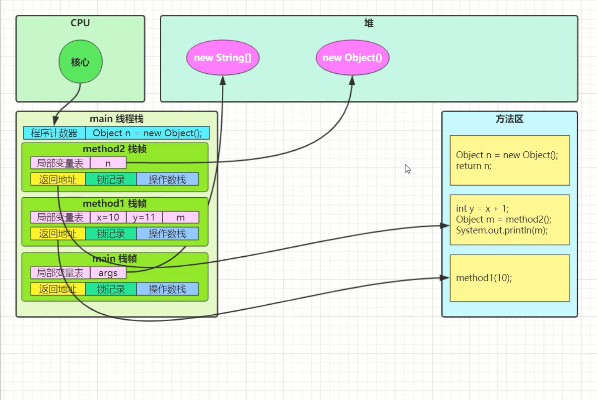
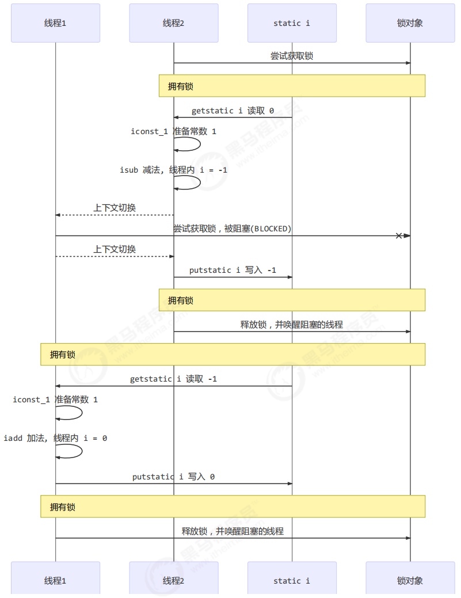
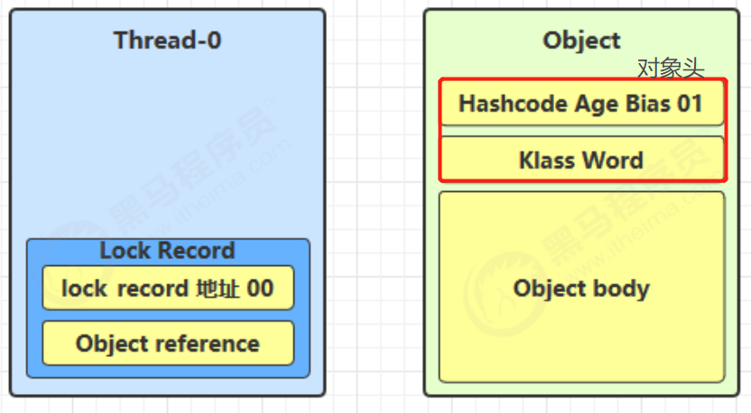
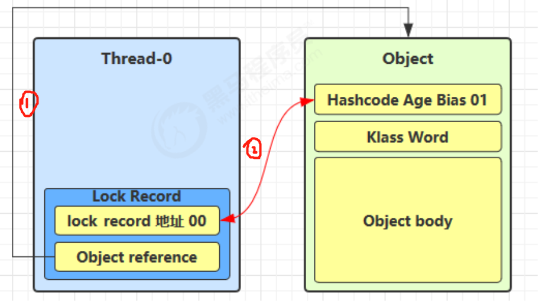
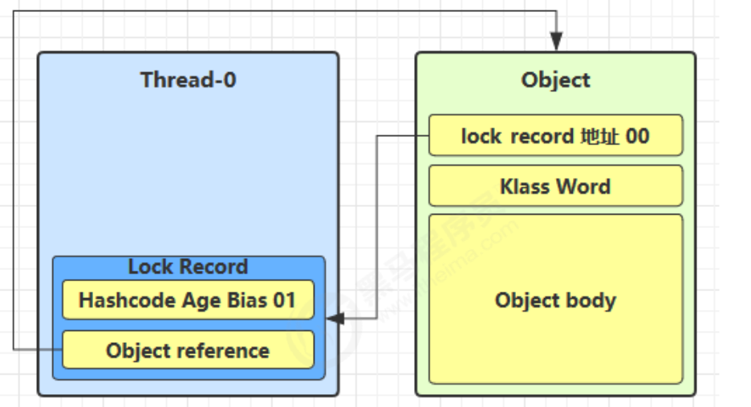
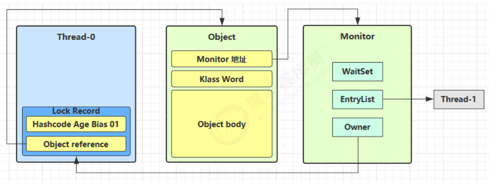

## 并发编程

### 1.进程与线程

#### 1.1 进程与线程

**进程**

- 程序由指令和数据组成，但这些指令要运行，数据要读写，就必须将指令加载至 CPU，数据加载至内存。在指令运行过程中还需要用到磁盘、网络等设备。进程就是用来加载指令、管理内存、管理 IO 的。

- 当一个程序被运行，从磁盘加载这个程序的代码至内存，这时就开启了一个进程。
- 进程就可以视为程序的一个实例。大部分程序可以同时运行多个实例进程（例如记事本、画图、浏览器 等），也有的程序只能启动一个实例进程（例如网易云音乐、360 安全卫士等）

**线程**

- 一个进程之内可以分为一到多个线程。
- 一个线程就是一个指令流，将指令流中的一条条指令以一定的顺序交给 CPU 执行 。
- Java 中，线程作为小调度单位，进程作为资源分配的最小单位。 在 windows 中进程是不活动的，只是作为线程的容器

**两者对比**

- 进程基本上相互独立的，而线程存在于进程内，是进程的一个子集 进程拥有共享的资源，如内存空间等，供其内部的线程共享
  - 进程间通信较为复杂 同一台计算机的进程通信称为 IPC（Inter-process communication）
  - 不同计算机之间的进程通信，需要通过网络，并遵守共同的协议，例如 HTTP
- 线程通信相对简单，因为它们共享进程内的内存，一个例子是多个线程可以访问同一个共享变量 线程更轻量，线程上下文切换成本一般上要比进程上下文切换低

#### 1.2 并行与并发

**并发**

单核 cpu 下，线程实际还是 串行执行的。操作系统中有一个组件叫做任务调度器，将 cpu 的时间片（windows下时间片最小约为 15 毫秒）分给不同的程序使用，只是由于 cpu 在线程间（时间片很短）的切换非常快，人类感觉是同时运行的 。总结为一句话就是： 微观串行，宏观并行 ，


一般会**将这种线程轮流使用 CPU 的做法称为并发， concurrent**


**并行**

多核 cpu下，每个核（core） 都可以调度运行线程，这时候线程可以是并行的。


引用 Rob Pike 的一段描述：

- 并发（concurrent）是同一时间应对（dealing with）多件事情的能力
- 并行（parallel）是同一时间动手做（doing）多件事情的能力

例子

- 家庭主妇做饭、打扫卫生、给孩子喂奶，她一个人轮流交替做这多件事，这时就是并发
- 家庭主妇雇了个保姆，她们一起这些事，这时既有并发，也有并行（这时会产生竞争，例如锅只有一口，一个人用锅时，另一个人就得等待）

- 雇了3个保姆，一个专做饭、一个专打扫卫生、一个专喂奶，互不干扰，这时是并行

#### 1.3 应用

**1.3.1 代码实例**

**同步调用**

```java
@Slf4j(topic = "c.Sync")
public class Sync {
    public static void main(String[] args) throws InterruptedException {
        log.debug("start sleep");
        TimeUnit.MILLISECONDS.sleep(2000);
        log.debug("end sleep");
        log.debug("do other thing");
    }
}
```


**异步调用**

```java
@Slf4j(topic = "c.Async")
public class Async {
    public static void main(String[] args){
        new Thread(() -> {
            log.debug("start sleep");
            try {
                TimeUnit.MILLISECONDS.sleep(2000);
            } catch (InterruptedException e) {
                e.printStackTrace();
            }
            log.debug("end sleep");
        }).start();
        log.debug("do other thing");
    }
}
```


可以发现。执行睡眠操作时的线程名称已经改变了，而且操作的顺序已经发生了改变。

**1.3.2** **应用之异步调用（案例**1)

以调用方角度来讲，如果

- 需要等待结果返回，才能继续运行就是同步
- 不需要等待结果返回，就能继续运行就是异步

**1)** **设计**

多线程可以让方法执行变为异步的（即不要巴巴干等着）比如说读取磁盘文件时，假设读取操作花费了 5 秒钟，如果没有线程调度机制，这 5 秒 cpu 什么都做不了，其它代码都得暂停...

**2)** **结论**

- 比如在项目中，视频文件需要转换格式等操作比较费时，这时开一个新线程处理视频转换，避免阻塞主线程
- tomcat 的异步 servlet 也是类似的目的，让用户线程处理耗时较长的操作，避免阻塞 tomcat 的工作线程
- ui 程序中，开线程进行其他操作，避免阻塞 ui 线程

**1.3.3 应用之提高效率（案例1）**

*计算 1 花费 10 ms*

*计算 2 花费 11 ms*

*计算 3 花费 9 ms*

*汇总需要 1 ms*

- 如果是串行执行，那么总共花费的时间是 10 + 11 + 9 + 1 = 31ms
- 但如果是四核 cpu，各个核心分别使用线程 1 执行计算 1，线程 2 执行计算 2，线程 3 执行计算 3，那么 3 线程是并行的，花费时间只取决于最长的那个线程运行的时间，即 11ms 最后加上汇总时间只会花费 12ms

**注意：需要在多核 cpu 才能提高效率，单核仍然时是轮流执行**

### 2. Java线程

#### 2.1 创建和运行线程

**方法一，直接使用Thread**

```java
// 创建线程对象
Thread t = new Thread() {
 public void run() {
 // 要执行的任务
 }
};
// 启动线程
t.start();
```

例如

```java
@Slf4j(topic = "c.CreateThread1")
public class CreateThread1 {
    public static void main(String[] args) {
        //1.创建线程
        Thread t = new Thread(){
            @Override
            public void run() {
                log.debug("Running");
            }
        };
        //2.指定名称并启动线程
        t.setName("log thread");
        t.start();
        //3.主线程中的打印
        log.debug("Main Running");
    }
}
```


**方法二，使用Runnable配合Thread**

把【线程】和【任务】（要执行的代码）分开

- Thread 代表线程
- Runnable 可运行的任务（线程要执行的代码）

```java
Runnable runnable = new Runnable() {
 public void run(){
 // 要执行的任务
 }
};
// 创建线程对象
Thread t = new Thread( runnable );
// 启动线程
t.start();
```

结果

```bash
11:17:21 【runnable】 c.CreateThread2 - Running
```

Java 8 以后可以使用 lambda 精简代码

```java
Runnable runnable = ()->{
    log.debug("Running");
};
Thread thread = new Thread(runnable,"lambda");
thread.start();
```

```java
Thread thread = new Thread(()->{
            log.debug("Running");
        },"lambda");
thread.start();
```

**小结**

- 方法1 是把线程和任务合并在了一起，方法2 是把线程和任务分开了
- 用 Runnable 更容易与线程池等高级 API 配合
- 用 Runnable 让任务类脱离了 Thread 继承体系，更灵活

**方法三，FutureTask 配合Thread**

FutureTask 能够接收 Callable 类型的参数，用来处理有返回结果的情况

Callable中的run方法可以返回值，而且能抛出异常，但是Runable中的run方法则不行

```java
@Slf4j(topic = "c.CreateThread3")
public class CreateThread3 {
    public static void main(String[] args) {
        Callable<Integer> callable = new Callable<Integer>() {
            @Override
            public Integer call() throws Exception {
                log.debug("Running");
                Thread.sleep(2000);
                return 10;
            }
        };
        FutureTask<Integer> task = new FutureTask<>(callable);
        Thread thread = new Thread(task,"callable task");
        thread.start();
        try {
            //在主线程中调用FutureTask的get方法，主线程会阻塞 等待线程的执行后返回的结果
            Integer callableReturn = task.get();
            log.debug("{}",callableReturn);
        } catch (InterruptedException | ExecutionException e) {
            e.printStackTrace();
        }
    }
}
```

```bash
11:33:45 【callable task】 c.CreateThread3 - Running
11:33:47 【main】 c.CreateThread3 - 10
```

#### 2.2 观察多个线程同时运行

```java
@Slf4j(topic = "c.ObserveMultiThread")
public class ObserveMultiThread {
    public static void main(String[] args) {
        new Thread(() -> {
            while (true){
                log.debug("Running t1");
            }
        },"t1").start();

        new Thread(() -> {
            while (true){
                log.debug("Running t2");
            }
        },"t2").start();
    }
}
```

```bash
11:37:10 【t2】 c.ObserveMultiThread - Running t2
11:37:10 【t2】 c.ObserveMultiThread - Running t2
11:37:10 【t1】 c.ObserveMultiThread - Running t1
11:37:10 【t1】 c.ObserveMultiThread - Running t1
11:37:10 【t1】 c.ObserveMultiThread - Running t1
```

至于线程的底层是多个核并行处理这两个线程，还是一个核并发处理这两个线程，是由底层的任务调度器处理的，我们控制不了。

#### **2.3 查看进程的方法**

**windows**

- 任务管理器可以查看进程和线程数，也可以用来杀死进程
- tasklist 查看进程
- taskkill 杀死进程

**linux**

- ps -fe 查看所有进程
- ps -fT -p <PID> 查看某个进程（PID）的所有线程
- kill 杀死进程
- top 按大写 H 切换是否显示线程
- top -H -p <PID> 
- 查看某个进程（PID）的所有线程

**Java**

- jps 命令查看所有 Java 进程
- jstack <PID> 查看某个 Java 进程（PID）的所有线程状态
- jconsole 来查看某个 Java 进程中线程的运行情况（图形界面）

#### 2.4 线程运行原理

Java Virtual Machine Stacks （Java 虚拟机栈）

我们都知道 JVM 中由堆、栈、方法区所组成，其中栈内存是给谁用的呢？其实就是线程，每个线程启动后，虚拟

机就会为其分配一块栈内存。

- 每个栈由多个栈帧（Frame）组成，对应着每次方法调用时所占用的内存
- **每个线程只能有一个活动栈帧**，对应着当前正在执行的那个方法

**一个线程的栈帧测试**

```java
public class FrameTest {
    public static void main(String[] args) {
        method1(10);	//断点打在这里
    }
    private static void method1(int x){
        int y = x + 1;
        Object m = method2();
        System.out.println(m);
    }

    private static Object method2(){
        return new Object();
    }
}

```


其余方法调用同理。



**两个线程的栈帧测试**

```java
public class FrameTest2 {
    public static void main(String[] args) {
        Thread thread = new Thread(){
            @Override
            public void run() {
                method1(20);	//断点一
            }
        };
        thread.start();

        method1(10);		//断点二
    }
    private static void method1(int x){
        int y = x + 1;
        Object m = method2();
        System.out.println(m);
    }

    private static Object method2(){
        return new Object();
    }
}

```

在打断点时，要调整断点的模式为Thread，右击断点设置即可。


开始调试


经过执行之后，可以看到每个线程都有自己专有的方法栈和栈帧


#### 2.5 线程上下文切换

因为以下一些原因导致 cpu 不再执行当前的线程，转而执行另一个线程的代码

- 线程的 cpu 时间片用完
- 垃圾回收
- 有更高优先级的线程需要运行
- 线程自己调用了 sleep、yield、wait、join、park、synchronized、lock 等方法

当 Context Switch 发生时，需要由操作系统保存当前线程的状态，并恢复另一个线程的状态，Java 中对应的概念

就是程序计数器（Program Counter Register），它的作用是记住下一条 jvm 指令的执行地址，是线程私有的

- 状态包括程序计数器、虚拟机栈中每个栈帧的信息，如局部变量、操作数栈、返回地址等
- Context Switch 频繁发生会影响性能

#### **2.6 常见方法**


**注意，调用Thread.currentThread().isInterrupted()的效果和 当前线程对象.isInterrupted()是一样的，并不是调用的那个静态方法。**

**所以，无论是Thread.currentThread().interrupt()还是 当前线程对象.interrupt()都是将当前线程的打断标记置为true.**

​			**Thread.currentThread().isInterrupted()和 当前线程对象.isInterrupted() 都是返回当前线程的打断标记**


#### **2.7 start和run**

直接调用run方法

```java
@Slf4j(topic = "c.StartAndRun")
public class StartAndRun {
    public static void main(String[] args) {
        Thread t1 = new Thread("t1"){
            @Override
            public void run() {
                log.debug("t1 Running");
            }
        };
        t1.run();
    }
}
```

```bash
16:23:22 【main】 c.StartAndRun - t1 Running
16:23:22 【main】 c.StartAndRun - do other things
```

可以看到，直接调用run方法还是在主线程中调用的run方法，并没有达到异步的效果。所以线程的启动需要使用start方法；

```java
@Slf4j(topic = "c.StartAndRun")
public class StartAndRun {
    public static void main(String[] args) {
        Thread t1 = new Thread("t1"){
            @Override
            public void run() {
                log.debug("t1 Running");
            }
        };
        t1.start();
        log.debug("do other things");
    }
}
```

```bash
16:24:33 【t1】 c.StartAndRun - t1 Running
16:24:33 【main】 c.StartAndRun - do other things
```

start方法只能调用一次。调用多次会出现异常。

#### **2.8 sleep和yield**

**sleep**

- 调用 sleep 会让当前线程从 *Running* 进入 *Timed Waiting* 状态（阻塞）

  ```java
  @Slf4j(topic = "c.SleepAndYield")
  public class SleepAndYield {
      public static void main(String[] args) {
          Thread t1 = new Thread("t1"){
              @Override
              public void run() {
                  try {
                      Thread.sleep(2000);
                  } catch (InterruptedException e) {
                      e.printStackTrace();
                  }
              }
          };
  
          t1.start();
          log.debug("t1 state {}",t1.getState());
          try{
              Thread.sleep(500);
          }
          catch (Exception e){
              e.printStackTrace();
          }
          log.debug("t1 state {}",t1.getState());
      }
  }
  ```

  ```bash
  16:31:13 【main】 c.SleepAndYield - t1 state RUNNABLE
  16:31:13 【main】 c.SleepAndYield - t1 state TIMED_WAITING
  ```

- 其它线程可以使用 interrupt 方法打断正在睡眠的线程，这时 sleep 方法会抛出 InterruptedException

  ```java
  @Slf4j(topic = "c.SleepInterrupted")
  public class SleepInterrupted {
      public static void main(String[] args) throws InterruptedException {
          Thread t1 = new Thread("t1") {
              @Override
              public void run() {
                  log.debug("enter sleep....");
                  try {
                      Thread.sleep(2000);
                  } catch (InterruptedException e) {
                      log.debug("wake up ...");
                      e.printStackTrace();
                  }
              }
          };
          t1.start();
  
          //主线程睡一秒
          Thread.sleep(1000);
          //唤醒t1
          log.debug("interrupt ...");
          t1.interrupt();
      }
  }
  ```

  ```bash
  16:35:53 【t1】 c.SleepInterrupted - enter sleep....
  16:35:54 【main】 c.SleepInterrupted - interrupt ...
  16:35:54 【t1】 c.SleepInterrupted - wake up ...
  java.lang.InterruptedException: sleep interrupted
  	at java.lang.Thread.sleep(Native Method)
  	at com.echo.juc.chapter2.SleepInterrupted$1.run(SleepInterrupted.java:13)
  ```

- 睡眠结束后的线程未必会立刻得到执行

- 建议用 TimeUnit 的 sleep 代替 Thread 的 sleep 来获得更好的可读性

  ```java
  public class TimeUnitTest {
      public static void main(String[] args) throws InterruptedException {
          TimeUnit.MILLISECONDS.sleep(1); //睡眠一毫秒
          TimeUnit.SECONDS.sleep(1);  //睡眠一秒
          TimeUnit.HOURS.sleep(1);    //睡眠一小时
      }
  }
  ```

**yield**

- 调用 yield 会让当前线程从 *Running* 进入 *Runnable* 就绪状态，然后调度执行其它线程
- 具体的实现依赖于操作系统的任务调度器


yield是让线程变为就绪状态(可运行状态Runnable)，该线程是仍有机会获得CPU所给的时间片的。但是sleep则是让线程进入了阻塞状态，只有当线程醒过来了，才有机会获得CPU的时间片。

**线程优先级**

- 线程优先级会提示（hint）调度器优先调度该线程，但它仅仅是一个提示，调度器可以忽略它。
- 如果 cpu 比较忙，那么优先级高的线程会获得更多的时间片，但 cpu 闲时，优先级几乎没作用

```java
@Slf4j(topic = "c.PriorityTest")
public class PriorityTest {
    public static void main(String[] args) {
        Runnable task1 = ()->{
            int count = 0;
            for (;;){
                count ++;
                log.debug("t1 count {}",count);
            }
        };
        Runnable task2 = ()->{
            int count = 0;
            for (;;){
                count ++;
                log.debug("t2 count {}",count);
            }
        };

        Thread t1 = new Thread(task1,"t1");
        Thread t2 = new Thread(task2,"t2");
        t1.start();
        t2.start();
    }
}
```

不设置任何优先级时，对于count 的计数如下

```bash
16:49:30 【t1】 c.PriorityTest - t1 count 443762
16:49:30 【t1】 c.PriorityTest - t1 count 443763
16:49:30 【t2】 c.PriorityTest - t2 count 443404
16:49:30 【t2】 c.PriorityTest - t2 count 443405
```

可以发现，两个线程的count值差距并不大。

**使用yield**

```java
@Slf4j(topic = "c.PriorityTest")
public class PriorityTest {
    public static void main(String[] args) {
        Runnable task1 = ()->{
            int count = 0;
            for (;;){
                count ++;
                log.debug("t1 count {}",count);
            }
        };
        Runnable task2 = ()->{
            int count = 0;
            for (;;){
                Thread.yield(); //将cpu使用权优先让给其他线程
                count ++;
                log.debug("t2 count {}",count);
            }
        };

        Thread t1 = new Thread(task1,"t1");
        Thread t2 = new Thread(task2,"t2");
        t1.start();
        t2.start();
    }
}
```

```bash
16:52:45 【t1】 c.PriorityTest - t1 count 213925
16:52:45 【t1】 c.PriorityTest - t1 count 213926
16:52:45 【t1】 c.PriorityTest - t1 count 213927
16:52:45 【t2】 c.PriorityTest - t2 count 53435
16:52:45 【t2】 c.PriorityTest - t2 count 53436
16:52:45 【t2】 c.PriorityTest - t2 count 53437
```

可以发现，明显线程一的计数要大于线程二。因为线程二对于CPU的时间片是能让则让。

**设置优先级**

```java
@Slf4j(topic = "c.PriorityTest")
public class PriorityTest {
    public static void main(String[] args) {
        Runnable task1 = ()->{
            int count = 0;
            for (;;){
                count ++;
                log.debug("t1 count {}",count);
            }
        };
        Runnable task2 = ()->{
            int count = 0;
            for (;;){
                count ++;
                log.debug("t2 count {}",count);
            }
        };

        Thread t1 = new Thread(task1,"t1");
        Thread t2 = new Thread(task2,"t2");
        t1.setPriority(Thread.MAX_PRIORITY);
        t2.setPriority(Thread.MIN_PRIORITY);
        t1.start();
        t2.start();
    }
}
```

```bash
16:54:43 【t2】 c.PriorityTest - t2 count 135060
16:54:43 【t2】 c.PriorityTest - t2 count 135061
16:54:43 【t2】 c.PriorityTest - t2 count 135062
16:54:43 【t1】 c.PriorityTest - t1 count 222830
16:54:43 【t1】 c.PriorityTest - t1 count 222831
16:54:43 【t1】 c.PriorityTest - t1 count 222832
16:54:43 【t1】 c.PriorityTest - t1 count 222833
16:54:43 【t1】 c.PriorityTest - t1 count 222834
16:54:43 【t2】 c.PriorityTest - t2 count 135063
16:54:43 【t2】 c.PriorityTest - t2 count 135064
```

给线程一设置了最高优先级，给线程二设置了最低优先级，从结果可以看出。线程一的计数要比线程二大很多。

#### 2.9 案例：防止CPU占用100%

在一些开发的服务器，或者GUI程序时，可能需要程序一直执行，从而编写while(true)的代码。在没有利用cpu来计算时，为了防止所编写的while (true)空转浪费cpu，可以使用yield或者sleep来让出cpu的使用权给其他程序。(极为有效！)

```java
while (true){
    try {
        Thread.sleep(50);
        //dosomething
    }
    catch (InterruptedException e){
        e.printStackTrace();
    }
}
```

- 可以用 wait 或 条件变量达到类似的效果
- 不同的是，后两种都需要加锁，并且需要相应的唤醒操作，一般适用于要进行同步的场景
- sleep 适用于无需锁同步的场景

#### 2.10 join方法

考虑下面的代码打印什么？

```java
@Slf4j(topic = "c.JoinDemo")
public class JoinDemo {
    static int r = 0;
    public static void test(){
        log.debug("start");
        Thread t1 = new Thread(() -> {
            log.debug("start");
            try {
                Thread.sleep(1000);
            } catch (InterruptedException e) {
                e.printStackTrace();
            }
            log.debug("end");
            r = 10;
        });
        t1.start();
        log.debug("result:{}",r);
        log.debug("end");
    }

    public static void main(String[] args) {
        test();
    }
}
```

```bash
18:09:18 【main】 c.JoinDemo - start
18:09:18 【Thread-0】 c.JoinDemo - start
18:09:18 【main】 c.JoinDemo - result:0
18:09:18 【main】 c.JoinDemo - end
18:09:19 【Thread-0】 c.JoinDemo - end
```

出现这种情况的原因是：开启的线程要睡一秒才会修改r的值，但是在开启的线程睡的时候，主线程已经执行完了

分析

- 因为主线程和线程 t1 是并行执行的，t1 线程需要 1 秒之后才能算出 r=10
- 而主线程一开始就要打印 r 的结果，所以只能打印出 r=0

解决方法

- 用 sleep 行不行？为什么？
  有时候线程执行的方法是不确定的，主线程并不知道要休眠多久。
- 用 join，加在 t1.start() 之后即可

```java
@Slf4j(topic = "c.JoinDemo")
public class JoinDemo {
    static int r = 0;
    public static void test() throws InterruptedException {
        log.debug("start");
        Thread t1 = new Thread(() -> {
            log.debug("start");
            try {
                Thread.sleep(1000);
            } catch (InterruptedException e) {
                e.printStackTrace();
            }
            log.debug("end");
            r = 10;
        });
        t1.start();
        t1.join();  //主线程等待t1线程的结束
        log.debug("result:{}",r);
        log.debug("end");
    }

    public static void main(String[] args) throws InterruptedException {
        test();
    }
}
```

```bash
18:23:25 【main】 c.JoinDemo - start
18:23:26 【Thread-0】 c.JoinDemo - start
18:23:27 【Thread-0】 c.JoinDemo - end
18:23:27 【main】 c.JoinDemo - result:10
18:23:27 【main】 c.JoinDemo - end
```

#### 2.11 案例：同步

以调用方角度来讲，如果

- 需要等待结果返回，才能继续运行就是同步
- 不需要等待结果返回，就能继续运行就是异步


考虑下面的代码

```java
@Slf4j(topic = "c.MultiJoinDemo")
public class MultiJoinDemo {
    static int r1 = 0;
    static int r2 = 0;

    private static void test2() throws InterruptedException{
        Thread t1 = new Thread(){
            @SneakyThrows
            @Override
            public void run() {
                TimeUnit.SECONDS.sleep(1);
                r1 = 10;
            }
        };
        Thread t2 = new Thread(){
            @SneakyThrows
            @Override
            public void run() {
                TimeUnit.SECONDS.sleep(2);
                r2 = 20;
            }
        };
        long start = System.currentTimeMillis();
        t1.start();
        t2.start();
        t1.join();
        t2.join();
        long end = System.currentTimeMillis();
        log.debug("r1 : {} , r2 : {} , cost : {}",r1,r2,end - start);
    }

    public static void main(String[] args) throws InterruptedException {
        test2();
    }
}
```

```bash
18:35:19 【main】 c.MultiJoinDemo - join begin
18:35:20 【main】 c.MultiJoinDemo - t1 join end
18:35:21 【main】 c.MultiJoinDemo - t2 join end
18:35:21 【main】 c.MultiJoinDemo - r1 : 10 , r2 : 20 , cost : 2003
```


**如果颠倒两个join的位置呢？**

```java
@Slf4j(topic = "c.MultiJoinDemo")
public class MultiJoinDemo {
    static int r1 = 0;
    static int r2 = 0;

    private static void test2() throws InterruptedException{
        Thread t1 = new Thread(){
            @SneakyThrows
            @Override
            public void run() {
                TimeUnit.SECONDS.sleep(1);
                r1 = 10;
            }
        };
        Thread t2 = new Thread(){
            @SneakyThrows
            @Override
            public void run() {
                TimeUnit.SECONDS.sleep(2);
                r2 = 20;
            }
        };
        long start = System.currentTimeMillis();
        t1.start();
        t2.start();
        log.debug("join begin");
        t2.join();
        log.debug("t2 join end");
        t1.join();
        log.debug("t1 join end");
        long end = System.currentTimeMillis();
        log.debug("r1 : {} , r2 : {} , cost : {}",r1,r2,end - start);
    }

    public static void main(String[] args) throws InterruptedException {
        test2();
    }
}
```

```bash
18:38:19 【main】 c.MultiJoinDemo - join begin
18:38:21 【main】 c.MultiJoinDemo - t2 join end
18:38:21 【main】 c.MultiJoinDemo - t1 join end
18:38:21 【main】 c.MultiJoinDemo - r1 : 10 , r2 : 20 , cost : 2006
```

仍然是2秒，因为在t2.join()，即等待t2执行的时候，t1也正在执行。所以在调用完t1.join()之后，会立刻完成。


**限时join**

```java
@Slf4j(topic = "c.TimeLimitJoinDemo")
public class TimeLimitJoinDemo {
    static int r1 = 0;
    public static void main(String[] args) throws InterruptedException {
        test1();
    }
    private static void test1() throws InterruptedException{
        Thread t1 = new Thread(){
            @SneakyThrows
            @Override
            public void run() {
                TimeUnit.SECONDS.sleep(2);
                r1 = 10;
            }
        };
        long start = System.currentTimeMillis();
        t1.start();
        log.debug("join begin");
        t1.join(1500);  //等待t1 1.5s
        long end = System.currentTimeMillis();
        log.debug("r1 : {}, cost :{}",r1,end - start);
    }
}
```

```bash
18:45:38 【main】 c.TimeLimitJoinDemo - join begin
18:45:40 【main】 c.TimeLimitJoinDemo - r1 : 0, cost :1508
```

因为还差0.5秒，t1才能将r1修改为10，这里只等了1.5秒。但是如果join等待的时间比线程运行时间还要长，那么等待的时间就是线程运行的时间，并不会按照指定的值去等待。

#### 2.12 interrupt方法

**打断sleep,wait,join的线程**

这几个方法都会让线程进入**阻塞**状态，**打断阻塞的线程会让线程抛出异常。**

打断 sleep 的线程, 会清空打断状态，以 sleep 为例

```java
@Slf4j(topic = "c.InterruptDemo")
public class InterruptDemo {
    public static void main(String[] args) throws InterruptedException {
        Thread t1 = new Thread("t1") {
            @Override
            public void run() {
                log.debug("sleep...");
                try {
                    Thread.sleep(5000);
                } catch (InterruptedException e) {
                    e.printStackTrace();
                }
            }
        };
        t1.start();
        log.debug("interrupt");
        //等t1睡着
        TimeUnit.SECONDS.sleep(1);
        //打断
        t1.interrupt();
        
        log.debug("interrupt flg {}",t1.isInterrupted());
    }
}

```

```bash
18:57:31 【t1】 c.InterruptDemo - sleep...
18:57:31 【main】 c.InterruptDemo - interrupt
java.lang.InterruptedException: sleep interrupted
	at java.lang.Thread.sleep(Native Method)
	at com.echo.juc.chapter2.InterruptDemo$1.run(InterruptDemo.java:15)
18:57:32 【main】 c.InterruptDemo - interrupt flg false
```

sleep,wait,join在打断之后，会将打断标记清空，所以打印的是false（我在ubuntu中得到的flg是true?）,所指的清空打断标记，就是指将线程的打断标记重置为false

**打断正常运行的线程**

打断正常运行的线程, 不会清空打断状态

```java
@Slf4j(topic = "c.InterruptDemo2")
public class InterruptDemo2 {
    public static void main(String[] args) throws InterruptedException{
        Thread t1 = new Thread("t1") {
            @Override
            public void run() {
                while (true) {
                    //在主线程调用t1.interrupted()方法之后，会将打断标记置为真，
                    //在该线程中，判断打断标记是否为真，如果为真，则自己将自己打断
                    boolean interrupted = Thread.currentThread().isInterrupted();
                    if (interrupted){
                        log.debug("被打断了，退出循环");
                        break;
                    }
                }
            }
        };
        t1.start();
        TimeUnit.SECONDS.sleep(1);
        log.debug("interrupt");
        //正常运行的线程，在调用interrupt()方法之后，并不会停止运行。而是将打断标记置为true
        //真正是否要停止运行，是通过判断打断标记，如果为真，就停止运行
        t1.interrupt();
    }
}
```

#### 2.13 两阶段终止模式

在一个线程T1中，如何”优雅“的终止T2？这里的【优雅】是指给T2一个料理后事的机会

**错误思路**

1.使用线程对象的stop()方法停止线程

- stop方法会真正杀死线程，如果这时候线程锁住了共享资源，那么当它被杀死之后就再也没有机会释放锁，其他线程将永远无法获取锁

2.使用System.exit(int)方法停止线程

- 目的是仅停止一个线程，但是这种做法会让整个程序都停止

**流程**

一个后台监控线程，每隔两秒监控一次后台的情况，然后睡眠。

在每次while循环的开始，先检查有没有被打断，如果被打断了，那么处理后事，结束线程。如果没有被打断睡两秒，然后执行监控。

但是，如果是正常执行监控时，被打断，则打断标记会置为true，但是如果是在睡眠状态下被打断，那么打断标记并不会被置为true,所以就需要设置打断标记为true，然后同样的就会出现结束线程，处理后事的正常情况。


```java
@Slf4j(topic = "c.TwoParseTermination")
public class TwoParseTerminationDemo {
    public static void main(String[] args) throws InterruptedException {
        TwoParseTermination t = new TwoParseTermination();
        t.start();
        //主线程优雅的去停止该线程.
        TimeUnit.SECONDS.sleep(3);
        t.stop();
    }
}

@Slf4j(topic = "c.TwoParseTermination")
class TwoParseTermination{
    private Thread monitor;

    //启动监控线程
    public void start(){
        monitor = new Thread(){
            @Override
            public void run() {
                while (true){
                    boolean interrupted = Thread.currentThread().isInterrupted();
                    //被打断
                    if (interrupted){
                        log.debug("料理后事");
                        break;
                    }
                    //没被打断,睡眠一秒
                    try {
                        Thread.sleep(1000);
                        log.debug("执行监控记录");
                    } catch (InterruptedException e) {
                        e.printStackTrace();
                        //当睡眠时被打断。手动置打断标记为真
                        //因为睡眠时并不会将打断标记置为true,因此需要手动设置打断标记为true
                        //在这里可以设置成功是因为这里并没有sleep，而是正常的异常捕捉代码块
                        Thread.currentThread().interrupt();
                    }

                }
            }
        };
        monitor.start();
    }

    //停止监控线程
    public void stop(){
        monitor.interrupt();
    }
}
```

```bash
20:29:55 【Thread-0】 c.TwoParseTermination - 执行监控记录
20:29:56 【Thread-0】 c.TwoParseTermination - 执行监控记录
java.lang.InterruptedException: sleep interrupted
	at java.lang.Thread.sleep(Native Method)
	at com.echo.juc.chapter2.TwoParseTermination$1.run(TwoParseTerminationDemo.java:37)
20:29:57 【Thread-0】 c.TwoParseTermination - 料理后事
```

**打断park线程**

```java
@Slf4j(topic = "c.LockParkDemo")
public class LockParkDemo {
    public static void main(String[] args) throws InterruptedException {
        test1();
    }
    private static void test1() throws InterruptedException{
        Thread t1 = new Thread("t1"){
            @Override
            public void run() {
                log.debug("park....");
                //锁住该线程，锁住之后，下面的代码不会执行
                LockSupport.park();
                log.debug("unpark...");
                log.debug("interrupt flg {}",Thread.currentThread().isInterrupted());
                //再锁一次,但是打断标记仍为真，所以不会锁住,只能在上面重置打断标记
                LockSupport.park();
                log.debug("unpark");
            }
        };
        t1.start();
        //主线程睡一秒
        TimeUnit.SECONDS.sleep(1);
        //打断,打断之后，打断标记为真
        t1.interrupt();
    }
}
```

```bash
21:38:18 【t1】 c.LockParkDemo - park....
21:38:19 【t1】 c.LockParkDemo - unpark...
21:38:19 【t1】 c.LockParkDemo - interrupt flg true
21:38:19 【t1】 c.LockParkDemo - unpark
```

#### **2.14 不推荐的方法**

还有一些不推荐使用的方法，这些方法已过时，容易破坏同步代码块，造成线程死锁


**stop()方法要使用两阶段种植模式来终止**

#### **2.15 主线程与守护线程**

默认情况下，**Java 进程**需要等待所有线程都运行结束，才会结束。有一种特殊的线程叫做守护线程，只要其它非守护线程运行结束了，即使守护线程的代码没有执行完，也会强制结束。

```java
@Slf4j(topic = "c.DaemonDemo")
public class DaemonDemo {
    public static void main(String[] args) throws InterruptedException {
        Thread t1 = new Thread("t1"){
            @Override
            public void run() {
                while (true){
                    if(Thread.currentThread().isInterrupted()){
                        break;
                    }
                }
                log.debug("t1 end");
            }
        };
        //启动前设置为守护线程
        t1.setDaemon(true);
        t1.start();
        TimeUnit.SECONDS.sleep(1);
        log.debug("main end");
    }
}
```

```bash
21:46:10 【main】 c.DaemonDemo - main end
```

主线程已经结束了，虽然守护线程中是死循环，但仍然会被结束

**注意：**

- 垃圾回收器线程就是一种守护线程
- Tomcat 中的 Acceptor 和 Poller 线程都是守护线程，所以 Tomcat 接收到 shutdown 命令后，不会等待它们处理完当前请求

#### **2.16 线程的五种状态**

五种状态的划分主要是从操作系统的层面进行划分的


1. 初始状态，仅仅是在语言层面上创建了线程对象，即`Thead thread = new Thead();`，还未与操作系统线程关联
2. 可运行状态，也称就绪状态，指该线程已经被创建，与操作系统相关联，等待cpu给它分配时间片就可运行
3. 运行状态，指线程获取了CPU时间片，正在运行
   1. 当CPU时间片用完，线程会转换至【可运行状态】，等待 CPU再次分配时间片，会导致我们前面讲到的上下文切换
4. 阻塞状态
   1. 如果调用了阻塞API，如BIO读写文件，那么线程实际上不会用到CPU，不会分配CPU时间片，会导致上下文切换，进入【阻塞状态】
   2. 等待BIO操作完毕，会由操作系统唤醒阻塞的线程，转换至【可运行状态】
   3. 与【可运行状态】的区别是，只要操作系统一直不唤醒线程，调度器就一直不会考虑调度它们，CPU就一直不会分配时间片
5. 终止状态，表示线程已经执行完毕，生命周期已经结束，不会再转换为其它状态

#### 2.17 线程的六种状态

这是从 Java API 层面来描述的，我们主要研究的就是这种。状态转换详情图：[地址](https://www.jianshu.com/p/ec94ed32895f) 根据 Thread.State 枚举，分为六种状态 Test12.java


1. NEW 跟五种状态里的初始状态是一个意思
2. RUNNABLE 是当调用了 `start()` 方法之后的状态，注意，Java API 层面的 `RUNNABLE` 状态涵盖了操作系统层面的【可运行状态（就绪状态）】、【运行状态】和【阻塞状态（操作系统级别的阻塞状态，如文件阻塞读写）】（由于 BIO 导致的线程阻塞，在 Java 里无法区分，仍然认为是可运行）
3. `BLOCKED` ， `WAITING` ， `TIMED_WAITING` 都是 Java API 层面对【阻塞状态】的细分，后面会在状态转换一节 详述

**演示**

```java
@Slf4j(topic = "c.SixState")
public class SixState {
    public static void main(String[] args) {
        //t1新建出来还没有start
        Thread t1 = new Thread("t1"){
            @Override
            public void run() {
                log.debug("t1 running...");
            }
        };

        //t2一直执行
        Thread t2 = new Thread("t2"){
            @Override
            public void run() {
                while (true){

                }
            }
        };
        t2.start();

        //t3正常执行并结束
        Thread t3 = new Thread("t3"){
            @Override
            public void run() {
                log.debug("t3 running...");
            }
        };
        t3.start();
        
        //t4对SixState.class加锁（可以拿到），然后执行休眠
        Thread t4 = new Thread("t4"){
            @Override
            public void run() {
                synchronized (SixState.class){
                    try {
                        TimeUnit.SECONDS.sleep(5000);
                    } catch (InterruptedException e) {
                        e.printStackTrace();
                    }
                }
            }
        };
        t4.start();
        
        //t5 等待t2执行完毕，因为t2是死循环，所以一直不会执行完毕
        Thread t5 = new Thread("t5"){
            @Override
            public void run() {
                try{
                    t2.join();
                }
                catch (InterruptedException e){
                    e.printStackTrace();
                }
            }
        };
        t5.start();

        //t6等待拿到SixState.class的锁，但是由于t4没有休眠完成，所以不会得到锁
        Thread t6 = new Thread("t6"){
            @Override
            public void run() {
                //这里t6是拿不到锁的，所以会一直等待锁
                synchronized (SixState.class){
                    //blocked
                    try {
                        TimeUnit.SECONDS.sleep(5000);
                    } catch (InterruptedException e) {
                        e.printStackTrace();
                    }
                }
            }
        };
        t6.start();

        log.debug("t1 state {}", t1.getState());
        log.debug("t2 state {}", t2.getState());
        log.debug("t3 state {}", t3.getState());
        log.debug("t4 state {}", t4.getState());
        log.debug("t5 state {}", t5.getState());
        log.debug("t6 state {}", t6.getState());
    }
}

```

```bash
16:33:26 【t3】 c.SixState - t3 running...
16:33:26 【main】 c.SixState - t1 state NEW
16:33:26 【main】 c.SixState - t2 state RUNNABLE
16:33:26 【main】 c.SixState - t3 state TERMINATED
16:33:26 【main】 c.SixState - t4 state TIMED_WAITING
16:33:26 【main】 c.SixState - t5 state WAITING
16:33:26 【main】 c.SixState - t6 state BLOCKED
```

#### 2.18 案例：统筹规划

t1执行洗水壶和做开水的动作，其中洗水壶1分钟，做开水15分钟。

t2执行洗茶杯，洗茶壶,拿茶叶的动作，其中洗茶杯1分钟，洗茶壶2分钟，拿茶叶1分钟。然后等待t1执行完成后，t2执行泡茶动作

```java
@Slf4j(topic = "c.MakeTea")
public class MakeTea {
    public static void main(String[] args) {
        //t1.洗水壶，烧开水
        Thread t1 = new Thread("t1"){
            @Override
            public void run() {
                log.debug("洗水壶 1分钟");
                try {
                    TimeUnit.SECONDS.sleep(1);
                } catch (InterruptedException e) {
                    e.printStackTrace();
                }
                log.debug("做开水 15分钟");
                try {
                    TimeUnit.SECONDS.sleep(15);
                } catch (InterruptedException e) {
                    e.printStackTrace();
                }
            }
        };
        //t2.洗茶杯，洗茶壶，拿茶叶
        Thread t2 = new Thread("t2"){
            @Override
            public void run() {
                log.debug("洗茶杯 1分钟");
                try {
                    TimeUnit.SECONDS.sleep(1);
                } catch (InterruptedException e) {
                    e.printStackTrace();
                }
                log.debug("洗茶壶 2分钟");
                try {
                    TimeUnit.SECONDS.sleep(2);
                } catch (InterruptedException e) {
                    e.printStackTrace();
                }
                log.debug("拿茶叶 1分钟");
                try {
                    TimeUnit.SECONDS.sleep(1);
                } catch (InterruptedException e) {
                    e.printStackTrace();
                }
                //t2等待t1执行完成后，泡茶
                try {
                    t1.join();
                } catch (InterruptedException e) {
                    e.printStackTrace();
                }
                log.debug("泡茶");
            }
        };

        t1.start();
        t2.start();
    }
}

```

后续有更好的解法

#### 2.19 小结

1）线程的创建
2）线程重要的 API，如 start、run、sleep、yield、join、interrupt 等
3）线程的状态
4）原理方面，线程的运行流程，栈、栈帧、上下文切换、程序计数器等知识。
5）Thread 两种创建线程的源码
6）使用 interrupt 来编写两阶段终止

### 3.共享模型之管程

#### 3.1 小故事 

#### 3.2 线程出现问题的原因

线程出现问题的根本原因是因为线程上下文切换，导致线程里的指令没有执行完就切换执行其它线程了

```java
@Slf4j(topic = "c.CurrentError")
public class CurrentError {
    static int count = 0;

    public static void main(String[] args) throws InterruptedException {
        Thread t1 = new Thread(()->{
            for (int i = 0; i < 5000; i++) {
                count ++;
            }
        },"t1");
        Thread t2 = new Thread(() -> {
            for (int i = 0; i < 5000; i++) {
                count--;
            }
        }, "t2");
        t1.start();
        t2.start();
        t1.join();
        t2.join();
        log.debug("count :{}",count);
    }
}
```

```bash
17:18:24 【main】 c.CurrentError - count :-755
```

java中对于静态变量执行的自增或者自减都不是原子操作，从字节码部分可以看

```bash
count++; // 操作字节码如下：

getstatic i // 获取静态变量i的值
iconst_1 // 准备常量1
iadd // 自增
putstatic i // 将修改后的值存入静态变量i

count--; // 操作字节码如下：

getstatic i // 获取静态变量i的值
iconst_1 // 准备常量1
isub // 自减
putstatic i // 将修改后的值存入静态变量i
```

Java 的内存模型如下，完成静态变量的自增，自减需要在主存和工作内存中进行数据交换：


如果代码是正常按顺序运行的，那么count的值不会计算错


出现负数的情况：


出现正数的情况：


#### 3.3 临界区 Critical Section

- 一个程序运行多线程本身是没有问题的

- 问题出现在多个线程共享资源的时候
  - 多个线程同时对共享资源进行读操作本身也没有问题
  - 多个线程对共享资源进行读写操作时，发生指令交错，就会出现问题

临界区的概念：一段代码内如果存在对共享资源的多线程读写操作，那么称这段代码为临界区

```java
static int counter = 0;
static void increment(){
    //临界区
    counter ++;
}
static void decrement(){
    //临界区
    counter --;
}
```

#### 3.4 竞态条件

多个线程在临界区执行，那么由于代码指令的执行不确定而导致的结果问题，称为竞态条件

#### 3.5 synchronized解决竞态条件

为了避免临界区中的竞态条件发生，有多种手段可以达到该目的

- 阻塞式解决方案：synchronized ，Lock
- 非阻塞式解决方案：原子变量

现在讨论使用synchronized来进行解决，即俗称的对象锁，它采用互斥的方式让同一时刻至多只有一个线程持有对象锁，其他线程如果想获取这个锁就会阻塞住，这样就能保证拥有锁的线程可以安全的执行临界区内的代码，不用担心线程上下文切换

*注意 虽然 java 中互斥和同步都可以采用 synchronized 关键字来完成，但它们还是有区别的： 互斥是保证临界区的竞态条件发生，同一时刻只能有一个线程执行临界区的代码 同步是由于线程执行的先后，顺序不同但是需要一个线程等待其它线程运行到某个点。*

**语法**

```java
synchronized(对象){	//线程一获得锁，那么线程二的状态是block，注意是block，因为sychronized是互斥的。
    临界区
}
```

```java
@Slf4j(topic = "c.SychronizedResolve")
public class SychronizedResolve {
    static int count = 0;
    static Object lock = new Object();

    public static void main(String[] args) throws InterruptedException {
        Thread t1 = new Thread(()->{
            for (int i = 0; i < 5000; i++) {
                synchronized (lock){   //拿到锁对象，锁住代码
                    count ++;
                }
            }
        },"t1");
        Thread t2 = new Thread(() -> {
            for (int i = 0; i < 5000; i++) {
                synchronized (lock){
                    count--;
                }
            }
        }, "t2");
        t1.start();
        t2.start();
        t1.join();
        t2.join();
        log.debug("count :{}",count);
    }
}
```

#### 3.6 synchronized理解

可以做这样的类比:

- synchronized(对象)中的对象，可以想象为一个房间，有唯一入口（门），房间只能一次进入一人进行计算，线程t1,t2可以想象成两个人
- 当线程t1执行到synchronized(room)时，就好比t1进入了这个房间，并锁住了门，拿走了钥匙，在门内执行了count++代码。
- 这时如果t2也运行到了synchronized(room)时，它发现门被锁住了，只能在门外等候，发生了上下文切换，阻塞住了。
- 这时，即使t1的cpu时间片不幸用完，被踢出了门外（**不要错误的理解为锁住了对象就能一直执行下去**），这时门还是锁住的,t1仍拿着钥匙，t2线程还在阻塞状态进不去，因为t2没有钥匙，只有下次轮到t1自己再次获得时间片时才能开门进入。
- 当t1执行完synchronized{}块内的代码，这时候才会从room房间里出来，并解开门上的锁，唤醒t2线程，把钥匙给它，t2这时才可以进入room房间，锁住门，拿上钥匙，执行代码。

如图



synchronized 实际是用**对象锁**保证了**临界区内代码的原子性**，临界区内的代码对外是不可分割的，不会被线程切

换所打断。

**思考**

- 如果把 synchronized(obj) 放在 for 循环的外面，如何理解？-- 原子性

  ```java
  Thread t1 = new Thread(()->{
              synchronized (lock){ //拿到锁对象，锁住代码
                  for (int i = 0; i < 5000; i++) {
                      count ++;
                  }
              }
   },"t1");
  ```

  这样会将整个for循环都锁住，等到整个for循环执行完成后才释放锁。

- 如果 t1 synchronized(obj1) 而 t2 synchronized(obj2) 会怎样运作？-- 锁对象

  ```java
  Thread t1 = new Thread(()->{
      for (int i = 0; i < 5000; i++) {
          synchronized (lock1){   //拿到锁对象，锁住代码
              count ++;
          }
      }
  },"t1");
  Thread t2 = new Thread(() -> {
      for (int i = 0; i < 5000; i++) {
          synchronized (lock2){
              count--;
          }
      }
  }, "t2");
  ```

  这样锁的是两个不同的对象，第一个会给第一个加锁，第二个会给第二个加锁，不能实现互斥

- 如果 t1 synchronized(obj) 而 t2 没有加会怎么样？如何理解？-- 锁对象

  ```java
  Thread t1 = new Thread(()->{
      for (int i = 0; i < 5000; i++) {
          synchronized (lock){   //拿到锁对象，锁住代码
              count ++;
          }
      }
  },"t1");
  Thread t2 = new Thread(() -> {
      for (int i = 0; i < 5000; i++) {
          count--;
      }
  }, "t2");
  ```

  看上面的时序图，虽然t1进行了加锁，但是当时间片分配到t2时，t2并不需要获取锁，也就不会阻塞，从而导致t2在获取到时间片时可以随意操作count的值

**面向对象的改进**

```java
/**
 * 以面向对象的方式改进
 */
@Slf4j(topic = "c.SychronizedResolveOOP")
public class SychronizedResolveOOP {

//    static Object lock = new Object();

    public static void main(String[] args) throws InterruptedException {
        Room room = new Room();
        Thread t1 = new Thread(()->{
            for (int i = 0; i < 5000; i++) {
                room.increment();
            }
        },"t1");
        Thread t2 = new Thread(() -> {
            for (int i = 0; i < 5000; i++) {
                room.decrement();
            }
        }, "t2");
        t1.start();
        t2.start();
        t1.join();
        t2.join();
        log.debug("count :{}",room.getCount());
    }
}
class Room{
    private int count = 0;
    public void increment(){
        //用当前对象自己作为锁对象，保护原子操作
        synchronized (this){
            this.count ++;
        }
    }
    public void decrement(){
        synchronized (this){
            this.count -- ;
        }
    }
    public int getCount(){
        //为了保证获取时得到的是一个完整的结果，
        //而不是指令执行一半之后的结果，也需要加锁
        synchronized (this){
            return this.count;
        }
    }
}
```

```bash
22:03:29 【main】 c.SychronizedResolveOOP - count :0
```

#### 3.7 方法上的synchronized

```java
//非static方法
class Test{
    public synchronized void test() {

    }
}
//等价于
class Test{
    public void test() {
        synchronized(this) {

        }
    }
}
```

```java
//static方法
class Test{
    public synchronized static void test() {
        
    }
}
//等价于
class Test{
    public static void test() {
        synchronized(Test.class) {

        }
    }
}
```

**synchronized只能锁对象**

**不加synchronized**的方法是无法保证方法中的代码的原子性的


**“线程八锁”**

其实就是考察 synchronized 锁住的是哪个对象

情况一

```java
@Slf4j(topic = "c.Number")
class Number{
    public synchronized void a(){
        log.debug("1");
    }
    public synchronized void b(){
        log.debug("2");
    }
}


@Slf4j(topic = "c.ThreadEightLockOne")
public class ThreadEightLockOne {
    public static void main(String[] args) {
        Number number = new Number();
        new Thread(() -> { number.a(); }).start();
        new Thread(() -> { number.b(); }).start();
    }
}
```

```bash
22:15:01 【Thread-0】 c.Number - 1
22:15:01 【Thread-1】 c.Number - 2
```

结果也有可能是先2后1

两个线程锁的都是同一个对象，都是number对象，因为synchronized加在成员方法上相当于锁的是this.


情况二

```java
@Slf4j(topic = "c.Number")
class Number2{
    public synchronized void a() throws InterruptedException {
        TimeUnit.SECONDS.sleep(1);
        log.debug("1");
    }
    public synchronized void b(){
        log.debug("2");
    }
}


@Slf4j(topic = "c.ThreadEightLockTwo")
public class ThreadEightLockTwo {
    public static void main(String[] args) {
        Number2 number = new Number2();
        new Thread(() -> {
            try {
                number.a();
            } catch (InterruptedException e) {
                e.printStackTrace();
            }
        }).start();
        new Thread(() -> { number.b(); }).start();
    }
}
```

```bash
22:57:47 【Thread-0】 c.Number - 1
22:57:47 【Thread-1】 c.Number - 2
```

会出现两种结果，1秒后，打印1 2，或者先打印2 ，1秒后打印1


情况三

```java
@Slf4j(topic = "c.Number3")
class Number3{
    public synchronized void a() throws InterruptedException {
        TimeUnit.SECONDS.sleep(1);
        log.debug("a");
    }

    public synchronized void b(){
        log.debug("b");
    }

    public void c(){
        log.debug("c");
    }
}

public class ThreadEightLockThree {
    public static void main(String[] args) {
        Number3 number = new Number3();
        new Thread(() -> {
            try {
                number.a();
            } catch (InterruptedException e) {
                e.printStackTrace();
            }
        }).start();
        new Thread(() -> { number.b(); }).start();
        new Thread(() -> { number.c(); }).start();
    }
}
```

```bash
21:06:23 【Thread-2】 c.Number3 - c
21:06:24 【Thread-0】 c.Number3 - a
21:06:24 【Thread-1】 c.Number3 - b
```

可能的情况，c 肯定会打印，然后第一个线程获得锁，等待一秒打印a,然后打印b

或者就是b先获得锁，先打印c 打印b然后一秒后打印a

因为执行c方法并不需要锁，所以线程启动后可以直接执行c方法，没有互斥的方法。


情况四

```java
@Slf4j(topic = "c.Number4")
class Number4{
    public synchronized void a() throws InterruptedException {
        TimeUnit.SECONDS.sleep(1);
        log.debug("1");
    }
    public synchronized void b(){
        log.debug("2");
    }
}
@Slf4j(topic = "c.ThreadEightLockFour")
public class ThreadEightLockFour {
    public static void main(String[] args) {
        Number4 n1 = new Number4();
        Number4 n2 = new Number4();

        new Thread(()->{
            try {
                n1.a();
            } catch (InterruptedException e) {
                e.printStackTrace();
            }
        }).start();
        new Thread(()->{
            n2.b();
        }).start();

    }
}
```

```bash
21:14:22 【Thread-1】 c.Number4 - 2
21:14:23 【Thread-0】 c.Number4 - 1
```

肯定是这种执行结果，因为两个线程锁的对象不一样，互不干扰，然后2先打印，1在1秒后打印


情况五

```java
@Slf4j(topic = "c.Number5")
class Number5{
    public static synchronized void a() throws InterruptedException {
        TimeUnit.SECONDS.sleep(1);
        log.debug("1");
    }
    public synchronized void b(){
        log.debug("2");
    }
}
@Slf4j(topic = "c.ThreadEightLockFive")
public class ThreadEightLockFive {
    public static void main(String[] args) {
        Number5 number5 = new Number5();
        new Thread(()->{
            try {
                number5.a();
            } catch (InterruptedException e) {
                e.printStackTrace();
            }
        }).start();
        new Thread(()->{
            number5.b();
        }).start();
    }
}
```

```bash
21:29:23 【Thread-1】 c.Number5 - 2
21:29:24 【Thread-0】 c.Number5 - 1
```

同理，b方法锁的是this对象，a方法锁的是Number5.class对象。两者不是同一个锁，所以不会相互干扰。


情况六

```java
@Slf4j(topic = "c.Number5")
class Number6{
    public static synchronized void a() throws InterruptedException {
        TimeUnit.SECONDS.sleep(1);
        log.debug("1");
    }
    public static synchronized void b()  {
        log.debug("2");
    }
}

@Slf4j(topic = "c.ThreadEightLockFive")
public class ThreadEightLockSix {
    public static void main(String[] args) {
        Number5 number5 = new Number5();
        new Thread(()->{
            try {
                number5.a();
            } catch (InterruptedException e) {
                e.printStackTrace();
            }
        }).start();
        new Thread(()->{
            number5.b();
        }).start();
    }
}
```

```bash
21:32:24 【Thread-1】 c.Number5 - 2
21:32:25 【Thread-0】 c.Number5 - 1
```

方法a和b都是锁的Number.class对象。所以，两个线程互斥，会出现先2,一秒之后1。也会出现一秒之后1，马上2


情况七

```java
@Slf4j(topic = "c.Number7")
class Number7{
    public static synchronized void a() throws InterruptedException {
        TimeUnit.SECONDS.sleep(1);
        log.debug("1");
    }
    public synchronized void b()  {
        log.debug("2");
    }
}

@Slf4j(topic = "c.ThreadEightLockSeven")
public class ThreadEightLockSeven {
    public static void main(String[] args) {
        Number7 number5 = new Number7();
        new Thread(()->{
            try {
                number5.a();
            } catch (InterruptedException e) {
                e.printStackTrace();
            }
        }).start();
        new Thread(()->{
            number5.b();
        }).start();
    }
}
```

```bash
21:35:55 【Thread-1】 c.Number7 - 2
21:35:56 【Thread-0】 c.Number7 - 1
```

方法a锁Number7.class对象，方法b锁this对象。所以这两个线程同样互不干扰，先打印2，睡1秒后打印1.


情况八

```java
@Slf4j(topic = "c.Number8")
class Number8{
    public static synchronized void a() throws InterruptedException {
        TimeUnit.SECONDS.sleep(1);
        log.debug("1");
    }
    public static synchronized void b()  {
        log.debug("2");
    }
}

@Slf4j(topic = "c.ThreadEightLockEight")
public class ThreadEightLockEight {
    public static void main(String[] args) {
        Number8 num1 = new Number8();
        Number8 num2 = new Number8();
        new Thread(()->{
            try {
                num1.a();
            } catch (InterruptedException e) {
                e.printStackTrace();
            }
        }).start();
        new Thread(()->{
            num2.b();
        }).start();
    }
}
```

```bash
21:40:01 【Thread-0】 c.Number8 - 1
21:40:01 【Thread-1】 c.Number8 - 2
```

方法a和方法b锁的都是Number8.class对象。所以二者会竞争锁，会出现睡一秒然后打印1，2以及，先打印2，睡1秒打印1的情况。

#### 3.8 变量的线程安全分析

**成员变量和静态变量是否线程安全**

- 如果它们没有共享，则线程安全

- 如果它们被共享了，根据它们的状态是否能够改变，又分两种情况

  ​	如果只有读操作，则线程安全

  ​	如果有读写操作，则这段代码是临界区，需要考虑线程安全

  

**局部变量是否线程安全**

- 局部变量是线程安全的

- 但局部变量引用的对象则未必(例如引用的堆种的对象)

  - 如果该对象没有逃离方法的作用访问，它是线程安全的
  - 如果该对象逃离方法的作用范围，需要考虑线程安全，（return语句返回的对象引用）

  

**局部变量线程安全分析**

```java
public static void test1() {
    int i = 10;
    i++;
}
```

每个线程调用 test1() 方法时,局部变量 i会在每个线程的栈帧内存中被创建多份，因此不存在共享。每个线程的栈帧中都会创建一个i,可以看其反编译后的代码。

```bash
public static void test1();
    descriptor: ()V
    flags: ACC_PUBLIC, ACC_STATIC
    Code:
    stack=1, locals=1, args_size=0
    0: bipush 10
    2: istore_0
    3: iinc 0, 1
    6: return
    LineNumberTable:
    line 10: 0
    line 11: 3
    line 12: 6
    LocalVariableTable:
    Start Length Slot Name Signature
    3     4      0    i    I
```

如图


**局部变量的引用不一定是线程安全的**，如下例子

```java
@Slf4j(topic = "c.LocalVariableReferenceUnsafe")
public class LocalVariableReferenceUnsafe {
    static final int THREAD_NUMBER = 2;
    static final int LOOP_NUMBER = 200;

    public static void main(String[] args) {
        ThreadUnsafe th = new ThreadUnsafe();
        for (int i = 0;i < THREAD_NUMBER;i ++){
            new Thread(() -> {
                th.method1(LOOP_NUMBER);
            },"Thread" + i).start();
        }
    }
}
class ThreadUnsafe{
    ArrayList<String> arrayList = new ArrayList<>();
    public void method1(int loop){
        for (int i = 0;i < loop;i ++){
            method2();
            method3();
        }
    }

    public void method2(){
        arrayList.add("1");
    }

    public void method3(){
        arrayList.remove(0);
    }
}
```

运行

其中一种情况是，如果线程2 还未 add，线程1 remove 就会报错：

```bash
Exception in thread "Thread1" java.lang.IndexOutOfBoundsException: Index: 0, Size: 0
	at java.util.ArrayList.rangeCheck(ArrayList.java:659)
	at java.util.ArrayList.remove(ArrayList.java:498)
	at com.echo.juc.chapter3.ThreadUnsafe.method3(LocalVariableReferenceUnsafe.java:35)
	at com.echo.juc.chapter3.ThreadUnsafe.method1(LocalVariableReferenceUnsafe.java:26)
	at com.echo.juc.chapter3.LocalVariableReferenceUnsafe.lambda$main$0(LocalVariableReferenceUnsafe.java:16)
	at java.lang.Thread.run(Thread.java:748)
```

根本原因就是方法中的引用，引用了局部变量。

分析：

- 无论哪个线程中的 method2 引用的都是同一个对象中的 list 成员变量
- method3 与 method2 分析相同


**将 list 修改为局部变量**

```java
public class LocalVariableReferenceSafe {
    static final int THREAD_NUM = 2;
    static final int LOOP = 200;
    public static void main(String[] args) {
        ThreadSafe threadSafe = new ThreadSafe();
        for (int i = 0;i < THREAD_NUM;i ++){
            new Thread(() -> {
                threadSafe.method1(LOOP);
            },"Thread" + (i + 1)).start();
        }
    }
}
class ThreadSafe{
    public void method1(int loop){
        ArrayList<String> list = new ArrayList<>();
        for (int i = 0;i < loop;i ++){
            method2(list);
            method3(list);
        }
    }

    public void method2(ArrayList<String> list){
        list.add("1");
    }

    public void method3(ArrayList<String> list){
        list.remove(0);
    }
}
```

分析

- list 是局部变量，每个线程调用时会创建其不同实例，没有共享
- 而 method2 的参数是从 method1 中传递过来的，与 method1 中引用同一个对象
- method3 的参数分析与 method2 相同


**将局部变量的引用暴露到外部**

方法访问修饰符带来的思考，如果把 method2 和 method3 的方法修改为 public 会不会代理线程安全问题？

- 情况1：有其它线程调用 method2 和 method3
  这种情况下不会出现线程安全问题，因为即使调用了method2和method3，传入的引用也不会是method1中对list的引用。

- 情况2：在 情况1 的基础上，为 ThreadSafe 类添加子类，子类覆盖 method2 或 method3 方法，即

  ```java
  class ThreadSafe2{
      public void method1(int loop){
          ArrayList<String> list = new ArrayList<>();
          for (int i = 0;i < loop;i ++){
              method2(list);
              method3(list);
          }
      }
  
      public void method2(ArrayList<String> list){
          list.add("1");
      }
  
      public void method3(ArrayList<String> list){
          list.remove(0);
      }
  }
  class ThreadSafe2Sub extends ThreadSafe2{
      @Override
      public void method3(ArrayList<String> list) {
          new Thread(() -> {
              list.remove(0);
          }).start();
      }
  }
  public class ExtendsUnsafe {
      public static void main(String[] args) {
          ThreadSafe2Sub t = new ThreadSafe2Sub();
          t.method1(200);
      }
  }
  
  ```

  ```bash
  Exception in thread "Thread-199" java.lang.IndexOutOfBoundsException: Index: 0, Size: 0
  	at java.util.ArrayList.rangeCheck(ArrayList.java:659)
  	at java.util.ArrayList.remove(ArrayList.java:498)
  	at com.echo.juc.chapter3.ThreadSafe2Sub.lambda$method3$0(ExtendsUnsafe.java:26)
  	at java.lang.Thread.run(Thread.java:748)
  ```

  这是因为，子类调用method1(),子类并没有重写父类的method1，所以子类实际上是调用的父类的method1，而method1中调用了method3，这个method3是子类重写过的，在重写的method3中又重新开了一个线程去访问传入的list，出现了线程不安全的问题。

  从这个例子可以看出 private 或 final 提供【安全】的意义所在，请体会开闭原则中的【闭】

**常见线程安全类**

- String
- Integer（所有包装类）
- StringBuffer
- Random
- Vector
- Hashtable
- java.util.concurrent 包下的类

这里说它们是线程安全的是指，多个线程调用它们同一个实例的某个方法时，是线程安全的。也可以理解为

```java
Hashtable table = new Hashtable();
new Thread(()->{
    table.put("key","value1");
}).start();
new Thread(()->{
    table.put("key","value2");
}).start();
```

- 它们的每个方法是原子的，因为每个方法上都添加了sychronized

- 但注意它们多个方法的组合不是原子的

  ```java
  Hashtable table = new Hashtable();
  // 线程1，线程2
  if(table.get("key") == null) {
      table.put("key", value);
  }
  ```

  get和put组合，就会受到线程上下文切换的影响。

  

**不可变类线程安全性**

String、Integer 等都是不可变类，因为其内部的状态不可以改变，因此它们的方法都是线程安全的。

但String 有 replace，substring 等方法【可以】改变值啊，那么这些方法又是如何保证线程安全的呢？

以subString()为例分析源码

```java
public String substring(int beginIndex) {
    if (beginIndex < 0) {
        throw new StringIndexOutOfBoundsException(beginIndex);
    }
    int subLen = value.length - beginIndex;
    if (subLen < 0) {
        throw new StringIndexOutOfBoundsException(subLen);
    }
    return (beginIndex == 0) ? this : new String(value, beginIndex, subLen);
}
```

可以看到在分割字符串之后，返回了一个新的字符串

```java
public String(char value[], int offset, int count) {
    if (offset < 0) {
        throw new StringIndexOutOfBoundsException(offset);
    }
    if (count <= 0) {
        if (count < 0) {
            throw new StringIndexOutOfBoundsException(count);
        }
        if (offset <= value.length) {
            this.value = "".value;
            return;
        }
    }
    // Note: offset or count might be near -1>>>1.
    if (offset > value.length - count) {
        throw new StringIndexOutOfBoundsException(offset + count);
    }
    this.value = Arrays.copyOfRange(value, offset, offset+count);
}
```

在构造方法中是对所传入的字符数组进行了复制。所以substring的实质是新创建了一个字符串，而并非改变了原有的字符串。

**实例分析**

1.

```java
public class MyServlet extends HttpServlet {	//tomcat中的线程共享servlet实例，servlet只有一份
    // 是否安全？ 否
    Map<String,Object> map = new HashMap<>();
    // 是否安全？ 是，字符串是不可变类，字符串对象本身就是不可变的
    String S1 = "...";
    // 是否安全？ 是
    final String S2 = "...";
    // 是否安全？否
    Date D1 = new Date();
    // 是否安全？ 否，加了final只是说明，D2这个引用指向Date()不可变。并不是说对象Date()本身不可变
    final Date D2 = new Date();
    public void doGet(HttpServletRequest request, HttpServletResponse response) {
    
    }
}
```

2.

```java
public class MyServlet extends HttpServlet {
    // 是否安全？并不安全，因为sevelet只有一份，userService是Servlet的成员变量
    private UserService userService = new UserServiceImpl();
    public void doGet(HttpServletRequest request, HttpServletResponse response) {
        userService.update(...);
    }
}
public class UserServiceImpl implements UserService {
    // 记录调用次数
    private int count = 0;
    public void update() {
// ...
        count++;
    }
}
```

3.

```java
@Aspect
@Component
public class MyAspect {
    // 是否安全？Spring中的对象默认都是单例的，所以对象中的实例变量也是呗线程共享的，不安全
    private long start = 0L;
    @Before("execution(* *(..))")
    public void before() {
        start = System.nanoTime();
    }
    @After("execution(* *(..))")
    public void after() {
        long end = System.nanoTime();
        System.out.println("cost time:" + (end-start));
    }
}
```


4.

```java
public class MyServlet extends HttpServlet {
    // 是否安全？是的，因为userService中的成员变量是私有的，其他线程也无法访问，而且成员变量dao是无状态的
    private UserService userService = new UserServiceImpl();
    public void doGet(HttpServletRequest request, HttpServletResponse response) {
        userService.update(...);
    }
}
public class UserServiceImpl implements UserService {
    // 是否安全？是，因为userDao中没有可以更改的属性，即没有成员变量，处于无状态的情况。因此是线程安全的
    private UserDao userDao = new UserDaoImpl();
    public void update() {
        userDao.update();
    }
}
public class UserDaoImpl implements UserDao {
    public void update() {
        String sql = "update user set password = ? where username = ?";
// 是否安全？没有任何成员变量，是线程安全的
        try (Connection conn = DriverManager.getConnection("","","")){
// ...
        } catch (Exception e) {
// ...
        }
    }
}
```


5.

```java
public class MyServlet extends HttpServlet {
    // 是否安全
    private UserService userService = new UserServiceImpl();
    public void doGet(HttpServletRequest request, HttpServletResponse response) {
        userService.update(...);
    }
}
public class UserServiceImpl implements UserService {
    // 是否安全
    private UserDao userDao = new UserDaoImpl();
    public void update() {
        userDao.update();
    }
}

public class UserDaoImpl implements UserDao {
    // 是否安全,不安全，因为这个conn是成员变量，是共享的
    private Connection conn = null;
    public void update() throws SQLException {
        String sql = "update user set password = ? where username = ?";
        conn = DriverManager.getConnection("","","");
// ...
        conn.close();
    }
}
```


6.

```java
public class MyServlet extends HttpServlet {
    // 是否安全
    private UserService userService = new UserServiceImpl();
    public void doGet(HttpServletRequest request, HttpServletResponse response) {
        userService.update(...);
    }
}
public class UserServiceImpl implements UserService {
    public void update() {
        UserDao userDao = new UserDaoImpl();
        userDao.update();
    }
}
public class UserDaoImpl implements UserDao {
// 是否安全,安全，虽然这个conn是dao的成员变量。但是dao在service中成了局部变量。任何线程调用service的update方法都会新建一个dao对象，而不是共享一个dao对象，同样的新建一个dao对象，就会新建一个conn
    private Connection conn = null;
    public void update() throws SQLException {
        String sql = "update user set password = ? where username = ?";
        conn = DriverManager.getConnection("","","");
// ...
        conn.close();
    }
}
```


7.

```java
public abstract class Test {
    public void bar() {
// 是否安全，不安全，因为会将SimpleDateFormat对象的引用泄露给子类。子类中的foo方法的行为是不知道的
        SimpleDateFormat sdf = new SimpleDateFormat("yyyy-MM-dd HH:mm:ss");
        foo(sdf);
    }

    public abstract foo(SimpleDateFormat sdf);

    public static void main(String[] args) {
        new Test().bar();
    }
}
```

其中 foo 的行为是不确定的，可能导致不安全的发生，被称之为**外星方法**

```java
public void foo(SimpleDateFormat sdf) {
    String dateStr = "1999-10-11 00:00:00";
    for (int i = 0; i < 20; i++) {
        new Thread(() -> {
            try {
                sdf.parse(dateStr);
            } catch (ParseException e) {
                e.printStackTrace();
            }
        }).start();
    }
}
```

请比较 JDK 中 String 类的实现,String类是final的，因为如果String类不设计成final 的，就可以使用子类覆盖String中的某些方法，导致线程不安全等危险现象的发生。

#### 3.9 习题

1.

```java
@Slf4j(topic = "c.ExerciseSell")
public class ExerciseSell {
    public static void main(String[] args) {
        TicketWindow ticketWindow = new TicketWindow(2000);
        log.debug("最初总票数:{}",ticketWindow.getCount());
        List<Thread> list = new ArrayList<>();
        // 用来存储买出去多少张票
        List<Integer> sellCount = new Vector<>();
        for (int i = 0; i < 2000; i++) {
            Thread t = new Thread(() -> {
        // 分析这里的竞态条件
                int count = ticketWindow.sell(randomAmount());
                sellCount.add(count);
            });
            list.add(t);
            t.start();
        }
        list.forEach((t) -> {
            try {
                t.join();
            } catch (InterruptedException e) {
                e.printStackTrace();
            }
        });
        // 买出去的票求和
        log.debug("selled count:{}", sellCount.stream().mapToInt(c -> c).sum());
        // 剩余票数
        log.debug("remainder count:{}", ticketWindow.getCount());
    }

    // Random 为线程安全
    static Random random = new Random();

    // 随机 1~5
    public static int randomAmount() {
        return random.nextInt(5) + 1;
    }
}

class TicketWindow {
    private int count;

    public TicketWindow(int count) {
        this.count = count;
    }

    public int getCount() {
        return count;
    }

    public int sell(int amount) {
        if (this.count >= amount) {
            this.count -= amount;
            return amount;
        } else {
            return 0;
        }
    }
}
```

```bash
11:30:59 【main】 c.ExerciseSell - 最初总票数:2000
11:30:59 【main】 c.ExerciseSell - 一共卖出的票数:2002
11:30:59 【main】 c.ExerciseSell - 剩余的票数:0
```

出现了线程安全问题

#### 3.10 转账问题

```java
@Slf4j(topic = "c.ExerciseTransfer")
public class ExerciseTransfer {
    //random为线程安全
    static Random random = new Random();
    public static int randomAccount(){
        return random.nextInt(100) + 1;
    }

    public static void main(String[] args) throws InterruptedException {
        Account a = new Account(1000);
        Account b = new Account(1000);

        Thread t1 = new Thread(() -> {
            for (int i = 0; i < 1000; i++) {
                a.transfer(b,randomAccount());
            }
        },"t1");

        Thread t2 = new Thread(() -> {
            for (int i = 0; i < 1000; i++) {
                b.transfer(a,randomAccount());
            }
        },"t2");
        t1.start();
        t2.start();
        t1.join();
        t2.join();

        log.debug("total: {}",(a.getMoney() + b.getMoney()));
    }

}

class Account{
    private int money;

    public Account(int money){
        this.money = money;
    }

    public int getMoney() {
        return money;
    }

    public void setMoney(int money) {
        this.money = money;
    }

    //转账
    public void transfer(Account another,int amount){
        if (this.money >= amount){
            this.setMoney(this.money - amount);
            another.setMoney(another.getMoney() + amount);
        }
    }
}
```

```bash
21:51:39 【main】 c.ExerciseTransfer - total: 13223
```

这里的共享变量其实有两个，一个是A账户的余额，一个是B账户的余额，所以，加锁时，单纯的去锁this，就是去锁一个共享变量是不行的。如果同时要给两个账户加锁，也是不行的，因为可能会发生死锁的问题。

解决方法

```java
//转账
public void transfer(Account another,int amount){
    synchronized (Account.class){
        if (this.money >= amount){
            this.setMoney(this.money - amount);
            another.setMoney(another.getMoney() + amount);
        }
    }
}
```

这两个account共享的有这个Account.class对象。所以对它进行加锁，就可以解决该问题。

#### 3.11 Monitor概念

**Java对象头**

以 32 位虚拟机为例

**普通对象**


**Klass word是指向其类对象的指针**

**数组对象**


其中Mark Word结构为


这个表代表了：Mark Word这32位，在不同的状态（Normal,Biased,Ligheweight Locked,Heavyweight Locked,Mark for GC)下的不同表示。

biased_lock指偏向锁，biased_lock后面两位代表加锁状态。

**64 位虚拟机 Mark Word**


一个对象的结构如下


**Monitor(锁)**

Monitor被翻译为**监视器**或者说**管程**

每个java对象都可以关联一个Monitor，如果使用`synchronized`给对象上锁（重量级），该对象头的Mark Word中就被设置为指向Monitor对象的指针，过程如下


Monitor结构如下：


- 刚开始时Monitor中的Owner为null
- 当Thread-2 执行synchronized(obj){}代码时就会将Monitor的所有者Owner 设置为 Thread-2，上锁成功，Monitor中同一时刻只能有一个Owner
- 当Thread-2 占据锁时，如果线程Thread-3，Thread-4也来执行synchronized(obj){}代码，就会进入EntryList中变成BLOCKED状态
- Thread-2 执行完同步代码块的内容，然后唤醒 EntryList 中等待的线程来竞争锁，竞争时是非公平的
- 图中 WaitSet 中的 Thread-0，Thread-1 是之前获得过锁，但条件不满足进入 WAITING 状态的线程，后面讲wait-notify 时会分析

*注意：synchronized 必须是进入同一个对象的 monitor 才有上述的效果不加 synchronized 的对象不会关联监视器，不遵从以上规则*

#### 3.12 synchronized原理

```java
public class SychronizedPrinciple {
    static final Object lock = new Object();
    static int counter = 0;

    public static void main(String[] args) {
        synchronized (lock){
            counter ++;
        }
    }
}
```

反编译后的字节码

```bash
Classfile /G:/JavaConcurrentProgramming/target/classes/com/echo/juc/chapter3/SychronizedPrinciple.class
  Last modified 2021-8-15; size 719 bytes
  MD5 checksum cfa233596c243a52c16fc76800f5ccdc
  Compiled from "SychronizedPrinciple.java"
public class com.echo.juc.chapter3.SychronizedPrinciple
  minor version: 0
  major version: 52
  flags: ACC_PUBLIC, ACC_SUPER
Constant pool:
   #1 = Methodref          #4.#28         // java/lang/Object."<init>":()V
   #2 = Fieldref           #5.#29         // com/echo/juc/chapter3/SychronizedPrinciple.lock:Ljava/lang/Object;
   #3 = Fieldref           #5.#30         // com/echo/juc/chapter3/SychronizedPrinciple.counter:I
   #4 = Class              #31            // java/lang/Object
   #5 = Class              #32            // com/echo/juc/chapter3/SychronizedPrinciple
   #6 = Utf8               lock
   #7 = Utf8               Ljava/lang/Object;
   #8 = Utf8               counter
   #9 = Utf8               I
  #10 = Utf8               <init>
  #11 = Utf8               ()V
  #12 = Utf8               Code
  #13 = Utf8               LineNumberTable
  #14 = Utf8               LocalVariableTable
  #15 = Utf8               this
  #16 = Utf8               Lcom/echo/juc/chapter3/SychronizedPrinciple;
  #17 = Utf8               main
  #18 = Utf8               ([Ljava/lang/String;)V
  #19 = Utf8               args
  #20 = Utf8               [Ljava/lang/String;
  #21 = Utf8               StackMapTable
  #22 = Class              #20            // "[Ljava/lang/String;"
  #23 = Class              #31            // java/lang/Object
  #24 = Class              #33            // java/lang/Throwable
  #25 = Utf8               <clinit>
  #26 = Utf8               SourceFile
  #27 = Utf8               SychronizedPrinciple.java
  #28 = NameAndType        #10:#11        // "<init>":()V
  #29 = NameAndType        #6:#7          // lock:Ljava/lang/Object;
  #30 = NameAndType        #8:#9          // counter:I
  #31 = Utf8               java/lang/Object
  #32 = Utf8               com/echo/juc/chapter3/SychronizedPrinciple
  #33 = Utf8               java/lang/Throwable
{
  static final java.lang.Object lock;
    descriptor: Ljava/lang/Object;
    flags: ACC_STATIC, ACC_FINAL

  static int counter;
    descriptor: I
    flags: ACC_STATIC

  public com.echo.juc.chapter3.SychronizedPrinciple();
    descriptor: ()V
    flags: ACC_PUBLIC
    Code:
      stack=1, locals=1, args_size=1
         0: aload_0
         1: invokespecial #1                  // Method java/lang/Object."<init>":()V
         4: return
      LineNumberTable:
        line 3: 0
      LocalVariableTable:
        Start  Length  Slot  Name   Signature
            0       5     0  this   Lcom/echo/juc/chapter3/SychronizedPrinciple;

  public static void main(java.lang.String[]);
    descriptor: ([Ljava/lang/String;)V
    flags: ACC_PUBLIC, ACC_STATIC
    Code:
      stack=2, locals=3, args_size=1
         0: getstatic     #2                  // Field lock:Ljava/lang/Object; <-lock引用(sychronzied开始) 拿到lock引用
         3: dup								//复制一份
         4: astore_1						//存到slot 1中，后续用来解锁
         5: monitorenter					//开始加锁，将lock对象的markword置为monitor指针
         6: getstatic     #3                  // Field counter:I 拿到i引用
         9: iconst_1						//准备常数 i
        10: iadd							//i++
        11: putstatic     #3                  // Field counter:I 写回到i
        14: aload_1							//执行完成将slot 1中的锁引用取出
        15: monitorexit						//将lock对象Markword重置，唤醒EntryList
        16: goto          24
        19: astore_2						// e -> slot 2将异常对象的引用存储到slot 2
        20: aload_1							// 加载 lock引用
        21: monitorexit						// 将lock对象Markword重置，唤醒EntryList
        22: aload_2							// 将slot 2中的异常对象引用取出来
        23: athrow							// 将异常抛出
        24: return
      Exception table:		//异常监测表，检测的范围有6-16行的字节码和19-22行的字节码，
         from    to  target type
             6    16    19   any	//如果6-16行的字节码（其实就是同步代码块中的内容）出现异常，跳到第19行处理
            19    22    19   any	//如果19-22行的字节码出现异常，跳到第19行处理
      LineNumberTable:
        line 8: 0
        line 9: 6
        line 10: 14
        line 11: 24
      LocalVariableTable:
        Start  Length  Slot  Name   Signature
            0      25     0  args   [Ljava/lang/String;
      StackMapTable: number_of_entries = 2
        frame_type = 255 /* full_frame */
          offset_delta = 19
          locals = [ class "[Ljava/lang/String;", class java/lang/Object ]
          stack = [ class java/lang/Throwable ]
        frame_type = 250 /* chop */
          offset_delta = 4

  static {};
    descriptor: ()V
    flags: ACC_STATIC
    Code:
      stack=2, locals=0, args_size=0
         0: new           #4                  // class java/lang/Object
         3: dup
         4: invokespecial #1                  // Method java/lang/Object."<init>":()V
         7: putstatic     #2                  // Field lock:Ljava/lang/Object;
        10: iconst_0
        11: putstatic     #3                  // Field counter:I
        14: return
      LineNumberTable:
        line 4: 0
        line 5: 10
}
SourceFile: "SychronizedPrinciple.java"
```

#### 3.13 synchronized优化原理-小故事

故事角色

- 老王 - JVM
- 小南 - 线程
- 小女 - 线程
- 房间 - 对象
- 房间门上 - 防盗锁 - Monitor
- 房间门上 - 小南书包 - 轻量级锁
- 房间门上 - 刻上小南大名 - 偏向锁
- 批量重刻名 - 一个类的偏向锁撤销到达 20 阈值
- 不能刻名字 - 批量撤销该类对象的偏向锁，设置该类不可偏向

小南要使用房间保证计算不被其它人干扰（原子性），最初，他用的是防盗锁，当上下文切换时，锁住门。这样，即使他离开了，别人也进不了门，他的工作就是安全的。

但是，很多情况下没人跟他来竞争房间的使用权。小女是要用房间，但使用的时间上是错开的，小南白天用，小女晚上用。每次上锁太麻烦了，有没有更简单的办法呢？

小南和小女商量了一下，约定不锁门了，而是谁用房间，谁把自己的书包挂在门口，但他们的书包样式都一样，因此每次进门前得翻翻书包，看课本是谁的，如果是自己的，那么就可以进门，这样省的上锁解锁了。万一书包不是自己的，那么就在门外等，并通知对方下次用锁门的方式。

后来，小女回老家了，很长一段时间都不会用这个房间。小南每次还是挂书包，翻书包，虽然比锁门省事了，但仍然觉得麻烦。

于是，小南干脆在门上刻上了自己的名字：【小南专属房间，其它人勿用】，下次来用房间时，只要名字还在，那么说明没人打扰，还是可以安全地使用房间。如果这期间有其它人要用这个房间，那么由使用者将小南刻的名字擦掉，升级为挂书包的方式。

同学们都放假回老家了，小南就膨胀了，在 20 个房间刻上了自己的名字，想进哪个进哪个。后来他自己放假回老家了，这时小女回来了（她也要用这些房间），结果就是得一个个地擦掉小南刻的名字，升级为挂书包的方式。老王（这里是JVM)觉得这成本有点高，提出了一种批量重刻名的方法，他让小女不用挂书包了，可以直接在门上刻上自己的名字

后来，刻名的现象越来越频繁，老王受不了了：算了，这些房间都不能刻名了，只能挂书包

从JDK6开始，对monitor加锁的方式进行了优化。

#### 3.14 synchronized优化原理-进阶

**轻量级锁**

轻量级锁的使用场景是：如果一个对象虽然有多个线程要对它进行加锁，但是加锁的时间是错开的（也就是没有人可以竞争的），那么可以使用轻量级锁来进行优化，如果有竞争，轻量级锁会变成重量级锁。

轻量级锁对使用者是透明的，即语法仍然是`synchronized`，

假设有两个方法同步块，利用同一个对象加锁。

```java
static final Object obj = new Object();
public static void method1() {
     synchronized( obj ) {
         // 同步块 A
         method2();
     }
}
public static void method2() {
     synchronized( obj ) {
         // 同步块 B
     }
}
```

1. 每次执行到synchronized代码块时，线程都会在栈帧中创建锁记录（Lock Record）对象，每个线程都会包括一个锁记录的结构，锁记录内部可以储存加锁对象的Mark Word和加锁对象的引用reference



2. 让锁记录中的Object reference指向对象，并且尝试用cas(compare and sweep)替换Object对象的Mark Word ，将Mark Word 的值存入锁记录中，*说白了就是将   lock record 地址 00  和 hashcode age bias 01进行交换*。未加锁的状态码为01，轻量级锁的状态码为00



3.如果cas替换成功，那么对象的对象头储存了锁记录的地址和状态00，表示由该线程给对象加锁，如下所示

表示Thread-0给Object加上了轻量级锁


4. 如果cas失败，有两种情况

- 如果是其它线程已经持有了该Object的轻量级锁，那么表示有竞争，将进入锁膨胀阶段，直白一些就是这个Object已经被Thread-0加上轻量级锁了，那么再有线程过来的时候，就会有竞争，进入锁膨胀
- 如果是自己的线程已经执行了synchronized进行加锁，那么那么再添加一条 Lock Record 作为重入的计数，直白一些：就是线程Thread-0自己又对该Object进行了加锁，那么就再添加一条Lock Record表示重入了，添加时同样会执行cas交换的过程，但是执行的时候发现已经进行过了cas交换，所以本次的cas交换就会失败，Thread-0中有几条lock record，就表明Thread-0对object加了几次锁。


5.当线程退出synchronized代码块的时候，**如果获取的是取值为 null 的锁记录（Lock Record) **，表示有重入，这时重置锁记录，表示重入计数减一



6.当线程退出synchronized代码块的时候，如果获取的锁记录取值不为 null，那么使用cas将Mark Word的值恢复给对象

- 成功，则解锁成功

- 失败，则说明轻量级锁进行了锁膨胀或已经升级为重量级锁，进入重量级锁解锁流程

**锁膨胀**

如果在尝试加轻量级锁的过程中，cas操作无法成功，这是有一种情况就是其它线程已经为这个对象加上了轻量级锁，这时就要进行锁膨胀，将轻量级锁变成重量级锁。

1.当 Thread-1 进行轻量级加锁时，Thread-0 已经对该对象加了轻量级锁，发生过cas交换


2.这时 Thread-1 加轻量级锁失败，进入锁膨胀流程

- 即为对象申请Monitor锁，让Object指向重量级锁地址，然后自己进入Monitor 的EntryList 变成BLOCKED状态



- 当Thread-0 退出synchronized同步块时，使用cas将Mark Word的值恢复给对象头，失败（因为已经升级为重量级锁），那么会进入重量级锁的解锁过程，即按照Monitor的地址找到Monitor对象，将Owner设置为null，唤醒EntryList 中的Thread-1线程

**自旋优化**

重量级锁竞争的时候，还可以使用自旋来进行优化，如果当前线程自旋成功（即在自旋的时候持锁的线程释放了锁），那么当前线程就可以不用进行上下文切换就获得了锁，不必进入阻塞状态。自旋其实就是执行循环，尝试获得锁。

- 自旋重试成功的情况，对于多核CPU，自旋性能更好。


- 自旋重试失败的情况，自旋了一定次数还是没有等到持锁的线程释放锁


自旋会占用 CPU 时间，单核 CPU 自旋就是浪费，多核 CPU 自旋才能发挥优势。在 Java 6 之后自旋锁是自适应的，比如对象刚刚的一次自旋操作成功过，那么认为这次自旋成功的可能性会高，就多自旋几次；反之，就少自旋甚至不自旋，总之，比较智能。Java 7 之后不能控制是否开启自旋功能

**偏向锁**

如果同一个线程对同一个锁对象进行重入锁时，也需要执行CAS操作，会很耗时。

那么java6开始引入了偏向锁，只有第一次使用CAS时将线程ID设置到对象的Mark Word头，**之后这个入锁线程再进行重入锁时，发现线程ID是自己的，那么就不用再进行CAS了。以后只要不发生竞争，这个对象就归该线程所有。**

例如：

```java
static final Object obj = new Object();
public static void m1(){
    synchronized(obj){
        //同步块 A
        m2();
    }
}
public static void m2(){
    synchronized(obj){
        //同步块B
        m3();
    }
}
public static void m3(){
    synchronized(obj){
        //同步块C
    }
}
```


**偏向状态**

回忆一下对象头格式


一个对象的创建过程

- 如果开启了偏向锁（默认是开启的），那么对象刚创建之后，Mark Word 最后三位的值101，并且这是它的Thread，epoch，age都是0，在加锁的时候进行设置这些的值

- 偏向锁默认是延迟的，不会在程序启动的时候立刻生效，如果想避免延迟，可以添加虚拟机参数来禁用延迟：-`XX:BiasedLockingStartupDelay=0`来禁用延迟
  测试前需要加入一个工具包

  ```xml
  <dependency>
      <groupId>org.openjdk.jol</groupId>
      <artifactId>jol-core</artifactId>
      <version>0.10</version>
  </dependency>
  ```

  ```java
  @Slf4j(topic = "c.BiasedTest")
  public class BiasedTest {
      public static void main(String[] args) throws InterruptedException {
          Dog dog = new Dog();
          String s = ClassLayout.parseInstance(dog).toPrintable();
          log.debug(s);
          Thread.sleep(4000);
          Dog newDog = new Dog();
          String s2 = ClassLayout.parseInstance(newDog).toPrintable();
          log.debug(s2);
      }
  }
  class Dog{
  
  }
  ```

  

- 注意：处于偏向锁的对象解锁后，线程 id 仍存储于对象头中

  ```java
  @Slf4j(topic = "c.BiasedTest")
  public class BiasedTest {
      public static void main(String[] args) throws InterruptedException {
          Dog dog = new Dog();
          String s = ClassLayout.parseInstance(dog).toPrintable();
          log.debug(s);
          Thread.sleep(4000);
          Dog newDog = new Dog();
          //加锁后打印
          synchronized (newDog){
              String s2 = ClassLayout.parseInstance(newDog).toPrintable();
              log.debug(s2);
          }
          //解锁后打印
          String s2 = ClassLayout.parseInstance(newDog).toPrintable();
          log.debug(s2);
      }
  }
  class Dog{
  
  }
  ```

  

  可以看到，加锁中以及加锁后，对象头的信息没有发生变化，是因为使用了偏向锁，在加锁之后，就将线程的信息进行了保存。

禁用偏向锁

在上述代码运行时添加VM参数: -XX:-UseBiasedLocking 禁用偏向锁。+ 是使用   -是禁用


禁用偏向锁之后，使用的就是轻量级锁


**调用hashcode()方法会禁用偏向锁**

```java
@Slf4j(topic = "c.BiasedTest")
public class BiasedTest {
    public static void main(String[] args) throws InterruptedException {
        Dog dog = new Dog();
        log.debug("延迟前");
        String s = ClassLayout.parseInstance(dog).toPrintable();
        log.debug(s);
        Thread.sleep(4000);
        Dog newDog = new Dog();
        //hashcode() 方法会禁用偏向锁。
        newDog.hashCode();
        //加锁前打印
        log.info("加锁前");
        String s1 = ClassLayout.parseInstance(newDog).toPrintable();
        log.debug(s1);
        //加锁后打印
        synchronized (newDog){
            log.debug("加锁中");
            String s2 = ClassLayout.parseInstance(newDog).toPrintable();
            log.debug(s2);
        }
        //解锁后打印
        log.debug("枷锁后");
        String s2 = ClassLayout.parseInstance(newDog).toPrintable();
        log.debug(s2);
    }
}
class Dog{

}
```


神奇的现象发生了，并没有使用-XX:-UseBiasedLocking参数，也出现了偏向锁被禁用的情况。

原因如下：


当调用hashcode()方法之后，对象为了存储其hashcode的值，对象头的markword就变回了普通的状态，因此，也就没有办法去存储thread,epoch等值，它也就自然而然的禁用了偏向锁，使用了Normal状态。

