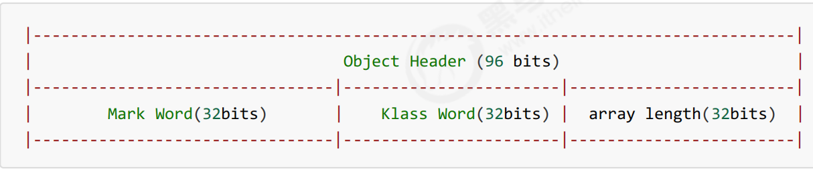
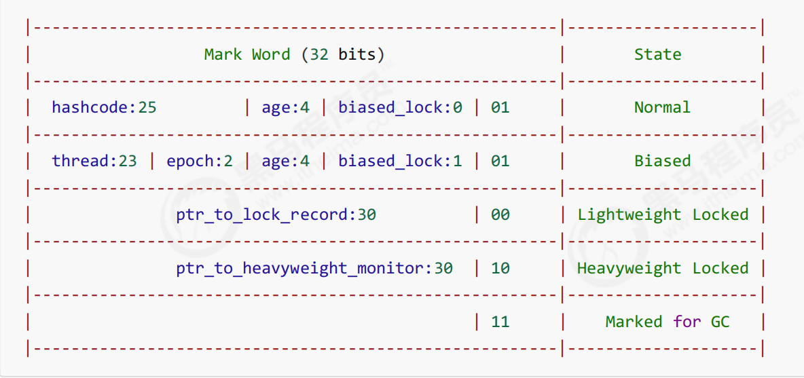
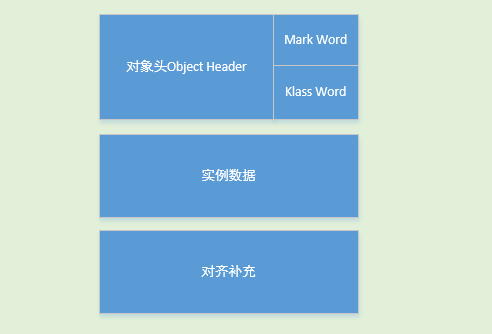

#### 3.10 转账问题

```java
@Slf4j(topic = "c.ExerciseTransfer")
public class ExerciseTransfer {
    //random为线程安全
    static Random random = new Random();
    public static int randomAccount(){
        return random.nextInt(100) + 1;
    }

    public static void main(String[] args) throws InterruptedException {
        Account a = new Account(1000);
        Account b = new Account(1000);

        Thread t1 = new Thread(() -> {
            for (int i = 0; i < 1000; i++) {
                a.transfer(b,randomAccount());
            }
        },"t1");

        Thread t2 = new Thread(() -> {
            for (int i = 0; i < 1000; i++) {
                b.transfer(a,randomAccount());
            }
        },"t2");
        t1.start();
        t2.start();
        t1.join();
        t2.join();

        log.debug("total: {}",(a.getMoney() + b.getMoney()));
    }

}

class Account{
    private int money;

    public Account(int money){
        this.money = money;
    }

    public int getMoney() {
        return money;
    }

    public void setMoney(int money) {
        this.money = money;
    }

    //转账
    public void transfer(Account another,int amount){
        if (this.money >= amount){
            this.setMoney(this.money - amount);
            another.setMoney(another.getMoney() + amount);
        }
    }
}
```

```bash
21:51:39 【main】 c.ExerciseTransfer - total: 13223
```

这里的共享变量其实有两个，一个是A账户的余额，一个是B账户的余额，所以，加锁时，单纯的去锁this，就是去锁一个共享变量是不行的。如果同时要给两个账户加锁，也是不行的，因为可能会发生死锁的问题。

解决方法

```java
//转账
public void transfer(Account another,int amount){
    synchronized (Account.class){
        if (this.money >= amount){
            this.setMoney(this.money - amount);
            another.setMoney(another.getMoney() + amount);
        }
    }
}
```

这两个account共享的有这个Account.class对象。所以对它进行加锁，就可以解决该问题。

#### 3.11 Monitor概念

**Java对象头**

以 32 位虚拟机为例

**普通对象**


**Klass word是指向其类对象的指针**

**数组对象**



其中Mark Word结构为



这个表代表了：Mark Word这32位，在不同的状态（Normal,Biased,Ligheweight Locked,Heavyweight Locked,Mark for GC)下的不同表示。

biased_lock指偏向锁，biased_lock后面两位代表加锁状态。

**64 位虚拟机 Mark Word**


一个对象的结构如下



**Monitor(锁)**

Monitor被翻译为**监视器**或者说**管程**

每个java对象都可以关联一个Monitor，如果使用`synchronized`给对象上锁（重量级），该对象头的Mark Word中就被设置为指向Monitor对象的指针，过程如下


Monitor结构如下：


