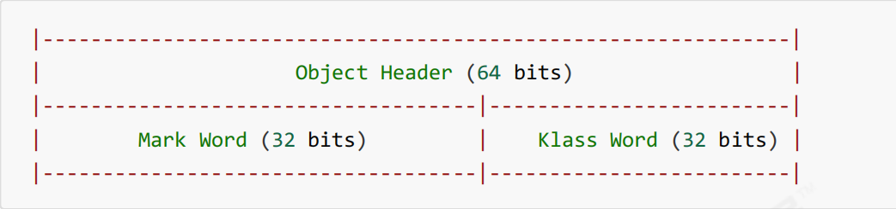
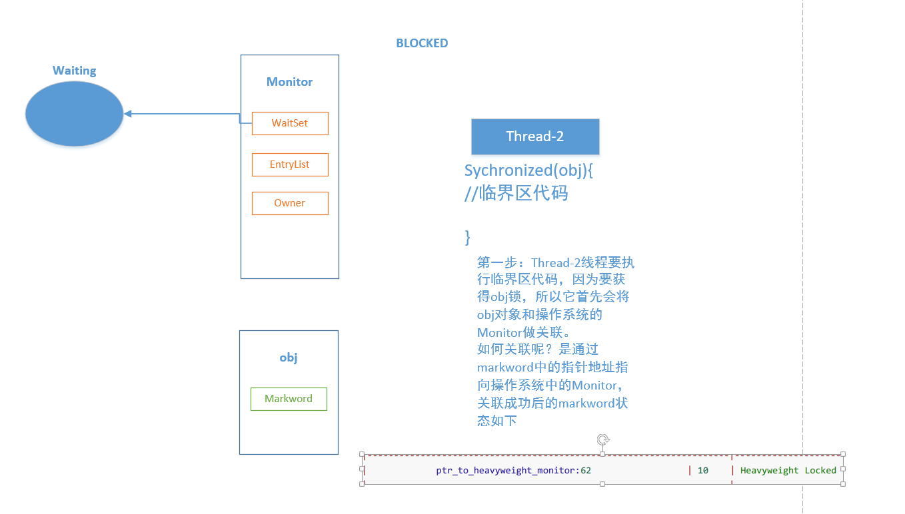
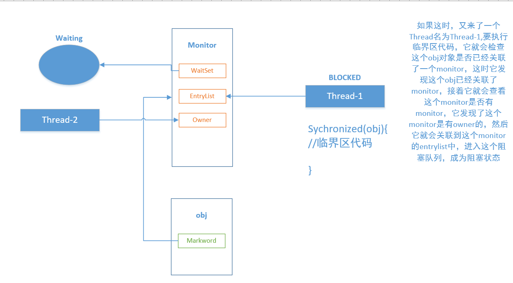
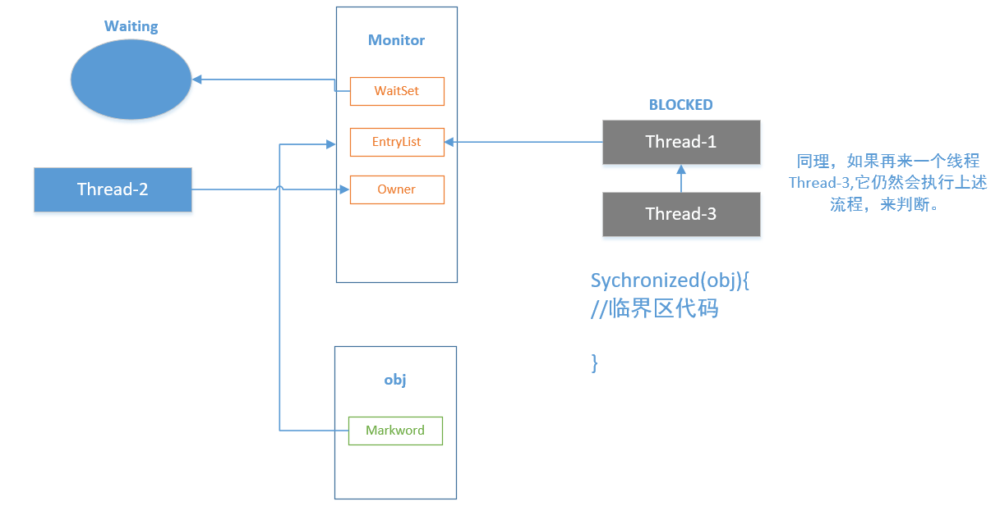
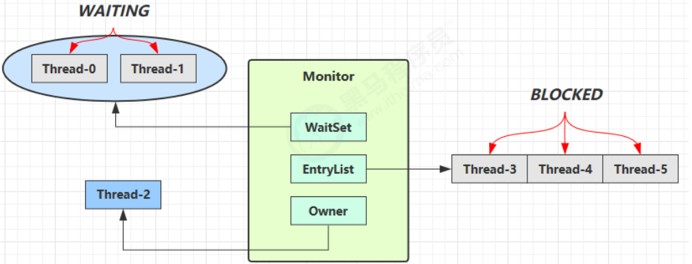
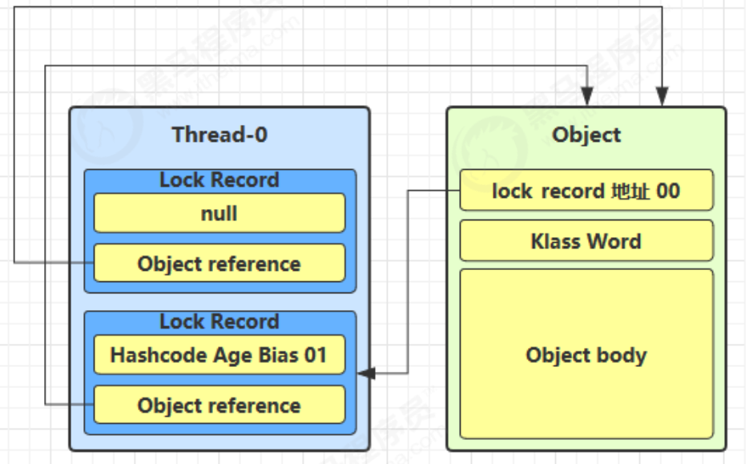
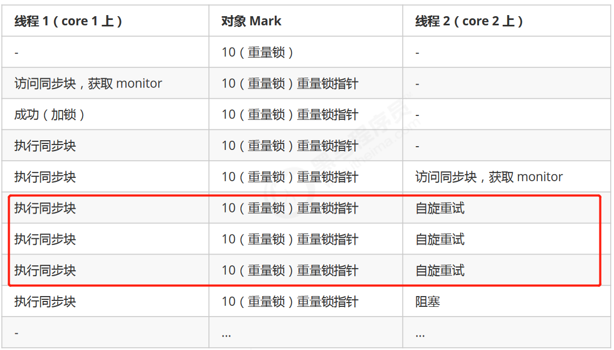
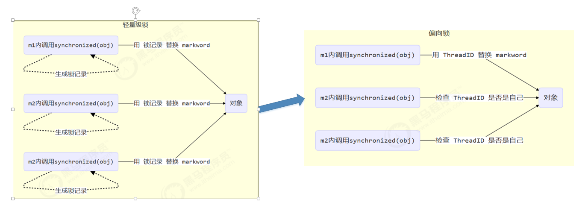
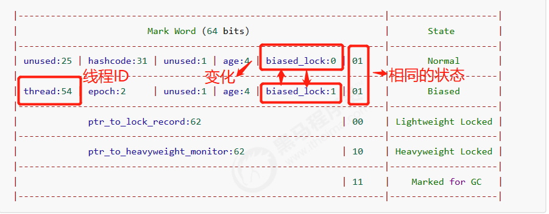

#### 3.10 转账问题

```java
@Slf4j(topic = "c.ExerciseTransfer")
public class ExerciseTransfer {
    //random为线程安全
    static Random random = new Random();
    public static int randomAccount(){
        return random.nextInt(100) + 1;
    }

    public static void main(String[] args) throws InterruptedException {
        Account a = new Account(1000);
        Account b = new Account(1000);

        Thread t1 = new Thread(() -> {
            for (int i = 0; i < 1000; i++) {
                a.transfer(b,randomAccount());
            }
        },"t1");

        Thread t2 = new Thread(() -> {
            for (int i = 0; i < 1000; i++) {
                b.transfer(a,randomAccount());
            }
        },"t2");
        t1.start();
        t2.start();
        t1.join();
        t2.join();

        log.debug("total: {}",(a.getMoney() + b.getMoney()));
    }

}

class Account{
    private int money;

    public Account(int money){
        this.money = money;
    }

    public int getMoney() {
        return money;
    }

    public void setMoney(int money) {
        this.money = money;
    }

    //转账
    public void transfer(Account another,int amount){
        if (this.money >= amount){
            this.setMoney(this.money - amount);
            another.setMoney(another.getMoney() + amount);
        }
    }
}
```


```bash
21:51:39 【main】 c.ExerciseTransfer - total: 13223
```

这里的共享变量其实有两个，一个是A账户的余额，一个是B账户的余额，所以，加锁时，单纯的去锁this，就是去锁一个共享变量是不行的。如果同时要给两个账户加锁，也是不行的，因为可能会发生死锁的问题。

解决方法

```java
//转账
public void transfer(Account another,int amount){
    synchronized (Account.class){
        if (this.money >= amount){
            this.setMoney(this.money - amount);
            another.setMoney(another.getMoney() + amount);
        }
    }
}
```

这两个account共享的有这个Account.class对象。所以对它进行加锁，就可以解决该问题。

其实，并不一定非要是Account.class对象，只要能保证这个锁对象是唯一且二者都能访问到的，都可以！例如：

```java
	private static final Object lock = new Object();
    //转账
    public void transfer(Account another,int amount){
        synchronized (lock){
//        synchronized (Account.class){
            if (this.money >= amount){
                this.setMoney(this.money - amount);
                another.setMoney(another.getMoney() + amount);
            }
        }
    }
```


#### 3.11 Monitor概念

**Java对象头**

以 32 位虚拟机为例

**普通对象**



**Klass word是指向其类对象的指针**

**数组对象**


其中Mark Word结构为


这个表代表了：Mark Word这32位，在不同的状态（Normal,Biased,Ligheweight Locked,Heavyweight Locked,Mark for GC)下的不同表示。

biased_lock指偏向锁，biased_lock后面两位代表加锁状态。

**64 位虚拟机 Mark Word**


一个对象的结构如下


**Monitor(锁)**

Monitor被翻译为**监视器**或者说**管程**

**每个java对象都可以关联一个Monitor**，如果使用`synchronized`给对象上锁（重量级），该对象头的Mark Word中就被设置为指向Monitor对象的指针，过程如下









Monitor结构如下：



- 刚开始时Monitor中的Owner为null
- 当Thread-2 执行synchronized(obj){}代码时就会将Monitor的所有者Owner 设置为 Thread-2，上锁成功，Monitor中同一时刻只能有一个Owner
- 当Thread-2 占据锁时，如果线程Thread-3，Thread-4也来执行synchronized(obj){}代码，就会进入EntryList中变成BLOCKED状态
- Thread-2 执行完同步代码块的内容，然后唤醒 EntryList 中等待的线程来竞争锁，竞争时是非公平的
- 图中 WaitSet 中的 Thread-0，Thread-1 是之前获得过锁，但条件不满足进入 WAITING 状态的线程，后面讲wait-notify 时会分析

*注意：synchronized 必须是进入同一个对象的 monitor 才有上述的效果不加 synchronized 的对象不会关联监视器，不遵从以上规则*

#### 3.12 synchronized原理

```java
public class SychronizedPrinciple {
    static final Object lock = new Object();
    static int counter = 0;

    public static void main(String[] args) {
        synchronized (lock){
            counter ++;
        }
    }
}
```

反编译后的字节码

```bash
Classfile /G:/JavaConcurrentProgramming/target/classes/com/echo/juc/chapter3/SychronizedPrinciple.class
  Last modified 2021-8-15; size 719 bytes
  MD5 checksum cfa233596c243a52c16fc76800f5ccdc
  Compiled from "SychronizedPrinciple.java"
public class com.echo.juc.chapter3.SychronizedPrinciple
  minor version: 0
  major version: 52
  flags: ACC_PUBLIC, ACC_SUPER
Constant pool:
   #1 = Methodref          #4.#28         // java/lang/Object."<init>":()V
   #2 = Fieldref           #5.#29         // com/echo/juc/chapter3/SychronizedPrinciple.lock:Ljava/lang/Object;
   #3 = Fieldref           #5.#30         // com/echo/juc/chapter3/SychronizedPrinciple.counter:I
   #4 = Class              #31            // java/lang/Object
   #5 = Class              #32            // com/echo/juc/chapter3/SychronizedPrinciple
   #6 = Utf8               lock
   #7 = Utf8               Ljava/lang/Object;
   #8 = Utf8               counter
   #9 = Utf8               I
  #10 = Utf8               <init>
  #11 = Utf8               ()V
  #12 = Utf8               Code
  #13 = Utf8               LineNumberTable
  #14 = Utf8               LocalVariableTable
  #15 = Utf8               this
  #16 = Utf8               Lcom/echo/juc/chapter3/SychronizedPrinciple;
  #17 = Utf8               main
  #18 = Utf8               ([Ljava/lang/String;)V
  #19 = Utf8               args
  #20 = Utf8               [Ljava/lang/String;
  #21 = Utf8               StackMapTable
  #22 = Class              #20            // "[Ljava/lang/String;"
  #23 = Class              #31            // java/lang/Object
  #24 = Class              #33            // java/lang/Throwable
  #25 = Utf8               <clinit>
  #26 = Utf8               SourceFile
  #27 = Utf8               SychronizedPrinciple.java
  #28 = NameAndType        #10:#11        // "<init>":()V
  #29 = NameAndType        #6:#7          // lock:Ljava/lang/Object;
  #30 = NameAndType        #8:#9          // counter:I
  #31 = Utf8               java/lang/Object
  #32 = Utf8               com/echo/juc/chapter3/SychronizedPrinciple
  #33 = Utf8               java/lang/Throwable
{
  static final java.lang.Object lock;
    descriptor: Ljava/lang/Object;
    flags: ACC_STATIC, ACC_FINAL

  static int counter;
    descriptor: I
    flags: ACC_STATIC

  public com.echo.juc.chapter3.SychronizedPrinciple();
    descriptor: ()V
    flags: ACC_PUBLIC
    Code:
      stack=1, locals=1, args_size=1
         0: aload_0
         1: invokespecial #1                  // Method java/lang/Object."<init>":()V
         4: return
      LineNumberTable:
        line 3: 0
      LocalVariableTable:
        Start  Length  Slot  Name   Signature
            0       5     0  this   Lcom/echo/juc/chapter3/SychronizedPrinciple;

  public static void main(java.lang.String[]);
    descriptor: ([Ljava/lang/String;)V
    flags: ACC_PUBLIC, ACC_STATIC
    Code:
      stack=2, locals=3, args_size=1
         0: getstatic     #2                  // Field lock:Ljava/lang/Object; <-lock引用(sychronzied开始) 拿到lock引用
         3: dup								//复制一份
         4: astore_1						//存到slot 1中，后续用来解锁
         5: monitorenter					//开始加锁，将lock对象的markword置为monitor指针
         6: getstatic     #3                  // Field counter:I 拿到i引用
         9: iconst_1						//准备常数 i
        10: iadd							//i++
        11: putstatic     #3                  // Field counter:I 写回到i
        14: aload_1							//执行完成将slot 1中的锁引用取出
        15: monitorexit						//将lock对象Markword重置，唤醒EntryList
        16: goto          24
        19: astore_2						// e -> slot 2将异常对象的引用存储到slot 2
        20: aload_1							// 加载 lock引用
        21: monitorexit						// 将lock对象Markword重置，唤醒EntryList
        22: aload_2							// 将slot 2中的异常对象引用取出来
        23: athrow							// 将异常抛出
        24: return
      Exception table:		//异常监测表，检测的范围有6-16行的字节码和19-22行的字节码，
         from    to  target type
             6    16    19   any	//如果6-16行的字节码（其实就是同步代码块中的内容）出现异常，跳到第19行处理
            19    22    19   any	//如果19-22行的字节码出现异常，跳到第19行处理
      LineNumberTable:
        line 8: 0
        line 9: 6
        line 10: 14
        line 11: 24
      LocalVariableTable:
        Start  Length  Slot  Name   Signature
            0      25     0  args   [Ljava/lang/String;
      StackMapTable: number_of_entries = 2
        frame_type = 255 /* full_frame */
          offset_delta = 19
          locals = [ class "[Ljava/lang/String;", class java/lang/Object ]
          stack = [ class java/lang/Throwable ]
        frame_type = 250 /* chop */
          offset_delta = 4

  static {};
    descriptor: ()V
    flags: ACC_STATIC
    Code:
      stack=2, locals=0, args_size=0
         0: new           #4                  // class java/lang/Object
         3: dup
         4: invokespecial #1                  // Method java/lang/Object."<init>":()V
         7: putstatic     #2                  // Field lock:Ljava/lang/Object;
        10: iconst_0
        11: putstatic     #3                  // Field counter:I
        14: return
      LineNumberTable:
        line 4: 0
        line 5: 10
}
SourceFile: "SychronizedPrinciple.java"
```

#### 3.13 synchronized优化原理-小故事

故事角色

- 老王 - JVM
- 小南 - 线程
- 小女 - 线程
- 房间 - 对象
- 房间门上 - 防盗锁 - Monitor
- 房间门上 - 小南书包 - 轻量级锁
- 房间门上 - 刻上小南大名 - 偏向锁
- 批量重刻名 - 一个类的偏向锁撤销到达 20 阈值
- 不能刻名字 - 批量撤销该类对象的偏向锁，设置该类不可偏向

小南要使用房间保证计算不被其它人干扰（原子性），最初，他用的是防盗锁，当上下文切换时，锁住门。这样，即使他离开了，别人也进不了门，他的工作就是安全的。

但是，很多情况下没人跟他来竞争房间的使用权。小女是要用房间，但使用的时间上是错开的，小南白天用，小女晚上用。每次上锁太麻烦了，有没有更简单的办法呢？

小南和小女商量了一下，约定不锁门了，而是谁用房间，谁把自己的书包挂在门口，但他们的书包样式都一样，因此每次进门前得翻翻书包，看课本是谁的，如果是自己的，那么就可以进门，这样省的上锁解锁了。万一书包不是自己的，那么就在门外等，并通知对方下次用锁门的方式。

后来，小女回老家了，很长一段时间都不会用这个房间。小南每次还是挂书包，翻书包，虽然比锁门省事了，但仍然觉得麻烦。

于是，小南干脆在门上刻上了自己的名字：【小南专属房间，其它人勿用】，下次来用房间时，只要名字还在，那么说明没人打扰，还是可以安全地使用房间。如果这期间有其它人要用这个房间，那么由使用者将小南刻的名字擦掉，升级为挂书包的方式。

同学们都放假回老家了，小南就膨胀了，在 20 个房间刻上了自己的名字，想进哪个进哪个。后来他自己放假回老家了，这时小女回来了（她也要用这些房间），结果就是得一个个地擦掉小南刻的名字，升级为挂书包的方式。老王（这里是JVM)觉得这成本有点高，提出了一种批量重刻名的方法，他让小女不用挂书包了，可以直接在门上刻上自己的名字

后来，刻名的现象越来越频繁，老王受不了了：算了，这些房间都不能刻名了，只能挂书包

从JDK6开始，对monitor加锁的方式进行了优化。

#### 3.14 synchronized优化原理-进阶

**轻量级锁**

轻量级锁的使用场景是：如果一个对象虽然有多个线程要对它进行加锁，但是加锁的时间是错开的（也就是没有人可以竞争的），那么可以使用轻量级锁来进行优化，如果有竞争，轻量级锁会变成重量级锁。

轻量级锁对使用者是透明的，即语法仍然是`synchronized`，

假设有两个方法同步块，利用同一个对象加锁。

```java
static final Object obj = new Object();
public static void method1() {
     synchronized( obj ) {
         // 同步块 A
         method2();
     }
}
public static void method2() {
     synchronized( obj ) {
         // 同步块 B
     }
}
```

1. 每次执行到synchronized代码块时，线程都会在栈帧中创建锁记录（Lock Record）对象，每个线程都会包括一个锁记录的结构，锁记录内部可以储存加锁对象的Mark Word和加锁对象的引用reference
   


2. 让锁记录中的Object reference指向对象，并且尝试用cas(compare and sweep)替换Object对象的Mark Word ，将Mark Word 的值存入锁记录中，*说白了就是将   lock record 地址 00  和 hashcode age bias 01进行交换，这不是一整个字段，这是四个字段，看前面的对象头表*。未加锁的状态码为01，轻量级锁的状态码为00


3.如果cas替换成功，那么对象的对象头储存了锁记录的地址和状态00，表示由该线程给对象加锁，如下所示

表示Thread-0给Object加上了轻量级锁


4. 如果cas失败，有两种情况

- 如果是其它线程已经持有了该Object的轻量级锁，那么表示有竞争，将进入锁膨胀阶段，直白一些就是这个Object已经被Thread-0加上轻量级锁了，那么再有线程过来的时候，就会有竞争，进入锁膨胀
- 如果是自己的线程已经执行了synchronized进行加锁，那么那么再添加一条 Lock Record 作为重入的计数，直白一些：就是线程Thread-0自己又对该Object进行了加锁，那么就再添加一条Lock Record表示重入了，添加时同样会执行cas交换的过程，但是执行的时候发现已经进行过了cas交换，所以本次的cas交换就会失败，Thread-0中有几条lock record，就表明Thread-0对object加了几次锁。



5.当线程退出synchronized代码块的时候，**如果获取的是取值为 null 的锁记录（Lock Record) **，表示有重入，这时重置锁记录，表示重入计数减一


6.当线程退出synchronized代码块的时候，如果获取的锁记录取值不为 null，那么使用cas将Mark Word的值恢复给对象

- 成功，则解锁成功

- 失败，则说明轻量级锁进行了锁膨胀或已经升级为重量级锁，进入重量级锁解锁流程

**锁膨胀**

如果在尝试加轻量级锁的过程中，cas操作无法成功，这是一种情况：其它线程已经为这个对象加上了轻量级锁，这时就要进行锁膨胀，将轻量级锁变成重量级锁。

1.当 Thread-1 进行轻量级加锁时，Thread-0 已经对该对象加了轻量级锁，发生过cas交换


2.这时 Thread-1 加轻量级锁失败，进入锁膨胀流程

- 即为对象申请Monitor锁，让Object指向重量级锁地址，然后自己进入Monitor 的EntryList 变成BLOCKED状态


- 当Thread-0 退出synchronized同步块时，使用cas将Mark Word的值恢复给对象头，失败（因为已经升级为重量级锁），那么会进入重量级锁的解锁过程，即按照Monitor的地址找到Monitor对象，将Owner设置为null，唤醒EntryList 中的Thread-1线程

**自旋优化**

重量级锁竞争的时候，还可以使用自旋来进行优化，如果当前线程自旋成功（即在自旋的时候持锁的线程释放了锁），那么当前线程就可以不用进行上下文切换就获得了锁，不必进入阻塞状态。自旋其实就是执行循环，尝试获得锁。

- 自旋重试成功的情况，对于多核CPU，自旋性能更好。


- 自旋重试失败的情况，自旋了一定次数还是没有等到持锁的线程释放锁



自旋会占用 CPU 时间，单核 CPU 自旋就是浪费，多核 CPU 自旋才能发挥优势。在 Java 6 之后自旋锁是自适应的，比如对象刚刚的一次自旋操作成功过，那么认为这次自旋成功的可能性会高，就多自旋几次；反之，就少自旋甚至不自旋，总之，比较智能。Java 7 之后不能控制是否开启自旋功能

自旋：
重量级锁的情况下。会尝试获得锁几次，怎么获得呢？ 

 

查看锁对象的对象头，找到其Monitor。
然后查找该Monitor的owner，看看是否为空？不为空，不立即进入阻塞队列，
而是循环几次检查owner的操作，如果在这几次循环过程中发现了owner为null，即获得了锁
那么不会进入阻塞状态，避免了上下文切换，直接进入就绪态，等待CPU调度运行。

在这几次自旋（循环检查)之后仍然获得不了锁，才进入阻塞状态。


**偏向锁**

如果同一个线程对同一个锁对象进行重入锁时，也需要执行CAS操作，会很耗时。

那么java6开始引入了偏向锁，只有第一次使用CAS时将线程ID设置到对象的Mark Word头，**之后这个入锁线程再进行重入锁时，发现线程ID是自己的，那么就不用再进行CAS了。以后只要不发生竞争，这个对象就归该线程所有。**

例如：

```java
static final Object obj = new Object();
public static void m1(){
    synchronized(obj){
        //同步块 A
        m2();
    }
}
public static void m2(){
    synchronized(obj){
        //同步块B
        m3();
    }
}
public static void m3(){
    synchronized(obj){
        //同步块C
    }
}
```



**偏向状态**

回忆一下对象头格式



一个对象的创建过程

- 如果开启了偏向锁（默认是开启的），那么对象刚创建之后，Mark Word 最后三位的值101，并且这是它的Thread，epoch，age都是0，在加锁的时候进行设置这些的值

- 偏向锁默认是延迟的，不会在程序启动的时候立刻生效，如果想避免延迟，可以添加虚拟机参数来禁用延迟：-`XX:BiasedLockingStartupDelay=0`来禁用延迟
  测试前需要加入一个工具包

  ```xml
  <dependency>
      <groupId>org.openjdk.jol</groupId>
      <artifactId>jol-core</artifactId>
      <version>0.10</version>
  </dependency>
  ```

  ```java
  @Slf4j(topic = "c.BiasedTest")
  public class BiasedTest {
      public static void main(String[] args) throws InterruptedException {
          Dog dog = new Dog();
          String s = ClassLayout.parseInstance(dog).toPrintable();
          log.debug(s);
          Thread.sleep(4000);
          Dog newDog = new Dog();
          String s2 = ClassLayout.parseInstance(newDog).toPrintable();
          log.debug(s2);
      }
  }
  class Dog{
  
  }
  ```

  

- 注意：处于偏向锁的对象解锁后，线程 id 仍存储于对象头中

  ```java
  @Slf4j(topic = "c.BiasedTest")
  public class BiasedTest {
      public static void main(String[] args) throws InterruptedException {
          Dog dog = new Dog();
          String s = ClassLayout.parseInstance(dog).toPrintable();
          log.debug(s);
          Thread.sleep(4000);
          Dog newDog = new Dog();
          //加锁后打印
          synchronized (newDog){
              String s2 = ClassLayout.parseInstance(newDog).toPrintable();
              log.debug(s2);
          }
          //解锁后打印
          String s2 = ClassLayout.parseInstance(newDog).toPrintable();
          log.debug(s2);
      }
  }
  class Dog{
  
  }
  ```

  

  可以看到，加锁中以及加锁后，对象头的信息没有发生变化，是因为使用了偏向锁，在加锁之后，就将线程的信息进行了保存。

禁用偏向锁

在上述代码运行时添加VM参数: -XX:-UseBiasedLocking 禁用偏向锁。+ 是使用   -是禁用


禁用偏向锁之后，使用的就是轻量级锁


**调用hashcode()方法会禁用偏向锁**

```java
@Slf4j(topic = "c.BiasedTest")
public class BiasedTest {
    public static void main(String[] args) throws InterruptedException {
        Dog dog = new Dog();
        log.debug("延迟前");
        String s = ClassLayout.parseInstance(dog).toPrintable();
        log.debug(s);
        Thread.sleep(4000);
        Dog newDog = new Dog();
        //hashcode() 方法会禁用偏向锁。
        newDog.hashCode();
        //加锁前打印
        log.info("加锁前");
        String s1 = ClassLayout.parseInstance(newDog).toPrintable();
        log.debug(s1);
        //加锁后打印
        synchronized (newDog){
            log.debug("加锁中");
            String s2 = ClassLayout.parseInstance(newDog).toPrintable();
            log.debug(s2);
        }
        //解锁后打印
        log.debug("枷锁后");
        String s2 = ClassLayout.parseInstance(newDog).toPrintable();
        log.debug(s2);
    }
}
class Dog{

}
```


神奇的现象发生了，并没有使用-XX:-UseBiasedLocking参数，也出现了偏向锁被禁用的情况。

原因如下：


当调用hashcode()方法之后，对象为了存储其hashcode的值，对象头的markword就变回了普通的状态，因此，也就没有办法去存储thread,epoch等值，它也就自然而然的禁用了偏向锁，使用了Normal状态。


